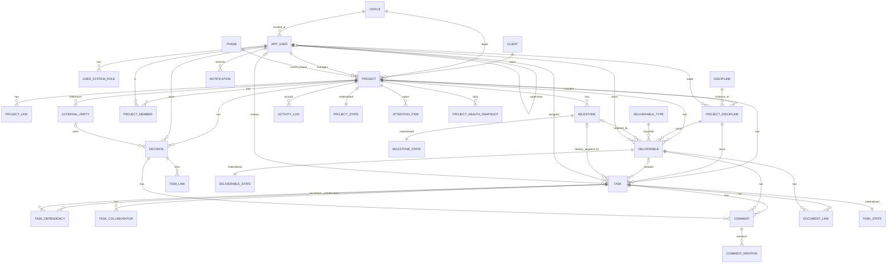
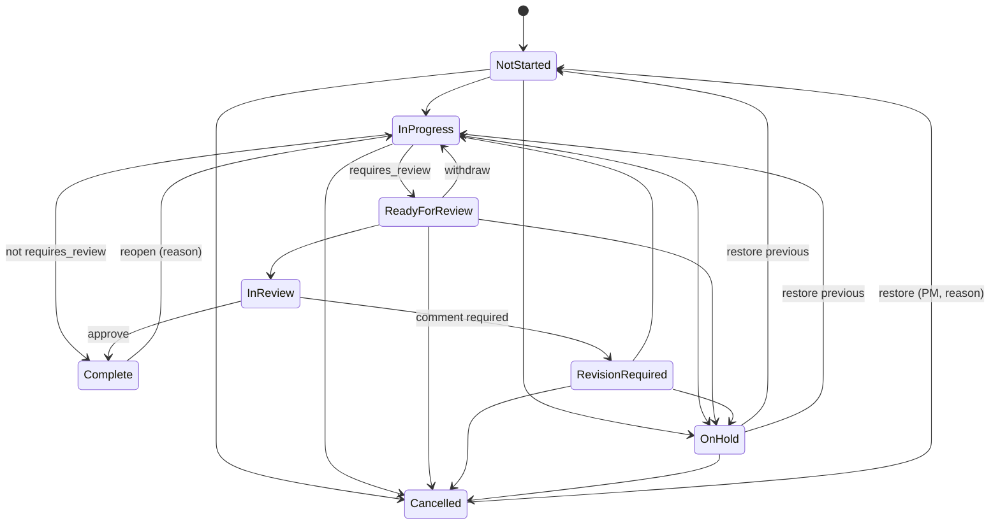
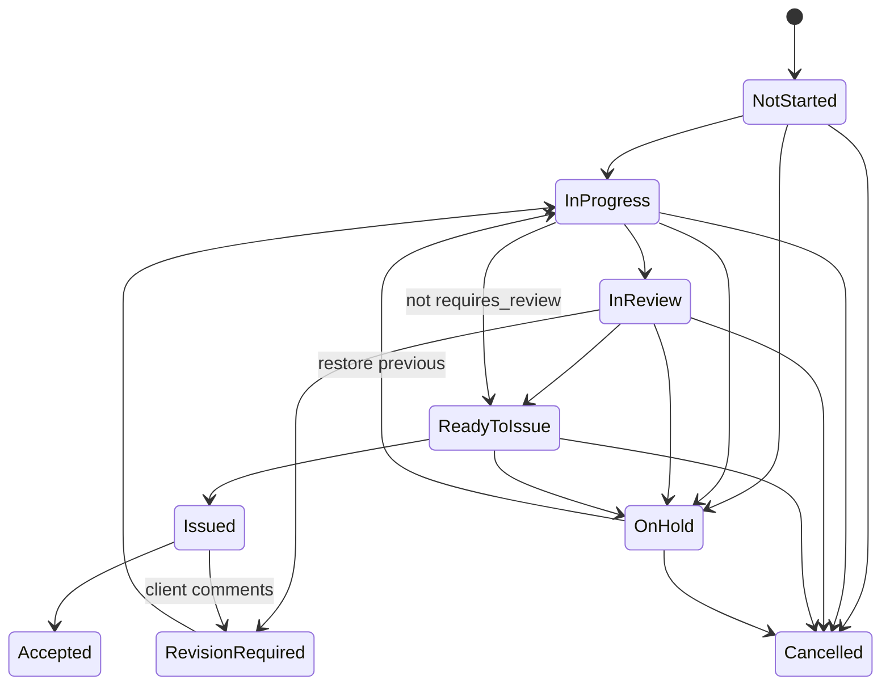

# Engineering Project Coordination Hub

## Product Specification — Version 1.0 (Draft for Review)

| Item | Value |
|---|---|
| Document | Product and Implementation Specification |
| Product | Engineering Project Coordination Hub (working name; "the Hub" in this document) |
| Version | 1.0 — Draft for stakeholder review |
| Date | 2026-09-15 |
| Status | Ready for architecture review, wireframing, and ticket breakdown |
| Audience | Product owner, engineering team, UX design, IT security, pilot project managers |

---

### How to read this document

This specification uses a small set of consistent labels. They matter, because they tell the development team what is a requirement, what is a suggestion, and what still needs a human decision.

| Label | Meaning |
|---|---|
| **[MVP-Required]** | Must be in the first production release. The MVP is not complete without it. |
| **[MVP-Recommended]** | Strongly recommended for MVP because it is cheap relative to its coordination value. Can be cut if the schedule demands it, with the stated consequence. |
| **[Phase 2]** | Planned for the release after MVP. |
| **[Phase 3]** | Later capability. Designed for, not built. |
| **[Out of Scope]** | Will not be built. Listed to protect the product from scope creep. |
| **Recommendation:** | A recommendation by the authors, not a stated requirement. The business may choose otherwise. |
| **Assumption:** | An architectural or business assumption made to keep the specification concrete. Must be validated. |
| **TBD — Business Decision Required** | Information that only the company can provide. The specification is written so that development can proceed around it where possible. |

Canonical status names, role names, and threshold names are defined once in Section 10 (Core Data Model) and used verbatim everywhere else. If a later section appears to contradict Section 10, Section 10 wins and the later section should be corrected.

---

## Table of Contents

- [1. Executive Summary](#1-executive-summary)
- [2. Problem Statement](#2-problem-statement)
- [3. Product Vision](#3-product-vision)
- [4. Product Principles](#4-product-principles)
- [5. Goals](#5-goals)
- [6. Non-Goals](#6-non-goals)
- [7. User Personas](#7-user-personas)
- [8. Roles and Permissions](#8-roles-and-permissions)
- [9. Information Architecture](#9-information-architecture)
- [10. Core Data Model](#10-core-data-model)
- [11. Functional Requirements](#11-functional-requirements)
- [12. Module Specifications](#12-module-specifications)
- [13. Detailed Screen Specifications](#13-detailed-screen-specifications)
- [14. User Workflows](#14-user-workflows)
- [15. Business Rules](#15-business-rules)
- [16. Project Health Logic](#16-project-health-logic)
- [17. Notification Logic](#17-notification-logic)
- [18. Search and Filtering](#18-search-and-filtering)
- [19. Reporting](#19-reporting)
- [20. Audit Requirements](#20-audit-requirements)
- [21. Security Requirements](#21-security-requirements)
- [22. Non-Functional Requirements](#22-non-functional-requirements)
- [23. Technical Architecture](#23-technical-architecture)
- [24. Database Design](#24-database-design)
- [25. API Design](#25-api-design)
- [26. Integration Architecture](#26-integration-architecture)
- [27. MVP Scope](#27-mvp-scope)
- [28. Phase 2 Scope](#28-phase-2-scope)
- [29. Phase 3 Scope](#29-phase-3-scope)
- [30. Explicitly Out-of-Scope Items](#30-explicitly-out-of-scope-items)
- [31. Acceptance Criteria](#31-acceptance-criteria)
- [32. Edge Cases and Recommended Handling](#32-edge-cases-and-recommended-handling)
- [33. Risks and Technical Considerations](#33-risks-and-technical-considerations)
- [34. Open Decisions / Questions](#34-open-decisions-questions)
- [35. Recommended Development Sequence](#35-recommended-development-sequence)
- [Decisions We Need to Make Before Development](#decisions-we-need-to-make-before-development)
- [Features That Sound Useful But Should NOT Be Built Yet](#features-that-sound-useful-but-should-not-be-built-yet)
- [Appendix A — Reference Example: Municipal Infrastructure Design template and "DCC Dundurn Roads"](#appendix-a-reference-example-municipal-infrastructure-design-template-and-dcc-dundurn-roads)
- [Appendix B — Glossary](#appendix-b-glossary)
- [Appendix C — Status Transition Diagrams](#appendix-c-status-transition-diagrams)

---

## 1. Executive Summary

The Engineering Project Coordination Hub is an internal web application for coordinating multidisciplinary engineering consulting projects. It exists to answer one question, continuously and without anyone compiling a status report:

> **Who is responsible for what, what is due next, what are we waiting for, and what is preventing the project from moving forward?**

The Hub is not a general-purpose task manager and it is not a scheduling engine. It is a purpose-built coordination layer for engineering projects that are organised by **discipline**, driven by **deliverables**, punctuated by **submission milestones**, and frequently held up by **cross-discipline dependencies** and **unmade decisions**.

The product is built entirely from structured data and deterministic rules. Every status, flag, and "attention required" item can be traced to a stated rule and a stated threshold. There is no AI in the base product and none is assumed.

**What the MVP delivers**

- Projects with disciplines, discipline leads, and project teams.
- Milestones, deliverables, and tasks, in a hierarchy designed for engineering work rather than generic to-do lists.
- Task status workflow with independent technical review built in.
- Task dependencies (Finish-to-Start) with automatic detection of waiting, blocked, and blocking work, and identification of affected milestones.
- A deterministic "PM Attention Required" engine with configurable thresholds.
- A Project Dashboard, a personal My Work page, and a Weekly Coordination view designed to run a multidisciplinary coordination meeting directly from the application.
- A thin Decision Register, because decisions are the most common non-task blocker in design projects. (Recommended for MVP; see Section 27 for the rationale and the fallback if it is cut.)
- Comments with @mentions, document links to SharePoint/Teams/network folders, a full activity log, in-app and email notifications, and corporate single sign-on.

**What comes later**

Risk and Issue registers, Meeting Actions, Project Templates, the Resource/Workload view, the Portfolio Dashboard, an improved Gantt, and saved views are Phase 2. Teams and SharePoint integration, ERP/Vantagepoint integration, and financial or utilisation data are Phase 3.

**Recommended technical approach**

A modular monolith: a React + TypeScript single-page application, an ASP.NET Core Web API (with Node.js/TypeScript as an acceptable alternative if the team's skills favour it), PostgreSQL, Microsoft Entra ID single sign-on, hosted on Azure App Service with Azure Database for PostgreSQL. The system is sized for hundreds of active projects, tens of thousands of tasks, and a few hundred users, and is intended to be maintained by a small internal team.

**What this document enables**

The specification is written so that a development team (or a software-development agent) can design the database (Section 24), produce wireframes (Section 13), establish the architecture (Section 23), create development tickets (Sections 11, 27, 35), implement the MVP, and test it against explicit acceptance criteria (Section 31).

---

## 2. Problem Statement

### 2.1 The coordination gap

A multidisciplinary engineering project — a municipal road reconstruction, for example — involves a project manager and five to eight disciplines, each with its own lead, its own deliverables, and its own internal review process. The disciplines depend on one another in ways that are well understood by experienced staff but rarely written down in a form the whole team can see:

```
Survey base plan
  → Civil preliminary design
    → Utility coordination
    → Geotechnical recommendations
      → Civil detailed design
        → Electrical coordination
          → QA/QC review
            → Client review
              → Final submission
```

Today this knowledge lives in the PM's head, in a spreadsheet, in a Planner board that nobody updates, and in a weekly meeting where the same questions are asked every time: *Is the survey done? Are we waiting on the client for the pavement decision? Who has the stormwater report? When is 60% due again?*

### 2.2 Why existing tools do not fit

Generic tools (Planner, Trello, Asana, Monday.com, Smartsheet) treat all work as flat tasks or cards. They have no concept of a discipline, a deliverable, a design submission, a technical review, or a decision that blocks a package. Schedule tools (Primavera P6, Microsoft Project) model dependencies well but are heavyweight, require scheduling expertise, and are not something a design team updates daily. The result is that the coordination question is answered by people compiling status, not by the system.

### 2.3 Concrete pains this product addresses

| Pain | How it shows up today | What the Hub does about it |
|---|---|---|
| Unclear ownership | "I thought Electrical was doing that." | Every task has exactly one accountable assignee and one owning discipline. Every deliverable has an owner. Unowned work is flagged. |
| Invisible dependencies | Civil detailed design starts late because geotech recommendations slipped and nobody connected the two. | Explicit task dependencies; successors are automatically shown as Waiting or Blocked; overdue predecessors are flagged as blocking others. |
| Decisions that stall work | Client has not confirmed the pavement structure; three tasks are quietly idle. | Decision Register with owner, required-by date, and links to the work it holds up; overdue decisions surface on the dashboard and coordination view. |
| Submissions that surprise people | 85% package is due Friday; two disciplines have open tasks. | Milestone status (On Track / At Risk / Overdue) computed from linked deliverables; approaching milestones with incomplete prerequisites are flagged. |
| Status compiled by hand | PM spends Monday morning building a status email. | Project Dashboard and Weekly Coordination view are always current; the meeting is run from the screen. |
| Review bottlenecks | Work sits "done" but unreviewed. | Review is part of the task workflow; stalled reviews are flagged; reviewers see a My Reviews queue. |
| No traceability | "Who moved that date?" | Immutable activity log on assignments, dates, statuses, deletions, and decisions. |

### 2.4 What success looks like

Success is measured by coordination outcomes, not feature counts:

- A PM can open the Weekly Coordination view and run the coordination meeting without any other preparation.
- A discipline lead can see, in under a minute, everything their discipline owes and everything their discipline is waiting on.
- A team member's My Work page is the single list they work from.
- A supervisor can see who is overloaded and who has capacity across projects without asking.
- Every "why is this blocked?" question can be answered by clicking the blocked indicator.

---

## 3. Product Vision

**For** project managers, discipline leads, supervisors, and engineering staff in a multidisciplinary consulting firm,
**who** need to coordinate deliverable-driven work across disciplines and keep design submissions on schedule,
**the Engineering Project Coordination Hub** is an internal coordination platform
**that** makes ownership, due dates, dependencies, blockers, and pending decisions immediately visible at project, personal, and portfolio level.
**Unlike** generic task boards and heavyweight scheduling tools,
**the Hub** is structured around disciplines, deliverables, milestones, reviews, and decisions, and it answers the coordination question through deterministic rules rather than manual status compilation.

### 3.1 What the Hub is

- A **system of record for coordination**: who owns what, when it is due, what it depends on, and what state it is in.
- A **meeting tool**: the Weekly Coordination view is designed to be projected and walked through.
- A **personal work queue**: My Work is designed to be the one list a person opens each morning.
- A **visibility layer for management**: the Portfolio Dashboard and Resource View (Phase 2) answer "which projects need help" and "who needs help".

### 3.2 What the Hub is not

- Not a scheduling engine. It does not compute critical paths, level resources, or auto-shift dates.
- Not a document management system. It links to documents; it does not store them.
- Not a timesheet, accounting, or ERP system.
- Not a replacement for Teams, email, or the engineering tools in which the actual work is produced.
- Not an AI product. Nothing in the base product depends on or includes AI.

---

## 4. Product Principles

These principles are used to make design decisions throughout the specification and should be used by the development team to resolve ambiguities. Every proposed feature must pass the first principle.

1. **Does this make coordination easier?** If a feature does not help someone answer "who, what, when, what are we waiting for, what is stuck", it does not belong. Administrative burden is a cost, not a neutral.

2. **One accountable owner.** Every task, deliverable, decision, risk, issue, and action has exactly one accountable owner. Others may collaborate, watch, or review, but accountability is never shared. Shared accountability is how work falls through gaps.

3. **Deliverables drive the work.** Tasks exist to produce deliverables; deliverables exist to meet milestones. The hierarchy in the product reflects this, and progress rolls up along it.

4. **Disciplines own their work.** Discipline leads are accountable for their discipline's deliverables and tasks within a project. The product gives them ownership views and permissions to match.

5. **Dependencies are first-class and visible.** Cross-discipline hand-offs are the main source of delay. The system makes them explicit, computes their consequences, and never hides a blocker.

6. **Deterministic and explainable.** Every computed status, flag, or health colour can be explained by a stated rule and a stated threshold. If a user asks "why is this red?", the interface shows the rule that fired.

7. **Review is part of the workflow, not an afterthought.** Engineering work requires independent technical review. The task and deliverable lifecycles model it explicitly.

8. **Decisions are work.** A pending decision is tracked with the same seriousness as a task, because it has the same power to stop a project.

9. **Minimum viable ceremony.** Fields are optional unless a rule genuinely needs them. Warnings and attention flags are preferred over hard validation, except where data integrity requires it.

10. **Information-dense, calm interface.** Desktop-first, table-oriented, low-animation, colour used with redundant text or icons. Professional engineering software, not a consumer app.

11. **Traceable.** Changes to ownership, dates, statuses, and decisions are logged and visible.

12. **Simple enough for a small team to maintain.** Modular monolith, one database, mainstream frameworks, no speculative infrastructure.

---

## 5. Goals

### 5.1 Product goals (MVP)

| ID | Goal | How we will know |
|---|---|---|
| G1 | PMs run weekly coordination meetings from the Hub. | Pilot PMs report the Weekly Coordination view replaces their status spreadsheet/email for the meeting. |
| G2 | Every active project has a current, correct answer to "what is due next and who owns it". | Attention items "task has no owner" and "task has no due date" trend toward zero on pilot projects after 4 weeks. |
| G3 | Blocked work is visible within one day of becoming blocked. | Blocked indicators are computed automatically; PM attention list shows blocked items without manual entry. |
| G4 | Team members use My Work as their daily list. | Pilot users update task status at least weekly in the Hub without being chased. |
| G5 | Milestone risk is visible at least two weeks before a submission. | Milestone At Risk rule fires on configurable lead time; no "surprise" submissions on pilot projects. |
| G6 | The system is adopted with minimal training. | New users complete core actions (update task, add comment, mark ready for review) after a 30-minute walkthrough. |

### 5.2 Technical goals

| ID | Goal |
|---|---|
| T1 | Deterministic rules are implemented as pure, unit-tested functions with near-complete test coverage. |
| T2 | Corporate SSO from day one; no separate passwords. |
| T3 | Maintainable by a team of 2–4 developers after launch. |
| T4 | Deployable to Azure with infrastructure as code and separate dev/test/prod environments. |
| T5 | All ownership, date, status, and deletion changes are captured in an immutable activity log. |

---

## 6. Non-Goals

The following are deliberately not goals of this product, at any phase. See Section 30 for the full out-of-scope list.

- Replacing Primavera P6, Microsoft Project, or any CPM scheduling tool.
- Replacing SharePoint, Teams, OneDrive, or a document management system.
- Tracking time, costs, budgets, invoices, or payroll.
- Performing or automating engineering calculations or engineering decisions.
- Providing AI assistants, summaries, recommendations, or predictions.
- Serving external clients as system users (external parties are referenced, not logged in, until at least Phase 3).
- Acting as a general-purpose work tool for non-project work (HR, IT tickets, marketing).
- Being a mobile-first product. Mobile is for reading and quick updates only.

---

## 7. User Personas

Personas are composites used to make design decisions. Names are illustrative. Most real employees combine several personas (see Section 8.4).

### 7.1 Priya — Project Manager

- **Role:** Manages 4–8 concurrent municipal infrastructure projects, each with 4–7 disciplines.
- **Goals:** Know what is due this week and next, know what is blocked and why, run a tight coordination meeting, keep clients informed, avoid submission surprises.
- **Frustrations:** Compiling status by hand every Monday. Finding out about a slipped predecessor only when the successor is late. Chasing client decisions by email with no record.
- **Uses:** Project Dashboard daily; Weekly Coordination weekly; Decision Register; Milestone view; Task list filtered by discipline.
- **Devices:** Desktop with two monitors; laptop in meeting rooms; phone for quick checks.

### 7.2 Marc — Discipline Lead (Civil)

- **Role:** Senior civil engineer leading the civil discipline on 6–10 projects, also a PM on 1–2 small ones.
- **Goals:** See everything Civil owes across all projects; know what Civil is waiting on from Survey and Geotech; assign and review Civil work; protect the team's review time.
- **Frustrations:** Being assigned tasks in tools they do not control. Learning about scope changes second-hand. Reviewing work that was "done" without being told.
- **Uses:** My Work (My Reviews); Task list filtered to Civil; Deliverables Register; Kanban for the discipline.

### 7.3 Alex — Project Team Member (Designer / EIT)

- **Role:** Works on 3–5 projects at a time across two disciplines' teams.
- **Goals:** A single list of what to do, in due-date order, with context. Clear hand-off when work is ready for review. Know when a dependency is cleared so work can start.
- **Frustrations:** Being asked for status in meetings. Not knowing a predecessor finished. Ambiguous ownership ("the Civil team").
- **Uses:** My Work almost exclusively; task detail panel; comments and mentions.
- **Devices:** Desktop; occasionally tablet on site.

### 7.4 Diane — Reviewer (Senior Technical)

- **Role:** Senior engineer who performs technical review for several disciplines' deliverables but is not on every project team.
- **Goals:** A clear queue of what needs review and by when; ability to send work back with specific comments; not being the bottleneck by surprise.
- **Uses:** My Work (My Reviews); task detail; deliverable detail.

### 7.5 Sam — Supervisor / Resource Manager (Civil Group)

- **Role:** Manages 12 civil staff across many projects. Not a member of most project teams.
- **Goals:** See each person's load across projects; spot overloaded staff and overlapping deadlines; know who has capacity when a PM asks for help; reassign work when someone is away or leaves.
- **Frustrations:** No cross-project view without asking each PM. Estimates are unreliable but something is better than nothing.
- **Uses:** Resource View (Phase 2); Portfolio Dashboard filtered by discipline; My Work of supervised staff (read).

### 7.6 Lena — Executive / Regional Manager

- **Role:** Responsible for a region or business unit with 40–100 active projects.
- **Goals:** Which projects are at risk this week and why; which PMs need support; upcoming submissions across the portfolio.
- **Frustrations:** Health reported by PMs is optimistic and inconsistent. No single place to see it.
- **Uses:** Portfolio Dashboard (Phase 2); Project Dashboard (read); reports export.

### 7.7 Jordan — System Administrator

- **Role:** IT / applications administrator.
- **Goals:** Manage user access via Entra ID groups; maintain disciplines, deliverable types, offices, clients, templates, and thresholds; deactivate leavers; audit changes.
- **Uses:** Administration screens; activity history; Entra ID.

### 7.8 The Client Contact (non-user)

- **Role:** Client project manager or approving authority. Does **not** log in.
- **Why it matters:** Client decisions and client reviews are frequently the blocker. The Hub represents clients and other external parties as **External Parties** that can own decisions and meeting actions, so "waiting on client" is visible, dated, and tracked, even though no notification is sent outside the organisation in MVP.


## 8. Roles and Permissions

### 8.1 Two-layer role model

The same employee is routinely a Civil supervisor, a discipline lead on one project, the PM on another, and a task assignee on a third. A single flat role cannot express this. The Hub therefore uses two layers:

1. **System roles** — assigned per user for the whole application. They control cross-project visibility and administration. A user has one or more system roles.
2. **Project roles** — assigned per user per project (and, for Discipline Lead, per discipline within the project). They control what the user can do inside that project.

Effective permission for any action = the union of what the user's system roles allow and what their project roles on the relevant project allow, further extended by **ownership** (assignee, reviewer, owner, creator) as defined in 8.6. Permissions are always evaluated server-side. Deny is the default.

**Recommendation:** Keep exactly these roles. Do not add per-field or per-status permissions. Where finer control seems needed, prefer a business rule with a warning over a permission.

### 8.2 System roles

| System role | Purpose | Cross-project visibility | Typical holders |
|---|---|---|---|
| **System Administrator** | Configure the system: users, roles, disciplines, clients, offices, deliverable types, phases, thresholds, templates. Can unarchive projects and perform data corrections. | All projects (read and write) | IT / application admin (2–3 people) |
| **Executive** | Portfolio-level visibility. | Read all projects, portfolio dashboard, reports, resource view | Regional/business unit managers |
| **Supervisor** | Staff workload visibility and reassignment for the people they supervise. | Read all projects; Resource View for supervised staff; may reassign tasks owned by supervised staff | Group/department managers |
| **Project Manager** | May create projects and becomes PM of projects they create. | Read all projects (subject to 8.7); write only where they hold a project role | Staff designated as PMs |
| **Standard User** | Default for every employee. | Read all projects (subject to 8.7); write only where they hold a project role | All staff |
| **Read Only** | View-only account. Cannot comment or edit. | Read all projects (subject to 8.7) | Auditors, temporary staff, contractors (TBD) |

**Recommendation:** "Standard User" is granted automatically to every active user provisioned from Entra ID. Other system roles are mapped from Entra ID security groups (see Section 23.6) or set by a System Administrator in the Hub. **TBD — Business Decision Required:** group-mapped or in-app-assigned system roles (see Section 34).

### 8.3 Project roles

| Project role | Scope | Purpose |
|---|---|---|
| **Project Manager (PM)** | Whole project | Accountable for the project. Full write within the project: project info, team, disciplines, milestones, deliverables, tasks, dependencies, decisions, registers, health override, status changes including Complete. Exactly one *primary* PM per project (the `Project.project_manager_id`); additional users may hold the PM role (e.g., deputy PM). |
| **Discipline Lead (DL)** | One discipline within the project | Accountable for the discipline's work. Full write on deliverables and tasks whose owning discipline matches; may create tasks/deliverables in their discipline; may assign within the project team; may set deliverable status; may add dependencies from/to their discipline's tasks. Read on everything else. Cannot change milestone dates or project info. |
| **Team Member** | Whole project | May create tasks in disciplines they are a member of (Recommendation: allow, with owning discipline defaulting to their discipline); update tasks assigned to them or on which they are collaborators; comment anywhere in the project; add document links; view everything. |
| **Reviewer** | Whole project | A team-member-level role granted automatically when someone outside the team is assigned as reviewer. Can view the project, comment, and act on reviews assigned to them. |
| **Viewer** | Whole project | Read and comment (Recommendation: allow comments; make it configurable per project). For stakeholders who want to follow a project without owning work. |

A user can hold multiple project roles on the same project (e.g., PM and DL of Project Management discipline). A user can be DL for more than one discipline on a project.

### 8.4 Role combinations — worked example

Employee **Marc**:

| Context | Role(s) | What Marc can do |
|---|---|---|
| System | Supervisor (Civil group), Project Manager, Standard User | See all projects; see Resource View for the 12 civil staff; create projects |
| Project 1234 (DCC Dundurn Roads) | Discipline Lead — Civil | Manage all Civil deliverables/tasks on 1234; cannot move 1234's milestones |
| Project 1301 | PM | Everything on 1301 |
| Project 1187 | Team Member (assigned 3 tasks) | Update own tasks, comment |
| Project 1187 | Reviewer on task 1187-T0042 | Review that task |

Marc's My Work aggregates all of these. The Hub never asks Marc to "switch role"; it evaluates effective permissions per action.

### 8.5 Permissions matrix

Legend: **Y** = allowed; **O** = allowed for own items only (see 8.6); **D** = allowed within own discipline only; **—** = not allowed.

#### 8.5.1 System-level actions

| Action | Sys Admin | Executive | Supervisor | Project Manager (sys) | Standard User | Read Only |
|---|---|---|---|---|---|---|
| Sign in and use the application | Y | Y | Y | Y | Y | Y |
| View project list and any project (subject to 8.7) | Y | Y | Y | Y | Y | Y |
| Create a project | Y | — | — | Y | — | — |
| View Portfolio Dashboard | Y | Y | Y | Y (own projects by default; all with filter) | — | — |
| View Resource / Workload View | Y | Y (all) | Y (supervised staff, plus all in read) | Y (members of own projects) | — | — |
| Reassign tasks across projects for supervised staff | Y | — | Y | — | — | — |
| Manage users, system roles, offices, disciplines, clients, deliverable types, phases | Y | — | — | — | — | — |
| Manage project templates | Y | — | — | Y (Recommendation: also allow "Template Editor" as an Admin-granted flag) | — | — |
| Manage organisation thresholds and notification defaults | Y | — | — | — | — | — |
| Unarchive a project | Y | — | — | — | — | — |
| View all activity history | Y | Y | Y | Y | Y (projects they can view) | Y |
| Export reports | Y | Y | Y | Y | Y (own projects) | Y |
| Manage own notification preferences and saved views | Y | Y | Y | Y | Y | Y |

#### 8.5.2 Project-level actions

| Action | PM | Discipline Lead | Team Member | Reviewer | Viewer |
|---|---|---|---|---|---|
| View project, dashboard, all registers | Y | Y | Y | Y | Y |
| Edit project information (name, client, description, dates, phase, links) | Y | — | — | — | — |
| Change project status (Active, On Hold, Complete, Cancelled) | Y | — | — | — | — |
| Archive project | Y (Complete → Archived) | — | — | — | — |
| Manage project team and roles | Y | — | — | — | — |
| Add/remove disciplines, set Discipline Lead | Y | — | — | — | — |
| Set/clear health override | Y | — | — | — | — |
| Create / edit / delete milestone; change milestone date | Y | — | — | — | — |
| Mark milestone Complete | Y | — | — | — | — |
| Create deliverable | Y | D | — | — | — |
| Edit deliverable (fields, owner, dates) | Y | D | O (owner) | — | — |
| Change deliverable status | Y | D | O (owner, except Issued/Accepted — Recommendation: PM or DL only) | — | — |
| Delete / cancel deliverable | Y | D (if no completed tasks) | — | — | — |
| Create task | Y | D | Y (in own discipline; Recommendation) | — | — |
| Edit task fields | Y | D | O (assignee/collaborator/creator) | — | — |
| Assign / reassign task | Y | D | O (creator may assign at creation) | — | — |
| Change task status | Y | D | O (assignee/collaborator: Not Started → In Progress → Ready for Review; On Hold with reason) | O (reviewer: In Review, Revision Required, Complete) | — |
| Set reviewer on a task | Y | D | O (creator at creation) | — | — |
| Add / remove task dependency | Y | D (either end in own discipline) | O (successor is own task) | — | — |
| Set manual block / clear manual block | Y | D | O | — | — |
| Change task due date | Y | D | O (Recommendation: assignee may change with reason; logged; PM notified) | — | — |
| Delete task | Y | D (Recommendation: only if Not Started) | O (creator, only if Not Started and no dependencies) | — | — |
| Cancel task | Y | D | — | — | — |
| Reopen completed task | Y | D | — | O (reviewer) | — |
| Comment, @mention, add document link | Y | Y | Y | Y | Y (comment configurable) |
| Edit / delete own comment (within rules, Section 12.8) | O | O | O | O | O |
| Create / edit decision, risk, issue, meeting, action | Y | Y (Recommendation: DL may raise decisions/risks/issues; owner edits own) | Y (raise only; edit own) | — | — |
| Record a decision outcome | Y | O (decision owner) | O (decision owner) | — | — |
| Run Weekly Coordination in meeting mode (record "reviewed" timestamp) | Y | Y | — | — | — |

**Recommendation:** Treat the matrix as the acceptance test for the authorisation layer. Each row becomes a set of automated tests.

### 8.6 Ownership-based permissions

Ownership extends role permissions on individual items regardless of project role:

- **Assignee** of a task: update status (within assignee transitions), progress, description, estimated effort, document links; add dependencies where their task is the successor; set manual block; propose due-date change (Recommendation: allowed with reason).
- **Collaborator** on a task: same as assignee except cannot reassign or change due date.
- **Reviewer** of a task or deliverable: transition In Review → Revision Required / Complete (task) or In Review → Revision Required / Ready to Issue (deliverable); comment.
- **Owner** of a deliverable, decision, risk, issue, or action: edit the item and change its status (within rules).
- **Creator** of an item: edit it until someone else has acted on it (status change, comment by another user, assignment accepted); delete it if it is Not Started/Pending and has no links.

### 8.7 Visibility model

**Assumption:** All active employees may view all projects (open-by-default). This is typical in consulting firms, maximises coordination value, and keeps the permission model simple.

**TBD — Business Decision Required:** whether some projects must be **restricted** (e.g., confidential clients, litigation support, M&A due diligence). If yes, the design accommodates a per-project `visibility` flag (`Open` | `Restricted`), where Restricted projects are visible only to project members, System Administrators, and Executives. This is cheap to add at the data-model level and should be included in the schema from day one even if the UI control ships later. Recommendation: include the column and enforce it in the authorisation layer in MVP; expose the toggle only if the business confirms the need.

### 8.8 How roles are assigned

| Layer | Mechanism |
|---|---|
| System roles | Recommendation: map from Entra ID security groups at sign-in (`HUB-Admins`, `HUB-Executives`, `HUB-Supervisors`, `HUB-ProjectManagers`, `HUB-ReadOnly`), with an in-app override table for exceptions. Standard User is implicit for any authenticated employee. See Section 23.6. |
| Supervisor → staff relationship | Recommendation: `User.supervisor_id` maintained by System Administrators in the Hub (or synchronised from Entra ID `manager` attribute if populated — **TBD**). |
| Project roles | Assigned in-app by the PM on the Project Team screen. Creating a project makes the creator its PM. Setting a Discipline Lead grants the DL role for that discipline. Assigning a reviewer who is not on the team grants Reviewer automatically. |

### 8.9 Permission principles for implementation

1. Every API endpoint declares the permission it requires; authorisation is evaluated in the application service layer, never only in the UI.
2. The UI hides or disables actions the user cannot perform and explains why on hover ("Only the Project Manager can change milestone dates").
3. Permission checks are pure functions of (user, roles, project memberships, item) and are unit-tested against the matrix above.
4. No "super-user impersonation" in MVP. Administrators act as themselves and their actions are logged.

---

## 9. Information Architecture

### 9.1 Evaluation of the proposed hierarchy

The proposed hierarchy was:

```
Organization → Project → Discipline → Milestone → Deliverable → Task
```

It is a good starting point but it treats two things as containers that are not containers in practice:

| Level | Problem with strict containment | Observation from engineering projects |
|---|---|---|
| Discipline → Milestone | Milestones are almost always **project-wide** (60% Design Submission, IFC, Tender). A few are discipline-specific (Geotechnical Field Investigation), but forcing every milestone under one discipline breaks the common case. | A submission milestone is met by deliverables from several disciplines. |
| Milestone → Deliverable | A deliverable *targets* a milestone; it is not *contained* by it. Some deliverables (e.g., a survey base plan) are prerequisites that do not correspond to a client submission at all. | Deliverables need an optional target milestone, not a mandatory parent. |
| Deliverable → Task | Correct. Tasks are the units of work that produce a deliverable. But some tasks are not deliverable work (arrange kickoff meeting, coordinate utility locates, chase a permit). | Tasks need an optional deliverable parent, with the discipline still mandatory. |
| Organization | Correct as the tenant boundary. The Hub is single-organisation; "Office" is an attribute used for filtering, not a hierarchy level. | — |

### 9.2 Recommended structure

**Recommendation:** Treat *Project* as the root container, *Discipline* as an ownership dimension, *Milestone* as a date-target dimension, and *Deliverable → Task* as the work hierarchy.

```
Organization (single tenant; Offices, Disciplines, Clients, Users, Templates, Settings)
└── Project
    ├── Project Disciplines      (which disciplines are on this project; each with a Discipline Lead)
    ├── Project Team             (members with project roles)
    ├── Milestones               (project-level dated checkpoints; optionally tagged with a discipline)
    ├── Deliverables             (owned by ONE discipline; optionally target ONE milestone)
    │   └── Tasks                (owned by ONE discipline; belong to at most ONE deliverable;
    │                             may alternatively target a milestone directly)
    ├── Dependencies             (task → task, Finish-to-Start, within the project)
    ├── Registers                (Decisions; Phase 2: Risks, Issues, Meetings & Actions)
    ├── Comments, Document Links, Notifications, Activity History (attached to items)
    └── External Parties         (client and third-party contacts referenced by items)
```

Rules of containment:

1. Every Deliverable and every Task belongs to exactly one Project and exactly one owning Discipline (from the project's disciplines).
2. A Task belongs to at most one Deliverable. If it has a Deliverable, it inherits the Deliverable's milestone for roll-up purposes. If it has no Deliverable, it may target a Milestone directly (optional).
3. A Deliverable optionally targets one Milestone. Milestone status is derived from its targeted deliverables and their tasks.
4. A Milestone belongs to the Project and may optionally be tagged with a Discipline for filtering (e.g., "Geotech Field Investigation").
5. Registers (Decisions, Risks, Issues, Meeting Actions) belong to the Project and *link* to any number of Tasks, Deliverables, and Milestones through a generic link table. They are not in the containment tree.
6. Dependencies are edges between Tasks within the same Project. Deliverable-level and milestone-level dependencies are **derived** from task dependencies in MVP (see Section 12.6). Explicit deliverable-to-deliverable dependencies are Phase 2.

### 9.3 Project phase

**Recommendation:** Add **Phase** as a project attribute drawn from a configurable ordered list (default: Proposal/Setup, Kickoff, Field Investigation, Preliminary Design, Detailed Design, IFC, Tender, Construction, Closeout). The PM sets the current phase manually. Milestones may optionally carry a `completes_phase` reference so the Hub can *suggest* advancing the phase when the milestone is completed; it never advances the phase automatically.

### 9.4 Application navigation architecture

Global navigation (persistent left rail or top bar; desktop-first):

| Area | Contents | Audience |
|---|---|---|
| **My Work** (landing page) | My Tasks, My Reviews, My Deliverables, Waiting on Others, Blocking Others, My Projects, Upcoming Milestones | Everyone |
| **Projects** | Project list (search, filter); opens a project workspace | Everyone |
| **Portfolio** (Phase 2) | Portfolio Dashboard, Projects At Risk | Executives, Supervisors, PMs |
| **Resources** (Phase 2) | Resource / Workload View | Supervisors, Executives, PMs |
| **Reports** | Deterministic report list with export | Everyone (scoped) |
| **Notifications** | In-app notification centre | Everyone |
| **Admin** | Users & roles, Disciplines, Clients, Offices, Deliverable Types, Phases, Templates, Settings | System Administrators |
| Global search | Always visible search box | Everyone |

Project workspace navigation (tabs within a project):

`Dashboard · Weekly Coordination · Tasks (List / Board) · Deliverables · Milestones · Timeline · Decisions · Risks (P2) · Issues (P2) · Meetings & Actions (P2) · Team & Disciplines · Activity · Settings`

### 9.5 Identifiers

Every user-facing item has a stable, human-readable key in addition to its database primary key:

| Item | Key format | Example |
|---|---|---|
| Project | Business project number (unique, entered or imported) | `1234` or `2026-0417` (format **TBD — Business Decision Required**) |
| Milestone | `{project}-M{nn}` | `1234-M03` |
| Deliverable | `{project}-D{nnn}` | `1234-D012` |
| Task | `{project}-T{nnnn}` | `1234-T0042` |
| Decision | `{project}-DEC{nn}` | `1234-DEC02` |
| Risk / Issue / Action (P2) | `{project}-R{nn}` / `{project}-I{nn}` / `{project}-A{nn}` | `1234-I04` |

Keys are assigned from a per-project sequence at creation and never reused. They appear in search, URLs, notifications, and exports. Renumbering a project does not change item keys (the key stores the project number at creation; Recommendation: display the current project number but keep the stored key stable).

---

## 10. Core Data Model

This section defines the conceptual model and all canonical vocabulary. The physical schema is in Section 24.

### 10.1 Entity overview

| Group | Entities | Notes |
|---|---|---|
| Organisation | `User`, `Office`, `Discipline`, `Client`, `ExternalParty`, `DeliverableType`, `Phase`, `OrgSetting` | Reference data managed by System Administrators |
| Access | `UserSystemRole`, `ProjectMember` (with project role), `ProjectDiscipline` (with lead) | See Section 8 |
| Project | `Project`, `ProjectLink` (important links), `ProjectHealthSnapshot` (daily) | |
| Work | `Milestone`, `Deliverable`, `Task`, `TaskDependency`, `TaskParticipant` | Core hierarchy |
| Registers | `Decision` (MVP-thin), `Risk` (P2), `Issue` (P2), `Meeting` (P2), `MeetingAction` (P2), `ItemLink` | `ItemLink` is a generic relation between any two items |
| Collaboration | `Comment`, `Mention`, `DocumentLink` | Polymorphic target (item type + id) |
| System | `ActivityLog`, `Notification`, `NotificationPreference`, `AttentionSnooze`, `SavedView` (P2) | |
| Templates | `ProjectTemplate`, `TemplateDiscipline`, `TemplateMilestone`, `TemplateDeliverable`, `TemplateTask`, `TemplateDependency` (P2) | Snapshot-copied into projects |

### 10.2 Canonical statuses

Status names are stored as fixed codes and displayed exactly as below. They are not configurable per project in MVP (custom workflows are [Out of Scope]).

#### Project status

| Status | Meaning | Effect |
|---|---|---|
| **Setup** (Recommendation) | Project is being built out (team, milestones, template items) before going live. | Health = Grey; no digest notifications; excluded from portfolio counts; immediate notifications (assignment) still sent. |
| **Active** | Live project. | Fully evaluated. |
| **On Hold** | Work paused by PM. | Health = Grey; items excluded from overdue/attention/digests; retained in portfolio with "On Hold" indicator. |
| **Complete** | Work finished; closeout done. | Read-mostly; PM may still make corrections (Section 12.1); evaluation stops; retained in searches. |
| **Archived** | Retained for record. | Read-only for everyone; Admin may unarchive; excluded from default lists; searchable with "include archived". |
| **Cancelled** | Project stopped before completion. | Read-only; treated like Archived for visibility. |

Allowed transitions: Setup → Active; Active ↔ On Hold; Active → Complete; Active/On Hold/Setup → Cancelled; Complete → Archived; Complete → Active (reopen, PM, with reason); Archived → Complete (Admin unarchive).

#### Task status (workflow)

| Status | Meaning | Who typically sets it |
|---|---|---|
| **Not Started** | Created, not begun. | System (default) |
| **In Progress** | Being worked. | Assignee |
| **Ready for Review** | Assignee has finished; awaiting reviewer (only if task requires review). | Assignee |
| **In Review** | Reviewer has started reviewing. | Reviewer |
| **Revision Required** | Reviewer returned it with comments. | Reviewer |
| **Complete** | Done (and reviewed, if review required). Terminal unless reopened. | Reviewer (if review required) or Assignee/PM/DL |
| **On Hold** | Deliberately paused; reason required. | Assignee, DL, PM |
| **Cancelled** | Will not be done. Terminal. | PM, DL |

Transitions are defined in Section 15 (rules T-10 to T-14). **Blocked is not a status** — see 10.3 and the insight below.

#### Deliverable status (lifecycle)

| Status | Meaning |
|---|---|
| **Not Started** | Defined, no work begun. |
| **In Progress** | Tasks under way. |
| **In Review** | Internal QA/QC / technical review of the package under way. |
| **Revision Required** | Returned by internal review or by the client with comments. |
| **Ready to Issue** | Reviewed and approved internally; awaiting issue/submission. |
| **Issued** | Issued/submitted (to client, authority, or internally to another discipline). `issued_date` and `revision` recorded. |
| **Accepted** | Recipient accepted / no further action (optional final state; PM decides whether to use it). |
| **On Hold** | Paused; reason required. |
| **Cancelled** | Will not be produced. Terminal. |

#### Milestone status (derived, except Complete/Cancelled)

| Status | Meaning |
|---|---|
| **On Track** | Not complete; date in future; no risk conditions met. |
| **At Risk** | Not complete; a risk rule fired (Section 16.2). |
| **Overdue** | Not complete; date has passed. |
| **Complete** | PM marked complete; `completed_date` recorded. |
| **Cancelled** | Removed from plan but retained for history. |

#### Decision status

| Status | Meaning |
|---|---|
| **Pending** | Raised; owner has not started. |
| **Under Review** | Owner is actively considering / has requested information. |
| **Decided** | Decision recorded with `decision_text` and `decision_date`. Terminal unless reopened. |
| **Deferred** | Owner has explicitly postponed; a new `required_by_date` is mandatory. Justified because it distinguishes a consciously postponed decision from a stale one. |
| **Cancelled** | No longer needed. |

#### Risk status (Phase 2)

`Open` → `Monitoring` → `Closed`; `Realised` (converted into an Issue; link retained).

#### Issue status (Phase 2)

`Open` → `In Progress` → `Resolved`; `Cancelled`.

#### Meeting Action status (Phase 2)

`Open` → `In Progress` → `Complete`; `Cancelled`.

#### Project health

`Green` (On Track) · `Yellow` (Attention Required) · `Red` (At Risk / Critical) · `Grey` (Not Evaluated). Computed per Section 16, with optional PM override.

### 10.3 Canonical derived indicators

Indicators are computed, never stored as the primary status (they may be cached). Each has a rule in Section 15 and a visual treatment in Section 13.

| Indicator | Applies to | Plain-language definition |
|---|---|---|
| **Overdue** | Task, Deliverable, Milestone, Decision, Action | Due/required date is before today and the item is not in a terminal or held state. |
| **Due Soon** | Task, Deliverable, Milestone, Decision | Due within the configured lead time and not terminal. |
| **Waiting** | Task | Has at least one incomplete predecessor, but it is not yet a problem (successor not due to start). |
| **Blocked** | Task | Cannot proceed: incomplete predecessor when the task should have started or the predecessor is overdue, **or** a manual block is set, **or** a linked decision is overdue (Recommendation). |
| **Blocking Others** | Task, Decision | Has at least one open successor/linked item that is Waiting or Blocked because of it. |
| **Stale** | Task, Deliverable | In Progress (or Ready for Review/In Review) with no update for longer than the stale threshold. |
| **Unassigned** | Task, Deliverable | No accountable owner while active. |
| **No Due Date** | Task | Active (In Progress or later) without a due date, or Not Started inside a deliverable that has a due date. |
| **Date Inconsistent** | Task, Deliverable | Task due after its deliverable's due date; deliverable due after its milestone date; successor starts before predecessor is due. |
| **Slipped** | Milestone, Deliverable | Current date is later than original (baseline) date; shows days of slip. |
| **Inactive Owner** | Task, Deliverable, Decision | Owner's user account is inactive. |

> **Design note.** Why "Blocked" is an indicator and not a status: a blocked task is still *In Progress* or *Not Started* from a workflow point of view. If Blocked replaced the workflow status, unblocking it would require guessing which status to restore, and reporting would lose the distinction between "not started because blocked" and "half done and blocked". Modelling Blocked as a computed flag with an explicit list of blockers means it appears and disappears automatically as predecessors complete, and the workflow status is never corrupted. The same reasoning applies to Overdue.

### 10.4 Canonical thresholds (organisation settings)

All thresholds are stored in `OrgSetting`, editable by System Administrators, with the defaults below. Calendar days are used in MVP; working-day calendars are Phase 2 (**TBD — Business Decision Required:** statutory holiday calendar by office).

| Setting key | Default | Used by |
|---|---|---|
| `task_due_soon_days` | 5 | Due Soon indicator; digest |
| `deliverable_due_soon_days` | 10 | Due Soon; attention rule A-06 |
| `milestone_approaching_days` | 14 | Milestone At Risk rule; attention rule A-05 |
| `decision_due_soon_days` | 5 | Decision Due Soon; digest |
| `task_stale_days` | 10 | Stale indicator; attention rule A-10 |
| `review_stale_days` | 5 | Stalled review; attention rule A-11 |
| `blocked_attention_days` | 0 | Days a task may be Blocked before A-02 fires (0 = immediately) |
| `health_overdue_task_pct_yellow` | 10% | Project health |
| `health_overdue_task_pct_red` | 25% | Project health |
| `health_overdue_task_min_yellow` | 3 | Minimum count to trigger yellow by percentage |
| `health_blocked_days_yellow` | 5 | A task blocked longer than this contributes to Yellow |
| `health_override_expiry_days` | 14 | Manual health override validity |
| `chain_depth_limit` | 10 | Maximum depth for dependency chain display |
| `allow_self_review` | false | Whether assignee may be their own reviewer |
| `complete_project_edit_window_days` | 30 | Days a Complete project stays editable by PM before Archive is suggested |
| `default_weekly_capacity_hours` | 40 | Resource View (P2); **TBD** |
| `org_time_zone` | **TBD** | "Today" for date rules (Recommendation: single organisation time zone in MVP) |
| `digest_send_time_local` | 07:00 | Daily digest |

### 10.5 Scales

| Scale | Values | Notes |
|---|---|---|
| Task/Deliverable priority | `Low`, `Medium`, `High`, `Critical` | Default Medium. Priority affects sorting and attention severity; it never changes rules. |
| Decision impact if delayed | `Low`, `Medium`, `High` | Free-text impact description also required. |
| Risk probability (P2) | 1 Low, 2 Medium, 3 High | |
| Risk impact (P2) | 1 Low, 2 Medium, 3 High | |
| Risk severity (P2) | Probability × Impact → 1–2 Low, 3–4 Medium, 6–9 High | Practical 3×3 grid; see Section 12.10 |
| Issue severity (P2) | `Low`, `Medium`, `High` | Direct selection; no scoring |
| Attention severity | `Critical`, `Warning`, `Info` | Assigned per rule; Section 12.12 |

### 10.6 Date and time conventions

- Due dates, start dates, milestone dates, required-by dates are **calendar dates** (no time component). Stored as `DATE`.
- Timestamps (created, updated, completed, issued, activity) are stored in UTC (`TIMESTAMPTZ`) and displayed in the user's browser time zone.
- "Today" for rule evaluation is the current date in `org_time_zone`. A project-level time-zone override is a future capability.
- "Within N days" means `date − today ≤ N` and `date ≥ today`.
- **Overdue** means `date < today` (a task due today is not overdue until tomorrow).

### 10.7 Key relationship summary

| Relationship | Cardinality | Notes |
|---|---|---|
| Project — ProjectDiscipline | 1 : many | Discipline appears at most once per project; each has an optional lead |
| Project — ProjectMember | 1 : many | User appears once per project with one or more project roles |
| Project — Milestone | 1 : many | |
| Project — Deliverable | 1 : many | Deliverable → Discipline (required), → Milestone (optional), → owner User (required when not Not Started; Recommendation: required always) |
| Deliverable — Task | 1 : many (optional parent) | Task → Discipline (required), → Deliverable (optional), → Milestone (optional, only when no deliverable) |
| Task — Task (TaskDependency) | many : many, directed | predecessor → successor; same project; acyclic |
| Task — User | assignee (0..1), reviewer (0..1), participants (0..many collaborators/watchers) | Single accountable assignee |
| Decision — Items (ItemLink) | many : many | Decision ↔ Task/Deliverable/Milestone |
| Comment / DocumentLink / ActivityLog — Item | many : 1 polymorphic | `item_type` + `item_id`, plus `project_id` for scoping and permissions |
| Template → Project | snapshot copy | Project records `template_id` and `template_version`; later template changes do not propagate |
| User — User (supervisor) | many : 1 | Drives Supervisor scope |


## 11. Functional Requirements

This catalogue is the ticket-level index of what the system does. Each requirement has a stable ID, a classification, and a pointer to the module specification that details it. Development tickets should reference these IDs.

Classification codes: **R** = MVP-Required, **Rec** = MVP-Recommended, **P2** = Phase 2, **P3** = Phase 3.

### 11.1 Authentication, users, and organisation reference data

| ID | Requirement | Class | Detail |
|---|---|---|---|
| FR-AUTH-01 | Users sign in with their corporate Microsoft Entra ID account (OIDC/OAuth 2.0, PKCE). No local passwords. | R | §23.6 |
| FR-AUTH-02 | A user record is created or updated on first sign-in (just-in-time provisioning) with display name, email, Entra object ID, job title, office (if available). | R | §23.6 |
| FR-AUTH-03 | System roles are derived from Entra ID group membership at sign-in and/or assigned in-app by a System Administrator. | R | §8.8, §34 |
| FR-AUTH-04 | Users disabled in Entra ID cannot sign in; a scheduled sync marks them Inactive in the Hub within 24 hours. | R | §23.6, §32 |
| FR-AUTH-05 | Sessions use short-lived access tokens with silent renewal; idle sign-out after a configurable period. | R | §23.6 |
| FR-ORG-01 | System Administrators maintain Disciplines (name, code, colour, active flag, sort order). | R | §12.2 |
| FR-ORG-02 | System Administrators maintain Clients (name, short name, active flag). | R | §12.1 |
| FR-ORG-03 | System Administrators maintain Offices (name, code, time zone). | R | §12.1 |
| FR-ORG-04 | System Administrators maintain Deliverable Types (name, default discipline optional, active). | R | §12.4 |
| FR-ORG-05 | System Administrators maintain the ordered Phase list. | R | §9.3 |
| FR-ORG-06 | System Administrators maintain organisation thresholds (Section 10.4). | R | §10.4 |
| FR-ORG-07 | System Administrators maintain each user's supervisor and active/inactive state. | R | §8.8 |
| FR-ORG-08 | Any user can create External Parties (name, organisation, email, role, is_client) within a project; PMs edit them. | Rec | §12.9 |

### 11.2 Projects, teams, disciplines

| ID | Requirement | Class | Detail |
|---|---|---|---|
| FR-PRJ-01 | Users with the Project Manager system role (or Admin) can create a project with the fields in §12.1; project number is unique. | R | §12.1 |
| FR-PRJ-02 | The creator becomes the primary Project Manager. | R | §12.1 |
| FR-PRJ-03 | PM can edit project information, links, phase, and internal notes. | R | §12.1 |
| FR-PRJ-04 | PM can change project status per the transition rules; status changes are logged and, where relevant, require a reason. | R | §12.1, §15 |
| FR-PRJ-05 | Projects display computed health and, optionally, a PM override with note and expiry. | R | §16 |
| FR-PRJ-06 | Project list supports search, filters (status, PM, client, office, phase, discipline, health), sorting, and column selection. | R | §13.2 |
| FR-PRJ-07 | Complete projects can be archived; archived projects are read-only and excluded from default lists but remain searchable. | R | §12.1, §35 |
| FR-PRJ-08 | A per-project `visibility` flag (Open/Restricted) exists in the schema and is enforced; UI control shipped only if required. | Rec | §8.7 |
| FR-TEAM-01 | PM manages the project team: add/remove members, set project roles, set a member's primary discipline. | R | §12.2 |
| FR-TEAM-02 | PM adds disciplines to the project and sets one Discipline Lead per discipline. | R | §12.2 |
| FR-TEAM-03 | Assigning a task or review to a non-member automatically adds them as Team Member or Reviewer, with notification to the PM. | R | §12.2 |
| FR-TEAM-04 | Changing the primary PM re-routes attention items and notifications; the previous PM is retained as a member unless removed. | R | §32 |
| FR-TEAM-05 | Per-discipline status summary (open, overdue, blocked, next due) is computed for the project. | R | §12.2 |

### 11.3 Milestones

| ID | Requirement | Class | Detail |
|---|---|---|---|
| FR-MS-01 | PM creates milestones with name, date, type, description, optional discipline tag, optional completes-phase. | R | §12.3 |
| FR-MS-02 | Milestone status (On Track / At Risk / Overdue / Complete / Cancelled) is derived per Section 16.2; Complete and Cancelled are set by PM. | R | §12.3, §16.2 |
| FR-MS-03 | Original date is captured on creation; slip (days) is shown when the current date differs. | Rec | §12.3 |
| FR-MS-04 | Changing a milestone date logs old/new, notifies PM and Discipline Leads, and flags deliverables/tasks that are now date-inconsistent. | R | §12.3 |
| FR-MS-05 | On a milestone date change, the PM may optionally shift linked deliverable due dates by the same delta after a preview. | Rec | §12.3 |
| FR-MS-06 | Milestone view lists linked deliverables with status and prerequisite completeness. | R | §13.7 |
| FR-MS-07 | Marking a milestone Complete while linked deliverables are not Issued/Accepted/Cancelled requires confirmation and is logged. | R | §15 M-05 |

### 11.4 Deliverables

| ID | Requirement | Class | Detail |
|---|---|---|---|
| FR-DEL-01 | PM or DL creates deliverables with the fields in §12.4 (discipline and type required; owner required; milestone optional). | R | §12.4 |
| FR-DEL-02 | Deliverable status follows the lifecycle in §10.2 with the guards in §15. | R | §12.4 |
| FR-DEL-03 | Deliverable progress is derived from its tasks (percentage complete by count; by estimated hours when all tasks have estimates). | R | §12.4 |
| FR-DEL-04 | Issued state records issued date, revision, and issued-to text. | R | §12.4 |
| FR-DEL-05 | Deliverables Register lists all deliverables with filters by discipline, status, milestone, owner, due window, and indicators. | R | §13.6 |
| FR-DEL-06 | Deliverable due date defaults to its milestone's date and is flagged if later than the milestone. | R | §15 DL-03 |
| FR-DEL-07 | Setting a deliverable to Issued with open tasks requires confirmation; open tasks are listed. | R | §15 DL-05 |
| FR-DEL-08 | Issue history (multiple issues/revisions of one deliverable) is recorded as a list. | P2 | §12.4 |

### 11.5 Tasks and review

| ID | Requirement | Class | Detail |
|---|---|---|---|
| FR-TSK-01 | Authorised users create tasks with the fields in §12.5; discipline required, deliverable optional, single assignee, optional reviewer. | R | §12.5 |
| FR-TSK-02 | Task status follows the workflow in §10.2 with the transition rules in §15. | R | §12.5 |
| FR-TSK-03 | Tasks flagged `requires_review` cannot be completed without passing through review. | R | §15 R-01 |
| FR-TSK-04 | Assignee may not be the reviewer unless `allow_self_review` is enabled. | R | §15 R-02 |
| FR-TSK-05 | Progress percentage (0–100 in steps of 10) is editable by assignee/collaborators; Complete forces 100. | R | §12.5 |
| FR-TSK-06 | Tasks show derived indicators (Overdue, Due Soon, Waiting, Blocked, Blocking Others, Stale, Unassigned, No Due Date, Date Inconsistent). | R | §10.3 |
| FR-TSK-07 | Manual block with type and reason can be set and cleared; while set, the task is Blocked. | R | §12.6 |
| FR-TSK-08 | Collaborators and watchers can be added to a task; collaborators may update progress/status; watchers receive notifications only. | Rec | §12.5 |
| FR-TSK-09 | Task list supports filters (status, assignee, reviewer, discipline, deliverable, milestone, priority, due window, indicators), sorting, grouping, column selection, and bulk actions (assign, due date shift, status). | R | §13.3 |
| FR-TSK-10 | Kanban board by status with swimlanes by discipline, deliverable, or assignee; drag respects transition rules. | R | §13.4 |
| FR-TSK-11 | Tasks are soft-deleted; deletion is logged with a snapshot; dependencies are removed and affected users notified. | R | §12.5 |
| FR-TSK-12 | Completed tasks can be reopened with a reason; successors are re-evaluated. | R | §15 T-14 |
| FR-TSK-13 | Due-date change count is tracked and shown when ≥ 3. | Rec | §12.5 |
| FR-REV-01 | Assignee marks a task Ready for Review; reviewer is notified and the task appears in My Reviews. | R | §12.5 |
| FR-REV-02 | Reviewer moves to In Review, then Complete or Revision Required (comment mandatory). | R | §12.5 |
| FR-REV-03 | Review round counter increments each time Revision Required is set. | R | §12.5 |
| FR-REV-04 | Stalled reviews (Ready for Review or In Review beyond `review_stale_days`) are flagged. | R | §12.12 A-11 |

### 11.6 Dependencies

| ID | Requirement | Class | Detail |
|---|---|---|---|
| FR-DEP-01 | Users can add Finish-to-Start dependencies between tasks in the same project (predecessor blocks successor). | R | §12.6 |
| FR-DEP-02 | The system rejects self-dependencies, duplicates, and cycles, showing the cycle path. | R | §15 D-03 |
| FR-DEP-03 | Successor tasks show Waiting or Blocked per rule D-05/D-06 and list their blocking tasks. | R | §12.6 |
| FR-DEP-04 | Predecessor tasks show "Blocking N tasks" with the list. | R | §12.6 |
| FR-DEP-05 | Completing or cancelling a predecessor automatically clears dependency blocking on successors and notifies their assignees. | R | §15 D-07 |
| FR-DEP-06 | Overdue predecessors are flagged as blocking; affected milestones are identified via the chain. | R | §15 D-13 |
| FR-DEP-07 | Dependency chain view shows transitive predecessors and successors up to `chain_depth_limit`. | R | §13.3 |
| FR-DEP-08 | Deliverable-level dependencies are derived from task dependencies and displayed on the deliverable. | Rec | §12.6 |
| FR-DEP-09 | Explicit deliverable-to-deliverable dependencies. | P2 | §28 |
| FR-DEP-10 | Cross-project dependencies. | P3 | §29 |

### 11.7 Decisions, risks, issues, meeting actions

| ID | Requirement | Class | Detail |
|---|---|---|---|
| FR-DEC-01 | Users raise decisions with subject, description, requested by, owner (internal user or external party), required-by date, impact if delayed, and links to tasks/deliverables/milestones. | Rec | §12.9 |
| FR-DEC-02 | Decision status follows §10.2; Decided requires decision text and date; Deferred requires a new required-by date. | Rec | §12.9 |
| FR-DEC-03 | Overdue decisions are flagged, appear on the dashboard and Weekly Coordination, and mark linked open tasks as Blocked (Recommendation). | Rec | §15 DEC-04 |
| FR-DEC-04 | Decision Register lists decisions with filters and sorting; decision detail shows history. | Rec | §13.8 |
| FR-RSK-01..05 | Risk Register per §12.10. | P2 | §12.10 |
| FR-ISS-01..05 | Issue Register per §12.10. | P2 | §12.10 |
| FR-MTG-01..05 | Meetings and Meeting Actions per §12.11. | P2 | §12.11 |

### 11.8 Collaboration and documents

| ID | Requirement | Class | Detail |
|---|---|---|---|
| FR-COM-01 | Comments on tasks, deliverables, milestones, decisions (and P2 registers) with @mentions, timestamps, and author. | R | §12.8 |
| FR-COM-02 | Authors may edit their comment within 15 minutes and delete their own comment (soft-delete leaves a placeholder); PMs may delete any comment in their project. | R | §12.8 |
| FR-COM-03 | @mention notifies the mentioned user and adds them as a watcher. | R | §12.8 |
| FR-DOC-01 | Document links (URL, title, type) can be added to projects, deliverables, and tasks; the Hub stores no files. | R | §12.7 |
| FR-DOC-02 | Links to SharePoint/OneDrive/Teams/network paths (UNC) are recognised by pattern and shown with an icon; UNC paths are copyable. | R | §12.7 |
| FR-DOC-03 | File upload/storage. | Out of scope | §30 |

### 11.9 Rules engine, attention, health, dashboards

| ID | Requirement | Class | Detail |
|---|---|---|---|
| FR-ATT-01 | A deterministic attention engine evaluates rules A-01…A-18 (§12.12) per project and produces a ranked list with rule name, severity, item link, and "why". | R | §12.12 |
| FR-ATT-02 | Users with PM or DL role may snooze an attention item for N days with a note; snoozes are logged and expire. | Rec | §12.12 |
| FR-ATT-03 | Attention items are visible on the Project Dashboard, Weekly Coordination, My Work (for items the user owns), and Portfolio (counts). | R | §13 |
| FR-HLT-01 | Project health is computed per §16 and recomputed on relevant changes and nightly. | R | §16 |
| FR-HLT-02 | PM may override health with a mandatory note; override expires after `health_override_expiry_days`; both computed and reported health are visible. | R | §16.4 |
| FR-HLT-03 | Daily health snapshots are stored for trend display. | Rec (store) / P2 (display) | §16.5 |
| FR-DASH-01 | Project Dashboard per §13.1. | R | §13.1 |
| FR-WC-01 | Weekly Coordination view per §13.9 with agenda sections, "since last review" delta, inline updates, and "mark reviewed". | R | §13.9 |
| FR-WC-02 | Export of the coordination summary as text/markdown to clipboard. | Rec | §13.9 |
| FR-MYW-01 | My Work per §13.10 with sections, filters, sorting, and grouping. | R | §13.10 |
| FR-PORT-01 | Portfolio Dashboard per §13.12. | P2 | §13.12 |
| FR-RES-01 | Resource / Workload View per §12.15 and §13.11. | P2 | §12.15 |

### 11.10 Views, timeline, templates

| ID | Requirement | Class | Detail |
|---|---|---|---|
| FR-VIEW-01 | Timeline showing milestones and deliverables with today line, progress fill, and status colour; read-only. | Rec | §12.16 |
| FR-VIEW-02 | Tasks on timeline, dependency arrows, drag-to-reschedule with confirmation. | P2 | §12.16 |
| FR-VIEW-03 | Activity History view per project and per item. | R | §13.14, §20 |
| FR-VIEW-04 | Saved views (personal and project-shared filter/sort/column presets). | P2 | §18.4 |
| FR-TPL-01 | Project Templates with disciplines, milestones, deliverables, tasks, dependencies, and relative date offsets; instantiation with a date wizard; snapshot semantics. | P2 | §12.14 |
| FR-TPL-02 | "Add from template" to append a discipline pack to an existing project. | P2 | §12.14 |

### 11.11 Notifications, search, reporting, audit

| ID | Requirement | Class | Detail |
|---|---|---|---|
| FR-NOT-01 | In-app notification centre with unread count, mark read, and link to item. | R | §17 |
| FR-NOT-02 | Email notifications for immediate events and a daily digest, per §17 defaults. | R | §17 |
| FR-NOT-03 | Per-user notification preferences (per event: in-app, email, off; digest on/off). | R | §17.4 |
| FR-NOT-04 | Microsoft Teams notifications. | P3 | §26 |
| FR-SRCH-01 | Global search across project number/name, client, tasks, deliverables, milestones, decisions, and people; results grouped by type; permission-filtered. | R | §18 |
| FR-SRCH-02 | Direct key lookup (typing `1234-T0042` opens the item). | R | §18 |
| FR-RPT-01 | Deterministic reports per §19 with CSV/XLSX export. | R (core set) / P2 (portfolio and workload reports) | §19 |
| FR-AUD-01 | Immutable activity log for creates, updates (field-level), status changes, assignments, date changes, deletions, decision changes, and health overrides. | R | §20 |
| FR-AUD-02 | Item-level history tab and project-level Activity History with filters. | R | §13.14 |
| FR-AUD-03 | Export of activity log for a project. | Rec | §20 |

### 11.12 Administration

| ID | Requirement | Class | Detail |
|---|---|---|---|
| FR-ADM-01 | Admin screens for all reference data in §11.1 with soft-delete/deactivate (never hard-delete referenced data). | R | §13.15 |
| FR-ADM-02 | "Reassign work" tool listing all open items owned by an inactive or departing user, with bulk reassignment. | Rec | §32 |
| FR-ADM-03 | Health and notification settings screen. | R | §13.15 |
| FR-ADM-04 | Template administration. | P2 | §12.14 |


## 12. Module Specifications

Each module is specified with purpose, users, inputs, outputs, business rules, permissions, UI behaviour, dependencies on other modules, edge cases, and acceptance criteria. Rule IDs refer to Section 15; acceptance criteria IDs refer to Section 31; edge cases refer to Section 32.

### 12.1 Project Management

**Purpose.** Hold the identity, team, status, phase, dates, health, and key links of a project; act as the container and permission boundary for all work.

**Users.** PM (create/edit), all users (view), Executives/Supervisors (portfolio), Admin.

**Inputs — project fields**

| Field | Type | Required | Notes |
|---|---|---|---|
| `project_number` | text, unique | Yes | Format validated by a configurable regular expression (**TBD — Business Decision Required**: numbering scheme and source; MVP is manual entry). |
| `name` | text (200) | Yes | |
| `client_id` | FK Client | Yes | Recommendation: allow "Internal" client for internal projects. |
| `client_reference` | text | No | Client's PO / contract / project reference. |
| `project_manager_id` | FK User | Yes | Primary PM; also granted PM project role. |
| `office_id` | FK Office | Yes | Lead office; used for portfolio filtering and time zone (future). |
| `project_type_id` | FK ProjectType | Recommended | E.g., Municipal Infrastructure, Building, Environmental Assessment. Drives template suggestions and portfolio filters. |
| `description` | text (long) | No | Scope summary. |
| `location` | text | No | Free text (municipality, address, or site name). Recommendation: no map integration in MVP. |
| `status` | enum (§10.2) | Yes | Default `Setup` if that status is adopted, otherwise `Active`. |
| `phase_id` | FK Phase | No | Current phase; PM-set. |
| `start_date` | date | Recommended | |
| `target_completion_date` | date | Recommended | |
| `visibility` | enum Open/Restricted | Yes (default Open) | §8.7 |
| `internal_notes` | text (long) | No | Not shown on portfolio; visible to project members and management. |
| `coordination_day` | weekday | No | Day the weekly coordination meeting is held; drives the "this week" window (Recommendation). |
| `health_override`, `health_override_note`, `health_override_by`, `health_override_at`, `health_override_expires_at` | see §16.4 | No | |
| `created_from_template_id`, `template_version` | FK / int | No | Set on template instantiation. |
| `important_links` | child rows (`ProjectLink`: title, url, link_type) | No | SharePoint site, Teams channel, network folder, client portal. |
| Derived | `health_computed`, `next_milestone`, `next_submission_milestone`, task/deliverable/decision counts, discipline summaries, `last_coordination_reviewed_at` | — | Computed |

**Outputs.** Project header (used on every project screen), project card in list, portfolio row, dashboard metrics, activity log entries.

**Business rules.** P-01 unique project number; P-02 status transitions (§10.2); P-03 status change to On Hold/Cancelled/Complete requires reason; P-04 Complete requires closeout checklist confirmation (open tasks, deliverables not Issued/Accepted/Cancelled, pending decisions are listed; PM confirms and items are auto-cancelled or left as-is at PM's choice, all logged); P-05 Complete projects remain editable by PM for `complete_project_edit_window_days`, after which the dashboard suggests Archive; P-06 Archived projects are read-only; P-07 project number change is Admin-only and logged; P-08 primary PM must hold the PM project role (enforced automatically).

**Permissions.** §8.5.1 create; §8.5.2 edit/status/archive.

**UI behaviour.** Create-project dialog is a two-step form (identity → team & disciplines) with an option "Start from template" (P2). Project header shows key, name, client, PM, phase, status pill, health pill (with "why" popover), next milestone with countdown, and quick links. Status change opens a confirmation dialog with reason field and consequence text ("Putting this project on hold will stop overdue and attention evaluation for 42 open tasks.").

**Dependencies.** Users/Org reference data; Teams & Disciplines; Health (§16).

**Edge cases.** E-02 PM change; E-05 project on hold; E-11 completed project needs correction; E-13 duplicate project numbers.

**Acceptance criteria.** AC-PRJ-01 … AC-PRJ-06.

---

### 12.2 Project Team and Disciplines

**Purpose.** Define which disciplines are active on a project, who leads each, and who is on the team with what project role. Provide per-discipline status roll-ups.

**Users.** PM (manage), DL (view own discipline summary), everyone (view).

**Inputs**

| Entity | Fields |
|---|---|
| `ProjectDiscipline` | `project_id`, `discipline_id`, `lead_user_id` (nullable during setup; flagged if null on Active project), `sort_order`, `is_active` |
| `ProjectMember` | `project_id`, `user_id`, `roles[]` (PM, Team Member, Reviewer, Viewer), `primary_discipline_id` (optional), `added_by`, `added_at`, `removed_at` (soft) |

Discipline Lead is not stored on `ProjectMember`; it is derived from `ProjectDiscipline.lead_user_id`. The lead is auto-added as a member.

**Outputs.** Team list; discipline chips with lead; discipline summary table: per discipline → open tasks, overdue, blocked, waiting, deliverables due in next 14 days, next due item, DL name, and a discipline status colour derived by the same rules as project health but scoped to the discipline's items (§16.6).

**Business rules.** TM-01 a user appears once per project; TM-02 a discipline appears once per project; TM-03 the primary PM cannot be removed from the team (change the PM first); TM-04 removing a member who owns open items prompts for reassignment (bulk reassign dialog) or leaves items assigned with an "Inactive on project" indicator (PM's choice, logged); TM-05 removing a discipline is only allowed if it has no non-cancelled deliverables or tasks (otherwise deactivate: hidden from pickers, existing items retained); TM-06 assigning work to a non-member auto-adds them as Team Member (task) or Reviewer (review) and notifies the PM (in-app).

**Permissions.** PM only for changes.

**UI behaviour.** Team tab with two panels: Disciplines (with lead picker) and Members (with role checkboxes and primary discipline). People picker searches active users by name/email; shows office and job title. Adding a lead who is not on the team adds them in one action.

**Dependencies.** Users; Disciplines reference data.

**Edge cases.** E-01 employee leaves; E-02 PM change; E-06 task in multiple disciplines (single owning discipline; collaborators from other disciplines).

**Acceptance criteria.** AC-TEAM-01 … AC-TEAM-04.

---

### 12.3 Milestones

**Purpose.** Represent dated checkpoints — especially design submissions — and roll up whether the work targeting them is on track.

**Users.** PM (create/edit/complete), everyone (view), Executives (portfolio next milestone).

**Inputs**

| Field | Type | Required | Notes |
|---|---|---|---|
| `key` | generated | — | `1234-M03` |
| `name` | text | Yes | e.g., "60% Design Submission" |
| `milestone_type` | enum: Kickoff, Field Work, Design Submission, Client Workshop, Permit Submission, Tender, Construction, IFC, Record Drawings, Closeout, Other | Yes | `Design Submission`, `Permit Submission`, `Tender`, `IFC` are treated as **submissions** for "Next Submission" logic. |
| `date` | date | Yes | Current planned date. |
| `original_date` | date | auto | Set to `date` on creation; never changes afterwards. Slip = `date − original_date`. |
| `description` | text | No | |
| `discipline_id` | FK | No | Tag for discipline-specific milestones. |
| `completes_phase_id` | FK Phase | No | Suggests phase advance on completion. |
| `is_client_facing` | bool | No | Shown on portfolio "upcoming submissions" when true or type is a submission. |
| `status` | derived + `is_complete`, `completed_date`, `is_cancelled` | — | §16.2 |

**Outputs.** Milestone list and timeline; status pill with "why" (rule fired); linked deliverables with status; prerequisite completeness (% of linked deliverables Issued/Accepted, % of tasks under them Complete); days remaining / days overdue; slip.

**Business rules.** M-01 date required; M-02 date change logs old/new and notifies PM and all DLs (in-app) with the delta; M-03 after a date change, deliverables targeting the milestone with `due_date > milestone.date` are flagged Date Inconsistent; M-04 optional cascade: PM may shift the due dates of all deliverables (and, P2, their tasks) targeting the milestone by the same delta after a preview list — each shifted date is logged individually; M-05 Complete with un-issued deliverables requires confirmation; M-06 Complete sets `completed_date` = today by default (editable to a past date, not future); M-07 Cancelled milestones keep links but are excluded from status evaluation; deliverables that targeted them are flagged "Milestone cancelled — retarget"; M-08 "Next Milestone" = earliest non-complete, non-cancelled milestone by date; "Next Submission" = the same restricted to submission types.

**Permissions.** PM for all changes. DLs may comment.

**UI behaviour.** Milestone view (§13.7) has a horizontal strip at the top of the Project Dashboard showing the next 5 milestones as diamonds with status colour and countdown. Date edits show slip after save. Completing a milestone with `completes_phase_id` shows: "Advance project phase to Detailed Design?" (Yes/No; never automatic).

**Dependencies.** Deliverables (for status roll-up), Phases.

**Edge cases.** E-09 milestone moves; cancelled milestone with linked deliverables.

**Acceptance criteria.** AC-MS-01 … AC-MS-06.

---

### 12.4 Engineering Deliverables Register

**Purpose.** Track the engineering products the project must produce — drawings, reports, calculations, estimates, packages — separately from the tasks that produce them, through a lifecycle that includes internal review and issue.

**Users.** DL (create/manage within discipline), PM (all), deliverable owner (update), reviewers, everyone (view).

**Inputs**

| Field | Type | Required | Notes |
|---|---|---|---|
| `key` | generated | — | `1234-D012` |
| `name` | text | Yes | e.g., "85% Civil Drawing Package" |
| `discipline_id` | FK ProjectDiscipline | Yes | Owning discipline. |
| `deliverable_type_id` | FK DeliverableType | Yes | Drawing Package, Report, Specification, Calculation, Cost Estimate, Quantity Estimate, Permit Submission, Tender Package, IFC Package, Record Drawings, Certification, Memo, Model/Base Plan, Other (Admin-managed). |
| `description` | text | No | |
| `owner_id` | FK User | Yes | Accountable person; defaults to DL. |
| `reviewer_id` | FK User | No | Default reviewer for the package-level review. |
| `milestone_id` | FK Milestone | No | Target milestone. |
| `start_date` | date | No | |
| `due_date` | date | Recommended | Defaults to milestone date when a milestone is chosen and due date is blank. |
| `priority` | enum | Yes (default Medium) | |
| `status` | enum §10.2 | Yes | |
| `revision` | text | No | e.g., "Rev A", "Rev 0", "Rev 2". Free text; conventions vary by client. |
| `issued_date`, `issued_to` | date, text | On Issued | |
| `accepted_date` | date | On Accepted | |
| `on_hold_reason`, `cancelled_reason` | text | Conditional | |
| `requires_review` | bool | default true | Whether the package must pass In Review before Ready to Issue. |
| Derived | `progress_pct`, `task_counts` (total/complete/open/overdue/blocked), `estimated_hours_total`, `remaining_hours`, indicators (Overdue, Due Soon, Unassigned, Stale, Date Inconsistent, Slipped), derived predecessors/successors (§12.6) | — | |

**Outputs.** Deliverables Register (§13.6), deliverable detail with task list, milestone roll-up, dashboard counts (Upcoming, At Risk, Complete), reports.

**Progress derivation (DL-07).** If the deliverable has tasks: `progress_pct = complete_tasks / (total_tasks − cancelled_tasks) × 100`, rounded down to the nearest 5. If every non-cancelled task has `estimated_hours`, weight by hours instead. If no tasks exist, progress is shown as "—" and the status alone conveys state. Progress is never manually entered on a deliverable; this keeps deliverable progress honest.

**Deliverable "At Risk" indicator (DL-08).** A deliverable is At Risk when it is not Issued/Accepted/Cancelled/On Hold and any of: it is Overdue; it is due within `deliverable_due_soon_days` and has open tasks that are Overdue or Blocked; it is due within `deliverable_due_soon_days` and progress < 50%; its milestone is Overdue. This indicator feeds the dashboard "Deliverables: At Risk" count.

**Business rules.** DL-01 discipline, type, owner required; DL-02 status transitions: Not Started → In Progress (auto when first task moves to In Progress — Recommendation) → In Review → (Revision Required → In Progress) | Ready to Issue → Issued → Accepted; any non-terminal → On Hold (reason) → back to previous; any → Cancelled (PM/DL, reason); DL-03 due after milestone date → Date Inconsistent warning (not blocked); DL-04 In Review requires a reviewer; if `requires_review` is true, Ready to Issue is reachable only from In Review; DL-05 Issued with open tasks → confirmation listing open tasks; PM/DL may proceed; open tasks remain open and are flagged "Deliverable issued with task open"; DL-06 Issued requires `issued_date` (default today) and `revision` (default from previous +1 is not attempted; free text); DL-07 progress derivation above; DL-08 At Risk indicator above; DL-09 deleting a deliverable that has tasks is not allowed — cancel it, or move its tasks first; DL-10 changing a deliverable's discipline moves its tasks' owning discipline with confirmation.

**Permissions.** §8.5.2.

**UI behaviour.** Register is a dense table grouped by discipline (default) or milestone, with status pills, progress bar (with fraction "6/8 tasks"), due date with indicator, owner avatar, and an expand chevron that reveals the deliverable's tasks inline. Detail is a side panel with tabs: Overview, Tasks, Dependencies (derived), Links, Comments, History. "Issue deliverable" is an explicit action button opening a small dialog (date, revision, issued to, note).

**Dependencies.** Disciplines, Milestones, Tasks, Deliverable Types.

**Edge cases.** Deliverable issued then task reopened (flag, do not revert status automatically); deliverable with no tasks; owner leaves.

**Acceptance criteria.** AC-DEL-01 … AC-DEL-07.

---

### 12.5 Task Management (including Review)

**Purpose.** Track the units of work: who does them, when they are due, what they depend on, whether they are reviewed, and what state they are in.

**Users.** Everyone.

**Inputs**

| Field | Type | Required | Notes |
|---|---|---|---|
| `key` | generated | — | `1234-T0042` |
| `name` | text (200) | Yes | Imperative phrasing encouraged by placeholder text ("Update grading plan for 60%"). |
| `description` | text (long, lightweight markdown: bold, lists, links) | No | |
| `project_id` | FK | Yes | |
| `discipline_id` | FK ProjectDiscipline | Yes | Defaults from deliverable, else from creator's primary discipline. |
| `deliverable_id` | FK | No | Parent deliverable. |
| `milestone_id` | FK | No | Only when `deliverable_id` is null; otherwise derived from deliverable. |
| `assignee_id` | FK User | Recommended | Single accountable person. Null allowed (flagged Unassigned). |
| `reviewer_id` | FK User | Conditional | Required before Ready for Review when `requires_review`. |
| `requires_review` | bool | default false (default true when created from a template task marked review) | |
| `priority` | enum | default Medium | |
| `start_date` | date | No | Used for Blocked evaluation and timeline. |
| `due_date` | date | Recommended | |
| `status` | enum §10.2 | Yes | default Not Started |
| `progress_pct` | int 0–100 step 10 | Yes | default 0 |
| `estimated_hours` | decimal | No | Used by deliverable weighting and Resource View. |
| `manual_block_type` | enum: Client, External Party, Internal, Decision, Information, Other | No | |
| `manual_block_reason` | text | Required when type set | |
| `manual_block_set_at` | timestamp | auto | Drives "blocked for N days". |
| `on_hold_reason`, `cancelled_reason` | text | Conditional | |
| `review_round` | int | auto | Increments on each Revision Required. |
| `due_date_change_count` | int | auto | |
| `last_activity_at` | timestamp | auto | Any field change, status change, or comment. |
| `completed_at` | timestamp | auto | |
| `created_by`, `created_at`, `updated_by`, `updated_at`, `row_version` | audit | auto | |
| `sort_order` | int | auto | Manual ordering within a deliverable. |
| Children | `TaskParticipant` (collaborator/watcher), `TaskDependency`, `Comment`, `DocumentLink`, `ItemLink` (to decisions) | | |
| Derived | indicators (§10.3), `blocked_by[]` (tasks, decisions, manual reason), `blocking[]`, `affected_milestones[]`, `days_overdue`, `days_blocked` | | |

**Outputs.** Task list, Kanban card, task detail panel, My Work rows, dashboard counts, attention items, notifications, activity log.

**Status transitions (T-10 to T-14, summarised)**

| From | To | Allowed for | Conditions |
|---|---|---|---|
| Not Started | In Progress | Assignee, Collaborator, DL, PM | Warning (not block) if task is Blocked: "This task is blocked by 1234-T0031. Start anyway?" |
| In Progress | Ready for Review | Assignee, Collaborator, DL, PM | Only if `requires_review`; reviewer must be set (prompt to set one). |
| In Progress | Complete | Assignee, Collaborator, DL, PM | Only if `requires_review` is false. |
| Ready for Review | In Review | Reviewer, DL, PM | |
| Ready for Review | In Progress | Assignee, DL, PM | Withdraw from review. |
| In Review | Complete | Reviewer, DL, PM | Reviewer approves. Optional comment. |
| In Review | Revision Required | Reviewer, DL, PM | Comment mandatory. `review_round++`. |
| Revision Required | In Progress | Assignee, Collaborator, DL, PM | |
| Any non-terminal | On Hold | Assignee, DL, PM | Reason mandatory. Previous status stored. |
| On Hold | previous status | Assignee, DL, PM | |
| Any non-terminal | Cancelled | DL, PM | Reason mandatory. |
| Complete | In Progress (reopen) | DL, PM, Reviewer | Reason mandatory. Clears `completed_at`; progress set to 90 (Recommendation) so the reopen is visible. Successors re-evaluated. |
| Cancelled | Not Started (restore) | PM | Reason mandatory. |

Setting progress to 100 prompts completion (or Ready for Review if review required). Setting progress > 0 on a Not Started task prompts In Progress. Complete forces progress to 100.

**Business rules.** T-01 single assignee; T-02 discipline required; T-03 due date not required but flagged (A-09) when In Progress or when parent deliverable has a due date; T-04 task due after deliverable due → Date Inconsistent; T-05 Overdue definition (§15 G-01); T-06 On Hold excluded from Overdue counts but shown in a "Held past due date" list; T-07 `last_activity_at` drives Stale; T-08 soft delete only; deleting a task with dependencies removes them and notifies affected assignees and the PM; T-09 cancel preferred over delete once any progress/comments exist (UI offers Cancel first); T-10 – T-14 transitions above; T-15 collaborators may change status/progress but not assignee/due date; T-16 due-date changes by anyone other than PM/DL require a reason (Recommendation) and always notify assignee and reviewer if changed by someone else; T-17 changing deliverable moves the task's milestone context; T-18 task cannot be moved to a deliverable in another project.

**Review rules.** R-01 `requires_review` tasks cannot go In Progress → Complete; R-02 reviewer ≠ assignee unless `allow_self_review`; R-03 Revision Required requires a comment, which is posted as a comment tagged "Review — Round n"; R-04 reviewer change while Ready for Review/In Review notifies both old and new reviewer; R-05 review stalled when Ready for Review or In Review for more than `review_stale_days` (A-11).

**Permissions.** §8.5.2 and §8.6.

**UI behaviour.**
- Task detail opens as a **right-side panel** over the list/board so context is kept; full-page view available via the key link (deep-linkable URL `/projects/1234/tasks/1234-T0042`).
- Header: key, name (inline edit), status pill with transition menu (only allowed transitions shown; disallowed shown greyed with reason on hover), indicators row (Overdue 3d · Blocked · Review round 2).
- "Blocked" indicator is clickable and lists blockers: predecessor tasks (with their assignee, status, due), linked overdue decisions, and manual block reason, each with a link. "Blocking others" likewise.
- Fields in a two-column grid; dates via date picker; people via picker.
- Dependencies section: "Depends on" and "Blocks" lists with add/remove; add uses a search box scoped to the project (excluding tasks that would create a cycle, which are shown disabled with "would create a cycle").
- Comments with @mention; History tab shows field-level changes.
- Quick actions on list rows and cards: change status, reassign, change due date, add comment.
- Bulk actions on the list: assign, set due date / shift by N days, set priority, set deliverable, cancel. Bulk actions respect permissions per row and report "12 updated, 2 skipped (no permission)".

**Dependencies.** Deliverables, Disciplines, Users, Dependencies module, Decisions (for decision blocks), Notifications, Activity Log.

**Edge cases.** E-03 due date changed; E-04 predecessor deleted; E-06 multiple disciplines; E-07 multiple collaborators; E-08 reviewer is assignee; E-10 task reopened; E-01 assignee leaves.

**Acceptance criteria.** AC-TSK-01 … AC-TSK-12; AC-REV-01 … AC-REV-05.

> **Design note.** Two small fields carry disproportionate coordination value: `requires_review` and `due_date_change_count`. The first makes QA/QC a structural part of the workflow instead of a convention, so "done" can never silently mean "done but unreviewed". The second is a deterministic slippage signal: a task whose due date has moved three times is telling you something a single overdue flag cannot. Both cost one column each.

---

### 12.6 Dependencies

**Purpose.** Make cross-discipline hand-offs explicit and compute their consequences: which tasks are waiting, which are blocked, which are blocking others, and which milestones are exposed.

**Users.** PM, DL, assignees (add dependencies for own tasks), everyone (view).

**Inputs**

| Field | Type | Notes |
|---|---|---|
| `predecessor_task_id` | FK Task | The task that must finish first ("blocks"). |
| `successor_task_id` | FK Task | The task that waits ("blocked by"). |
| `dependency_type` | enum | MVP: `FinishToStart` only. Column exists so other types can be added later without migration. |
| `note` | text | Optional: "Need approved base plan, not draft." |
| `created_by`, `created_at` | audit | |

Lag/lead days: **[Phase 2]**. In MVP, represent a waiting period (e.g., client review time) as a task.

**Semantics and derived states**

| Rule | Definition |
|---|---|
| D-01 | A dependency is directed: predecessor → successor. It means "the successor should not be worked until the predecessor is Complete (or Cancelled)". It is advisory for starting work (a warning, not a lock) and authoritative for indicators. |
| D-02 | Both tasks must be in the same project. |
| D-03 | Self-dependencies, duplicate edges, and cycles are rejected at save with the offending path displayed ("T0042 → T0057 → T0061 → T0042"). |
| D-04 | A predecessor is **satisfied** when its status is Complete or Cancelled. A Cancelled predecessor satisfies the dependency but the successor shows an info note "Predecessor cancelled". |
| D-05 | **Waiting**: successor is not terminal/On Hold and has ≥ 1 unsatisfied predecessor, and none of the Blocked conditions in D-06 hold. Waiting is normal and is shown quietly. |
| D-06 | **Blocked (by dependency)**: successor is not terminal/On Hold and has ≥ 1 unsatisfied predecessor P, and at least one of: (a) `successor.start_date ≤ today`; (b) `P` is Overdue; (c) `successor.due_date − today ≤ task_due_soon_days`; (d) successor status is In Progress or later (someone is trying to work it). |
| D-07 | When a predecessor becomes satisfied, all successors are re-evaluated immediately; any that are no longer Waiting/Blocked trigger an "unblocked — you can start" notification to their assignee. |
| D-08 | When a Complete predecessor is reopened, successors are re-evaluated and re-blocked as applicable; assignees and PM are notified. |
| D-09 | Deleting a task removes its dependency edges; successors are re-evaluated; the deletion is logged with the list of removed edges; successor assignees and the PM are notified. |
| D-10 | Deleting a dependency edge is allowed by PM, DL (either end in own discipline), or the successor's assignee, and is logged. |
| D-11 | **Blocking Others**: a task is Blocking Others when ≥ 1 of its successors is Waiting or Blocked because of it. The count and list are shown. Blocking Others plus Overdue on the same task is the highest-severity task condition in the attention engine (A-03). |
| D-12 | **Date inconsistency**: if `successor.start_date < predecessor.due_date` (both set), or `successor.due_date < predecessor.due_date`, the successor is flagged Date Inconsistent with the specific pair shown. This is a warning only. |
| D-13 | **Affected milestones**: for a task X, affected milestones = the milestone of X's deliverable (or X's direct milestone) ∪ the milestones of all transitive successors' deliverables, up to `chain_depth_limit`. Shown when X is Overdue or Blocked. |
| D-14 | **Manual block**: setting `manual_block_type` + reason marks the task Blocked regardless of dependencies until cleared. Manual blocks appear in the blockers list with type and reason and "blocked for N days". |
| D-15 | **Decision block** (Recommended; requires thin Decision Register): a task linked to a Decision (via ItemLink with relation `blocked_by_decision`) whose status is Pending/Under Review/Deferred and whose `required_by_date` < today is Blocked with the decision listed as blocker. A linked decision that is not yet overdue shows as Waiting. |
| D-16 | Adding a dependency where the predecessor is already Complete is allowed (documents the relationship) and has no effect. |
| D-17 | Adding a dependency to a successor that is already Complete is allowed with a warning. |
| D-18 | **Derived deliverable dependency** (Recommended): Deliverable B "depends on" Deliverable A if any task in B has a predecessor in A (A ≠ B). Shown read-only on both deliverables and on the Timeline (P2 arrows). |

**Outputs.** Blockers list on task; "Blocking N" chip; chain view (predecessors up, successors down); affected milestones; dashboard "Blocked" count; attention items A-02, A-03; notifications.

**Permissions.** §8.5.2 "Add / remove task dependency".

**UI behaviour.** In the task panel, "Depends on" lists predecessors with status pill, assignee, due date, and a red/amber marker when unsatisfied. "Blocks" lists successors. A "Show chain" button opens a compact tree (indent per level, up to depth limit) with the current task highlighted. On the Task List, filter "Blocked" and "Blocking others" are one click. On Kanban cards, a small chain icon with count.

**Dependencies.** Tasks, Notifications, Decisions (for D-15).

**Edge cases.** E-04 predecessor deleted; cycle attempted through bulk edit; predecessor moved to another deliverable (edge unaffected); predecessor put On Hold (still unsatisfied; successor indicators unchanged; PM sees On Hold predecessor in blockers list).

**Acceptance criteria.** AC-DEP-01 … AC-DEP-09.


### 12.7 Documents and Links

**Purpose.** Connect work items to where the documents actually live, without storing files.

**Recommended approach.** The Hub is a *pointer* system. Every project, deliverable, and task can hold any number of `DocumentLink` rows: `title`, `url`, `link_type` (SharePoint, OneDrive, Teams, Network Folder, External DMS, Other — auto-detected by URL pattern, overridable), `added_by`, `added_at`. Network paths are stored as UNC (`\\server\share\project\...`) and rendered with a "Copy path" button because browsers cannot open UNC links directly. No files are uploaded, no content is indexed, no permissions are mirrored; if a user cannot open the target, that is governed by the target system.

**Why this is the right approach.** Document control in an engineering firm already lives in SharePoint/DMS with its own versioning, permissions, and retention. Duplicating any of it creates two sources of truth and a compliance problem. The coordination value is knowing *where* the current package is and *who* is working on it, which a link provides.

**Business rules.** DOC-01 URL must be http(s) or a UNC path; DOC-02 link title defaults to the last path segment; DOC-03 links are soft-deleted and logged; DOC-04 links on a deliverable are shown on its tasks (inherited, read-only) so the package folder is one click from any task.

**Future capability [Phase 3].** SharePoint integration: browse a project library from within the Hub and pick a document (Microsoft Graph). Still no storage in the Hub.

**Acceptance criteria.** AC-DOC-01 … AC-DOC-03.

---

### 12.8 Comments and Collaboration

**Purpose.** Capture item-specific discussion and hand-off notes where the work is tracked, without becoming a chat tool.

**Inputs.** `Comment`: `item_type`, `item_id`, `project_id`, `author_id`, `body` (lightweight markdown: bold, italic, lists, links, inline code; no images), `mentions[]` (user IDs parsed from `@Name` tokens at save), `comment_kind` (General, Review, Status Note, System), `created_at`, `edited_at`, `deleted_at`.

**Rules.** C-01 comments allowed on tasks, deliverables, milestones, decisions (and P2 registers) by any project member and Viewer if project allows; C-02 author may edit within 15 minutes of posting (shows "edited"); after that, edits are not allowed — post a follow-up; C-03 author may delete own comment at any time; deletion leaves a "Comment deleted by author" placeholder and the body is retained in the database for audit (visible to Admin only); C-04 PM may delete any comment in their project (placeholder shows "removed by PM"); C-05 @mention resolves against project members first, then all active users; mentioning a non-member adds them as a Viewer on the project? **Recommendation:** No — mentioned non-members receive the notification and can open the item (read) but are not added to the team; PM sees "mentioned non-member" in activity; C-06 mentioned users are added as watchers on the item; C-07 review outcomes (Revision Required) are posted as comments of kind Review with the round number; C-08 system events are not comments (they live in the activity log), except an optional "status note" the user types when changing status, which is posted as a Status Note comment.

**UI behaviour.** Comment box at the bottom of the item panel; newest at the bottom; `@` triggers a people autocomplete; Enter adds a line, Ctrl+Enter posts. Comments and history are separate tabs (comments are conversation; history is facts).

**What is deliberately not built.** Threads/replies, reactions, chat channels, file attachments in comments, read receipts. Use Teams for discussion; link back to the item by key.

**Acceptance criteria.** AC-COM-01 … AC-COM-05.

---

### 12.9 Decision Register (thin version recommended for MVP)

**Purpose.** Track decisions that must be made — by the client, an authority, management, or the team — with an owner and a date, and connect them to the work they hold up.

**Users.** Anyone raises; owner decides; PM manages; everyone views.

**Inputs**

| Field | Type | Required | Notes |
|---|---|---|---|
| `key` | generated | — | `1234-DEC02` |
| `subject` | text | Yes | "Confirm pavement structure for Dundurn St" |
| `description` | text | Yes | What must be decided and the options if known. |
| `requested_by_id` | FK User | Yes | Default current user. |
| `owner_user_id` **or** `owner_external_party_id` | FK | Exactly one | Internal or external decision owner. |
| `date_requested` | date | Yes | Default today. |
| `required_by_date` | date | Yes | |
| `impact_if_delayed` | enum Low/Medium/High + text | Yes | |
| `status` | enum §10.2 | Yes | |
| `decision_text`, `decision_date`, `decided_by_id` | text, date, FK | On Decided | |
| `deferral_reason` | text | On Deferred | |
| Links | `ItemLink` to Tasks (relation `blocked_by_decision` or `related`), Deliverables, Milestones | No | |
| Derived | Overdue, Due Soon, `blocking_count`, `days_overdue` | | |

**Rules.** DEC-01 owner required (internal or external); DEC-02 Decided requires decision text and date; DEC-03 Deferred requires a new `required_by_date` later than today and a reason; the previous date is kept in history; DEC-04 an Overdue decision (`required_by_date < today`, status Pending/Under Review/Deferred) blocks linked tasks with relation `blocked_by_decision` (D-15) and appears in attention rule A-04; DEC-05 a decision with `impact_if_delayed = High` that is Due Soon appears in attention (A-04 Warning); DEC-06 decisions owned by external parties generate no external notifications in MVP; the requester and PM receive the digest/attention items instead; DEC-07 reopening a Decided decision (PM) requires a reason and re-blocks linked tasks if overdue.

**Additional statuses considered.** "Approved/Rejected" — not needed; the decision text records the outcome. "Escalated" — not needed; use a comment and change the owner. "Superseded" — not needed; Cancel with reason and raise a new decision.

**External Parties.** `ExternalParty`: `project_id` (nullable for shared parties such as a municipality — Recommendation: project-scoped in MVP), `name`, `organisation`, `email`, `role`, `is_client`, `notes`. Used as owner of decisions and (P2) meeting actions, and as `manual_block_type = Client/External Party` reference on tasks.

**Fallback if the Decision Register is cut from MVP.** Decisions are represented as tasks with `manual_block_type = Decision` on the blocked work and a task named "DECISION: …" owned by the PM. This loses the external owner, the required-by semantics, and the register view, and is the reason the thin register is recommended.

**Acceptance criteria.** AC-DEC-01 … AC-DEC-06.

---

### 12.10 Risk and Issue Registers [Phase 2]

**Distinction.** A **risk** is something that *may* happen and would hurt the project ("Environmental approval may delay fieldwork"). An **issue** is something that *has* happened and needs resolution ("Survey crew cannot access site — gate locked, owner unresponsive"). A realised risk becomes an issue (linked).

**Risk fields.** `key`, `title`, `description`, `owner_id`, `probability` (1–3), `impact` (1–3), `severity` (derived = P × I, banded Low 1–2 / Medium 3–4 / High 6–9), `mitigation` (text), `trigger_indicator` (text: how we will know it is happening), `review_date` (date the risk should be re-assessed), `status` (Open, Monitoring, Closed, Realised), `realised_issue_id`, links to tasks/deliverables/milestones.

**Issue fields.** `key`, `title`, `description`, `raised_by_id`, `owner_id`, `severity` (Low/Medium/High, directly selected), `date_raised`, `target_resolution_date`, `resolution` (text), `resolved_date`, `status` (Open, In Progress, Resolved, Cancelled), links to tasks/deliverables/milestones, `origin_risk_id`.

**Scoring approach.** A 3×3 grid is sufficient for coordination purposes. Probability and impact are chosen from three labelled levels with plain-language anchors (e.g., Impact High = "would move a submission milestone or require re-work of an issued deliverable"). Severity is displayed as a colour band and a number. No expected monetary value, no Monte Carlo, no risk appetite matrices.

**Rules.** RSK-01 High severity Open risks appear on the dashboard and Weekly Coordination; RSK-02 a risk past its `review_date` is flagged "Review overdue"; RSK-03 Realised requires creating or linking an Issue; ISS-01 High severity Open/In Progress issues fire attention rule A-07 (Critical) and contribute Red to project health; ISS-02 Resolved requires resolution text; ISS-03 an issue past `target_resolution_date` is Overdue.

**Views.** Register tables with filters (status, severity, owner, discipline), sort by severity then date, detail panels with links and comments.

---

### 12.11 Meeting Action Register [Phase 2]

**Purpose.** Capture actions arising from project meetings and assign them to people, disciplines, clients, or external parties, without building a meeting-management product.

**Meeting fields.** `id`, `project_id`, `title` ("Weekly Coordination — 2026-09-14", "Client Progress Meeting #4"), `meeting_date`, `meeting_type` (Coordination, Client, Design Review, Site, Other), `notes_link` (URL to minutes in SharePoint/Teams), `created_by`.

**Action fields.** `key` (`1234-A07`), `meeting_id`, `action` (text), `owner_type` (User, Discipline, External Party), `owner_user_id` / `owner_discipline_id` / `owner_external_party_id`, `due_date`, `status` (Open, In Progress, Complete, Cancelled), `related_task_id`, `related_decision_id`, `comments`.

**Rules.** MTG-01 an action owned by a Discipline is routed to that discipline's lead for attention and appears in the DL's My Work; MTG-02 external-party actions generate no external notification; they appear in Weekly Coordination "Waiting on client / external"; MTG-03 "Convert to task" creates a task pre-filled from the action and links them; the action then tracks the task's completion; MTG-04 Weekly Coordination in meeting mode can create actions inline against the current meeting record.

**Not built.** Agendas, minutes authoring, attendance, calendar integration, recurring meeting series.

---

### 12.12 "PM Attention Required" Engine

**Purpose.** Continuously identify items that need a human to intervene, using stated rules and thresholds, and route them to the right people.

**Users.** PM (primary), DL (own discipline), assignees (own items), Supervisors/Executives (counts).

**Design.**
- Rules are pure functions over the project's current data and organisation thresholds. They are evaluated on demand for dashboards (cached briefly) and on a 15-minute schedule for change detection and notifications (§23.5).
- Each firing produces an **attention item**: `rule_id`, `severity`, `item` (type, key, name, link), `route_to` (set of users), `why` (rendered message with the specific values: "Due 2026-09-10 — 5 days overdue; blocking 1234-T0057 and 1234-T0061"), `first_detected_at`.
- Items are ranked by severity, then days overdue/blocked, then priority, then due date.
- **Snooze** (Recommended): a PM or DL may snooze an item for 1–30 days with a note. Snoozed items are hidden from the default list, shown under "Snoozed (3)", logged, and reappear on expiry or if the severity increases.
- Items are never manually "dismissed"; they disappear when the underlying condition clears.

**Rules**

| ID | Rule | Condition (all: item not terminal; project Active) | Severity | Routed to |
|---|---|---|---|---|
| A-01 | Task overdue | Task Overdue (G-01) | Warning; Critical if `days_overdue > 5` or priority Critical | Assignee, DL, PM |
| A-02 | Task blocked | Task Blocked (D-06/D-14/D-15) for ≥ `blocked_attention_days` | Warning; Critical if Blocked and Due Soon or Overdue | Assignee, DL, PM |
| A-03 | Overdue predecessor blocking others | Task Overdue **and** Blocking Others | Critical | Predecessor assignee, both DLs, PM |
| A-04 | Decision overdue / at risk | Decision Overdue; or Due Soon with impact High | Critical (overdue) / Warning (due soon High) | Requester, owner (if internal), PM |
| A-05 | Milestone approaching with incomplete prerequisites | Milestone within `milestone_approaching_days`, not complete, and any targeted deliverable not Issued/Accepted/Cancelled with progress < 100 or any task under it Overdue/Blocked | Warning; Critical within 5 days | PM, DLs of affected deliverables |
| A-06 | Deliverable due soon with open work | Deliverable due within `deliverable_due_soon_days` and (open tasks Overdue/Blocked **or** progress < 50%) | Warning | Owner, DL, PM |
| A-07 | High-severity open issue [P2] | Issue severity High, status Open/In Progress | Critical | Owner, PM |
| A-08 | Task has no owner | Task Unassigned and (In Progress or later, **or** `start_date ≤ today`, **or** Due Soon) | Warning | DL, PM |
| A-09 | Task has no due date | Task with no due date and (In Progress or later, **or** parent deliverable has a due date) | Info | Assignee, DL |
| A-10 | Stale work | Task In Progress with `today − last_activity_at > task_stale_days` | Info; Warning if also Due Soon | Assignee, DL |
| A-11 | Review stalled | Task Ready for Review or In Review for > `review_stale_days` | Warning | Reviewer, DL, PM |
| A-12 | Milestone without deliverables | Active milestone of a submission type with zero targeted deliverables | Info | PM |
| A-13 | Deliverable without owner | Deliverable Unassigned and status ≠ Not Started, or due within `deliverable_due_soon_days` | Warning | DL, PM |
| A-14 | Milestone overdue | Milestone Overdue | Critical | PM, all DLs |
| A-15 | Health override expired | Override past `health_override_expires_at` | Info | PM |
| A-16 | Task date inconsistent with deliverable | Task `due_date > deliverable.due_date` | Info | Assignee, DL |
| A-17 | Deliverable date inconsistent with milestone | Deliverable `due_date > milestone.date` | Warning | DL, PM |
| A-18 | Work assigned to inactive user | Assignee/owner/reviewer is Inactive | Critical | DL, PM, Supervisor of the inactive user |
| A-19 | Task held past due | Task On Hold with `due_date < today` for > 10 days | Info | DL, PM |
| A-20 | Repeated due-date slips | `due_date_change_count ≥ 3` and task not Complete | Info | DL, PM |

**Configuration.** Each rule has `enabled` (bool) and, where noted, the thresholds in §10.4. Severity mappings are fixed in MVP. Adding rules requires code; the rule set is small and stable by design. Per-project overrides of thresholds are **[Phase 3]**.

**Outputs.** Dashboard "PM Attention" panel (top 10 with "show all"); Weekly Coordination "Items requiring PM attention" section; My Work "Needs my attention" strip for items routed to the user; Portfolio counts (Critical/Warning per project); digest email sections.

**Acceptance criteria.** AC-ATT-01 … AC-ATT-08.

---

### 12.13 Weekly Coordination (module logic)

The screen layout is in §13.9. This section defines the data behind each agenda section so it is computed identically everywhere.

**Time window.** "This week" = the 7 days starting from the project's `coordination_day` of the current week (or Monday if not set) through the day before the next; "next week" = the following 7 days. **Since last review** = changes since `project.last_coordination_reviewed_at` (or the last 7 days if never reviewed).

| Agenda section | Definition | Default sort |
|---|---|---|
| 1. Headline | Health (computed + reported), next milestone with countdown, next submission, counts: overdue tasks, blocked tasks, decisions overdue, deliverables at risk | — |
| 2. PM attention | Attention items severity ≥ Warning, not snoozed | Rank (§12.12) |
| 3. Milestones approaching | Milestones within `milestone_approaching_days` or Overdue, with status and prerequisite completeness | Date |
| 4. Deliverables due | Deliverables due this week or next week, or Overdue, not Issued/Accepted/Cancelled; grouped by discipline | Due date |
| 5. Decisions required | Decisions Pending/Under Review/Deferred that are Overdue or Due Soon, or that block any task | Required-by |
| 6. Blocked work | Tasks Blocked, grouped by blocker (predecessor task / decision / manual reason) so the meeting discusses the *cause* once | Days blocked desc |
| 7. Overdue work | Tasks Overdue grouped by discipline | Days overdue desc |
| 8. Due this week | Tasks due this week, not overdue, grouped by discipline | Due date |
| 9. Discipline round | For each project discipline: DL, status colour, open / overdue / blocked counts, deliverables due next 14 days, top 3 items; the meeting walks discipline by discipline | Discipline sort order |
| 10. Open issues / high risks [P2] | Issues Open/In Progress; risks High | Severity |
| 11. Recently completed | Tasks and deliverables completed/issued since last review; decisions Decided | Completed desc |
| 12. Upcoming | Tasks due next week; deliverables due within 14 days beyond this week | Due date |
| 13. Held items | Tasks and deliverables On Hold with reason and days held | Days held desc |

**Meeting mode.** Toggling meeting mode: enlarges type; hides filters; allows stepping through sections with keyboard arrows; enables inline actions on each row (change status, change due date with reason, reassign, add comment, set manual block, create task, P2: create meeting action); shows a running "Changes made in this meeting" tray. "Mark as reviewed" sets `last_coordination_reviewed_at = now` (logged), which resets the "since last review" delta. A "Copy summary" action produces a plain-text/markdown digest of sections 1, 3, 5, 6, 7 for pasting into meeting notes.

**Per-discipline view.** A DL can open Weekly Coordination filtered to their discipline before the meeting; the same sections apply, scoped.

**Acceptance criteria.** AC-WC-01 … AC-WC-07.

---

### 12.14 Project Templates [Phase 2]

**Purpose.** Let a PM create a fully structured project — disciplines, milestones, deliverables, tasks, dependencies, review flags — in minutes, from a curated template such as "Municipal Infrastructure Design".

**Template structure**

| Entity | Fields |
|---|---|
| `ProjectTemplate` | `name`, `description`, `project_type_id`, `version` (int, incremented on publish), `status` (Draft, Published, Retired), `created_by`, `published_at` |
| `TemplateDiscipline` | `template_id`, `discipline_id`, `sort_order`, `is_default_included` (PM can untick at instantiation) |
| `TemplateMilestone` | `template_id`, `name`, `milestone_type`, `sort_order`, `offset_days_from_anchor` (nullable), `anchor` (ProjectStart | PreviousMilestone | None), `completes_phase_id`, `is_client_facing` |
| `TemplateDeliverable` | `template_id`, `template_discipline_id`, `name`, `deliverable_type_id`, `template_milestone_id` (target), `due_offset_days` (relative to target milestone; negative = before), `requires_review`, `sort_order`, `description` |
| `TemplateTask` | `template_id`, `template_deliverable_id` (nullable), `template_discipline_id`, `name`, `description`, `requires_review`, `priority`, `estimated_hours`, `due_offset_days` (relative to deliverable due; negative = before), `assign_to_role` (DisciplineLead | PM | Unassigned), `sort_order` |
| `TemplateDependency` | `predecessor_template_task_id`, `successor_template_task_id` |

**Instantiation algorithm**

1. PM chooses a template; the wizard shows disciplines (tick/untick), milestones (with a date column), and a summary count.
2. PM enters the project start date and either (a) accepts offsets to compute milestone dates, or (b) types actual milestone dates (common — submission dates are usually contractual). Milestones with no date remain undated and are flagged.
3. Deliverable due dates = milestone date + `due_offset_days` (blank if milestone undated). Task due dates = deliverable due + task offset. Tasks without a deliverable and without an offset are undated.
4. `assign_to_role` resolves: DisciplineLead → the lead chosen in the wizard for that discipline; PM → the creating PM; Unassigned → null.
5. All items are **copied** into the project with `template_*_id` origin references and the project records `created_from_template_id` and `template_version`.
6. Dependencies are copied between the corresponding tasks; any dependency whose tasks belong to an unticked discipline is dropped.
7. The project is created in `Setup` status; the PM adjusts and then activates. No digest notifications fire during Setup.

**Editing after creation.** Everything is ordinary project data and fully editable. Later template changes never propagate to existing projects (snapshot semantics). "Add from template" lets a PM append a single discipline pack or deliverable set from any published template to an existing project, using the same date logic anchored to the project's existing milestones by name match (PM confirms mapping).

**Template governance.** Admins and users with the Template Editor flag can create/edit Draft templates; publishing increments the version; Retired templates are hidden from the wizard but remain referenced by projects.

**Reference example.** Appendix A specifies the "Municipal Infrastructure Design" template and how the DCC Dundurn Roads project instantiates it.

---

### 12.15 Resource / Workload View [Phase 2]

**Purpose.** Give supervisors and PMs a defensible, cross-project view of who is carrying how much, who has capacity, and where deadlines collide — without pretending estimates are precise.

**Calculation (transparent and stated on the screen)**

1. For each open task (not Complete/Cancelled/On Hold) with an assignee:
   - `remaining_hours = estimated_hours × (1 − progress_pct/100)` if `estimated_hours` is set; otherwise the task is counted in an "unestimated" bucket and contributes no hours.
   - Window = from `max(start_date, today)` to `due_date`. If `due_date < today` (overdue), the entire remainder lands in the current week. If `due_date` is null, remaining hours are shown in a "no due date" bucket and not spread.
   - Spread `remaining_hours` evenly across working days (Mon–Fri) in the window; sum per ISO week.
2. Per user per week: `assigned_hours`, `capacity_hours` (user override or `default_weekly_capacity_hours`), `load_pct = assigned / capacity`, `unestimated_task_count`, `overdue_count`, `task_count`, `project_count`.
3. Indicators: **Over-assigned** when `load_pct > 110%` in the current or next week; **Under-assigned** when `load_pct < 40%` for the next 2 weeks *and* `unestimated_task_count = 0` (never call someone under-assigned when their work is unestimated); **Deadline cluster** when ≥ 3 tasks across ≥ 2 projects are due within any 3-day window in the next 14 days.
4. The screen always shows the unestimated count next to the hours so the reader can judge reliability, and states the method in a help popover.

**What it deliberately does not do.** Timesheet reconciliation, actuals vs. estimate, leave/holiday calendars (Phase 3, or import from HR), utilisation targets, resource levelling, forecasting beyond 8 weeks, or capacity planning by role.

**Views.** Person × week grid (heat-shaded load with the number visible) with expandable rows: Person → Project → Tasks (with due dates). Filters: supervisor, discipline, office, project, date range. Sort by load, overdue count, task count. Export.

---

### 12.16 Gantt / Timeline

**Purpose.** A visual sense of sequence and proximity — what is coming, in what order, and how deliverables relate to milestones. Not a scheduling tool.

**Supported [MVP-Recommended]**
- Horizontal time axis with week and month zoom; today line; project start/target dates.
- Milestones as diamonds on a top lane, coloured by status, labelled with name and date; slip shown as a hollow diamond at the original date when different.
- Deliverables as bars from `start_date` (or `created_at` if no start) to `due_date`, grouped by discipline (collapsible), with progress fill and status colour; Overdue bars extend to today with a hatched segment.
- Click any element to open its detail panel.
- Filters: discipline, milestone, status, show/hide completed.
- Print-friendly rendering (browser print CSS).

**Supported [Phase 2]**
- Tasks as thin bars under their deliverable (collapsible).
- Dependency arrows between tasks (and derived deliverable dependencies), highlighted when unsatisfied and overdue.
- Drag a bar or diamond to change dates, with a confirmation dialog showing the change and (for milestones) the optional cascade (M-04). Dates are the only thing that changes; nothing else is recalculated.
- Baseline (original) dates shown as ghost bars.

**Not supported [Out of Scope]**
- Automatic scheduling, critical path, float/slack, resource levelling, calendars/working-time, lag/lead (P2 at most), constraint types beyond Finish-to-Start, cost or earned value, import/export of MS Project or P6 files.

**Implementation note.** Render with a purpose-built SVG/Canvas component or a lightweight library; avoid heavyweight commercial Gantt components whose feature surface would tempt scope creep and whose licensing is a business decision.

---

### 12.17 Dashboards and My Work

Module-level behaviour for the Project Dashboard, Portfolio Dashboard, and My Work is fully specified in their screen specifications (§13.1, §13.12, §13.10) because they are composed entirely of the modules above. The shared principle: every number on a dashboard is a link to the filtered list that produced it, and every colour has a visible reason.


## 13. Detailed Screen Specifications

### 13.0 Global UI conventions

These conventions apply to every screen and should be implemented once as a design system.

**Layout.** Persistent left navigation rail (collapsible to icons) with: My Work, Projects, Portfolio (P2), Resources (P2), Reports, Notifications, Admin. Top bar: global search, quick-create (Task, Decision), notification bell with unread count, user menu. Content area max-width unconstrained on desktop (tables benefit from width). Project screens show a **project header** (key, name, client, PM, phase, status pill, health pill, next milestone countdown, links) and project tabs beneath it.

**Density.** Tables default to compact rows (32–36 px), with a user toggle for comfortable rows. Typography: a single sans-serif system stack; 13–14 px table text; 16 px body. No decorative imagery.

**Status colour language (with redundant text and icon; never colour alone)**

| Meaning | Colour token | Icon | Used for |
|---|---|---|---|
| On Track / Normal | Green | ● | Milestone On Track, health Green |
| Attention / Warning | Amber | ▲ | Milestone At Risk, health Yellow, Due Soon, Waiting, Warning attention items |
| Critical / Blocked / Overdue | Red | ■ | Overdue, Blocked, health Red, Critical attention items |
| Not Started / Inactive / Not Evaluated | Grey | ○ | Not Started, On Hold, health Grey, Cancelled |
| Complete / Issued | Blue | ✓ | Complete, Issued, Accepted |
| In Progress / In Review | Neutral dark / Indigo outline | ◐ | Workflow statuses that are neither good nor bad |

Status pills always contain the status text. Indicators are small chips with an icon and short text ("Overdue 3d", "Blocked", "Waiting", "Review r2", "Stale 12d"). Colour contrast meets WCAG 2.1 AA; a high-contrast mode inherits from the OS setting.

**Interaction.** Detail views open as a right-side panel (approximately 560 px) over lists and boards, with a "open full page" control; URL updates so panels are deep-linkable. Inline edit on click for text fields and dropdowns in detail panels; explicit Save is not required except in multi-field dialogs (create forms, status changes with reason). Every destructive or consequential action (delete, cancel, status change with side-effects, milestone date change with cascade) uses a confirmation dialog that states the consequence in numbers. Undo toast for reassign and status changes for 10 seconds where the change has no side-effects on other users' notifications (Recommendation: skip undo in MVP if it complicates notifications).

**Filters.** Filter bar above every list with: quick chips (Mine, Overdue, Blocked, Due this week, Unassigned), a "+ Filter" menu for all fields, active filters shown as removable tokens, and "Clear". Filter state is encoded in the URL. Saved views are Phase 2.

**Sorting and grouping.** Click column headers to sort (with secondary sort by due date, then key). "Group by" control on lists (Discipline, Deliverable, Milestone, Assignee, Status, Due bucket).

**Empty states.** Every empty list explains what would appear there and offers the primary action ("No tasks are blocked. Blocked tasks appear here when a predecessor is incomplete or a manual block is set.").

**Loading and errors.** Skeleton rows while loading; inline error banners with a retry; optimistic concurrency conflicts show "This item was changed by Marc 2 minutes ago" with a reload-and-compare option.

**Keyboard.** `/` focuses search; `c` quick-create task on project screens; `j`/`k` move selection in lists; `Enter` opens the panel; `Esc` closes; in Weekly Coordination meeting mode, `→`/`←` move sections.

**Responsive.** ≥ 1280 px: full layout. 768–1279 px (tablet): navigation collapses to icons; tables hide low-priority columns (configurable per table via column chooser defaults); panels become full-width overlays. < 768 px (phone): navigation becomes a bottom bar with My Work, Search, Notifications; lists become cards; supported actions are read, change status, update progress, comment, and view blockers. Creating projects, editing milestones, templates, admin, resource and portfolio views are desktop/tablet only and display a notice on phones.

**Accessibility.** All interactive elements keyboard-reachable with visible focus; ARIA roles on tables, tabs, dialogs, and live regions for toasts; colour never the sole carrier of meaning; form fields with labels and error text; reduced-motion respected (there is little motion to begin with).

**Time display.** Dates as `2026-09-15` (ISO) or `15 Sep 2026` (**TBD — Business Decision Required**: date format); relative helpers alongside ("in 4 days", "3 days ago"); timestamps in local time with tooltip showing full value.

---

### 13.1 Project Dashboard

**Purpose.** Answer "how is this project doing and what needs attention right now" in one screen without scrolling on a 1080p display.

**Intended users.** PM (daily), DLs, team members, Executives/Supervisors (drill-in from portfolio).

**Information displayed (layout top to bottom)**

1. **Project header** (shared component).
2. **Milestone strip**: next 5 non-complete milestones as diamonds on a mini timeline with name, date, countdown, status colour; overdue ones first; "View all".
3. **Headline tiles** (each a link): Health (computed; reported override if any, with note preview); Next Milestone (name, date, days); Next Submission (name, date, days); Phase.
4. **Counts row** (each number links to the filtered list):
   - Tasks: Total · Complete · In Progress · Ready/In Review · Overdue · Blocked · Waiting · Unassigned
   - Deliverables: Upcoming (due ≤ 14 d) · At Risk · Issued/Accepted · Total
   - Decisions: Pending · Overdue
   - (P2) Issues: Open · High
   - (P2) Risks: High
5. **PM Attention** panel: top 10 attention items with severity icon, item key/name, "why", owner, age, and quick actions (open, snooze). "Show all (23)".
6. **Discipline progress** table: Discipline · Lead · Status colour · Open · Overdue · Blocked · Deliverables due ≤ 14 d · Next due item. Rows link to Task List filtered by discipline.
7. **Due this week / Blocked** two-column lists (top 8 each) with links.
8. **Recent activity**: last 15 activity entries (who did what to which item, when) with filter to "important only" (status, assignment, date, deletion).

**Primary actions.** Quick-create task; Open Weekly Coordination; Change health override (PM); Change status (PM); Edit project (PM).

**Filters.** None on the dashboard itself except "Discipline" scope chip (view the dashboard for one discipline), which filters sections 4–8.

**Sorting.** Fixed per section (attention rank; due date; recency).

**Navigation.** Every count and row deep-links into the corresponding list with filters applied and the item panel opened where relevant.

**Key UX considerations.** Numbers must reconcile with the lists they link to (same rules, same code path). Health pill has a "Why?" popover listing the exact indicators that fired (§16). Avoid charts for their own sake; the only visual is the milestone strip and the progress bars in the discipline table. Dashboard for a `Setup` or `On Hold` project shows a banner explaining why evaluation is paused.

---

### 13.2 Project List

**Purpose.** Find and open projects; give PMs and DLs a compact view of their projects' state.

**Users.** Everyone.

**Information.** Table: Project number · Name · Client · PM · Office · Phase · Status · Health · Next milestone (name, date) · Overdue tasks · Blocked tasks · My role (for current user) · Last activity. Default filter: Status in (Active, Setup, On Hold) and "My projects" for users who have project roles; "All projects" toggle.

**Primary actions.** Create project (PM system role/Admin); open project; star/favourite (Recommendation) for personal ordering.

**Filters.** Status, PM, client, office, phase, discipline (projects having the discipline), health, project type, "include archived".

**Sorting.** Default: health severity (Red, Yellow, Green, Grey) then next milestone date. Any column sortable.

**Navigation.** Row → Project Dashboard. Health cell → dashboard with the "Why?" popover open.

**UX.** Project number is monospace and copyable. Health has text label in the cell.

---

### 13.3 Task List

**Purpose.** The working table for a project's tasks; the destination for every dashboard count.

**Users.** Everyone on the project; DLs use it grouped by deliverable within their discipline.

**Information.** Columns (default): Key · Name · Deliverable · Discipline · Assignee · Reviewer · Status · Indicators · Priority · Start · Due · Progress · Est. hrs · Last activity. Column chooser adds: Milestone, Created, Completed, Blocking count, Review round, Due changes. Indicators cell shows chips (Overdue, Blocked, Waiting, Blocking n, Stale, Review rn, Date inconsistent).

**Primary actions.** Create task (inline "add row" under a deliverable group or button); open panel; inline edit of status, assignee, due date, priority, progress from the row; multi-select with bulk actions (assign, set/shift due date, set priority, set deliverable, mark On Hold with reason, cancel); export CSV/XLSX of the filtered view.

**Filters.** Quick chips: Mine · Overdue · Blocked · Blocking others · Due this week · Unassigned · Ready for review. Full: status (multi), assignee, reviewer, discipline, deliverable, milestone, priority, due range, start range, indicators, requires review, has dependencies, created by, text search within project.

**Sorting.** Any column; default due date ascending with nulls last, then priority.

**Grouping.** Deliverable (default), Discipline, Milestone, Assignee, Status, Due bucket (Overdue, Today, This week, Next week, Later, No date). Group headers show counts and, for deliverables, the deliverable's status pill and progress.

**Navigation.** Key → panel; deliverable name → deliverable panel; assignee → My Work of that user (read) for PM/DL/Supervisor.

**UX.** Virtualised rows for large projects (1,000+ tasks). Sticky header and group headers. Row hover reveals quick actions. Keyboard navigation per §13.0. Blocked chip click opens the blockers popover without opening the whole panel.

#### 13.3.1 Task Detail Panel

**Sections (top to bottom).** Header (key, name, status pill/menu, indicator chips, "open full page", close). Blockers box (only when Waiting/Blocked): list of blockers with links and "Start anyway" note; affected milestones. Fields grid: Assignee, Reviewer, Requires review, Priority, Discipline, Deliverable, Milestone (derived or direct), Start, Due (with change count when ≥ 3), Progress slider (10% steps), Estimated hours. Description. Dependencies: Depends on / Blocks lists with add/remove and "Show chain". Manual block: set/clear with type and reason. Collaborators and watchers. Document links (own and inherited from deliverable). Tabs: Comments · History.

**Behaviour.** Autosave per field with subtle confirmation; status transitions through the pill menu with reason dialogs where required; review outcomes through explicit "Approve" and "Request revision" buttons visible to the reviewer when In Review.

---

### 13.4 Kanban Board

**Purpose.** A visual flow view for a discipline or a deliverable; useful for DLs and teams who think in columns.

**Users.** DLs, team members.

**Information.** Columns = task statuses: Not Started · In Progress · Ready for Review · In Review · Revision Required · Complete (collapsed by default showing last 14 days) with On Hold and Cancelled available as collapsed side columns. Card: key, name, assignee initials, due date (coloured if overdue/due soon), indicator icons (blocked chain, review, stale), deliverable chip, priority marker. Column header shows count.

**Primary actions.** Drag between columns (transition rules enforced; invalid drop shows why and snaps back; transitions needing a reason open the dialog on drop); create card in a column; open panel; swimlane toggle.

**Filters.** Same as Task List; board is typically scoped by Discipline or Deliverable via filter.

**Sorting.** Within a column: due date (default), priority, or manual (manual order persists per column per project — Recommendation: defer manual ordering to P2).

**Swimlanes.** None (default), Discipline, Deliverable, Assignee.

**Navigation.** Card → panel. Deliverable chip → deliverable panel.

**UX.** No WIP limits, no card colours by custom label, no automation. Board and List share the same filter state so switching views keeps context.

---

### 13.5 Timeline (Gantt)

**Purpose.** See milestones and deliverables in time; spot crowding before submissions.

**Users.** PM, DLs, Executives.

**Information.** Per §12.16: milestone lane, discipline groups, deliverable bars with progress; (P2) tasks and dependency arrows.

**Primary actions.** Zoom (week/month/quarter); expand/collapse disciplines; click to open panel; print; (P2) drag to reschedule.

**Filters.** Discipline, milestone, status, hide completed, date range.

**Sorting.** Disciplines by project sort order; deliverables by due date.

**Navigation.** Elements → panels; milestone → Milestone view.

**UX.** Today line always visible; labels never overlap (truncate with tooltip); overdue segments hatched; legend visible. The Timeline is read-only in MVP and says so.

---

### 13.6 Deliverables Register

**Purpose.** The discipline lead's and PM's control list of what the project must produce.

**Users.** DLs, PM, owners, reviewers.

**Information.** Columns: Key · Deliverable · Type · Discipline · Owner · Reviewer · Milestone · Due · Status · Progress (bar + n/m tasks) · Indicators (Overdue, At Risk, Due soon, Unassigned, Date inconsistent, Slipped) · Revision · Issued date. Expand row → tasks inline (key, name, assignee, status, due).

**Primary actions.** Create deliverable (PM/DL); open panel; change status (with guards); Issue deliverable (dialog); add task under deliverable; bulk: set milestone, shift due dates, set owner.

**Filters.** Discipline, status, milestone, owner, type, due range, indicators, requires review.

**Sorting.** Default: due date asc; also status, discipline, milestone, progress.

**Grouping.** Discipline (default), Milestone, Status, Owner.

**Navigation.** Milestone → Milestone view; owner → filtered Task List; task rows → task panel.

**UX.** Status guard messages are explicit ("Cannot set Ready to Issue: this deliverable requires review and has not been In Review"). Issue dialog captures date, revision, issued to, and an optional link to the transmittal. The register is the natural home for a DL's weekly check.

#### 13.6.1 Deliverable Detail Panel

Header (key, name, status pill/menu, indicators). Fields grid (Type, Discipline, Owner, Reviewer, Milestone, Start, Due, Priority, Requires review, Revision, Issued date/to, Accepted date). Progress with task breakdown. Tabs: Tasks (mini list with add) · Dependencies (derived from tasks, read-only; P2 explicit) · Links · Comments · History. "Issue deliverable" button when Ready to Issue (or with confirmation from other states for PM/DL).

---

### 13.7 Milestone View

**Purpose.** Make submission dates and their readiness prominent.

**Users.** PM, DLs, Executives.

**Information.** Two presentations: **Strip/Timeline** (all milestones on a horizontal axis with today marker; diamonds coloured by status; hollow ghost at original date when slipped) and **Table**: Key · Milestone · Type · Date · Original date · Slip (d) · Status (with "why") · Days remaining · Deliverables (n Issued / m total) · Tasks under them (complete/total, overdue, blocked) · Discipline tag · Client-facing. Expand row → targeted deliverables with status, owner, due, progress; and under each, counts of open/overdue/blocked tasks.

**Primary actions.** Create milestone (PM); edit date (PM; dialog shows slip and cascade option per M-04); mark Complete (PM; confirmation per M-05 and phase suggestion per M-06); cancel milestone (PM).

**Filters.** Type, status, discipline, show completed.

**Sorting.** Date asc (default).

**Navigation.** Deliverable → panel; "what's outstanding" → Task List filtered to open tasks under the milestone.

**UX.** Status "why" popover lists the rule that fired ("At Risk: 2 of 5 deliverables not issued with 9 days remaining; 1234-T0042 overdue"). Completing a milestone is a deliberate PM action, celebrated only by a blue tick.

---

### 13.8 Decision Register

**Purpose.** Show what decisions are outstanding, who owns them, when they are needed, and what they are holding up.

**Users.** PM, DLs, requesters, everyone (view).

**Information.** Columns: Key · Subject · Owner (internal user or external party with organisation) · Requested by · Requested · Required by · Days to/overdue · Impact · Status · Blocking (n tasks) · Linked deliverables/milestones. Row expand → linked items.

**Primary actions.** Raise decision; record decision (owner/PM; dialog with decision text and date); defer (new date and reason); cancel; link items; comment.

**Filters.** Status, owner, owner type (internal/external/client), impact, required-by range, "blocking work".

**Sorting.** Default: overdue first, then required-by asc, then impact.

**Navigation.** Blocking count → Task List filtered to blocked-by-decision; linked items → panels.

**UX.** The register reads as an agenda for the client call: "Decisions we need from you, with dates." External owners are visually distinct (organisation shown). "Record decision" is one dialog with the text, date, and a "notify linked task assignees" checkbox (default on).

---

### 13.9 Weekly Coordination

**Purpose.** Run the coordination meeting from the screen. The single most important PM screen.

**Users.** PM (runs), DLs (present their discipline), team (follow along), Executives (occasionally).

**Information.** Agenda sections 1–13 as defined in §12.13, rendered as collapsible cards in order, each with a count in the header and a "jump to" side index. Section content is table-like rows with the same status pills, indicators, owners, and due dates used elsewhere. A "since last review" marker (`last_coordination_reviewed_at`) is shown at the top with the date.

**Primary actions.**
- **Meeting mode** toggle (§12.13): larger type, keyboard stepping, inline actions, "changes made in this meeting" tray.
- Inline: change status, change due date (with reason), reassign, add comment, set/clear manual block, create task, record decision, (P2) create meeting action.
- **Mark as reviewed** (PM/DL): stamps the review time.
- **Copy summary**: plain-text digest to clipboard.
- **Print** view.

**Filters.** Discipline scope (one or all); "hide items already discussed" toggle in meeting mode (items acted on in this session collapse).

**Sorting.** Fixed per section (§12.13).

**Navigation.** Every row opens its panel without leaving the view; the panel closes back to the same scroll position.

**Key UX considerations.** The screen is designed to be projected: high contrast, no dense side panels in meeting mode, section headers readable from across a room. Grouping blocked work by *blocker* means the meeting talks about the cause once rather than per task. The "Discipline round" section has a fixed rhythm (DL, status, counts, top items) so the meeting has the same shape every week. "Recently completed" gives the team visible progress. Nothing on this screen requires data entry that is not also useful outside the meeting.

---

### 13.10 My Work

**Purpose.** The one page a person opens each morning. Everything assigned to, waiting on, or blocked by them, across all projects.

**Users.** Everyone. Supervisors and PMs may view another user's My Work read-only (Supervisors: supervised staff; PMs: their project members' tasks within their projects only).

**Information (sections/tabs, each with count)**

| Section | Definition |
|---|---|
| Needs my attention | Attention items routed to me (A-01…A-20) |
| My Tasks | Tasks where I am assignee or collaborator, not terminal; default grouped by due bucket (Overdue, Today, This week, Next week, Later, No date) |
| My Reviews | Tasks where I am reviewer and status is Ready for Review or In Review; deliverables where I am reviewer and status In Review |
| My Deliverables | Deliverables I own, not Issued/Accepted/Cancelled |
| Waiting on Others | My tasks that are Waiting or Blocked, with the blocker and its owner |
| Blocking Others | My tasks that are Blocking Others, with the successors and their owners |
| My Decisions | Decisions I own or requested that are open |
| My Projects | Projects where I hold any role, with my role(s), health, next milestone |
| Upcoming Milestones | Milestones in my projects within 30 days |
| Recently completed by me | Last 14 days (collapsed) |

**Primary actions.** Change status/progress inline; open panel; add comment; start review; quick-create task (into a chosen project).

**Filters.** Project, discipline, status, priority, due range, "hide waiting".

**Sorting.** Due date (default), priority, project, last activity.

**Navigation.** Rows → panels; project → dashboard; blocker owner → (for PM/DL/Supervisor) their My Work.

**UX.** Overdue and due-today items are visually first. The page works well at tablet width because most actions are status and progress changes. On phones, My Tasks and My Reviews are the primary tabs.

---

### 13.11 Resource / Workload View [Phase 2]

**Purpose.** Cross-project workload per person, per §12.15.

**Users.** Supervisors, Executives, PMs (their members).

**Information.** Grid: rows = people (grouped by supervisor or discipline), columns = next 8 weeks; cell = assigned hours / capacity with heat shading and the number; row summary: projects, open tasks, unestimated tasks, overdue, deadline cluster flag, indicator (Over/OK/Under). Expand row → Project → tasks (key, name, due, est., remaining).

**Primary actions.** Reassign task (Supervisor for supervised staff; PM within project); set a person's capacity override (Supervisor/Admin); export.

**Filters.** Supervisor, discipline, office, project, indicator, date range.

**Sorting.** Load desc (default), overdue, name.

**UX.** Method popover explains the calculation and its limits in plain language; unestimated counts sit beside hours so nobody over-reads the numbers.

---

### 13.12 Portfolio Dashboard [Phase 2]

**Purpose.** Which projects need help this week, and why.

**Users.** Executives, Supervisors, PMs (own projects).

**Information.** Table: Project · PM · Client · Office · Phase · Health (computed and reported, with "why") · Next milestone (name, date, status) · Next submission · Overdue tasks · Blocked tasks · Decisions overdue · High issues · Attention (Critical/Warning counts) · Health trend (sparkline from daily snapshots, last 8 weeks). Summary tiles: Active projects; Red/Yellow/Green counts; submissions in next 14 days; total overdue decisions.

**Primary actions.** Open project dashboard; open project's Weekly Coordination; export.

**Filters.** PM, discipline, client, office, status, phase, health, project type, submission within N days.

**Sorting.** Default health severity then next submission date.

**UX.** Health "why" is always available; reported health that differs from computed is shown as two pills ("Computed: Yellow · Reported: Green — note by PM, 3 days ago") so optimism is visible, not hidden.

---

### 13.13 Risk Register, Issue Register, Meetings & Actions [Phase 2]

Standard register tables with panels, per §12.10 and §12.11. Risk Register default sort: severity desc then review date; Issue Register: severity desc then target resolution date; Actions: due date asc grouped by meeting. Each register has a "raise from here" action available from task/deliverable panels (pre-links the item).

---

### 13.14 Activity History

**Purpose.** Answer "who changed what, when".

**Users.** Everyone (project scope); Admin (global).

**Information.** Reverse-chronological list: timestamp · actor (or "System") · action verb · item (key + name) · change detail (field: old → new) · source (UI/API/System). Item-level history tab shows the same, scoped.

**Primary actions.** Export CSV (Rec); open item.

**Filters.** Date range, actor, item type, action type (status change, assignment, date change, deletion, creation, comment, decision, health override, dependency), discipline, "important only".

**Sorting.** Time desc only.

**UX.** Deletions show a snapshot summary of the deleted item. The log is read-only; nothing here can be edited or removed by any user.

---

### 13.15 Administration Screens

**Users & Roles.** List of users (from sign-in provisioning and sync) with system roles, supervisor, office, active state, last sign-in; edit system roles (if in-app assignment is used), supervisor, capacity (P2); "Reassign work" tool for a user (lists all open items across projects with bulk reassignment, Rec).

**Reference data.** Disciplines, Clients, Offices, Deliverable Types, Phases, Project Types, Milestone types are fixed enum (no admin). Each list: add, edit, deactivate (never hard-delete when referenced), reorder.

**Settings.** Organisation thresholds (§10.4) with defaults and descriptions; notification defaults; project-number format regex; `allow_self_review`; org time zone; date format.

**Templates [P2].** Template list; template editor with tabs for disciplines, milestones, deliverables, tasks, dependencies; publish/retire; preview instantiation.

**UX.** Admin screens are plain forms and tables; changes are logged to the activity log with actor.

---

### 13.16 Project Team & Settings

**Team tab.** Per §12.2: disciplines with leads; members with roles and primary discipline; add/remove; reassign prompt on removal.

**Settings tab (PM).** Edit project information; important links; coordination day; visibility (if enabled); status change; health override; archive; danger zone (cancel project).

---

### 13.17 Notification Centre

**Purpose.** In-app list of notifications with unread state.

**Information.** Grouped by day; each: icon by type, text ("Marc assigned you 1234-T0042 Update grading plan"), project, time; unread dot. Filter: unread, type, project. Actions: mark read, mark all read, open item, open preferences.

**Preferences page.** Per event type: In-app / Email / Off; daily digest on/off and time; per-project mute (Recommendation).

---

### 13.18 Reports

**Purpose.** Run the deterministic reports in §19 with filters and export.

**Information.** Report catalogue with description; parameter form; results table (same components as lists); export CSV/XLSX; "open as filtered list" where the report maps to a list.


## 14. User Workflows

Each workflow states the actor, trigger, steps, system response, exceptions, and result. Rule IDs refer to Section 15; screen references to Section 13.

### Workflow 1 — PM creates a new project (without template)

**Actor.** Project Manager (system role). **Trigger.** New project awarded or internal project approved.

**Steps.**
1. From Projects, click **Create project**.
2. Step 1 of 2 — Identity: enter project number (validated against format and uniqueness), name, client (search or "request new client" note to Admin), office, project type, description, location, start date, target completion date, client reference. Choose "Start blank" (template path is Workflow 2).
3. Step 2 of 2 — Team & disciplines: tick disciplines (from the organisation list); for each, choose a Discipline Lead (optional now, flagged later); add members with roles.
4. Click **Create**.
5. On the new Project Dashboard, add milestones (Milestone view), then deliverables per discipline (or delegate to DLs), then tasks.
6. When ready, change status from `Setup` to `Active`.

**System response.** Creates `Project` in `Setup`; adds creator as primary PM and member; creates `ProjectDiscipline` rows and adds leads as members; logs creation; sends in-app notifications to leads and members ("You were added to 1234 DCC Dundurn Roads as Civil Discipline Lead"). Dashboard shows a Setup banner with a checklist (milestones ≥ 1, each discipline has a lead, each submission milestone has ≥ 1 deliverable) that is advisory only.

**Exceptions.** Duplicate project number → inline error with link to the existing project (E-13). User lacks PM system role → Create button hidden; Admin can grant. Client does not exist → allow save with client blank? No: client is required; provide "Internal / TBD" client option managed by Admin.

**Result.** A project exists with team and disciplines; evaluation begins when Active.

---

### Workflow 2 — PM creates a project from a template [Phase 2]

**Actor.** PM. **Trigger.** Standard project type (e.g., municipal infrastructure design).

**Steps.**
1. Create project → Step 1 identity as in Workflow 1 → choose **Start from template** → pick "Municipal Infrastructure Design v3".
2. Wizard page A — Disciplines: pre-ticked per template; untick those not in scope (e.g., Environmental); choose a lead per discipline.
3. Wizard page B — Milestones: table of template milestones with computed dates from offsets and the entered start date; PM overtypes contractual dates (e.g., 60% Design Submission = 2027-01-29); milestones left blank stay undated.
4. Wizard page C — Summary: counts of deliverables and tasks to be created, dependency count, warnings (e.g., "3 deliverables will be undated because 'Tender' has no date").
5. Click **Create project**.
6. Review the generated deliverables and tasks; delete or edit what does not apply; activate.

**System response.** Instantiates per §12.14; stamps `created_from_template_id`/`template_version`; resolves `assign_to_role`; drops dependencies referencing unticked disciplines; project is in `Setup`; logs one "Created from template" entry plus item creation entries; no digests until Active.

**Exceptions.** Template retired mid-wizard → refuse with message. Milestone name collisions with manual entries → keyed uniquely, no collision possible. Dates produce task due dates in the past → allowed but flagged Overdue only after activation.

**Result.** A structured project with 6 disciplines, 11 milestones, ~40 deliverables, and ~150 tasks created in minutes; PM edits rather than builds.

---

### Workflow 3 — Discipline Lead creates deliverables

**Actor.** Discipline Lead (Civil). **Trigger.** Project activated or scope confirmed; DL defines what Civil will produce for each submission.

**Steps.**
1. Open project → Deliverables tab → filter Discipline = Civil (defaulted for a DL).
2. Click **Create deliverable**: name "60% Civil Drawing Package", type Drawing Package, owner (self or senior designer), reviewer (senior engineer), milestone "60% Design Submission", due date defaults to the milestone date; DL sets due to 3 days earlier for internal buffer; requires review = on.
3. Repeat for Stormwater Management Report, Preliminary Cost Estimate, etc.
4. Optionally expand a deliverable and add tasks inline ("Update grading", "Update pipe network", "CAD QA", "Technical review", "PM review", "Issue package") assigning people and due dates, marking "Technical review" and "PM review" as requiring review, and adding dependencies (Update grading → CAD QA → Technical review → PM review → Issue package).

**System response.** Creates deliverables with keys; validates DL-01; sets Not Started; if due date > milestone date, flags Date Inconsistent (A-17) but saves; notifies owner ("You own 1234-D012"); logs.

**Exceptions.** DL tries to create a deliverable in another discipline → permission error with hint ("Ask the PM or the Electrical lead"). Milestone missing → allowed; deliverable has no roll-up to milestone until linked (A-12 will flag the milestone if it is a submission with no deliverables).

**Result.** The Civil scope for the submission is visible on the register and the milestone view immediately shows readiness (0/5 issued).

---

### Workflow 4 — PM assigns a task

**Actor.** PM (or DL). **Trigger.** Work identified in coordination meeting or during planning.

**Steps.**
1. From Task List (or Weekly Coordination in meeting mode), click **Create task** or `c`.
2. Enter name "Coordinate hydro pole relocation with utility", discipline Electrical, deliverable (optional) "Utility Coordination Plan", assignee (people picker), reviewer (optional), due date, priority, estimated hours, requires review.
3. Optionally add "Depends on" 1234-T0031 "Civil preliminary alignment".
4. Save.

**System response.** Creates task with key; if assignee is not a member, adds them as Team Member and notifies PM (TM-06); sends assignment notification (immediate: in-app + email per defaults) to assignee and, if set, reviewer ("You are reviewer for…"); computes indicators — if predecessor is incomplete, task shows Waiting; logs.

**Exceptions.** Assignee is Inactive → picker excludes inactive users; existing tasks with inactive assignees are flagged A-18. Reviewer = assignee with `allow_self_review` false → validation error (R-02). Dependency would create a cycle → rejected with path (D-03).

**Result.** The task appears on the assignee's My Work under the right due bucket, with its blocker visible if any.

---

### Workflow 5 — Employee updates assigned work

**Actor.** Team member. **Trigger.** Daily work; Monday planning; before coordination meeting.

**Steps.**
1. Open My Work → My Tasks (due bucket grouping).
2. For a task not yet started: change status to In Progress (or set progress 10%, which prompts In Progress).
3. Update progress to 60%; add a comment "Grading updated for 60%; waiting on survey topo for the east limit" and set a manual block if truly waiting (type Internal, reason "Survey topo east limit", or add a dependency on the survey task if one exists).
4. When finished: if the task requires review, set Ready for Review (system asks for reviewer if missing); otherwise set Complete.

**System response.** Each change autosaves, updates `last_activity_at` (clearing Stale), logs field changes, and notifies watchers/PM per preferences (in-app). Ready for Review notifies the reviewer immediately and moves the task into their My Reviews. Manual block marks the task Blocked and surfaces it in the project's blocked list with the reason. Complete sets `completed_at`, progress 100, re-evaluates successors and, if any become unblocked, notifies their assignees ("1234-T0031 is complete — 1234-T0042 is no longer waiting").

**Exceptions.** Task is Blocked and user sets In Progress → warning, allowed (D-01). Task requires review but user tries Complete → transition not offered; hint shown. Concurrent edit by PM → conflict message with reload.

**Result.** Status is current without a status meeting; the PM sees changes on the dashboard and in "Recently completed".

---

### Workflow 6 — Task becomes blocked by another task

**Actor.** System (rules), with PM/DL/assignee responding. **Trigger.** A predecessor slips or a successor's start date arrives while the predecessor is incomplete.

**Steps (system).**
1. Nightly and on each relevant change, evaluate D-05/D-06 for all successors.
2. Successor 1234-T0042 "Civil detailed grading" has predecessor 1234-T0031 "Geotechnical pavement recommendations" (due 2026-09-10, In Progress). On 2026-09-11 the predecessor becomes Overdue → successor becomes Blocked (D-06 b) and predecessor becomes Blocking Others (D-11) and fires A-03 (Critical).
3. Notifications: successor assignee ("Your task 1234-T0042 is blocked by 1234-T0031, overdue, owned by Sam"), predecessor assignee ("1234-T0031 is overdue and blocking 1 task"), both DLs and PM (in-app; digest).
4. Dashboard: Blocked count +1; PM Attention shows A-03 at the top; affected milestone "60% Design Submission" listed on both tasks.

**Steps (people).**
5. PM opens the attention item; sees the chain; talks to the Geotech lead; the predecessor's due date is moved with reason, or resources are added.
6. When 1234-T0031 is Complete, the system clears the block (D-07) and notifies the successor's assignee that they can start.

**Exceptions.** Predecessor put On Hold → remains unsatisfied; successor stays Blocked with "predecessor on hold" shown. Predecessor Cancelled → dependency satisfied with info note (D-04). Predecessor deleted → edge removed, successor unblocked, PM and assignee notified (D-09).

**Result.** The blocker is visible and attributed within one evaluation cycle, and nothing needs to be typed to make it so.

---

### Workflow 7 — Task is submitted for review

**Actor.** Assignee, then Reviewer. **Trigger.** Work complete on a task with `requires_review`.

**Steps.**
1. Assignee sets Ready for Review; adds a comment summarising what to review and where the files are (document link to the SharePoint folder).
2. Reviewer sees the task in My Reviews with the deliverable's due date and priority; opens it; sets In Review.
3. Reviewer approves → Complete.

**System response.** Ready for Review → immediate notification to reviewer; In Review → in-app notification to assignee; if the task stays Ready for Review beyond `review_stale_days`, A-11 fires to reviewer, DL, PM. Complete → `completed_at`, successors re-evaluated, deliverable progress recalculated; if all tasks of the deliverable are Complete, the deliverable panel suggests moving the deliverable to In Review (never automatic).

**Exceptions.** Reviewer unavailable → PM/DL changes reviewer; both notified (R-04). Reviewer is also the assignee → prevented at assignment (R-02). Assignee withdraws (found an error) → Ready for Review → In Progress allowed.

**Result.** Review is visible work with an owner and an age, not an invisible queue.

---

### Workflow 8 — Reviewer requests revisions

**Actor.** Reviewer. **Trigger.** Review finds issues.

**Steps.**
1. In Review → click **Request revision**; comment mandatory ("Profile stationing does not match plan; update sheets C-201 to C-205").
2. Save.

**System response.** Status → Revision Required; `review_round` increments (r2); a Review comment with the round number is posted; assignee notified immediately; DL notified in-app; deliverable progress unchanged; if the task is now Overdue or Due Soon, indicators show. When the assignee resubmits (Revision Required → In Progress → Ready for Review), the reviewer is notified with "Round 2".

**Exceptions.** Reviewer tries to request revision without comment → blocked (R-03). Task reaches round ≥ 3 → shown as a chip; no rule fires (Recommendation: keep it informational).

**Result.** Revision cycles are counted and visible; PM can see a package that is bouncing.

---

### Workflow 9 — PM runs the weekly coordination meeting

**Actor.** PM with DLs. **Trigger.** Scheduled weekly meeting.

**Steps.**
1. Open project → Weekly Coordination → toggle **Meeting mode**; project the screen.
2. Section 1 Headline: state health and next submission.
3. Section 2 PM attention: address Critical items; snooze with a note where a plan exists; reassign or re-date inline.
4. Section 3 Milestones approaching: confirm readiness; for "At Risk", open the "why" and agree actions.
5. Section 5 Decisions required: confirm who is chasing the client; record any decisions received; defer with new dates where the client has committed to a date.
6. Section 6 Blocked work (grouped by blocker): agree the unblock action for each blocker once.
7. Section 7–8 Overdue and Due this week: DLs commit to new dates (with reason) or confirm.
8. Section 9 Discipline round: each DL speaks to their card; create tasks or decisions inline as needed.
9. Section 11 Recently completed: acknowledge.
10. Click **Mark as reviewed**; **Copy summary** into the Teams meeting chat.

**System response.** Every inline change is a normal change (logged, notified) and appears in the meeting tray; "Mark as reviewed" stamps `last_coordination_reviewed_at`; the summary text lists headline, milestones, decisions, blocked, and overdue with keys.

**Exceptions.** Two people edit the same task during the meeting → second save gets a conflict prompt. Meeting runs on a different day than `coordination_day` → the "this week" window still uses the configured day; the PM can change the day in settings.

**Result.** The meeting is run from live data; decisions and re-dates are captured as they are made; the following week's "since last review" is accurate.

---

### Workflow 10 — Supervisor reviews staff workload [Phase 2]

**Actor.** Supervisor (Civil group). **Trigger.** Weekly resourcing check or PM request for help.

**Steps.**
1. Open Resources → filter Supervisor = me → 8-week grid.
2. Sort by load; identify Alex at 140% next week with a deadline cluster (3 tasks due 2026-09-24/25 across 2 projects) and Jill at 25% with no unestimated tasks.
3. Expand Alex → see tasks by project; open 1234-T0058; reassign to Jill (Supervisor permission for supervised staff) with a comment.
4. Note tasks without estimates for the DLs to fill in.

**System response.** Reassignment notifies both people and the PM; workload grid recomputes; the change is logged with actor Supervisor.

**Exceptions.** Task belongs to a Restricted project the supervisor cannot see → row shows "Restricted project" with hours only; reassignment must be done by the PM. Person on leave → not modelled in MVP/P2 (Phase 3 or manual capacity override).

**Result.** Load is rebalanced with a traceable change; estimates gaps are visible.

---

### Workflow 11 — Decision becomes overdue and blocks work

**Actor.** System; PM; decision owner (client, external). **Trigger.** `required_by_date` passes with status Pending/Under Review.

**Steps.**
1. Decision 1234-DEC02 "Confirm pavement structure" owned by external party (Client PM), required by 2026-09-12, linked with relation `blocked_by_decision` to tasks 1234-T0042 and 1234-T0043.
2. On 2026-09-13 the decision is Overdue → A-04 Critical fires to requester and PM; linked tasks become Blocked with the decision as blocker (D-15); their assignees are notified; dashboard Decisions: Overdue = 1; Blocked = 2; affected milestone 60% shown.
3. PM contacts the client; client commits to 2026-09-19 → PM sets status Deferred with new date and reason; blocks clear to Waiting (still linked, no longer overdue); A-04 clears.
4. Client decides → PM records Decided with text and date; tasks' decision link becomes satisfied; assignees notified ("Decision recorded: …").

**System response.** As above, all logged; the decision's history shows Pending → Deferred (date change) → Decided.

**Exceptions.** Decision owner is internal and inactive → A-18 for the decision; PM reassigns owner. Decision is Cancelled → linked tasks unblocked with an info note.

**Result.** A client delay is dated, attributed, visible on the dashboard, and its impact (two blocked tasks and a submission) is explicit.

---

### Workflow 12 — Project reaches a design submission milestone

**Actor.** PM, DLs, deliverable owners. **Trigger.** Milestone "60% Design Submission" within `milestone_approaching_days`.

**Steps.**
1. 14 days out: milestone becomes At Risk if any targeted deliverable is not on course (H rules) → A-05 Warning to PM and affected DLs; Weekly Coordination section 3 lists it with readiness (2/5 issued).
2. DLs drive their deliverables through In Review → Ready to Issue; owners click **Issue deliverable** with date, revision "Rev A", issued to "City of X — via transmittal T-014", link to the transmittal.
3. On submission day, all 5 deliverables are Issued; PM marks the milestone **Complete**; system offers "Advance phase to Detailed Design?" → PM accepts.
4. PM records the client review period as a task or a decision ("Client 60% comments") owned by the external party, required by the contractual date, linked to the 90% deliverables so they show Waiting.

**System response.** Milestone → Complete with date; phase advanced (logged); dashboard Next Milestone rolls to "90% Design Submission"; portfolio "upcoming submissions" updates; deliverables' Issued dates recorded.

**Exceptions.** One deliverable not issued on the day → PM may still mark the milestone Complete with confirmation (M-05) and the deliverable stays Overdue with an "issued after milestone" indicator when eventually issued; or PM moves the milestone (M-02/M-04) with slip recorded. Deliverable issued with an open task ("File record copy") → confirmation, task flagged (DL-05).

**Result.** The submission is recorded with dates, revisions, and slippage, and the next cycle starts with the client's review visible as a dated wait.

---

### Workflow 13 — Project is closed and archived

**Actor.** PM; Admin for unarchive. **Trigger.** Record drawings issued; closeout complete.

**Steps.**
1. PM opens Settings → **Mark project Complete**.
2. Closeout checklist dialog lists: open tasks (n), deliverables not Issued/Accepted/Cancelled (n), open decisions (n), (P2) open issues/risks/actions. For each group the PM chooses: cancel all with reason, or leave open (they will be shown as "open at completion"). Reason for completion required.
3. Confirm. Project → Complete. Dashboard shows a Complete banner with the edit window countdown (`complete_project_edit_window_days`).
4. After the window (or immediately), PM clicks **Archive** → confirmation.

**System response.** Complete: evaluation stops; digests stop; health frozen as last computed; items remain editable by PM for corrections within the window; logs. Archive: project becomes read-only for everyone; removed from default lists; search includes it only with "include archived"; comments disabled; export of the project (CSV per entity plus activity log) offered for download at archive time (Rec).

**Exceptions.** A correction is needed after archive (E-11) → Admin unarchives (→ Complete), PM edits with reasons, PM re-archives; all logged. Project Cancelled instead → same read-only behaviour with Cancelled status.

**Result.** History is preserved, searchable, and immutable; the portfolio only shows live work.


## 15. Business Rules

All rules are deterministic, evaluated server-side, and unit-tested. Rules referenced in earlier sections are consolidated here with their IDs. Where a rule has a threshold, the threshold key from §10.4 is named.

### 15.1 General and date rules (G)

| ID | Rule |
|---|---|
| G-01 | **Overdue**: an item is Overdue when `due_date < today` (or `date` / `required_by_date` for milestones/decisions) **and** its status is not terminal (Complete, Cancelled, Issued, Accepted, Decided) **and** not On Hold **and** its project is Active. |
| G-02 | **Due Soon**: `today ≤ due_date ≤ today + N` where N is the item type's due-soon threshold, and the item is not terminal/On Hold. |
| G-03 | **Today** is the current date in `org_time_zone`. All date comparisons use calendar dates. |
| G-04 | **Terminal statuses**: Task — Complete, Cancelled; Deliverable — Issued (when `Accepted` is not used), Accepted, Cancelled; Milestone — Complete, Cancelled; Decision — Decided, Cancelled; Project — Complete, Archived, Cancelled. |
| G-05 | Items in a project whose status is Setup, On Hold, Complete, Archived, or Cancelled are **not evaluated** for Overdue, Due Soon, Blocked, Stale, attention rules, or health. They retain their stored data and show a banner explaining why. |
| G-06 | All deletions of work items (tasks, deliverables, milestones, decisions, comments, links, dependencies) are **soft deletes** (`deleted_at`, `deleted_by`) with a logged snapshot. Hard deletion is an Admin database operation outside the application, if ever. |
| G-07 | Every mutable entity carries `row_version`; updates must present the version they read; a mismatch is rejected with a conflict (§25.8). |
| G-08 | Item keys (`1234-T0042`) are immutable once assigned and never reused. |
| G-09 | The following changes **require a reason** (free text, ≥ 5 characters, stored in the activity log): project status change; task/deliverable On Hold or Cancelled; task reopen; milestone date change (Rec); due date change by a non-PM/DL (Rec); health override; decision deferral or cancellation; comment deletion by PM; bulk date shift. |
| G-10 | System-generated changes (rules engine, template instantiation, cascades) are logged with actor = System and a `correlation_id` linking them to the triggering user action. |
| G-11 | Users flagged Inactive cannot be assigned or selected as owner/reviewer; existing references are retained and flagged (A-18). |

### 15.2 Project rules (P)

| ID | Rule |
|---|---|
| P-01 | `project_number` is unique (case-insensitive, trimmed) and must match the configured format. |
| P-02 | Status transitions follow §10.2. Any other transition is rejected. |
| P-03 | Transition to On Hold, Cancelled, or Complete requires a reason. |
| P-04 | Transition to Complete presents the closeout checklist (open tasks, un-issued deliverables, open decisions, P2 registers); the PM chooses per group to cancel all (with reason) or leave open; the choice is logged. |
| P-05 | A Complete project remains editable by PM for `complete_project_edit_window_days`; after that the dashboard recommends Archive. Editing after the window is still permitted (with reasons) until Archived. |
| P-06 | Archived and Cancelled projects are read-only for all users; Admin may Unarchive (→ Complete). |
| P-07 | Changing `project_number` is Admin-only; item keys retain the original number (display uses the current number with the original in a tooltip). |
| P-08 | The user in `project_manager_id` always holds the PM project role and cannot be removed from the team. |
| P-09 | Setup → Active requires at least one milestone **or** one task (Recommendation: advisory warning only, not a hard rule). |

### 15.3 Team rules (TM)

TM-01 to TM-06 as in §12.2. Additionally:

| ID | Rule |
|---|---|
| TM-07 | A Discipline Lead must be an active user; when a lead becomes Inactive, A-18 fires for the discipline. |
| TM-08 | A user's project roles are removed when they are removed from the team; their historical references remain. |

### 15.4 Milestone rules (M)

M-01 to M-08 as in §12.3. Additionally:

| ID | Rule |
|---|---|
| M-09 | A milestone may be marked Complete only if `date ≤ today + 7` (Recommendation: prevents accidental early completion of far-future milestones; PM can move the date first). |
| M-10 | Reopening a Complete milestone (PM, reason) clears `completed_date` and restores derived status. |

### 15.5 Deliverable rules (DL)

DL-01 to DL-10 as in §12.4. Additionally:

| ID | Rule |
|---|---|
| DL-11 | Deliverable Overdue per G-01 uses `due_date` and terminal statuses Issued/Accepted/Cancelled. |
| DL-12 | If a task under an Issued deliverable is reopened or created, the deliverable shows "Issued with open work"; status is not changed automatically. |
| DL-13 | Deliverable `start_date` must be ≤ `due_date` when both set. |

### 15.6 Task rules (T)

T-01 to T-18 as in §12.5. Additionally:

| ID | Rule |
|---|---|
| T-19 | `start_date ≤ due_date` when both set (validation). |
| T-20 | Progress is stored as an integer 0–100 in steps of 10; Complete forces 100; reopen sets 90 (Recommendation). |
| T-21 | A task moved to another deliverable keeps its dependencies; its milestone context changes to the new deliverable's milestone. |
| T-22 | A task's `discipline_id` must be one of the project's active disciplines. |
| T-23 | Bulk actions apply row-by-row with per-row permission checks and produce a summary; a failed row never blocks others. |

### 15.7 Review rules (R)

R-01 to R-05 as in §12.5.

### 15.8 Dependency rules (D)

D-01 to D-18 as in §12.6.

### 15.9 Decision rules (DEC)

DEC-01 to DEC-07 as in §12.9.

### 15.10 Comment and document rules (C, DOC)

C-01 to C-08 as in §12.8; DOC-01 to DOC-04 as in §12.7.

### 15.11 Attention engine rules (ATT)

| ID | Rule |
|---|---|
| ATT-01 | Rules A-01…A-20 (§12.12) are evaluated only for Active projects. |
| ATT-02 | An attention item is uniquely identified by (`rule_id`, `item_type`, `item_id`); it persists (with `first_detected_at`) while its condition holds and disappears when it clears. |
| ATT-03 | Snooze (PM/DL) hides an item for 1–30 days with a mandatory note; it is logged; the item reappears at expiry or if its severity increases. |
| ATT-04 | Ranking: severity (Critical > Warning > Info), then `days_overdue`/`days_blocked` descending, then priority, then due date ascending. |
| ATT-05 | Routing sets are computed from current roles at evaluation time (a new PM inherits the items). |

### 15.12 Worked examples

**Example 1 — Overdue predecessor.** Task T0031 (Geotech recommendations) due 2026-09-10, In Progress. Task T0042 (Civil detailed grading) start 2026-09-15, due 2026-09-30, depends on T0031. On 2026-09-11: T0031 Overdue (G-01). T0042: unsatisfied predecessor and predecessor Overdue → Blocked (D-06 b). T0031: Blocking Others (D-11). Attention: A-01 for T0031 (Warning), A-03 for T0031 (Critical), A-02 for T0042 (Warning). Affected milestone for both: 60% Design Submission (D-13).

**Example 2 — Normal waiting.** Same tasks on 2026-09-05: T0031 not overdue; T0042 start in future; not In Progress; due not soon → T0042 is **Waiting**, not Blocked; no attention item.

**Example 3 — Due-soon override.** T0042 due 2026-09-17, today 2026-09-14, T0031 incomplete but not overdue (due 2026-09-16). `due − today = 3 ≤ task_due_soon_days (5)` → T0042 Blocked (D-06 c) even though the predecessor is not yet overdue; this is the "you will not make it" signal.

---

## 16. Project Health Logic

### 16.1 Principles

1. Health is a **summary of indicators**, not a prediction. The interface never says "likely to be late"; it says "2 overdue deliverables; milestone at risk".
2. Health is computed from a small set of stated inputs. Every input is visible in the "Why?" popover.
3. The PM may **override** the reported health with a note, for a bounded time. Both values are always visible where health is shown to management.
4. Health is only computed for Active projects; everything else is Grey.

### 16.2 Milestone status rules

Evaluated for each milestone that is not Complete or Cancelled, in a project that is Active. Let D = milestone `date`; T = today; A = `milestone_approaching_days`.

| Status | Condition (first match wins) |
|---|---|
| **Overdue** | `D < T` |
| **At Risk** | `D ≥ T` and any of: (a) any targeted deliverable is Overdue; (b) any task under a targeted deliverable (or directly targeting the milestone) is Overdue or Blocked; (c) `D − T ≤ A` and any targeted deliverable is not Issued/Accepted/Cancelled and has `progress_pct < 100`; (d) `D − T ≤ A` and the milestone is a submission type with zero targeted deliverables (nothing planned to meet it); (e) any targeted deliverable has `due_date > D` (planned to be late). |
| **On Track** | Otherwise. |

Milestones with no targeted deliverables and no tasks (e.g., "Kickoff") are On Track until Overdue, except for (d).

### 16.3 Project health computation

Inputs (all counts consider only non-terminal, non-On-Hold items in an Active project):

| Input | Definition |
|---|---|
| `ms_overdue` | Number of milestones Overdue |
| `ms_at_risk` | Number of milestones At Risk |
| `del_overdue` | Number of deliverables Overdue |
| `del_overdue_5` | Deliverables Overdue by more than 5 days |
| `open_tasks` | Tasks not Complete/Cancelled/On Hold |
| `task_overdue` | Tasks Overdue |
| `task_overdue_pct` | `task_overdue / open_tasks` (0 if `open_tasks` = 0) |
| `task_blocked_long` | Tasks Blocked for more than `health_blocked_days_yellow` days |
| `dec_overdue` | Decisions Overdue |
| `dec_overdue_blocking` | Decisions Overdue that block ≥ 1 task |
| `issue_high` [P2] | Issues Open/In Progress with severity High |
| `inactive_owner` | Items with Inactive owner/assignee (A-18 count) |

Rules (evaluate Red first, then Yellow, else Green):

| Colour | Condition |
|---|---|
| **Grey** | Project not Active, **or** (`open_tasks` = 0 and no non-complete milestones) — nothing to evaluate |
| **Red** | `ms_overdue ≥ 1` **or** `del_overdue_5 ≥ 1` **or** (`task_overdue_pct ≥ health_overdue_task_pct_red` and `task_overdue ≥ health_overdue_task_min_yellow`) **or** `dec_overdue_blocking ≥ 1` **or** `issue_high ≥ 1` [P2] |
| **Yellow** | `ms_at_risk ≥ 1` **or** `del_overdue ≥ 1` **or** (`task_overdue_pct ≥ health_overdue_task_pct_yellow` and `task_overdue ≥ health_overdue_task_min_yellow`) **or** `task_blocked_long ≥ 1` **or** `dec_overdue ≥ 1` **or** `inactive_owner ≥ 1` |
| **Green** | Otherwise |

The "Why?" popover lists each input that is non-zero with its value and the colour it contributes ("Milestone at risk: 60% Design Submission (9 days, 2/5 deliverables issued) → Yellow"; "Overdue tasks: 7 of 41 (17%) → Yellow").

### 16.4 Manual override

- PM may set `health_override` ∈ {Green, Yellow, Red} with a mandatory `health_override_note` (≥ 20 characters recommended by placeholder: "Client has agreed a two-week extension to 60%; revised dates being entered").
- `health_override_expires_at = now + health_override_expiry_days`. On expiry, the override is removed automatically (logged by System) and A-15 informs the PM.
- Override cannot set Grey.
- Wherever health is shown to anyone other than project members (Portfolio, Project List, reports), **both** are shown when they differ: "Computed Yellow · Reported Green (PM note, 3 days ago)". On the Project Dashboard, reported is primary with computed beside it.
- Setting, changing, and clearing overrides is logged.

**Evaluation of the override.** An override is useful because computed health lags reality (the extension is agreed before dates are re-entered) and because context matters (one overdue low-value deliverable should not paint a project red for a month). It is dangerous if it can hide problems indefinitely, which is why it expires and why computed health is never hidden from management. Recommendation: include it in MVP as specified.

### 16.5 Health snapshots

Nightly, for every Active project, store `ProjectHealthSnapshot` (`project_id`, `date`, `computed_health`, `reported_health`, the input values). This is cheap (one row per project per day) and enables the Portfolio trend sparkline and "how long has this been red" without recomputing history. Storing is MVP-Recommended; display is Phase 2.

### 16.6 Discipline status

The same rules as 16.3 are applied to the subset of items owned by a discipline within a project (milestones considered are those whose targeted deliverables include the discipline's deliverables). Result shown on the dashboard discipline table and in the Weekly Coordination discipline round. No override at discipline level.

### 16.7 Recalculation triggers

Health and milestone status are recomputed (a) on demand when a dashboard/portfolio/list requests them (cached for up to 60 seconds per project), (b) after any write to tasks, deliverables, milestones, decisions, dependencies, or project status in that project (invalidating the cache), and (c) nightly for snapshots and date-driven changes (things become overdue at midnight without anyone touching them). See §23.5.

---

## 17. Notification Logic

### 17.1 Principles

- Notify people about **their** work and about **changes others made** to things they own or watch. Never notify a user about their own actions.
- Prefer **one daily digest** for date-driven conditions (due soon, overdue, stale) over per-item emails.
- **Immediate** notifications are reserved for events that require a response or unblock someone.
- Every notification links to the item and states the project.
- Users can turn any channel off per event type; PMs cannot force notifications on others.
- Nothing is sent to external parties in MVP.

### 17.2 Event catalogue and defaults

Channels: **App** = in-app notification centre; **Email** = immediate email; **Digest** = included in the daily email digest.

| Event | Recipients | App | Email | Digest |
|---|---|---|---|---|
| Task assigned to you / reassigned to you | Assignee | ● | ● | |
| You were set as reviewer | Reviewer | ● | ● | |
| Review requested (task Ready for Review) | Reviewer | ● | ● | |
| Review outcome (Complete / Revision Required) | Assignee | ● | ● | |
| Your task became Blocked (dependency, decision, or manual block set by someone else) | Assignee | ● | | ● |
| Your task became unblocked ("you can start") | Assignee | ● | ● | |
| Your task is blocking others and is overdue (A-03) | Predecessor assignee | ● | ● (once, on first detection) | ● |
| Due date changed on your task (by someone else) | Assignee, Reviewer | ● | | ● |
| Task approaching due date (Due Soon) | Assignee | | | ● |
| Task overdue | Assignee | | | ● (daily while overdue) |
| Deliverable you own approaching due / overdue | Owner | | | ● |
| Comment on an item you own/watch | Owner, watchers | ● | | |
| @mention | Mentioned user | ● | ● | |
| Decision assigned to you (internal owner) | Owner | ● | ● | |
| Decision you requested/own approaching or overdue | Requester, owner, PM | ● (overdue only) | | ● |
| Decision recorded (Decided) on a decision linked to your task | Linked task assignees, requester | ● | ● | |
| Milestone approaching (within `milestone_approaching_days`) | PM, DLs with targeted deliverables | | | ● |
| Milestone At Risk / Overdue (status change) | PM, DLs | ● | | ● |
| Milestone date changed | PM, all DLs | ● | | ● |
| Added to a project / role changed | User | ● | ● | |
| You became Discipline Lead | User | ● | ● | |
| Project status changed (On Hold, Active, Complete) | All members | ● | | |
| Attention items routed to you (any new Critical) | Routed users | ● | | ● |
| Health override set/expired | PM | ● | | |
| Work reassigned away from you | Previous assignee | ● | | |
| Predecessor of your task was deleted / dependency removed | Successor assignee | ● | | |

### 17.3 Daily digest

One email per user per day at `digest_send_time_local` (default 07:00), only if there is content. Sections, each capped at 10 rows with "and n more" linking to My Work: Overdue (mine) · Due in the next N days (mine) · Blocked (mine) with blockers · Reviews waiting on me · Decisions I own/requested due or overdue · For PMs and DLs: attention items Critical/Warning per project · Milestones approaching in my projects. Subject line: "Hub digest — 3 overdue, 2 reviews, 1 blocked". No digest for projects in Setup/On Hold. Weekend digests are suppressed by default (Recommendation).

### 17.4 Preferences

Per user: each event type → App / Email / Off (Digest is a single on/off with time). Per project mute (App and Email off for that project except assignment and mention) — Recommendation. Defaults are set by Admin (Settings) and applied to new users; changes to defaults do not overwrite existing user choices.

### 17.5 Suppression and de-duplication

- No self-notifications.
- Collapse: multiple changes to the same item by the same actor within 5 minutes produce one in-app notification ("Marc updated 1234-T0042 (3 changes)").
- Digest de-dup: an item appears once per digest in its most severe section.
- Immediate emails for the same event on the same item to the same user are not repeated within 24 hours (e.g., A-03 first detection only).
- Bulk actions produce one notification per recipient summarising the affected items, not one per item.
- Template instantiation in Setup status sends assignment notifications only when the project is activated (batched per user: "You were assigned 12 tasks on 1234").

### 17.6 Delivery

- In-app: `Notification` rows (§24) read by the notification centre; unread count polled every 60 seconds or pushed via server-sent events (Recommendation: polling in MVP).
- Email: sent by a background worker via an outbound email provider. **TBD — Business Decision Required:** Microsoft Graph `sendMail` from a service mailbox (keeps mail in Exchange Online, respects corporate mail policies) vs. Azure Communication Services Email vs. SMTP relay. Recommendation: Graph with an application permission scoped to a single shared mailbox, subject to IT approval.
- Emails are plain, branded minimally, with the item key in the subject and deep links. No reply-by-email.

### 17.7 Future: Microsoft Teams [Phase 3]

Per-user Teams chat notifications (Graph) or per-project channel posts via Incoming Webhook/Workflows for the digest and Critical attention items. Designed for by keeping notification rendering separate from channel delivery (`NotificationRenderer` → `Channel` adapters).

---

## 18. Search and Filtering

### 18.1 Global search

- Single search box in the top bar; results in a dropdown grouped by type (Projects, Tasks, Deliverables, Milestones, Decisions, People, P2 registers) with the top 5 per group and "See all results" opening a results page with type tabs.
- Scope: project number, project name, client name, task key/name, deliverable key/name, milestone key/name, decision key/subject, user display name/email; **not** comment bodies or descriptions in MVP (Recommendation: add description/comment search in P2 if requested; keeps the index small and results predictable).
- Permission-filtered: only items in projects the user can view (matters if Restricted is enabled).
- Default excludes Archived/Cancelled projects; toggle "include archived".
- **Key lookup**: input matching an item key pattern (`\d+-(T|D|M|DEC|R|I|A)\d+`) opens that item directly on Enter.
- Ranking: exact key match; then project number prefix; then name prefix; then full-text rank; recency as a tiebreaker. Active projects ranked above others.

### 18.2 Technical approach

PostgreSQL full-text search (`tsvector` columns maintained by trigger or application code, GIN indexed) plus `pg_trgm` for prefix/substring matching on names and keys. No external search service in MVP; revisit only if latency exceeds targets at scale (§22).

### 18.3 List filtering model

Every list endpoint accepts filters as query parameters (§25.5). The UI's filter bar maps one-to-one to these parameters so URLs are shareable and reproducible. Filter operators: equals / in-list (enums, IDs), date range (`dueFrom`, `dueTo`), boolean indicators (`overdue=true`, `blocked=true`), text `q` within the list. Filters combine with AND; multi-value fields are OR within the field.

### 18.4 Saved views [Phase 2]

`SavedView`: `owner_id`, `scope` (Personal | Project), `project_id` (nullable), `list_type` (Tasks, Deliverables, Decisions, Projects…), `name`, `filters` (JSON), `sort`, `columns`, `group_by`, `is_default`. Personal views appear in the user's view switcher; Project views (created by PM/DL) appear for all project members. Views store filter definitions, not results.

---

## 19. Reporting

All reports are deterministic queries over current data (or snapshots where noted), presented as tables with the same components as lists, and exportable to CSV and XLSX. Reports respect permissions. A report that maps to a list offers "Open as filtered list".

| Report | Parameters | Columns (abridged) | Scope | Phase |
|---|---|---|---|---|
| Tasks Due This Week | project(s), discipline, assignee, week | Key, task, project, deliverable, discipline, assignee, due, status, indicators | Project / My / All | MVP |
| Overdue Tasks | project(s), discipline, assignee, min days overdue | + days overdue, blocking count, affected milestone | Project / All | MVP |
| Blocked Tasks | project(s), discipline, blocker type | Key, task, assignee, blocked since, days, blockers (task/decision/manual), affected milestones | Project / All | MVP |
| Tasks Blocking Others | project(s) | Key, task, assignee, due, status, successors count, successors' milestones | Project / All | MVP |
| Upcoming Deliverables | project(s), discipline, days ahead | Key, deliverable, discipline, owner, milestone, due, status, progress, indicators | Project / All | MVP |
| Deliverable Status by Project | project(s), discipline | Deliverable rows grouped by project with status, due, issued date, revision | All | MVP |
| Upcoming Milestones | project(s), days ahead, type | Project, milestone, type, date, status, slip, deliverables issued/total, open tasks | All | MVP |
| Open Decisions | project(s), owner type, overdue only | Key, subject, owner, requested, required by, days, impact, blocking count | Project / All | MVP (if register in MVP) |
| Review Queue | reviewer, project(s) | Key, task/deliverable, assignee, ready since, days waiting, round | My / All | MVP |
| Stale Work | project(s), days | Key, task, assignee, last activity, days | Project / All | MVP |
| Project Activity Log | project, date range, action types | Timestamp, actor, action, item, change | Project | MVP (Rec) |
| Projects At Risk | office, PM, health | Project, PM, computed/reported health, why, next submission | Portfolio | P2 |
| Open Issues / High Risks | project(s), severity | Register rows | Project / All | P2 |
| Meeting Actions Outstanding | project, owner type | Action rows | Project | P2 |
| Workload by Employee | supervisor, discipline, weeks | Person, week columns (hours/capacity), open tasks, unestimated, overdue | Resources | P2 |
| Workload by Discipline | office, weeks | Discipline, week columns aggregated | Resources | P2 |
| Health History | project(s), date range | Date, computed, reported (from snapshots) | Portfolio | P2 |
| Attention Items Export | project(s), severity | Rule, severity, item, why, owner, age | Project / All | P2 |

**Export rules.** CSV is UTF-8 with BOM (Excel-friendly); XLSX has a header row, frozen pane, date-typed columns, and a "Parameters" sheet recording filters and generation time. Exports are limited to 50,000 rows per request (larger runs split by project). Exports are logged (who exported which report when) but not their content.

**Not built.** Custom report builder, pivot tables, scheduled report emails (P3 if requested), charts beyond the milestone strip and sparkline.

---

## 20. Audit Requirements

### 20.1 What is logged

| Category | Events |
|---|---|
| Lifecycle | Create, soft-delete, restore of any work item, register item, comment, link, dependency, project, membership |
| Ownership | Assignee, reviewer, owner, Discipline Lead, PM, project membership and role changes |
| Dates | Due, start, milestone date, required-by, issued date, completed date changes (old → new; for milestones also slip) |
| Status | Every status transition (old → new, reason if given) for tasks, deliverables, milestones, decisions, projects, P2 registers |
| Structure | Task moved between deliverables/disciplines; deliverable retargeted to another milestone; dependency added/removed; template instantiation |
| Decisions | Raised, deferred (date change), decided (text), reopened, cancelled |
| Health | Override set/changed/cleared/expired; nightly computed value (via snapshot) |
| Attention | Snooze set/expired |
| Admin | Reference data changes; threshold changes; system role changes; user activation/deactivation |
| Access (minimal) | Sign-in events (success), export events |
| Not logged | Views/reads of items; comment body edits within the 15-minute window (only "edited" flag); search queries |

### 20.2 Structure

`ActivityLog`: `id`, `occurred_at`, `actor_user_id` (nullable for System), `actor_type` (User | System | Admin), `project_id` (nullable for org-level), `item_type`, `item_id`, `item_key`, `action` (enum), `changes` (JSONB array of `{field, old, new}`), `reason` (text), `correlation_id`, `source` (UI | API | Job | Migration), `snapshot` (JSONB, on delete only), `ip_hash` (optional, Recommendation: omit).

### 20.3 Properties

- **Append-only.** No application code path updates or deletes rows; the database role used by the application has INSERT and SELECT only on the table (Recommendation).
- **Same transaction.** Log rows are written in the same database transaction as the change they describe, so a logged change always happened and a change is never unlogged.
- **Human-readable.** The UI renders `changes` as "Due date: 2026-09-10 → 2026-09-17" and uses display names resolved at render time (IDs stored).
- **Retention.** Same as the project (indefinite by default; **TBD — Business Decision Required**: retention policy).
- **Access.** Project members and management see project logs; Admin sees org-level logs; nobody can edit.
- **Export.** CSV export per project (Rec).

### 20.4 Implementation approach

Logging is performed in the application service layer (a single `ActivityLogger` invoked by every command handler with the before/after entity state), not by database triggers, so that reasons, correlation IDs, actor context, and human-meaningful action names are available. Field-level diffs are computed generically from the entity's tracked properties with an explicit allow-list per entity (to avoid logging noise such as `updated_at`). Unit tests assert that each command produces the expected log entries.


## 21. Security Requirements

The Hub is an internal line-of-business application holding project coordination data (not financial or personal-sensitive data beyond employee names, emails, and job titles). Security is proportionate: standard enterprise controls, no over-engineering.

| Area | Requirement | Class |
|---|---|---|
| Transport | HTTPS only; TLS 1.2+; HSTS; HTTP redirects to HTTPS. | MVP |
| Authentication | Microsoft Entra ID via OpenID Connect / OAuth 2.0 with PKCE for the SPA; API accepts only bearer tokens issued for the Hub API audience; no local accounts, no passwords stored. | MVP |
| Authorisation | Role-based access control per Section 8 enforced in the application service layer for every command and query; deny by default; permission tests derived from the matrix. | MVP |
| Least privilege | App Service uses a system-assigned managed identity to reach Key Vault and (if Graph is used) Graph with the minimum application permissions (`User.Read.All` for sync; `Mail.Send` restricted to one mailbox via an Application Access Policy). Database role for the app has only the needed DML; `activity_log` INSERT/SELECT only (Rec). | MVP |
| Secret management | No secrets in code or config files; connection strings and client secrets in Azure Key Vault referenced by App Service; rotate on schedule (TBD). Prefer Entra-authenticated PostgreSQL (managed identity) to avoid database passwords entirely. | MVP |
| Audit logging | Section 20; plus sign-in and export events. | MVP |
| Backups | Azure Database for PostgreSQL automated backups with point-in-time restore (7–35 days; **TBD**); restore tested before go-live and quarterly (Rec). | MVP |
| Database security | Private networking (VNet integration + private endpoint) or at minimum firewall restricted to App Service outbound IPs; TLS enforced; encryption at rest (platform default); no public admin access; separate credentials per environment. | MVP (private endpoint Rec) |
| Secure coding | Input validation on all API inputs (schema validation); parameterised queries via the ORM; output encoding in the SPA (React default); markdown rendering through a sanitising renderer with an allow-list; CSRF not applicable to bearer-token APIs but SameSite cookies if any are used; Content Security Policy, X-Content-Type-Options, Referrer-Policy, frame-ancestors headers. | MVP |
| Dependency management | Automated dependency vulnerability scanning (Dependabot/Renovate or equivalent) with monthly update cadence and immediate action on critical CVEs; lockfiles committed; container/base image scanning if containers are used. | MVP |
| Logging | Structured application logs with correlation IDs; no secrets, tokens, or comment bodies in logs; user identifiers as IDs not emails where possible; log retention 30–90 days (TBD). | MVP |
| Environment separation | Separate Azure resource groups (and ideally subscriptions) for dev, test/UAT, prod; separate Entra app registrations per environment; no production data in dev; anonymised copy for test if needed (TBD). | MVP |
| Rate limiting | Basic per-user request rate limit on the API (e.g., 600 requests/minute) to protect against runaway clients. | Rec |
| Data classification | All project data treated as internal-confidential; Restricted projects (if enabled) additionally limited to members. | MVP |
| Security review | Threat-model walkthrough before pilot; automated OWASP dependency and static analysis in CI; penetration test before organisation-wide rollout (**TBD**). | Rec |
| Not in scope | Customer-facing security certifications, DLP integration, field-level encryption, bring-your-own-key. | — |

---

## 22. Non-Functional Requirements

Targets are realistic for an internal business application. Items marked TBD need a company decision; none are contractual SLAs.

| Area | Requirement | Target | Notes |
|---|---|---|---|
| Performance — page load | Time to interactive for My Work, Project Dashboard, Task List (≤ 500 tasks) on the corporate network | ≤ 2 s p95 | Measured with App Insights browser SDK |
| Performance — API | List endpoints (page of 100) and item reads | ≤ 500 ms p95 at 100 concurrent users | |
| Performance — evaluation | Re-evaluation of one project's derived states after a write | ≤ 2 s for a project with 2,000 tasks; asynchronous, never blocks the user's save | §23.5 |
| Performance — nightly job | Full re-evaluation + snapshots for all Active projects | ≤ 30 minutes for 500 projects / 100,000 tasks | Assumption on scale |
| Scale (assumption) | 300–500 users; 300–600 Active projects; 100,000 open tasks; 2,000,000 activity rows/year | Single PostgreSQL instance is sufficient | **TBD** actual numbers |
| Availability | Business hours across the organisation's time zones | 99.5% monthly (≈ 3.5 h downtime) | Single-region; no HA database in MVP unless required (**TBD**) |
| Reliability | No data loss on failure; jobs idempotent and resumable; notifications at-least-once with de-dup | RPO ≤ 15 min (PITR); RTO ≤ 8 h (**TBD**) | |
| Maintainability | Modular monolith; ADRs for decisions; automated tests: rules engine ≥ 95% branch coverage, services ≥ 70%, critical UI flows end-to-end; CI on every PR | — | |
| Scalability | Scale App Service plan vertically/horizontally; database tier upgrade; no architectural change needed up to 5× assumed scale | — | |
| Accessibility | WCAG 2.1 AA for all MVP screens | — | Automated checks in CI + manual audit before GA |
| Browser support | Current and previous major versions of Microsoft Edge and Google Chrome; Safari on iPadOS (current); Firefox current (Rec) | — | **TBD** official list |
| Responsiveness | Desktop primary (≥ 1280), tablet usable (768–1279), phone: My Work, task updates, notifications, search | — | §13.0 |
| Backup/recovery | Automated daily backups + PITR; quarterly restore drill; infrastructure re-creatable from IaC in < 1 day | — | |
| Monitoring | App Insights: availability test on `/health`, request/dependency telemetry, exceptions, job durations, queue depths; alerts on error rate, job failure, digest not sent | — | |
| Logging | Structured JSON logs to App Insights/Log Analytics; 30–90 day retention (**TBD**) | — | |
| Localisation | UI strings externalised from day one; English at launch; second language (e.g., French) if required (**TBD — Business Decision Required**) | — | Retrofitting i18n is expensive; externalising strings is cheap |
| Data export | Every list exportable; full project export at archive | — | Avoids lock-in |
| Documentation | Admin guide, user quick guide, API reference (OpenAPI), runbook for jobs and restores | — | |

---

## 23. Technical Architecture

### 23.1 Recommendation in one paragraph

**Recommendation:** Build a **modular monolith**: a React + TypeScript single-page application talking to a single **ASP.NET Core (.NET 8 LTS) Web API** backed by **PostgreSQL**, with background jobs hosted in the same application, authenticated by **Microsoft Entra ID**, deployed to **Azure App Service (Linux)** with **Azure Database for PostgreSQL Flexible Server**, **Key Vault**, and **Application Insights**, provisioned with **Bicep**, delivered via CI/CD. Node.js/TypeScript (NestJS + Prisma or Drizzle) is an acceptable alternative backend if the team's skills favour it; the rest of the architecture is unchanged.

### 23.2 Option evaluation

**Backend**

| Criterion | ASP.NET Core (.NET 8) | Node.js / TypeScript (NestJS or Fastify) |
|---|---|---|
| Entra ID integration | First-class (`Microsoft.Identity.Web`), Graph SDK mature | Good (`@azure/msal-node`, `passport-azure-ad`, Graph SDK) |
| Type safety / domain modelling | Strong; records, enums, pattern matching suit a rules engine | Good with strict TS; runtime validation needed (zod) |
| ORM / migrations | EF Core with Npgsql; mature migrations | Prisma (excellent DX) or Drizzle; mature |
| Background jobs in-process | Hosted services + Quartz.NET or Hangfire | BullMQ needs Redis; node-cron simple but not durable |
| Team skills | **TBD** — likely Microsoft-oriented in an engineering consulting firm | **TBD** — one language across front and back |
| Hosting on App Service | Native | Native |
| Recommendation | **Preferred** for a Microsoft-ecosystem organisation and for durable in-process scheduling without extra infrastructure | Choose if the team is stronger in TypeScript |

**Frontend**

| Criterion | React + Vite SPA (TypeScript) | Next.js |
|---|---|---|
| Fit | Internal app behind SSO; no SEO; heavy tables and panels | SSR/ISR add complexity without benefit here |
| Auth | MSAL.js in browser | MSAL with server components adds complexity |
| Hosting | Static files served by App Service or Azure Static Web Apps | Requires Node runtime |
| Recommendation | **Preferred** | Acceptable if team already standardised on it |

**Hosting**

| Criterion | Azure App Service (Linux) | Azure Container Apps | AKS |
|---|---|---|---|
| Operational simplicity | Highest | Medium | Low |
| Fit for one API + jobs | Excellent (WebJobs or in-process hosted services) | Good (scale-to-zero not needed) | Over-engineered |
| Recommendation | **Preferred** for MVP | Revisit if containerised workloads multiply | Not recommended |

**Supporting libraries (Recommendation, not mandatory)**: UI kit — Fluent UI React v9 (Microsoft look, accessible) or a headless kit with in-house styling; tables — TanStack Table with virtualisation; data fetching — TanStack Query; forms — React Hook Form + Zod; routing — React Router; charts — none beyond a small SVG milestone strip and sparkline; timeline — in-house SVG or a small MIT-licensed Gantt component; backend validation — FluentValidation; OpenAPI — Swashbuckle/NSwag with generated TypeScript client.

### 23.3 Modular monolith structure

One deployable API with clear internal module boundaries (separate projects/assemblies or folders with enforced dependency rules):

| Module | Responsibilities |
|---|---|
| `Identity` | Token validation, user provisioning, system roles, Graph sync |
| `Organisation` | Offices, disciplines, clients, project types, phases, deliverable types, settings |
| `Projects` | Project, links, members, project disciplines, status lifecycle, health override |
| `Work` | Milestones, deliverables, tasks, dependencies, collaborators, keys/sequences |
| `Registers` | Decisions, external parties; P2 risks, issues, meetings, actions; item links |
| `Collaboration` | Comments, mentions, watchers, document links |
| `Evaluation` | Pure rules (indicators, milestone status, health, attention) + state materialisation + change detection |
| `Notifications` | Event → notification mapping, preferences, in-app store, email rendering and sending, digest |
| `Templates` (P2) | Template CRUD and instantiation |
| `Reporting` | Report queries, exports, portfolio, workload (P2) |
| `Audit` | Activity logging, history queries |
| `Search` | FTS indexing and query |

Layering inside each module: API endpoints (thin) → application services / command and query handlers (authorisation, transactions, logging) → domain (entities, state machines, pure rule functions) → persistence (EF Core). Modules communicate through in-process domain events (e.g., `TaskStatusChanged`) handled synchronously for logging and asynchronously (outbox) for evaluation and notifications.

### 23.4 Frontend architecture

- SPA with route-based code splitting per area (My Work, Project, Admin).
- Generated typed API client from OpenAPI; server state via TanStack Query with per-project cache keys and invalidation on mutations.
- Shared component library: status pill, indicator chip, people picker, date picker, data table (virtualised, column chooser, group-by), side panel, filter bar, confirmation dialog with consequence text, "Why?" popover.
- Filter/sort/group state encoded in the URL; panels deep-linkable.
- Feature flags (simple config) for MVP-Recommended items and P2 modules so they can ship dark.
- Strings externalised (i18n-ready) from the first component.

### 23.5 Rules evaluation and background processing

**Strategy: compute on change, materialise, and re-run nightly.**

1. All rule logic lives in the `Evaluation` module as pure functions over in-memory snapshots of a project's tasks, dependencies, deliverables, milestones, decisions, and settings. They are exhaustively unit-tested (the worked examples in §15.12 are test cases).
2. After any write in a project that can affect derived state (task/deliverable/milestone/decision/dependency/project status), the transaction commits and publishes a `ProjectChanged(project_id)` event through a transactional **outbox** table. A background worker consumes it (debounced per project for ~2 seconds) and re-evaluates the whole project, writing results to `task_state`, `deliverable_state`, `milestone_state`, and `project_state` tables and upserting `attention_item` rows. Whole-project evaluation is simple and fast at the expected scale (thousands of tasks), and avoids incremental-graph bugs.
3. The worker **diffs** new state against previous state to detect transitions (became Blocked, became unblocked, milestone became At Risk, new Critical attention item) and emits notification events for exactly those transitions — this is how "notify when something *becomes* overdue" works without spamming.
4. A **nightly job** (after midnight in `org_time_zone`) re-evaluates every Active project (date rollovers), writes health snapshots, expires health overrides and snoozes, and queues the daily digest for `digest_send_time_local`.
5. A **15-minute job** re-evaluates projects whose outbox processing failed and retries email sends. A **daily** Graph user sync marks leavers inactive (§23.6).
6. Reads (dashboards, lists, My Work, portfolio) query the materialised state tables with ordinary SQL — fast filtering and sorting by indicator, no rule logic in SQL.

> **Design note.** This hybrid avoids the two classic failure modes. Pure compute-on-read puts rule logic in SQL views and again in application code for notifications, and the two drift. Pure nightly batch leaves a task showing "not blocked" all day after its predecessor slipped. Evaluating the whole project on every change through one pure function, then diffing against the last result, gives a single source of truth, near-real-time indicators, and transition-based notifications from the same code path. Whole-project recomputation sounds wasteful but a project rarely exceeds a few thousand tasks, and simplicity wins.

Scheduling implementation: Quartz.NET (or Hangfire) hosted in the API process with a single-instance lock (database-based) so scaling out App Service instances does not duplicate jobs; job runs recorded in `job_run`. If the team prefers, jobs can run in a separate App Service WebJob using the same codebase — same deployable, different entry point.

### 23.6 Authentication and SSO

- **App registrations**: one for the SPA (public client, redirect URIs per environment), one for the API (exposes scope `access_as_user`, defines **App Roles**: `Hub.Admin`, `Hub.Executive`, `Hub.Supervisor`, `Hub.ProjectManager`, `Hub.ReadOnly`). Recommendation: use App Roles assigned to Entra security groups (via the Enterprise Application) rather than raw group claims, which suffer from group-overage limits and leak group IDs into tokens.
- **Sign-in**: MSAL.js authorization code flow with PKCE; access token for the API scope; silent renewal; token lifetime per tenant policy (~1 h). API validates issuer, audience, signature, and expiry with `Microsoft.Identity.Web`. Conditional Access and MFA are Entra concerns and apply automatically.
- **Provisioning**: on first successful call, the API creates `app_user` from token claims (`oid`, `preferred_username`, `name`) and grants Standard User; app-role claims populate system roles on every sign-in (source = Group); Admin-assigned roles (source = Manual) are additive.
- **Directory sync** (Recommendation): nightly Graph query of users in the organisation (or in the licensed groups) to update `is_active` from `accountEnabled`, `job_title`, `office_location`, and `manager` → `supervisor_id`. Requires `User.Read.All` application permission (**TBD — IT approval**). Fallback without Graph: users who fail sign-in due to a disabled account are marked inactive on the next attempted token use (weak), plus an Admin "deactivate" action.
- **Disabled accounts**: cannot obtain tokens (Entra); marked Inactive by sync; A-18 flags their work; the "Reassign work" tool lists everything they own.
- **Security groups**: five groups mapped to app roles, managed by IT; membership changes take effect at next token issuance.
- **Session management**: API is stateless (no server sessions). SPA sign-out clears MSAL cache and redirects to Entra logout. Idle timeout in the SPA (e.g., 8 h) forces re-authentication (**TBD**). No refresh tokens stored server-side.
- **Service-to-service**: none in MVP other than the API's managed identity to Key Vault/Graph/PostgreSQL.

### 23.7 Environments, CI/CD, IaC

- Environments: `dev` (shared, auto-deployed from main), `test` (UAT, deployed on release candidates), `prod` (approval-gated). Each has its own resource group, database, Key Vault, app registrations, and Entra groups.
- IaC: Bicep modules for App Service plan and app, PostgreSQL Flexible Server (with private endpoint/VNet integration), Key Vault, App Insights/Log Analytics, and (if used) Static Web App. Parameter files per environment.
- CI: build, unit tests, rules-engine tests, lint, dependency scan, OpenAPI generation, SPA build, accessibility checks on key pages; PR required for main.
- CD: GitHub Actions or Azure DevOps Pipelines (**TBD** by existing tooling); database migrations run as a deployment step with backup-before-migrate in prod; blue/green via App Service deployment slots (Rec).
- Configuration: environment variables from App Service settings referencing Key Vault; feature flags as configuration.

### 23.8 Observability

Application Insights (browser + server): requests, dependencies, exceptions, custom events (evaluation duration per project, attention items count, digest sent count, emails failed), availability test on `/health` (checks database and outbox lag). Dashboards and alerts: error rate > 2% for 10 min; outbox lag > 10 min; nightly job failed; digest not sent by 08:00; database CPU > 80% sustained.

### 23.9 Azure services and sizing (assumptions)

| Service | Purpose | Initial size (Assumption) |
|---|---|---|
| App Service (Linux) — P1v3 or P2v3 | API + static SPA + in-process jobs | 1–2 instances |
| Azure Database for PostgreSQL Flexible Server | Primary database | General Purpose 2–4 vCores, 128 GB, PITR 14 days; zone-redundant HA **TBD** |
| Azure Key Vault | Secrets and certificates | Standard |
| Application Insights + Log Analytics | Telemetry and logs | Pay-as-you-go, 30–90 day retention |
| Azure Static Web Apps (optional) | SPA hosting with CDN | Standard; alternatively serve SPA from App Service |
| Microsoft Graph | User sync, mail send | No cost; permissions approval |
| Azure Communication Services Email (alternative) | Outbound email | If Graph mail is not approved |
| Azure Storage | Not required (no files); optional for export staging | — |

### 23.10 Architecture diagram

```mermaid
flowchart LR
  subgraph Browser
    SPA[React + TypeScript SPA<br/>MSAL.js]
  end
  subgraph Entra[Microsoft Entra ID]
    IDP[(OIDC / OAuth2<br/>App Roles from Groups)]
  end
  subgraph Azure[Azure — App Service (Linux)]
    API[ASP.NET Core Web API<br/>Modules: Identity · Organisation · Projects · Work · Registers · Collaboration · Evaluation · Notifications · Reporting · Audit · Search]
    JOBS[In-process jobs<br/>Outbox consumer · Nightly evaluation · Digest · Graph sync]
    API --- JOBS
  end
  PG[(Azure Database for PostgreSQL<br/>core tables · state tables · outbox · activity_log · FTS)]
  KV[(Key Vault)]
  AI[(Application Insights)]
  GRAPH[Microsoft Graph<br/>Users · Mail.Send]
  SPA -- bearer token --> API
  SPA -. sign-in .-> IDP
  API -. validate token .-> IDP
  API --> PG
  JOBS --> PG
  API --> KV
  API --> AI
  SPA --> AI
  JOBS --> GRAPH
```

---

## 24. Database Design

### 24.1 Conventions

- PostgreSQL 15+; schema `hub`; `snake_case` identifiers.
- Primary keys: `uuid` (UUIDv7 generated in the application for index locality). Human keys (`1234-T0042`) stored separately and unique per project.
- Statuses and enums: `text` columns with `CHECK` constraints (easy to evolve); admin-managed lists are tables.
- Audit columns on mutable entities: `created_at timestamptz`, `created_by uuid`, `updated_at`, `updated_by`, `row_version integer` (incremented by the application on every update; used for optimistic concurrency).
- Soft delete on work items: `deleted_at timestamptz`, `deleted_by uuid`; partial indexes `WHERE deleted_at IS NULL`.
- Dates `date`; timestamps `timestamptz`; money never stored.
- Foreign keys always declared; `ON DELETE RESTRICT` by default (soft delete makes cascades unnecessary), `ON DELETE CASCADE` only for pure child rows (links, mentions, state tables).
- `project_id` denormalised onto every project-scoped row (tasks, comments, links, logs, state) for permission filtering and partition-friendly queries.

### 24.2 Entities

Only the important fields are listed; standard audit columns are implied.

#### Organisation

| Entity | Purpose | Key fields | PK | FKs / relationships |
|---|---|---|---|---|
| `app_user` | Employees who can use the Hub | `entra_object_id` (unique), `email` (unique), `display_name`, `job_title`, `office_id`, `supervisor_id`, `is_active`, `weekly_capacity_hours`, `last_sign_in_at` | `id` | `office_id → office`; `supervisor_id → app_user` (self) |
| `user_system_role` | System roles per user | `user_id`, `role` (Admin, Executive, Supervisor, ProjectManager, ReadOnly), `source` (Group, Manual), `granted_by`, `granted_at` | `id`; unique(`user_id`,`role`) | `user_id → app_user` |
| `office` | Offices | `name`, `code`, `time_zone`, `is_active` | `id` | — |
| `discipline` | Organisation discipline list | `name`, `code`, `colour`, `sort_order`, `is_active` | `id` | — |
| `client` | Clients | `name`, `short_name`, `is_active` | `id` | — |
| `project_type` | Project categories | `name`, `is_active` | `id` | — |
| `phase` | Ordered phases | `name`, `sort_order`, `is_active` | `id` | — |
| `deliverable_type` | Deliverable categories | `name`, `sort_order`, `is_active` | `id` | — |
| `org_setting` | Thresholds and settings | `key`, `value` (jsonb), `description`, `updated_by`, `updated_at` | `key` | — |
| `user_setting` | Per-user preferences | `user_id`, `digest_enabled`, `digest_time_local`, `date_format`, `dense_rows` | `user_id` | → `app_user` |

#### Project

| Entity | Purpose | Key fields | PK | FKs / relationships |
|---|---|---|---|---|
| `project` | Project master | `project_number` (unique, citext), `name`, `client_id`, `client_reference`, `project_manager_id`, `office_id`, `project_type_id`, `description`, `location`, `status`, `phase_id`, `start_date`, `target_completion_date`, `visibility`, `internal_notes`, `coordination_day`, `health_override`, `health_override_note`, `health_override_by`, `health_override_at`, `health_override_expires_at`, `created_from_template_id`, `template_version`, `last_coordination_reviewed_at`, `last_coordination_reviewed_by`, `status_changed_at`, `completed_at`, `archived_at`, `next_task_seq`, `next_deliverable_seq`, `next_milestone_seq`, `next_decision_seq`, `next_risk_seq`, `next_issue_seq`, `next_action_seq`, `search_vector` | `id` | `client_id → client`; `project_manager_id → app_user`; `office_id → office`; `project_type_id`; `phase_id`; `created_from_template_id → project_template` |
| `project_link` | Important links | `project_id`, `title`, `url`, `link_type`, `sort_order` | `id` | → `project` (cascade) |
| `project_discipline` | Disciplines active on a project with lead | `project_id`, `discipline_id`, `lead_user_id`, `sort_order`, `is_active` | `id`; unique(`project_id`,`discipline_id`) | → `project`, `discipline`, `app_user` |
| `project_member` | Team membership and project roles | `project_id`, `user_id`, `roles` (text[]: PM, TeamMember, Reviewer, Viewer), `primary_discipline_id`, `added_by`, `added_at`, `removed_at` | `id`; unique(`project_id`,`user_id`) where `removed_at is null` | → `project`, `app_user`, `project_discipline` |
| `external_party` | Client and third-party contacts (no login) | `project_id`, `name`, `organisation`, `email`, `role`, `is_client`, `notes`, `is_active` | `id` | → `project` |
| `project_health_snapshot` | Daily health history | `project_id`, `snapshot_date`, `computed_health`, `reported_health`, `inputs` (jsonb) | `id`; unique(`project_id`,`snapshot_date`) | → `project` |

#### Work

| Entity | Purpose | Key fields | PK | FKs / relationships |
|---|---|---|---|---|
| `milestone` | Dated checkpoints | `project_id`, `key`, `seq`, `name`, `milestone_type`, `date`, `original_date`, `description`, `project_discipline_id`, `completes_phase_id`, `is_client_facing`, `is_complete`, `completed_date`, `is_cancelled`, `cancelled_reason`, `sort_order`, `search_vector`, soft-delete | `id`; unique(`project_id`,`seq`) | → `project`, `project_discipline`, `phase` |
| `deliverable` | Engineering deliverables | `project_id`, `key`, `seq`, `name`, `project_discipline_id`, `deliverable_type_id`, `description`, `owner_id`, `reviewer_id`, `milestone_id`, `start_date`, `due_date`, `priority`, `status`, `previous_status`, `revision`, `issued_date`, `issued_to`, `accepted_date`, `on_hold_reason`, `cancelled_reason`, `requires_review`, `template_deliverable_id`, `last_activity_at`, `search_vector`, soft-delete, `row_version` | `id`; unique(`project_id`,`seq`) | → `project`, `project_discipline`, `deliverable_type`, `app_user` (owner, reviewer), `milestone` |
| `task` | Units of work | `project_id`, `key`, `seq`, `name`, `description`, `project_discipline_id`, `deliverable_id`, `milestone_id`, `assignee_id`, `reviewer_id`, `requires_review`, `priority`, `start_date`, `due_date`, `status`, `previous_status`, `progress_pct`, `estimated_hours`, `manual_block_type`, `manual_block_reason`, `manual_block_set_at`, `manual_block_set_by`, `on_hold_reason`, `cancelled_reason`, `review_round`, `due_date_change_count`, `last_activity_at`, `completed_at`, `sort_order`, `template_task_id`, `search_vector`, soft-delete, `row_version` | `id`; unique(`project_id`,`seq`) | → `project`, `project_discipline`, `deliverable`, `milestone`, `app_user` (assignee, reviewer). CHECK: `milestone_id IS NULL OR deliverable_id IS NULL`; CHECK `progress_pct IN (0,10,…,100)`; CHECK `start_date <= due_date` |
| `task_dependency` | Finish-to-Start edges | `project_id`, `predecessor_task_id`, `successor_task_id`, `dependency_type` (FinishToStart), `note`, `created_by`, `created_at` | `id`; unique(`predecessor_task_id`,`successor_task_id`) | → `task` ×2 (cascade on task hard-delete only); CHECK `predecessor_task_id <> successor_task_id`. Acyclicity enforced in application (graph check inside the transaction with the project's edges locked). |
| `task_collaborator` | Additional contributors | `task_id`, `user_id`, `added_at` | `id`; unique(`task_id`,`user_id`) | → `task` (cascade), `app_user` |
| `item_watcher` | Users following an item | `project_id`, `item_type`, `item_id`, `user_id`, `source` (Mention, Manual, Assignment) | `id`; unique(`item_type`,`item_id`,`user_id`) | → `app_user`; polymorphic item |

#### Registers

| Entity | Purpose | Key fields | PK | FKs / relationships |
|---|---|---|---|---|
| `decision` | Decision register | `project_id`, `key`, `seq`, `subject`, `description`, `requested_by_id`, `owner_user_id`, `owner_external_party_id`, `date_requested`, `required_by_date`, `original_required_by_date`, `impact_level`, `impact_description`, `status`, `decision_text`, `decision_date`, `decided_by_id`, `deferral_reason`, `cancelled_reason`, `search_vector`, soft-delete, `row_version` | `id`; unique(`project_id`,`seq`) | → `project`, `app_user`, `external_party`. CHECK exactly one of `owner_user_id`, `owner_external_party_id` not null |
| `item_link` | Generic relation between items | `project_id`, `source_type`, `source_id`, `target_type`, `target_id`, `relation` (blocked_by_decision, related, realised_as, converted_to_task), `created_by`, `created_at` | `id`; unique(all five) | polymorphic; indexes on (`source_type`,`source_id`) and (`target_type`,`target_id`) |
| `risk` [P2] | Risk register | `project_id`, `key`, `seq`, `title`, `description`, `owner_id`, `probability`, `impact`, `severity` (generated), `mitigation`, `trigger_indicator`, `review_date`, `status`, `realised_issue_id` | `id` | → `project`, `app_user`, `issue` |
| `issue` [P2] | Issue register | `project_id`, `key`, `seq`, `title`, `description`, `raised_by_id`, `owner_id`, `severity`, `date_raised`, `target_resolution_date`, `resolution`, `resolved_date`, `status`, `origin_risk_id` | `id` | → `project`, `app_user`, `risk` |
| `meeting` [P2] | Meeting record | `project_id`, `title`, `meeting_date`, `meeting_type`, `notes_link`, `created_by` | `id` | → `project` |
| `meeting_action` [P2] | Actions from meetings | `project_id`, `key`, `seq`, `meeting_id`, `action`, `owner_type`, `owner_user_id`, `owner_discipline_id`, `owner_external_party_id`, `due_date`, `status`, `related_task_id`, `related_decision_id` | `id` | → `meeting`, `app_user`, `project_discipline`, `external_party`, `task`, `decision` |

#### Collaboration

| Entity | Purpose | Key fields | PK | FKs / relationships |
|---|---|---|---|---|
| `comment` | Comments on items | `project_id`, `item_type`, `item_id`, `author_id`, `body`, `comment_kind`, `review_round`, `created_at`, `edited_at`, `deleted_at`, `deleted_by` | `id` | → `project`, `app_user`; polymorphic item; index (`item_type`,`item_id`,`created_at`) |
| `comment_mention` | Users mentioned in a comment | `comment_id`, `user_id` | `id`; unique | → `comment` (cascade), `app_user` |
| `document_link` | Links to documents | `project_id`, `item_type` (Project, Deliverable, Task), `item_id`, `title`, `url`, `link_type`, `added_by`, `added_at`, `deleted_at` | `id` | polymorphic item |

#### System

| Entity | Purpose | Key fields | PK | FKs / relationships |
|---|---|---|---|---|
| `activity_log` | Immutable audit | per §20.2 | `id` (uuid v7, time-ordered) | indexes (`project_id`,`occurred_at desc`), (`item_type`,`item_id`,`occurred_at desc`), (`actor_user_id`,`occurred_at desc`) |
| `notification` | In-app notifications | `user_id`, `event_type`, `project_id`, `item_type`, `item_id`, `item_key`, `title`, `body`, `link_path`, `collapse_key`, `created_at`, `read_at`, `emailed_at`, `digest_included_at` | `id` | → `app_user`; index (`user_id`,`read_at`,`created_at desc`) |
| `notification_preference` | Per-user, per-event channels | `user_id`, `event_type`, `in_app`, `email` | `id`; unique(`user_id`,`event_type`) | → `app_user` |
| `project_mute` | Per-user project mute | `user_id`, `project_id`, `muted_at` | `id`; unique | → `app_user`, `project` |
| `outbox_event` | Transactional outbox | `id`, `event_type`, `payload` (jsonb), `created_at`, `processed_at`, `attempts`, `last_error` | `id` | index on (`processed_at`) where null |
| `task_state` | Materialised derived state | `task_id`, `project_id`, `is_overdue`, `days_overdue`, `is_due_soon`, `is_waiting`, `is_blocked`, `blocked_since`, `blocked_by` (jsonb: tasks/decisions/manual), `is_blocking`, `blocking_count`, `is_stale`, `is_unassigned`, `is_missing_due_date`, `is_date_inconsistent`, `inconsistency_detail`, `affected_milestone_ids` (uuid[]), `evaluated_at` | `task_id` | → `task` (cascade) |
| `deliverable_state` | Materialised derived state | `deliverable_id`, `project_id`, `progress_pct`, `task_total`, `task_complete`, `task_open`, `task_overdue`, `task_blocked`, `estimated_hours_total`, `remaining_hours`, `is_overdue`, `is_due_soon`, `is_at_risk`, `is_unassigned`, `is_date_inconsistent`, `slip_days`, `derived_predecessor_ids`, `derived_successor_ids`, `evaluated_at` | `deliverable_id` | → `deliverable` (cascade) |
| `milestone_state` | Materialised status | `milestone_id`, `project_id`, `status`, `status_reasons` (jsonb), `days_remaining`, `slip_days`, `deliverable_total`, `deliverable_issued`, `task_open`, `task_overdue`, `task_blocked`, `evaluated_at` | `milestone_id` | → `milestone` (cascade) |
| `project_state` | Materialised health and counts | `project_id`, `computed_health`, `health_reasons` (jsonb), `inputs` (jsonb per §16.3), `counts` (jsonb), `discipline_states` (jsonb), `next_milestone_id`, `next_submission_milestone_id`, `evaluated_at` | `project_id` | → `project` (cascade) |
| `attention_item` | Current attention items | `project_id`, `rule_id`, `item_type`, `item_id`, `item_key`, `severity`, `message`, `route_to_user_ids` (uuid[]), `first_detected_at`, `last_evaluated_at`, `sort_key` | `id`; unique(`rule_id`,`item_type`,`item_id`) | → `project` |
| `attention_snooze` | Snoozes | `project_id`, `rule_id`, `item_type`, `item_id`, `snoozed_by`, `snoozed_until`, `note`, `created_at` | `id` | → `project`, `app_user` |
| `job_run` | Background job history | `job_name`, `started_at`, `finished_at`, `status`, `details` (jsonb) | `id` | — |
| `saved_view` [P2] | Saved list configurations | `owner_id`, `scope`, `project_id`, `list_type`, `name`, `filters` (jsonb), `sort`, `columns`, `group_by`, `is_default` | `id` | → `app_user`, `project` |

#### Templates [P2]

| Entity | Key fields | PK | FKs |
|---|---|---|---|
| `project_template` | `name`, `description`, `project_type_id`, `version`, `status`, `published_at`, `created_by` | `id` | → `project_type` |
| `template_discipline` | `template_id`, `discipline_id`, `sort_order`, `is_default_included` | `id` | → `project_template`, `discipline` |
| `template_milestone` | `template_id`, `name`, `milestone_type`, `sort_order`, `anchor`, `offset_days_from_anchor`, `completes_phase_id`, `is_client_facing` | `id` | → `project_template`, `phase` |
| `template_deliverable` | `template_id`, `template_discipline_id`, `name`, `deliverable_type_id`, `template_milestone_id`, `due_offset_days`, `requires_review`, `sort_order`, `description` | `id` | → template tables, `deliverable_type` |
| `template_task` | `template_id`, `template_deliverable_id`, `template_discipline_id`, `name`, `description`, `requires_review`, `priority`, `estimated_hours`, `due_offset_days`, `assign_to_role`, `sort_order` | `id` | → template tables |
| `template_dependency` | `predecessor_template_task_id`, `successor_template_task_id` | `id`; unique | → `template_task` ×2 |

### 24.3 ERD (core MVP entities)



### 24.4 Key indexes

- `task (project_id, status) WHERE deleted_at IS NULL`; `task (assignee_id, status) WHERE deleted_at IS NULL`; `task (reviewer_id, status)`; `task (deliverable_id)`; `task (due_date) WHERE deleted_at IS NULL AND status NOT IN ('Complete','Cancelled')`.
- `task_state (project_id, is_blocked)`, `(project_id, is_overdue)`, `(is_blocking)`; My Work queries join `task` with `task_state` by `task_id`.
- `task_dependency (successor_task_id)`, `(predecessor_task_id)`.
- `deliverable (project_id, status)`, `(milestone_id)`, `(owner_id, status)`.
- `milestone (project_id, date)`.
- `decision (project_id, status)`, `(required_by_date) WHERE status IN ('Pending','Under Review','Deferred')`.
- `comment (item_type, item_id, created_at)`; `document_link (item_type, item_id)`; `item_link` both directions.
- `activity_log (project_id, occurred_at DESC)`, `(item_type, item_id, occurred_at DESC)`.
- `notification (user_id, read_at, created_at DESC)`.
- GIN on `search_vector` columns; `pg_trgm` GIN on `project.project_number`, `project.name`, `task.name`, `deliverable.name`.

### 24.5 Constraints worth stating

- Exactly one owner on `decision` (CHECK).
- `task.milestone_id` only when `deliverable_id` is null (CHECK).
- `project_member.roles` non-empty and within allowed values (CHECK).
- `task_dependency` acyclicity: application-enforced with `SELECT … FOR UPDATE` on the project row to serialise edge insertions per project, then a DFS over the project's edges.
- Per-project sequence counters (`next_*_seq`) incremented under the same project row lock, guaranteeing gap-free, unique keys without a global sequence per project.

### 24.6 Migrations and data volume

- EF Core migrations (or equivalent) versioned in the repository; every migration reversible or accompanied by a documented rollback.
- Estimated volumes (assumption): `task` 200k rows/year; `activity_log` 2–3M rows/year; `notification` 1M rows/year (purge read notifications after 180 days — Rec); state tables one row per work item. All comfortably within a single mid-tier PostgreSQL instance for years.

---

## 25. API Design

### 25.1 Conventions

- REST over HTTPS; JSON (camelCase); base path `/api/v1`. Versioning by path; breaking changes require a new major version.
- Resources are nouns; project-scoped collections are nested one level (`/projects/{projectId}/tasks`); individual items also have canonical top-level routes (`/tasks/{taskId}`) so panels can deep-link by ID.
- Human keys are accepted wherever IDs are (`/tasks/1234-T0042`), resolved server-side.
- `GET` is safe and cacheable per user for short periods; `POST` creates; `PATCH` partially updates (JSON merge semantics on provided fields); `PUT` is not used; `DELETE` soft-deletes; explicit **actions** use `POST /…/{id}:action` (e.g., `:transition`, `:issue`, `:complete`, `:snooze`) so state machines are not smuggled through PATCH.
- All list responses share an envelope; all errors share a problem-details shape.
- OpenAPI 3 document generated from code and published at `/api/v1/openapi.json`; TypeScript client generated from it.

### 25.2 Authentication and authorisation

- `Authorization: Bearer <access token>` issued by Entra ID for the API's audience. Missing/invalid → `401`.
- Every endpoint declares its required permission (e.g., `Task.Update`) and scope resolution (project from route or body). The authorisation service resolves the caller's system roles (from app-role claims + manual grants) and project roles (from `project_member`, `project_discipline`, `project.project_manager_id`) and ownership, and evaluates the matrix (§8.5). Denied → `403` with a problem detail explaining the missing role in plain language (used by the UI for hover text).
- List endpoints apply visibility filtering server-side (Restricted projects).

### 25.3 Pagination

Offset pagination is sufficient for an internal app: `?page=1&pageSize=50` (max 200). Response envelope:

```json
{
  "items": [ /* … */ ],
  "page": 1,
  "pageSize": 50,
  "totalCount": 1234,
  "sort": "dueDate:asc,key:asc",
  "filters": { "status": ["In Progress","Ready for Review"], "blocked": true }
}
```

Exports bypass pagination through dedicated `/export` endpoints that stream CSV/XLSX.

### 25.4 Sorting

`?sort=field:dir[,field:dir]` with an allow-list of sortable fields per resource; unknown field → `400`. Default sorts documented per list (§13). Nulls last for dates.

### 25.5 Filtering

Query parameters named after fields; multiple values comma-separated (OR within field); ranges via `From`/`To` suffixes; boolean indicators as flags; free text `q`.

Examples: `GET /projects/{id}/tasks?status=In Progress,Ready for Review&assigneeId=…&dueTo=2026-09-21&blocked=true&sort=dueDate:asc`; `GET /me/tasks?overdue=true`; `GET /portfolio?health=Red,Yellow&officeId=…&submissionWithinDays=14`.

### 25.6 Error handling

RFC 9457 problem details, `Content-Type: application/problem+json`:

```json
{
  "type": "https://hub.example/errors/validation",
  "title": "Validation failed",
  "status": 400,
  "detail": "One or more fields are invalid.",
  "traceId": "00-4bf9…",
  "errors": {
    "reviewerId": ["Reviewer cannot be the same as the assignee (allow_self_review is off)."],
    "dueDate": ["Due date is later than the deliverable due date 2026-10-02 (warning)."]
  },
  "warnings": ["Task is blocked by 1234-T0031; saved anyway."]
}
```

Status codes: `400` validation; `401`/`403` auth; `404` not found or not visible (indistinguishable by design); `409` conflict (concurrency, cycle, duplicate key, illegal transition — with `code` such as `dependency_cycle` and `cyclePath`); `422` business rule violation that is not a field error (e.g., cannot Complete: review outstanding), with `code`; `429` rate limited; `500` unexpected (no internals leaked; `traceId` for support).

Warnings (non-blocking rule outcomes) are returned alongside successful responses in a `warnings` array so the UI can show them as toasts.

### 25.7 Representative endpoints

| Method & path | Purpose | Permission |
|---|---|---|
| `GET /me` | Current user, system roles, preferences | any |
| `GET /me/work` | My Work aggregate (sections with counts and top rows) | any |
| `GET /me/tasks`, `/me/reviews`, `/me/deliverables`, `/me/decisions`, `/me/attention` | Section lists with filters | any |
| `GET /me/notifications`, `POST /me/notifications:markRead`, `PATCH /me/preferences` | Notification centre and preferences | any |
| `GET /projects` | Project list with filters/sort | any (visibility-filtered) |
| `POST /projects` | Create project | Project.Create |
| `GET /projects/{id}` | Project header and summary (includes `state`) | Project.View |
| `PATCH /projects/{id}` | Edit project fields | Project.Edit |
| `POST /projects/{id}:transition` | `{ toStatus, reason, closeout: {…} }` | Project.ChangeStatus |
| `POST /projects/{id}:healthOverride`, `DELETE …` | Set/clear override | Project.Edit |
| `GET /projects/{id}/dashboard` | Dashboard payload (state, counts, attention top-10, discipline table, recent activity) | Project.View |
| `GET /projects/{id}/coordination?asOf=…` | Weekly Coordination sections | Project.View |
| `POST /projects/{id}/coordination:markReviewed` | Stamp review | Coordination.Run |
| `GET/POST/PATCH/DELETE /projects/{id}/members[/{memberId}]` | Team | Project.ManageTeam |
| `GET/POST/PATCH /projects/{id}/disciplines[/{pdId}]` | Project disciplines and leads | Project.ManageTeam |
| `GET/POST /projects/{id}/milestones`, `GET/PATCH/DELETE /milestones/{id}` | Milestones | Milestone.* |
| `POST /milestones/{id}:changeDate` | `{ newDate, reason, cascadeDeliverables: bool }` returns preview if `dryRun=true` | Milestone.Edit |
| `POST /milestones/{id}:complete`, `:reopen`, `:cancel` | Lifecycle | Milestone.Edit |
| `GET/POST /projects/{id}/deliverables`, `GET/PATCH/DELETE /deliverables/{id}` | Deliverables (list includes `state`) | Deliverable.* |
| `POST /deliverables/{id}:transition` | `{ toStatus, reason }` | Deliverable.ChangeStatus |
| `POST /deliverables/{id}:issue` | `{ issuedDate, revision, issuedTo, note, confirmOpenTasks }` | Deliverable.ChangeStatus |
| `GET/POST /projects/{id}/tasks`, `GET/PATCH/DELETE /tasks/{id}` | Tasks (list includes `state`) | Task.* |
| `POST /tasks/{id}:transition` | `{ toStatus, reason, comment }` | Task.ChangeStatus (role/ownership evaluated per transition) |
| `POST /tasks/{id}:assign` | `{ assigneeId, reviewerId }` | Task.Assign |
| `POST /tasks/{id}:setBlock`, `:clearBlock` | Manual block | Task.Update |
| `GET /tasks/{id}/dependencies`, `POST …`, `DELETE /dependencies/{depId}` | Dependencies | Dependency.Manage |
| `GET /tasks/{id}/chain?depth=10` | Transitive predecessors/successors with states | Task.View |
| `POST /projects/{id}/tasks:bulk` | `{ taskIds[], operation: assign \| shiftDueDates \| setPriority \| setDeliverable \| transition, params, reason }` → per-row results | per row |
| `GET/POST /projects/{id}/decisions`, `GET/PATCH /decisions/{id}`, `POST /decisions/{id}:decide`, `:defer`, `:cancel`, `:reopen` | Decisions | Decision.* |
| `GET/POST /projects/{id}/externalParties` | External parties | Project.View / Project.Edit |
| `GET/POST /items/{type}/{id}/comments`, `PATCH/DELETE /comments/{id}` | Comments | Comment.* |
| `GET/POST /items/{type}/{id}/links`, `DELETE /links/{id}` | Document links | Link.* |
| `GET/POST/DELETE /items/{type}/{id}/watchers` | Watchers | any member |
| `GET /projects/{id}/attention`, `POST /attention/{id}:snooze` | Attention items | Project.View / Attention.Snooze |
| `GET /projects/{id}/activity`, `GET /items/{type}/{id}/activity` | Activity history | Project.View |
| `GET /projects/{id}/timeline` | Timeline payload (milestones, deliverables, P2 tasks and edges) | Project.View |
| `GET /search?q=…&types=…&includeArchived=false` | Global search | any |
| `GET /portfolio` [P2], `GET /resources/workload` [P2] | Cross-project views | Portfolio.View / Workload.View |
| `GET /reports`, `GET /reports/{name}?…`, `GET /reports/{name}/export?format=csv\|xlsx` | Reports | scoped |
| `GET/POST/PATCH /admin/users`, `/admin/disciplines`, `/admin/clients`, `/admin/offices`, `/admin/deliverableTypes`, `/admin/phases`, `/admin/projectTypes`, `/admin/settings` | Administration | Admin |
| `GET /admin/users/{id}/openWork`, `POST /admin/users/{id}:reassignAll` | Reassign work tool | Admin / Supervisor (scoped) |
| `GET /health` | Liveness/readiness (DB, outbox lag) | anonymous (network-restricted) |

### 25.8 Optimistic concurrency

Every mutable resource returns `rowVersion`. `PATCH` and action endpoints require `If-Match: "<rowVersion>"` (or `rowVersion` in the body); a mismatch returns `409` with `code: "concurrency_conflict"`, the current representation, and the conflicting fields when determinable, so the UI can show "changed by Marc 2 minutes ago" and offer reload. Comments and links are append-only and exempt. Bulk operations check each row.

### 25.9 Representative payload — task

```json
{
  "id": "0192f1c2-…",
  "key": "1234-T0042",
  "projectId": "0192f0aa-…",
  "name": "Civil detailed grading — 60%",
  "description": "…",
  "discipline": { "id": "…", "code": "CIV", "name": "Civil" },
  "deliverable": { "id": "…", "key": "1234-D012", "name": "60% Civil Drawing Package", "dueDate": "2027-01-26" },
  "milestone": { "id": "…", "key": "1234-M04", "name": "60% Design Submission", "date": "2027-01-29", "derived": true },
  "assignee": { "id": "…", "displayName": "Alex Chen" },
  "reviewer": { "id": "…", "displayName": "Diane Roy" },
  "requiresReview": true,
  "priority": "High",
  "startDate": "2026-09-15",
  "dueDate": "2026-09-30",
  "status": "In Progress",
  "progressPct": 40,
  "estimatedHours": 24,
  "manualBlock": null,
  "reviewRound": 0,
  "dueDateChangeCount": 1,
  "lastActivityAt": "2026-09-14T15:02:11Z",
  "state": {
    "overdue": false, "daysOverdue": 0, "dueSoon": false,
    "waiting": false, "blocked": true, "blockedSince": "2026-09-11",
    "blockedBy": [
      { "type": "task", "id": "…", "key": "1234-T0031", "name": "Geotechnical pavement recommendations",
        "status": "In Progress", "dueDate": "2026-09-10", "overdue": true,
        "assignee": { "id": "…", "displayName": "Sam Patel" } }
    ],
    "blocking": false, "blockingCount": 0,
    "stale": false, "unassigned": false, "missingDueDate": false,
    "dateInconsistent": false,
    "affectedMilestones": [ { "id": "…", "key": "1234-M04", "name": "60% Design Submission", "date": "2027-01-29" } ],
    "evaluatedAt": "2026-09-15T06:05:00Z"
  },
  "permissions": { "canEdit": true, "canAssign": false, "canChangeDueDate": false, "allowedTransitions": ["Ready for Review", "On Hold"] },
  "rowVersion": 7,
  "createdAt": "2026-08-20T13:00:00Z", "createdBy": { "id": "…", "displayName": "Priya Nair" },
  "updatedAt": "2026-09-14T15:02:11Z"
}
```

Including `permissions.allowedTransitions` lets the UI render only valid actions without duplicating the state machine client-side.

### 25.10 Rate limits and idempotency

Per-user rate limit (e.g., 600 requests/minute) returning `429` with `Retry-After`. Create endpoints accept an optional `Idempotency-Key` header (Rec) to make retries safe on flaky connections; not required for MVP.

---

## 26. Integration Architecture

### 26.1 Principles

- MVP integrates with exactly one external system: **Microsoft Entra ID** (plus Microsoft Graph for user sync and, if approved, mail). Everything else is a link or an export.
- Integrations are **adapters** behind interfaces (`IUserDirectory`, `IEmailSender`, `IChatNotifier`, `IProjectMasterSource`) so they can be swapped or stubbed in dev/test.
- The Hub never writes to systems of record it does not own (no writes to ERP, SharePoint, Exchange beyond sending mail).
- No inbound webhooks or public API for third parties in MVP–P2.

### 26.2 Integration inventory

| System | Direction | Purpose | Mechanism | Phase |
|---|---|---|---|---|
| Microsoft Entra ID | Inbound (auth) | SSO, app roles | OIDC/OAuth 2.0 | MVP |
| Microsoft Graph — Users | Inbound (sync) | Active state, title, office, manager | Nightly job; `User.Read.All` application permission (**TBD approval**) | MVP (Rec) |
| Microsoft Graph — Mail / ACS Email | Outbound | Notification emails and digests | `Mail.Send` scoped to one mailbox, or ACS | MVP (**TBD** provider) |
| SharePoint / OneDrive / Teams | Link only | Document links | URLs stored | MVP |
| Microsoft Teams | Outbound | Chat/channel notifications | Graph chat messages or Workflows webhook | P3 |
| SharePoint (Graph) | Read | Browse/pick documents from a project library | Graph Sites/Drives | P3 |
| ERP / Vantagepoint | Inbound (sync) | Project master data (number, name, client, PM, office, status) | Nightly import via vendor API or file drop; Hub fields marked "managed by ERP" become read-only | P3 (**TBD** capabilities and licensing — not assumed) |
| Excel | Outbound | Report and list exports | CSV/XLSX download | MVP |
| Calendar (ICS) | Outbound | Personal feed of due dates and milestones | Signed per-user ICS URL | P3 (optional) |
| HR / leave system | Inbound | Availability for workload | — | Out of scope unless P3 requested |

### 26.3 Design for the Phase 3 ERP integration (so MVP does not preclude it)

- `project.project_number` is the natural join key; keep it unique and stable.
- Add `project.external_source` and `external_id` columns in MVP (nullable) so an import can claim existing projects.
- Field-level "managed by" metadata is a simple JSON column listing which fields the import owns; the UI disables those fields when set.
- Import is idempotent and logged to `activity_log` with actor System and source `Migration/Import`.


## 27. MVP Scope

### 27.1 Critical evaluation of the candidate MVP list

| Candidate | Decision | Rationale |
|---|---|---|
| Projects, project teams, disciplines | **MVP-Required** | Container and permission boundary for everything. |
| Tasks, assignments, task status | **MVP-Required** | Core unit of coordination. |
| Task review workflow (Ready for Review → In Review → Complete/Revision Required) | **MVP-Required** | Review is structural in engineering; without it "Complete" is ambiguous. Cheap because it is a few extra states. |
| Dependencies (Finish-to-Start) with Waiting/Blocked/Blocking indicators | **MVP-Required** | The core differentiator; answers "what are we waiting for". |
| Milestones with derived status | **MVP-Required** | Submissions are how engineering projects are judged. |
| Deliverables register with lifecycle and derived progress | **MVP-Required** | Deliverable-driven work; roll-up to milestones depends on it. |
| Comments with @mentions; document links | **MVP-Required** | Minimum collaboration; keeps context with the work. |
| Project Dashboard | **MVP-Required** | PM's daily view. |
| My Work | **MVP-Required** | Individual adoption depends on it. |
| Weekly Coordination | **MVP-Required** | The reason the product exists; drives meeting adoption. |
| PM Attention engine (rules A-01…A-20 excluding P2 registers) | **MVP-Required** | Makes the dashboard actionable; deterministic. |
| Project health with override | **MVP-Required** | Needed for the dashboard and later portfolio; simple rules. |
| Basic notifications (in-app + email + daily digest) | **MVP-Required** | Without notifications nobody returns to the tool. Digest prevents fatigue. |
| Basic roles/permissions (two-layer model) | **MVP-Required** | Security and clarity of ownership. |
| SSO (Entra ID) | **MVP-Required** | No local passwords; frictionless adoption. Feasible with standard libraries. |
| Activity history | **MVP-Required** | Engineering traceability; cheap when built in from the start, painful to retrofit. |
| Global search + list filtering | **MVP-Required** | Basic usability at 100+ projects. |
| Kanban board | **MVP-Required (thin)** | Low cost on top of the task list; teams expect it. No swimlane customisation beyond the three groupings. |
| Thin Decision Register + External Parties | **MVP-Recommended** | Decisions are the top non-task blocker in design projects and the register is one entity. Fallback documented in §12.9. |
| Timeline (milestones + deliverables, read-only) | **MVP-Recommended** | Visual crowding before submissions is a common PM question; read-only keeps it small. |
| Milestone original date / slip; due-date change count | **MVP-Recommended** | Two columns each; strong deterministic signals. |
| Health snapshots (store only) | **MVP-Recommended** | One row/project/day; enables P2 trends without backfill. |
| Attention snooze | **MVP-Recommended** | Prevents the attention list from being ignored because it is cluttered by known items. |
| Restricted project visibility (schema + enforcement) | **MVP-Recommended** | Cheap now, expensive later; UI toggle only if the business confirms. |
| Core reports with CSV/XLSX export | **MVP-Required (core set)** | People will ask for Excel on day one. |
| Reassign-work tool for leavers | **MVP-Recommended** | Turnover is certain; the alternative is manual reassignment task by task. |
| Project templates | **Phase 2** | High value but the template editor is a significant UI; MVP projects can be set up manually or by cloning a project (**Recommendation: include "clone project structure" as a cheap MVP stopgap** — copies disciplines, milestones (undated), deliverables, tasks (unassigned), and dependencies from an existing project). |
| Risk / Issue registers, Meeting Actions | **Phase 2** | Valuable but not needed to answer the core question; can be represented in MVP by tasks and comments. |
| Resource / Workload view | **Phase 2** | Depends on estimated hours being populated, which requires MVP adoption first. |
| Portfolio dashboard | **Phase 2** | Requires enough Active projects in the system to be meaningful; the Project List with health column covers the interim. |
| Saved views | **Phase 2** | URL-encoded filters cover MVP. |
| Tasks/dependencies on the timeline, drag to reschedule | **Phase 2** | Scheduling-adjacent; risk of scope creep. |

### 27.2 MVP feature list

**Required**
1. Entra ID SSO; user provisioning; system roles; supervisor field; inactive handling.
2. Admin reference data: disciplines, clients, offices, project types, phases, deliverable types, thresholds, notification defaults.
3. Projects: create/edit; statuses (Setup, Active, On Hold, Complete, Archived, Cancelled); links; phase; closeout checklist; archive.
4. Team and disciplines: members with project roles; discipline leads; auto-add on assignment; discipline summaries.
5. Milestones: CRUD; types; derived status; complete/cancel; date change logging and inconsistency flags.
6. Deliverables: CRUD; lifecycle with guards; issue dialog; derived progress; At Risk indicator.
7. Tasks: CRUD; workflow with review; single assignee; collaborators/watchers; progress; manual block; soft delete; reopen; bulk actions.
8. Dependencies: Finish-to-Start; cycle prevention; Waiting/Blocked/Blocking; chain view; affected milestones; auto-unblock notifications.
9. Rules engine and materialised state; attention engine; project and discipline health; overrides.
10. Screens: Project List, Project Dashboard, Task List, Task Panel, Kanban, Deliverables Register, Milestone View, Weekly Coordination (with meeting mode and mark reviewed), My Work, Activity History, Notification Centre, Admin, Team & Settings, Reports.
11. Comments, mentions, watchers, document links.
12. Notifications: in-app, immediate email, daily digest, preferences.
13. Global search, list filters, sorting, grouping, column chooser, exports.
14. Activity log on all specified changes; item and project history.
15. Core reports (§19 MVP rows).

**Recommended (ship if schedule allows; each independently cuttable)**
Thin Decision Register + External Parties; read-only Timeline; slip and due-change tracking; health snapshots; attention snooze; Restricted visibility enforcement; reassign-work tool; clone project structure; "Copy summary" on Weekly Coordination; milestone date cascade to deliverables.

### 27.3 Explicitly not in MVP (and the consequence)

| Not in MVP | Consequence during MVP |
|---|---|
| Templates | Projects built manually or cloned from a reference project. |
| Risks, Issues, Meeting Actions | Tracked as tasks/comments or outside the Hub. |
| Portfolio Dashboard | Executives use Project List sorted by health plus Projects At Risk report (P2) — interim: Project List. |
| Resource View | Supervisors use "Tasks by assignee" filter across projects (My Work read for supervised staff). |
| Tasks on the timeline; drag scheduling | Dates edited in lists/panels. |
| Saved views | Bookmark URLs. |
| Teams notifications | Email and in-app only. |

---

## 28. Phase 2 Scope

Ordered by recommended sequence; each item lists what it depends on.

1. **Project Templates** (§12.14) — depends on stable MVP data model; replaces "clone project". Includes "Add from template".
2. **Decision Register enhancements** (if thin register shipped): decision history view, bulk link, client-facing export of open decisions.
3. **Risk Register and Issue Register** (§12.10) — adds attention rule A-07 and Red health input.
4. **Meeting Actions** (§12.11) — integrates with Weekly Coordination meeting mode (create actions inline; "Convert to task").
5. **Portfolio Dashboard** (§13.12) — uses health snapshots for trends; Projects At Risk and Health History reports.
6. **Resource / Workload View** (§12.15, §13.11) — requires estimated hours adoption; Workload reports.
7. **Improved Timeline** — tasks, dependency arrows, drag-to-reschedule with confirmation, baseline ghosts, milestone cascade to tasks.
8. **Saved views** (§18.4) — personal and project-shared.
9. **Advanced notifications** — weekly PM summary email; per-project mute; digest content preferences; server-sent events for live unread counts.
10. **Explicit deliverable-to-deliverable dependencies**; dependency lag days.
11. **Working-day calendars** for thresholds (statutory holidays by office).
12. **Search over descriptions and comments**.
13. **Kanban manual ordering** within columns.

---

## 29. Phase 3 Scope

1. **Microsoft Teams integration** — per-user chat notifications and per-project channel digests; deep links back into the Hub.
2. **SharePoint integration** — browse and pick documents from the project library (Graph); still no storage in the Hub.
3. **ERP / Vantagepoint integration** — inbound project master data sync (**TBD**: capabilities, licensing, ownership of fields). Nothing is assumed about ERP capabilities in this specification.
4. **Project financial information (read-only display)** — only if sourced from ERP; the Hub never becomes a financial system.
5. **Utilisation / resource planning** — availability from HR/leave systems, capacity by role, longer horizons; still not levelling or timesheets.
6. **Client / external actions** — optional read-only external access or emailed action lists to external parties (security review required).
7. **Advanced portfolio reporting** — cross-office comparisons, discipline throughput, submission on-time rates from snapshots.
8. **Advanced administration** — per-project threshold overrides; template analytics; bulk data tools.
9. **Calendar feed (ICS)** for personal due dates and milestones.
10. **Localisation** into a second language if not done in MVP (**TBD**).

No AI features are planned in any phase of this specification.

---

## 30. Explicitly Out-of-Scope Items

| Exclusion | Reason |
|---|---|
| AI assistants, LLM features, automated summaries, AI task extraction, recommendations, predictions, "smart" scheduling | Product constraint; the product must be fully deterministic and explainable. |
| Accounting, invoicing, budgets, cost tracking, earned value | Financial systems of record exist; the Hub coordinates work, not money. |
| Payroll, HR records, leave management | Not a coordination concern. |
| Timesheets or time tracking of any kind | Duplicates ERP/timesheet systems; poisons task estimates with compliance behaviour. |
| Full ERP or CRM functionality | — |
| CPM scheduling, critical path, float, resource levelling, baselining beyond original dates, MS Project/P6 import-export | Primavera/Project replacement is a non-goal. |
| CAD/BIM authoring, model viewing, drawing mark-up | Engineering tools do this. |
| Document management: file storage, versioning, check-in/out, transmittals | SharePoint/DMS does this; the Hub links. |
| Email client features, reply-by-email, Teams/chat replacement | Use Teams and Outlook; the Hub links by item key. |
| Engineering calculations or automated engineering decisions | Professional responsibility remains with engineers. |
| Custom fields builder, custom statuses/workflows per project, automation rule builder | Complexity that undermines consistency of the coordination rules. |
| Client login / external user accounts (before P3 review) | Security and licensing implications; externals are referenced, not users. |
| Native mobile apps | Responsive web covers reading and quick updates. |
| Multi-tenant SaaS packaging | Single organisation. |
| Gamification, badges, streaks, leaderboards | Professional tool; would distort behaviour. |
| Public API for third parties, outbound webhooks | No demonstrated need; revisit with integration requests. |
| Recurring tasks, subtasks/nested task trees, checklists inside tasks | Deliverable → Task is the hierarchy; nesting further invites task-tracker sprawl. Checklists may be reconsidered in P2 if a real need appears. |
| Multiple assignees per task | Violates single-accountability principle; collaborators cover the real need. |

---

## 31. Acceptance Criteria

Format: Given / When / Then. Criteria are testable against the rules and thresholds in Sections 10, 15, and 16. Default thresholds are assumed unless stated.

### 31.1 Authentication and access (AC-AUTH)

- **AC-AUTH-01** Given a user with a valid corporate Entra ID account who has never used the Hub, When they sign in, Then a user record is created with their display name and email, they receive the Standard User role, and they land on My Work.
- **AC-AUTH-02** Given a user whose Entra account is disabled, When they attempt to sign in, Then sign-in fails at Entra and, after the next directory sync, the user is marked Inactive and appears with an "(Inactive)" suffix wherever referenced.
- **AC-AUTH-03** Given a user in the `Hub.ProjectManager` app role, When they open Projects, Then the Create project action is visible; Given a user without it, Then it is not visible and a direct `POST /projects` returns 403.
- **AC-AUTH-04** Given an API request without a valid bearer token, When any endpoint except `/health` is called, Then the response is 401.

### 31.2 Permissions (AC-PERM)

- **AC-PERM-01** Given a Discipline Lead for Civil, When they attempt to change a milestone date, Then the action is not offered and the API returns 403 with a message naming the Project Manager role.
- **AC-PERM-02** Given a Discipline Lead for Civil, When they create a deliverable in Civil, Then it succeeds; When they attempt to create one in Electrical, Then it fails with 403.
- **AC-PERM-03** Given a Team Member assigned to a task, When they set it to In Progress, Then it succeeds; When they attempt to reassign it to someone else, Then it fails with 403.
- **AC-PERM-04** Given a Read Only user, When they open any project they can view, Then all edit actions are hidden and comment posting is disabled.
- **AC-PERM-05** Given Restricted visibility is enabled and a project is Restricted, When a non-member Standard User searches for its number, Then no result is returned and a direct URL returns 404.

### 31.3 Projects (AC-PRJ)

- **AC-PRJ-01** Given a project number already exists, When a PM creates a project with the same number (any case), Then creation fails with a validation error linking to the existing project.
- **AC-PRJ-02** Given a PM creates a project, When creation succeeds, Then the PM is the primary Project Manager, a member with the PM role, and the creation is logged.
- **AC-PRJ-03** Given an Active project with 42 open tasks, When the PM sets it On Hold with a reason, Then no task in it is counted as Overdue or Blocked on any screen or digest, health shows Grey with the reason "Project on hold", and the change is logged with the reason.
- **AC-PRJ-04** Given an Active project with 3 open tasks and 1 un-issued deliverable, When the PM marks it Complete, Then the closeout dialog lists these items with counts, requires a reason, and after confirmation the project status is Complete with `completed_at` set.
- **AC-PRJ-05** Given a Complete project, When the PM archives it, Then it is read-only for all users, absent from the default Project List, present when "include archived" is on, and its items remain openable.
- **AC-PRJ-06** Given an Archived project, When an Admin unarchives it, Then its status is Complete, the PM can edit with reasons, and both actions are logged.

### 31.4 Team (AC-TEAM)

- **AC-TEAM-01** Given a PM assigns a task to a user who is not on the team, When the assignment saves, Then the user is added as a Team Member and the PM receives an in-app notification.
- **AC-TEAM-02** Given a PM sets a Discipline Lead who is not a member, When saved, Then the user is added to the team and receives a "You are Discipline Lead" notification.
- **AC-TEAM-03** Given a member owns 5 open tasks, When the PM removes them from the team, Then the PM is prompted to reassign or leave; if left, the tasks show an "assignee not on project" indicator.
- **AC-TEAM-04** Given the primary PM, When anyone attempts to remove them from the team, Then the action is refused with guidance to change the PM first.

### 31.5 Milestones (AC-MS)

- **AC-MS-01** Given a milestone dated 2027-01-29 with 5 targeted deliverables, 3 Issued and 2 In Progress, When today is 2027-01-16 (13 days out, threshold 14), Then the milestone status is At Risk and the "why" lists "2 of 5 deliverables not issued".
- **AC-MS-02** Given the same milestone with all 5 deliverables Issued, When today is 2027-01-16, Then the status is On Track.
- **AC-MS-03** Given a milestone dated yesterday and not complete, Then its status is Overdue, attention rule A-14 fires as Critical, and project health is Red.
- **AC-MS-04** Given a milestone created with date 2027-01-29, When the PM changes the date to 2027-02-12 with a reason, Then `original_date` remains 2027-01-29, slip shows 14 days, the change is logged with old and new, all DLs receive an in-app notification, and any deliverable due after 2027-02-12 is flagged Date Inconsistent.
- **AC-MS-05** Given the cascade option is chosen in AC-MS-04, When confirmed after the preview, Then every deliverable targeting the milestone has its due date shifted by +14 days and each shift is logged individually.
- **AC-MS-06** Given a milestone with an un-issued deliverable, When the PM marks it Complete, Then a confirmation lists the deliverable, and on confirmation the milestone is Complete with today's date and the deliverable remains in its status.

### 31.6 Deliverables (AC-DEL)

- **AC-DEL-01** Given a DL creates a deliverable with a target milestone and no due date, Then the due date defaults to the milestone date.
- **AC-DEL-02** Given a deliverable with 8 tasks of which 6 are Complete and 1 Cancelled, Then progress shows 85% (6/7 rounded down to nearest 5) and "6/7 tasks".
- **AC-DEL-03** Given a deliverable with `requires_review` true in status In Progress, When the owner attempts Ready to Issue, Then the transition is refused with the message that it must pass In Review first.
- **AC-DEL-04** Given a deliverable In Review, When the reviewer sets Revision Required with a comment, Then status is Revision Required, the comment is stored as a Review comment, and the owner is notified.
- **AC-DEL-05** Given a deliverable Ready to Issue with 1 open task, When the owner clicks Issue, Then a confirmation lists the open task; on confirmation the deliverable is Issued with date, revision, and issued-to recorded, and the task shows "Deliverable issued with task open".
- **AC-DEL-06** Given a deliverable due in 7 days (threshold 10) with progress 30%, Then it is At Risk and attention rule A-06 fires as Warning to owner, DL, and PM.
- **AC-DEL-07** Given a deliverable due after its milestone date, Then it shows Date Inconsistent and A-17 fires.

### 31.7 Tasks (AC-TSK)

- **AC-TSK-01** Given a task is created without an assignee and its start date is today, Then it shows Unassigned and A-08 fires to DL and PM.
- **AC-TSK-02** Given a task with `requires_review` true, When the assignee attempts to move it from In Progress to Complete, Then Complete is not an allowed transition and Ready for Review is.
- **AC-TSK-03** Given a task with `requires_review` true and no reviewer, When the assignee sets Ready for Review, Then the system requires a reviewer to be chosen before saving.
- **AC-TSK-04** Given a task due yesterday in status In Progress, Then it is Overdue with "Overdue 1d", appears in the project's Overdue count, in the assignee's My Work Overdue bucket, and in the next digest.
- **AC-TSK-05** Given the same task is set On Hold with a reason, Then it is excluded from the Overdue count and appears in the "Held past due date" section of Weekly Coordination.
- **AC-TSK-06** Given a task In Progress with no changes or comments for 11 days (threshold 10), Then it shows Stale and A-10 fires as Info to the assignee and DL.
- **AC-TSK-07** Given an assignee sets progress to 100 on a task not requiring review, Then the system prompts to mark it Complete; on acceptance status is Complete, `completed_at` is set, and the deliverable's progress is recalculated.
- **AC-TSK-08** Given a Complete task, When a DL reopens it with a reason, Then status is In Progress, progress is 90, `completed_at` is cleared, successors are re-evaluated, and the reopen is logged with the reason.
- **AC-TSK-09** Given a task with two successors, When the PM deletes it, Then a confirmation lists the two dependencies to be removed; on confirmation the task is soft-deleted with a snapshot in the log, the dependencies are removed, and the two successor assignees and the PM are notified.
- **AC-TSK-10** Given a task's due date has been changed three times, Then the task shows a "Due moved ×3" indicator and A-20 fires as Info.
- **AC-TSK-11** Given a collaborator on a task, When they update progress and post a comment, Then both succeed; When they attempt to change the due date, Then it fails with 403.
- **AC-TSK-12** Given two users edit the same task, When the second saves with a stale `rowVersion`, Then the API returns 409 and the UI shows who changed it and when, with a reload option.

### 31.8 Review (AC-REV)

- **AC-REV-01** Given a task is set Ready for Review, Then the reviewer receives an immediate in-app and email notification and the task appears in their My Reviews.
- **AC-REV-02** Given a task In Review, When the reviewer clicks Request revision without a comment, Then the action is refused; with a comment, Then status is Revision Required, review round increments to 1, and the assignee is notified.
- **AC-REV-03** Given a task Ready for Review for 6 days (threshold 5), Then A-11 fires as Warning to reviewer, DL, and PM.
- **AC-REV-04** Given `allow_self_review` is false, When a user sets themselves as both assignee and reviewer, Then validation fails with the stated reason.
- **AC-REV-05** Given the reviewer is changed while a task is In Review, Then both old and new reviewers are notified and the change is logged.

### 31.9 Dependencies (AC-DEP)

- **AC-DEP-01** Given tasks A and B in the same project, When a user adds "B depends on A", Then A shows "Blocks B" and B shows "Depends on A".
- **AC-DEP-02** Given A → B → C exists, When a user attempts to add "A depends on C", Then the save is rejected with a 409 `dependency_cycle` and the path A → B → C → A is displayed.
- **AC-DEP-03** Given B depends on A, A is In Progress and due in 10 days, B's start date is in 12 days, Then B shows Waiting, not Blocked, and no attention item fires for B.
- **AC-DEP-04** Given B depends on A and A becomes Overdue, Then within one evaluation cycle B shows Blocked with A listed as blocker, A shows Blocking 1 task, A-03 fires as Critical for A, A-02 fires for B, and both list the affected milestone.
- **AC-DEP-05** Given B is Blocked by A, When A is marked Complete, Then B's Blocked indicator clears immediately after evaluation and B's assignee receives an "unblocked" notification.
- **AC-DEP-06** Given B is Blocked by A and A is Cancelled, Then B is no longer Waiting or Blocked and shows an info note "Predecessor cancelled".
- **AC-DEP-07** Given A → B → C → D, When the user opens the chain view on B, Then predecessors (A) and successors (C, D) are shown with their states up to the depth limit.
- **AC-DEP-08** Given B depends on A and B's start date is earlier than A's due date, Then B shows Date Inconsistent naming the pair.
- **AC-DEP-09** Given a manual block is set on a task with type Client and a reason, Then the task is Blocked with the reason and "blocked for n days" shown, and clearing the block removes the indicator.

### 31.10 Decisions (AC-DEC) — if the thin register ships

- **AC-DEC-01** Given a decision is raised with an external party as owner, Then it saves with the external owner shown with organisation, and no external email is sent.
- **AC-DEC-02** Given a decision required by yesterday in status Pending, Then it is Overdue, A-04 fires as Critical to requester and PM, and the dashboard Decisions: Overdue count is 1.
- **AC-DEC-03** Given the overdue decision is linked to two tasks with relation blocked_by_decision, Then both tasks show Blocked with the decision as blocker and the project Blocked count includes them.
- **AC-DEC-04** Given the PM defers the decision to a date next week with a reason, Then status is Deferred, the previous required-by date is visible in history, the tasks return to Waiting, and A-04 clears.
- **AC-DEC-05** Given the owner records the decision with text and date, Then status is Decided, linked task assignees are notified, and the decision link on the tasks is satisfied.
- **AC-DEC-06** Given a decision Under Review, When a user attempts to set Decided without decision text, Then validation fails.

### 31.11 Comments and links (AC-COM, AC-DOC)

- **AC-COM-01** Given a user posts a comment mentioning @Diane, Then Diane receives an immediate notification linking to the item and becomes a watcher.
- **AC-COM-02** Given a comment posted 10 minutes ago by the current user, Then it can be edited and shows "edited"; at 16 minutes, Then editing is no longer available.
- **AC-COM-03** Given a comment by another user, When the PM deletes it, Then a "removed by PM" placeholder remains and the deletion is logged.
- **AC-COM-04** Given a task's status is changed with a status note, Then the note appears as a Status Note comment and the status change appears in History.
- **AC-COM-05** Given a Viewer on a project where viewer comments are disabled, Then the comment box is not shown.
- **AC-DOC-01** Given a user adds a link with a SharePoint URL, Then the link type is detected as SharePoint and shown with its icon.
- **AC-DOC-02** Given a UNC path is added, Then it is shown with a Copy path button and is not rendered as a clickable hyperlink.
- **AC-DOC-03** Given a deliverable has a document link, Then its tasks show the link as inherited.

### 31.12 Attention engine and health (AC-ATT, AC-HLT)

- **AC-ATT-01** Given a project with one task Overdue 6 days and blocking another, Then the top attention item is A-03 Critical for that task with a message naming the successor and days overdue.
- **AC-ATT-02** Given a PM snoozes an attention item for 7 days with a note, Then it disappears from the default list, appears under Snoozed, is logged, and reappears after 7 days if the condition persists.
- **AC-ATT-03** Given a snoozed Warning item whose condition becomes Critical, Then it reappears immediately.
- **AC-ATT-04** Given a project in Setup status, Then no attention items are produced.
- **AC-ATT-05** Given a task assigned to an Inactive user, Then A-18 fires as Critical to DL, PM, and the user's supervisor.
- **AC-ATT-06** Given an attention item, When the user opens "why", Then the exact rule, threshold value, and the item values that satisfied it are shown.
- **AC-ATT-07** Given rule A-10 is disabled in settings, Then no Stale attention items are produced, while the Stale indicator on tasks still shows.
- **AC-ATT-08** Given the PM of a project changes, Then attention items routed to "PM" route to the new PM within one evaluation cycle.
- **AC-HLT-01** Given an Active project with 41 open tasks of which 7 are Overdue (17%) and no other conditions, Then computed health is Yellow and "why" shows "Overdue tasks 7 of 41 (17%) ≥ 10%".
- **AC-HLT-02** Given the same project with 11 Overdue (27%), Then computed health is Red.
- **AC-HLT-03** Given a Red computed health, When the PM sets an override to Green with a note, Then the Project Dashboard shows Reported Green with Computed Red beside it; the Project List shows both; after 14 days the override is removed by the system, logged, and A-15 informs the PM.
- **AC-HLT-04** Given a project with no milestones and no open tasks, Then health is Grey with reason "Nothing to evaluate".
- **AC-HLT-05** Given a nightly run, Then each Active project has exactly one health snapshot row for that date.

### 31.13 Dashboard, Weekly Coordination, My Work (AC-DASH, AC-WC, AC-MYW)

- **AC-DASH-01** Given the dashboard shows Blocked = 4, When the user clicks it, Then the Task List opens filtered to Blocked with exactly 4 rows.
- **AC-DASH-02** Given a project with 6 disciplines, Then the discipline table shows one row per active discipline with lead, status colour, open, overdue, blocked, and deliverables due within 14 days, and each count reconciles with the filtered list.
- **AC-DASH-03** Given the milestone strip, Then it shows the next 5 non-complete milestones ordered by date with Overdue first, each with status colour and countdown.
- **AC-WC-01** Given a project whose `last_coordination_reviewed_at` is 7 days ago, Then "Recently completed" lists exactly the tasks completed, deliverables issued, and decisions decided since that timestamp.
- **AC-WC-02** Given three tasks are Blocked by the same predecessor, Then the Blocked work section shows one group headed by the predecessor with three rows beneath.
- **AC-WC-03** Given meeting mode is on, When the user presses the right arrow, Then focus moves to the next section header and it scrolls into view.
- **AC-WC-04** Given meeting mode, When the PM changes a task due date inline with a reason, Then the change is saved, logged, notifications sent per defaults, and the item appears in the "Changes made in this meeting" tray.
- **AC-WC-05** Given the PM clicks Mark as reviewed, Then `last_coordination_reviewed_at` is set to now and logged, and the "since last review" marker updates.
- **AC-WC-06** Given Copy summary is clicked, Then the clipboard contains plain text with headline, approaching milestones, decisions required, blocked work, and overdue work, each row including the item key.
- **AC-WC-07** Given a DL opens Weekly Coordination scoped to their discipline, Then every section contains only items owned by that discipline, and the discipline round shows only their card.
- **AC-MYW-01** Given a user is assignee on 3 tasks, collaborator on 1, reviewer on 2 (Ready for Review), and owner of 1 deliverable, Then My Tasks shows 4, My Reviews shows 2, My Deliverables shows 1.
- **AC-MYW-02** Given one of the user's tasks is Blocked by another person's task, Then it appears under Waiting on Others with the blocker and its owner.
- **AC-MYW-03** Given one of the user's tasks blocks two others, Then it appears under Blocking Others with the two successors and their owners.
- **AC-MYW-04** Given a Supervisor opens a supervised employee's My Work, Then it is read-only and shows the same sections; Given a non-supervisor attempts the same URL, Then 403.

### 31.14 Notifications (AC-NOT)

- **AC-NOT-01** Given a user is assigned a task by someone else, Then they receive one in-app notification and one email within 2 minutes.
- **AC-NOT-02** Given a user changes their own task's status, Then they receive no notification.
- **AC-NOT-03** Given a user has 2 overdue tasks, 1 review waiting, and 1 blocked task at 07:00 in the organisation time zone, Then they receive one digest email with those sections and the subject "Hub digest — 2 overdue, 1 review, 1 blocked".
- **AC-NOT-04** Given a user has nothing due, overdue, blocked, or awaiting review, Then no digest is sent.
- **AC-NOT-05** Given a user turns off email for "Comment on an item you own/watch", Then comments still create in-app notifications and no emails.
- **AC-NOT-06** Given a PM bulk-reassigns 12 tasks to one user, Then that user receives a single notification summarising 12 tasks.
- **AC-NOT-07** Given a project in Setup with 40 tasks assigned during setup, When the project is activated, Then each assignee receives one batched assignment notification.

### 31.15 Search and audit (AC-SRCH, AC-AUD)

- **AC-SRCH-01** Given the user types `1234-T0042` and presses Enter, Then the task panel opens directly.
- **AC-SRCH-02** Given the user types "Dundurn", Then results show the project first, then tasks/deliverables/milestones/decisions whose names contain it, grouped by type, excluding archived projects unless toggled.
- **AC-SRCH-03** Given a Task List filtered by status and assignee, When the URL is shared, Then the recipient sees the same filters applied.
- **AC-AUD-01** Given a task's due date is changed from 2026-09-10 to 2026-09-17 with reason "Client extension", Then the item History shows actor, timestamp, "Due date: 2026-09-10 → 2026-09-17", and the reason.
- **AC-AUD-02** Given a task is deleted, Then the project Activity History shows the deletion with a snapshot summary (key, name, assignee, status, due) and the removed dependencies.
- **AC-AUD-03** Given the system expires a health override, Then the log entry shows actor System.
- **AC-AUD-04** Given any user, Then no UI or API path exists to edit or delete an activity log row (verified by API surface review and database role permissions).

---

## 32. Edge Cases and Recommended Handling

| ID | Edge case | Handling |
|---|---|---|
| E-01 | **Employee leaves the company** | Entra disable → sync marks Inactive within 24 h → cannot sign in → A-18 fires for every open task, deliverable, decision, review, and discipline lead role they hold → Supervisor and PMs use the Reassign-work tool (bulk, per project, logged) → historical references retained with "(Inactive)" suffix. Notifications to the inactive user stop. |
| E-02 | **Project manager changes** | PM (or Admin) sets a new `project_manager_id`; the new PM gets the PM role and notification; the old PM keeps membership as Team Member unless removed; attention items and digests re-route within one cycle; the change is logged. The Reassign-work dialog is offered for tasks assigned to the old PM (optional). |
| E-03 | **Due date is changed** | Log old → new with reason (required for non-PM/DL by Recommendation); notify assignee and reviewer if changed by someone else; increment `due_date_change_count`; re-evaluate Overdue/Due Soon/Blocked/Date Inconsistent for the task and its successors; if the task is a predecessor, successors with start dates before the new due date are flagged D-12. |
| E-04 | **Predecessor is deleted** | Soft-delete; all edges removed and listed in the log snapshot; successors re-evaluated (usually unblocked); successor assignees and PM notified with "dependency removed because 1234-T0031 was deleted"; PM may restore the task (Admin/PM restore action, Rec) which re-creates edges from the snapshot. |
| E-05 | **Project is placed On Hold** | Evaluation suspended (G-05); items keep their dates; portfolio shows On Hold; digests exclude the project; on resume, a "Date review" banner lists items whose dates passed while on hold with a bulk shift-by-N-days action (Rec). |
| E-06 | **Task belongs to multiple disciplines** | Not supported by design: one owning discipline for accountability. Handling: create the task under the leading discipline and add collaborators from the other; or create two linked tasks with a dependency; a "Coordination" task typically belongs to Project Management or the discipline that owns the deliverable. Documented in user guidance. |
| E-07 | **Multiple people collaborate on a task** | Single assignee plus collaborators (T-15); collaborators can update progress/status and comment; notifications go to assignee and collaborators; if the work is genuinely separable, split into tasks under the deliverable. |
| E-08 | **Reviewer is also the assignee** | Refused unless `allow_self_review` is on (R-02). If a DL must review their own work on a small project, the PM may change the reviewer to themselves or the org may enable self-review (logged setting change). |
| E-09 | **Milestone moves** | M-02 to M-04: log, notify DLs, flag inconsistent deliverables, optional cascade preview; slip visible on milestone; portfolio "next submission" updates; if moved earlier, deliverables now due after the milestone are flagged. |
| E-10 | **Task is reopened** | T-14: reason required; progress 90; successors re-evaluated (may re-block; notified); deliverable progress recalculated; if the deliverable is Issued, "Issued with open work" indicator (DL-12) — the deliverable status is never auto-reverted. |
| E-11 | **Completed project needs correction** | Complete status stays editable for the PM (P-05); Archived requires Admin unarchive → PM edits with reasons → re-archive; all logged; corrected items remain in original snapshot history. |
| E-12 | **Template changes after projects were created** | Snapshot semantics: no propagation. Projects record template id and version. "Add from template" allows pulling specific new items. A "Compare with template" view is deliberately not built. |
| E-13 | **Duplicate project numbers** | Unique constraint with case-insensitive collation; clear error linking to the existing project; Admin can renumber with logging; if the business uses sub-project suffixes (e.g., `1234-02`), the format regex allows them and each is a distinct project. |
| E-14 | **External parties own actions/decisions but have no accounts** | `ExternalParty` records; owner shown with organisation; no outbound notifications; requester/PM receive attention and digests; Weekly Coordination lists "Waiting on client/external" items; P3 may add emailed action lists. |
| E-15 | **Task with no deliverable and no milestone** | Allowed (e.g., "Book kickoff room"); shows under "Other tasks" in grouped views; excluded from milestone readiness; A-09 applies if In Progress with no due date. |
| E-16 | **Deliverable retargeted to another milestone** | Logged; both milestones re-evaluated; if the new milestone date is earlier than the deliverable due date, flag A-17. |
| E-17 | **Cancelled milestone with linked deliverables** | Deliverables flagged "Milestone cancelled — retarget"; excluded from readiness; PM prompted with a bulk retarget dialog. |
| E-18 | **Discipline deactivated organisation-wide while in use** | Deactivation hides it from pickers only; existing project disciplines and items remain valid; Admin sees the count of affected projects before deactivating. |
| E-19 | **Same person is PM, DL, and assignee on one project** | Permissions are the union; UI never asks to switch roles; self-review still governed by R-02; attention items routed once per user (de-duplicated). |
| E-20 | **Bulk action partially fails** | Row-by-row with a results summary (updated / skipped with reason); no rollback of successful rows; single summary notification per recipient. |
| E-21 | **Clock/time-zone differences** | Dates are calendar dates; "today" is the organisation time zone; a user in another time zone may see an item become Overdue an hour "early" or "late" — accepted and documented; per-project time zone is a future capability. |
| E-22 | **Very large project (5,000+ tasks)** | Whole-project evaluation still completes within seconds; lists are virtualised and paginated; Kanban warns above 500 cards and suggests filtering. |
| E-23 | **Two PMs edit Weekly Coordination items simultaneously** | Optimistic concurrency per item; conflicts surfaced inline; no locking. |
| E-24 | **Deliverable issued, then client returns comments** | Set status Revision Required (from Issued, PM/DL) with a comment; `issued_date`/`revision` retained; the next issue records the new revision; P2 issue history lists both. |

---

## 33. Risks and Technical Considerations

| Risk | Impact | Mitigation |
|---|---|---|
| **Adoption**: team members do not update tasks, so indicators are wrong and PMs stop trusting the tool. | High | My Work as the single list; minimal required fields; weekly coordination run from the tool creates the habit; digest reminders; pilot with 2–3 motivated PMs; measure update frequency. |
| **Data quality**: missing due dates, unassigned tasks, no estimates. | Medium | Attention rules A-08/A-09/A-13 make gaps visible; Resource View (P2) shows unestimated counts rather than hiding them; templates (P2) seed structure. |
| **Notification fatigue** leads to filters that hide everything. | Medium | Digest-first defaults; transition-based immediate notifications only; per-user preferences; monitor unsubscribe rates in pilot and adjust defaults. |
| **Rule tuning**: thresholds produce too many or too few attention items. | Medium | All thresholds configurable; start with defaults; review attention volume per project weekly during pilot; keep the rule set small. |
| **Over-reliance on health colours** by management. | Medium | Computed and reported shown together; "why" always available; override expiry; training message: health summarises indicators, it does not predict. |
| **Permission model perceived as restrictive** (e.g., DL cannot move a milestone). | Low | Clear hover explanations; PMs can grant roles quickly; revisit after pilot rather than pre-emptively loosening. |
| **Entra/Graph permission approvals** delay SSO or sync. | Medium | Start the IT approval process in the discovery sprint; SSO works without Graph; sync has a documented fallback. |
| **Email deliverability** (spam filtering of digests). | Low | Send from a corporate mailbox via Graph; SPF/DKIM already handled by Exchange Online; plain formatting. |
| **Evaluation performance** at higher-than-assumed scale. | Low | Whole-project evaluation is O(items) per project; per-project debounce; profile in test with synthetic 5,000-task projects; state tables keep reads cheap. |
| **Time-zone and working-day expectations** differ by office. | Low | Calendar days and one organisation time zone in MVP, stated plainly; working-day calendars in P2. |
| **Bilingual requirement discovered late.** | High if late | Externalise all strings from the first commit; decide the language requirement before development (§34). |
| **Small team bus factor.** | Medium | Mainstream stack; modular monolith; ADRs; runbooks; tests on rules; avoid exotic libraries. |
| **Template maintenance** becomes a bottleneck (P2). | Low | Template Editor flag; versioning; snapshot semantics avoid propagation complexity. |
| **Scope creep** toward scheduling, documents, or chat. | High | Section 30 and the "do not build yet" list; product principle 1 applied at every ticket. |
| **Optimistic concurrency confusion** during meetings. | Low | Clear conflict messages; per-field autosave reduces collision windows. |

---

## 34. Open Decisions / Questions

| # | Decision | Why it matters | Default assumption if undecided |
|---|---|---|---|
| Q1 | Backend stack: ASP.NET Core vs Node/TypeScript | Team skills and hiring; scheduling library choice | ASP.NET Core (.NET 8) |
| Q2 | System roles via Entra app roles/groups vs in-app assignment (or both) | IT ownership of access; audit expectations | App roles on groups + in-app manual additions |
| Q3 | Approval for Graph `User.Read.All` (directory sync) and `Mail.Send` (service mailbox) | Leaver detection and email delivery path | Request both; fall back to manual deactivation and ACS Email |
| Q4 | Open-by-default visibility vs Restricted projects | Permission enforcement, search, portfolio | Open by default; Restricted column enforced, toggle hidden |
| Q5 | Project number format and source (manual now; ERP later?) | Validation regex, uniqueness, future sync | Manual entry, free format with uniqueness |
| Q6 | Organisation time zone; date format | All date rules and display | Single org time zone; ISO dates |
| Q7 | Bilingual UI requirement (e.g., English/French) | i18n architecture from day one | Externalised strings; English only at launch |
| Q8 | Thin Decision Register in MVP: yes/no | Blocked-by-decision rule; workflow 11 | Yes |
| Q9 | Availability/HA and backup retention targets | Database tier and cost | 99.5% business hours; 14-day PITR; no zone-redundant HA |
| Q10 | Official browser list; iPad support | Testing matrix | Edge, Chrome current; Safari iPadOS |
| Q11 | Reason required for due-date changes by non-PM/DL? | Friction vs traceability | Required |
| Q12 | `allow_self_review` default | QA policy | False |
| Q13 | Who can create projects (PM role holders only vs all staff) | Governance vs friction | PM system role holders and Admins |
| Q14 | Retention policy for archived projects and logs | Storage, compliance | Indefinite |
| Q15 | CI/CD platform (GitHub Actions vs Azure DevOps) | Tooling alignment | Whichever the organisation already uses |
| Q16 | Pilot group and success metrics | Rollout plan | 3 PMs, 6 projects, 8 weeks |
| Q17 | Idle session timeout | Security vs convenience | 8 hours |
| Q18 | Weekly capacity default and whether under-assignment should be shown (P2) | Workload view sensitivity | 40 h; show with caveats |

---

## 35. Recommended Development Sequence

### 35.1 Overall sequence

| Stage | Purpose | Exit criteria |
|---|---|---|
| **0. Discovery & design sprint** | Confirm decisions Q1–Q13; wireframes for My Work, Project Dashboard, Task List/Panel, Weekly Coordination; validate rules with 3 PMs using real project data on paper; finalise discipline and deliverable type lists | Decisions recorded as ADRs; wireframes approved; test data set prepared (DCC Dundurn Roads-style project) |
| **1. Foundations** | Repo, CI/CD, IaC, environments, SSO end-to-end, user provisioning, admin reference data, activity log framework, design system skeleton | A user can sign in, see their name, and an Admin can maintain disciplines |
| **2. Core structure** | Projects, team, disciplines, milestones, deliverables, tasks (CRUD, workflow, review), comments, links | A project can be fully built by hand and worked through review |
| **3. Dependencies and rules** | Dependencies, evaluation module, state tables, outbox worker, indicators, milestone status, health, attention engine, nightly jobs | Worked examples in §15.12 pass as automated tests and show correctly in the UI |
| **4. Coordination surfaces** | Project Dashboard, My Work, Weekly Coordination (with meeting mode), Kanban, Milestone view, Deliverables Register polish, search, filters, exports | A PM can run a coordination meeting on the test project without leaving the app |
| **5. Notifications and recommended items** | In-app centre, email, digest, preferences; Decision Register; Timeline; snooze; reassign tool; clone project | Pilot readiness |
| **6. Hardening and pilot** | Accessibility audit, performance test with synthetic scale, security review, runbooks, training material; pilot with 3 PMs for 8 weeks; threshold tuning | Pilot success metrics met; go/no-go for organisation rollout |
| **7. General availability** | Rollout by office/group; support process; backlog triage for Phase 2 | — |

### 35.2 Recommended MVP Build Order (epics and dependencies)

| Epic | Contents | Depends on | Relative size |
|---|---|---|---|
| **E0 Platform & Foundations** | Repos, CI/CD, Bicep, environments, App Insights, database, migrations framework, design system skeleton, OpenAPI + client generation, feature flags | — | M |
| **E1 Identity & Organisation** | Entra SSO (SPA + API), JIT provisioning, app roles → system roles, user admin, supervisor, Graph sync (flag), reference data admin (disciplines, clients, offices, types, phases), settings | E0 | M |
| **E2 Audit Framework** | `ActivityLogger`, diff engine with allow-lists, history endpoints, item History tab component | E0 | S |
| **E3 Projects & Teams** | Project CRUD, status lifecycle, links, members/roles, project disciplines/leads, Project List, project header, Team & Settings screens, authorisation service and matrix tests | E1, E2 | L |
| **E4 Milestones & Deliverables** | Milestone CRUD/lifecycle/date change; deliverable CRUD/lifecycle/issue; Deliverables Register; Milestone view (without derived status) | E3 | L |
| **E5 Tasks & Review** | Task CRUD, workflow, review, collaborators/watchers, manual block, bulk actions, Task List, Task Panel, Kanban | E4 | XL |
| **E6 Dependencies** | Edge CRUD, cycle detection, chain endpoint, UI sections | E5 | M |
| **E7 Evaluation Engine** | Pure rules (indicators, milestone status, deliverable progress/at-risk, health, attention), state tables, outbox worker, nightly/15-min jobs, snapshots, snooze; "why" popovers; indicator chips wired to state | E6 | XL |
| **E8 Collaboration** | Comments, mentions, watchers, document links, status notes | E5 | M |
| **E9 Notifications** | Event mapping, in-app centre, preferences, email adapter (Graph/ACS), digest, suppression/collapse | E7, E8 | L |
| **E10 Coordination Surfaces** | Project Dashboard, My Work, Weekly Coordination (+ meeting mode, mark reviewed, copy summary), discipline summaries | E7, E8 | XL |
| **E11 Decisions & External Parties** (Rec) | Decision CRUD/lifecycle, external parties, item links, decision-block rule, register screen, dashboard/coordination integration | E7 | M |
| **E12 Search, Filters, Reports** | FTS indexing, global search, key lookup, filter bar/URL state, group-by, column chooser, core reports, CSV/XLSX export | E5 (usable earlier for projects) | M |
| **E13 Timeline & Extras** (Rec) | Read-only Timeline, clone project structure, reassign-work tool, milestone cascade | E7 | M |
| **E14 Hardening & Pilot** | Accessibility, performance, security review, runbooks, training, pilot support, threshold tuning | All | M |

```mermaid
flowchart TD
  E0[E0 Platform] --> E1[E1 Identity & Org]
  E0 --> E2[E2 Audit Framework]
  E1 --> E3[E3 Projects & Teams]
  E2 --> E3
  E3 --> E4[E4 Milestones & Deliverables]
  E4 --> E5[E5 Tasks & Review]
  E5 --> E6[E6 Dependencies]
  E6 --> E7[E7 Evaluation Engine]
  E5 --> E8[E8 Collaboration]
  E7 --> E9[E9 Notifications]
  E8 --> E9
  E7 --> E10[E10 Coordination Surfaces]
  E8 --> E10
  E7 --> E11[E11 Decisions (Rec)]
  E5 --> E12[E12 Search, Filters, Reports]
  E7 --> E13[E13 Timeline & Extras (Rec)]
  E9 --> E14[E14 Hardening & Pilot]
  E10 --> E14
  E11 --> E14
  E12 --> E14
  E13 --> E14
```

**Parallelisation.** With two developers, E2 runs alongside E1; E8 and E12 can proceed while E7 is built; front-end work on E10 can start against mocked state payloads once E7's contracts are fixed. **Assumption:** a team of 2–3 developers plus a part-time designer delivers Stages 1–5 in roughly 5–7 months; this is a planning assumption, not a commitment, and depends on Q1 and team availability.

### 35.3 Phase 2 sequence

Templates → Risks/Issues → Meeting Actions → Portfolio Dashboard → Resource View → Improved Timeline → Saved views → Advanced notifications → Deliverable dependencies/lag → Working-day calendars.

---

## Decisions We Need to Make Before Development

Only decisions that materially affect architecture, functionality, security, or UX:

1. **Backend technology** (ASP.NET Core vs Node/TypeScript) — determines hiring, libraries, and scheduling approach. (Q1)
2. **Role assignment mechanism** — Entra app roles on security groups, in-app assignment, or both; and who owns group membership. (Q2)
3. **Graph permissions** — approval (or not) for directory sync and service-mailbox mail sending; determines leaver detection quality and the email path. (Q3)
4. **Project visibility model** — open-by-default, or Restricted projects required from day one. (Q4)
5. **Project number format and source** — manual entry rules now; whether ERP will become the source later (affects field ownership). (Q5)
6. **Organisation time zone and date format** — affects every date rule. (Q6)
7. **Language requirement** — English only, or bilingual UI; decides i18n investment at the start. (Q7)
8. **Thin Decision Register in MVP** — yes or no; changes Workflow 11 and the blocked-by-decision rule. (Q8)
9. **Availability, HA, and backup retention targets** — database tier and cost. (Q9)
10. **Pilot group and success metrics** — defines what "done" means for MVP. (Q16)

Everything else in Section 34 has a workable default and can be decided during development.

---

## Features That Sound Useful But Should NOT Be Built Yet

| Feature | Why it sounds useful | Why not yet | Revisit when |
|---|---|---|---|
| **Time tracking / actual hours on tasks** | "We could compare estimate vs actual." | Duplicates the timesheet system; turns a coordination tool into a compliance tool; corrupts estimates. | Never in the Hub; read-only ERP display in P3 at most. |
| **Drag-to-reschedule Gantt with auto-shifting successors** | Feels like "real" scheduling. | Auto-shifting is CPM scheduling by another name; hides decisions behind drag gestures; huge testing surface. | P2 for manual drag with confirmation only; auto-shift never. |
| **Custom fields and custom statuses per project** | Every PM has a special case. | Breaks deterministic rules and cross-project reporting; permanent complexity. | Only if a concrete, organisation-wide need survives two release cycles. |
| **Automation rule builder ("when X then Y")** | "Let PMs automate their own workflows." | The built-in rules are the product; a builder makes behaviour unpredictable and unsupportable. | Not planned. |
| **Subtasks / nested task trees / checklists** | "Some tasks have steps." | Deliverable → Task already provides one level; nesting invites 10-item to-do lists that nobody coordinates. | Simple checklists in P2 only if pilot shows real demand. |
| **Multiple assignees** | "Two people work on it." | Destroys accountability; collaborators cover the need. | Not planned. |
| **File uploads / attachments** | "Just attach the PDF." | Becomes a shadow DMS with retention and permission problems. | Never; SharePoint picker in P3. |
| **Client portal / external logins** | "Clients could answer decisions directly." | Security, licensing, and support burden; externals as referenced parties cover MVP. | P3 after security review and demonstrated demand. |
| **Teams bot / chat commands** | "Update a task from Teams." | Integration surface before the core is stable. | P3, after Teams notifications prove valuable. |
| **Recurring tasks** | "Weekly site visit." | Adds scheduling semantics; engineering coordination work is rarely truly recurring. | Reconsider only with evidence. |
| **Per-project threshold overrides** | "Our project is different." | Makes portfolio comparisons meaningless; tune org defaults instead. | P3 at most. |
| **Portfolio dashboard in MVP** | Executives want it first. | Meaningless until many Active projects exist with maintained data; Project List with health covers the interim. | P2. |
| **Resource view in MVP** | Supervisors want it first. | Depends on estimates that will not exist until the tool is adopted; would show noise. | P2. |
| **Dark mode, themes, personalised dashboards** | Polish. | Zero coordination value; costs design time. | After GA if requested. |
| **Cross-project dependencies** | "Project B waits on Project A's survey." | Rare; complicates permissions and evaluation; can be represented by a decision or manual block with a link. | P3 if a pattern emerges. |
| **Email-to-task, calendar sync** | Convenience. | Integration before adoption. | P3 (ICS feed is the cheap version). |
| **Report builder / pivot tables** | "Let managers build their own." | Excel export already provides this; a builder is a product in itself. | Not planned. |
| **Any AI feature** | Summaries, extraction, prediction. | Explicit product constraint; deterministic rules must be trusted first. | Outside this specification. |

---

## Appendix A — Reference Example: Municipal Infrastructure Design template and "DCC Dundurn Roads"

### A.1 Template: Municipal Infrastructure Design (v1)

**Disciplines (default included):** Project Management, Survey, Civil, Geotechnical, Electrical, Environmental. (Structural, Transportation, Architecture available but not included by default.)

**Milestones (anchor = ProjectStart unless noted; offsets are illustrative defaults that PMs overtype with contractual dates)**

| # | Milestone | Type | Offset (days) | Completes phase | Client-facing |
|---|---|---|---|---|---|
| M01 | Project Kickoff | Kickoff | +7 | Kickoff | Yes |
| M02 | Field Investigation Complete | Field Work | +45 | Field Investigation | No |
| M03 | 30% Design Submission | Design Submission | +90 | Preliminary Design | Yes |
| M04 | 60% Design Submission | Design Submission | +150 | — | Yes |
| M05 | 85% Design Submission | Design Submission | +210 | — | Yes |
| M06 | 100% Design Submission | Design Submission | +250 | Detailed Design | Yes |
| M07 | Issued for Construction (IFC) | IFC | +270 | IFC | Yes |
| M08 | Tender Close | Tender | +310 | Tender | Yes |
| M09 | Construction Start | Construction | +340 | Construction | Yes |
| M10 | Record Drawings Issued | Record Drawings | +600 | — | Yes |
| M11 | Project Closeout | Closeout | +630 | Closeout | No |

**Deliverables by discipline (target milestone; due offset relative to milestone)**

| Discipline | Deliverable | Type | Target | Offset |
|---|---|---|---|---|
| Project Management | Project Management Plan | Report | M01 | 0 |
| Project Management | Kickoff Meeting Minutes | Memo | M01 | +3 |
| Project Management | Preliminary Cost Estimate | Cost Estimate | M03 | −2 |
| Project Management | Class B Cost Estimate | Cost Estimate | M05 | −2 |
| Project Management | Tender Package | Tender Package | M08 | −21 |
| Survey | Topographic Survey Base Plan | Model/Base Plan | M02 | 0 |
| Survey | Legal/Property Fabric Plan | Drawing Package | M02 | +7 |
| Civil | Existing Conditions Plan | Drawing Package | M03 | −14 |
| Civil | Preliminary Servicing Plan | Drawing Package | M03 | −3 |
| Civil | Grading Design | Drawing Package | M04 | −3 |
| Civil | Stormwater Management Report | Report | M04 | −3 |
| Civil | Road Design (Plan & Profile) | Drawing Package | M04 | −3 |
| Civil | Utility Coordination Plan | Drawing Package | M05 | −5 |
| Civil | Quantity Estimate | Quantity Estimate | M05 | −3 |
| Civil | 30% Civil Drawing Package | Drawing Package | M03 | −3 |
| Civil | 60% Civil Drawing Package | Drawing Package | M04 | −3 |
| Civil | 85% Civil Drawing Package | Drawing Package | M05 | −3 |
| Civil | 100% Civil Drawing Package | Drawing Package | M06 | −3 |
| Civil | Civil IFC Package | IFC Package | M07 | −2 |
| Civil | Specifications | Specification | M06 | −3 |
| Civil | Civil Record Drawings | Record Drawings | M10 | −5 |
| Geotechnical | Geotechnical Investigation Report | Report | M03 | −10 |
| Geotechnical | Pavement Design Recommendations | Report | M04 | −30 |
| Electrical | Street Lighting Design | Drawing Package | M05 | −5 |
| Electrical | Electrical Utility Coordination | Memo | M05 | −10 |
| Electrical | Electrical IFC Package | IFC Package | M07 | −2 |
| Environmental | Environmental Screening Report | Report | M02 | +14 |
| Environmental | Permit Submission (regulatory) | Permit Submission | M06 | −20 |

**Sample tasks — 85% Civil Drawing Package (all `requires_review` where noted; dependencies shown)**

| Task | Assign to role | Est. hrs | Due offset (from deliverable due) | Review | Depends on |
|---|---|---|---|---|---|
| Update grading | Unassigned | 24 | −12 | No | Pavement Design Recommendations (Geotech task: "Issue pavement recommendations") |
| Update pipe network | Unassigned | 24 | −12 | No | Update grading |
| Update profiles | Unassigned | 16 | −10 | No | Update grading |
| Update quantities | Unassigned | 8 | −6 | No | Update pipe network; Update profiles |
| CAD QA | Unassigned | 8 | −5 | Yes | Update quantities |
| Technical review | Discipline Lead | 8 | −3 | Yes | CAD QA |
| PM review | PM | 4 | −1 | Yes | Technical review |
| Issue package | Discipline Lead | 2 | 0 | No | PM review |

**Cross-discipline dependency chain seeded by the template**

```
Survey: Issue topographic base plan
  → Civil: Prepare existing conditions plan
    → Civil: Preliminary servicing plan
      → Electrical: Confirm utility conflicts (Electrical Utility Coordination)
      → Geotechnical: Issue pavement recommendations
        → Civil: Update grading (85%)
          → Electrical: Street lighting pole locations
            → Civil: CAD QA → Technical review → PM review
              → Decision (client): Approve 85% package  [Decision Register]
                → Civil: 100% Civil Drawing Package tasks
```

### A.2 Instantiation: project "DCC Dundurn Roads"

- Project number `2026-0417` (illustrative), client "Dundurn County Corporation" (illustrative), PM Priya, office Hamilton (illustrative), type Municipal Infrastructure, start 2026-10-05.
- Wizard: all six default disciplines ticked; leads chosen; contractual dates typed for M03 (2027-01-15), M04 (2027-03-12), M05 (2027-05-14), M06 (2027-06-25), M07 (2027-07-16); others computed from offsets; M08–M11 left for later confirmation (undated, flagged).
- Result: 11 milestones (5 dated by contract, 2 by offset, 4 undated), 28 deliverables, ~120 tasks, ~95 dependencies; project in Setup. PM removes "Legal/Property Fabric Plan" (not in scope), adds "Traffic Management Plan" under a newly added Transportation discipline, assigns tasks, and activates.
- Week 1 dashboard: health Green; next milestone Project Kickoff in 7 days; attention items: A-12 "Tender Close has no deliverables" (Info), A-08 for 40 unassigned tasks (Warning) until assignment; discipline table shows six leads.

---

## Appendix B — Glossary

| Term | Definition |
|---|---|
| Attention item | A rule firing (A-01…A-20) that indicates a human should intervene; carries severity, item, routing, and reason. |
| Blocked | Derived indicator: a task cannot reasonably proceed because a predecessor is incomplete when it should have started or is overdue, a linked decision is overdue, or a manual block is set. |
| Blocking Others | Derived indicator: a task or decision has at least one open dependent that is Waiting or Blocked because of it. |
| Deliverable | An engineering product (drawing package, report, estimate, etc.) with a lifecycle; contains tasks. |
| Discipline | An engineering practice area (Civil, Electrical…); an ownership dimension for deliverables and tasks. |
| Discipline Lead (DL) | The person accountable for a discipline's work on a project. |
| External Party | A client or third-party contact referenced as an owner of decisions/actions without a system login. |
| Health | Green/Yellow/Red/Grey summary of deterministic indicators for a project or discipline; may be overridden by the PM with a note for a limited time. |
| Item key | Human-readable identifier such as `1234-T0042`. |
| Milestone | A dated project checkpoint, especially a design submission; status derived from targeted deliverables. |
| Predecessor / Successor | In a dependency, the task that must finish first / the task that waits. |
| Slip | Days between a milestone's (or deliverable's) original date and current date. |
| Stale | Derived indicator: active work with no update for longer than the stale threshold. |
| Waiting | Derived indicator: a task has an incomplete predecessor but is not yet a problem. |
| Weekly Coordination | The screen and agenda used to run a project's multidisciplinary coordination meeting. |

## Appendix C — Status Transition Diagrams

**Task**



**Deliverable**



---

*End of specification.*
