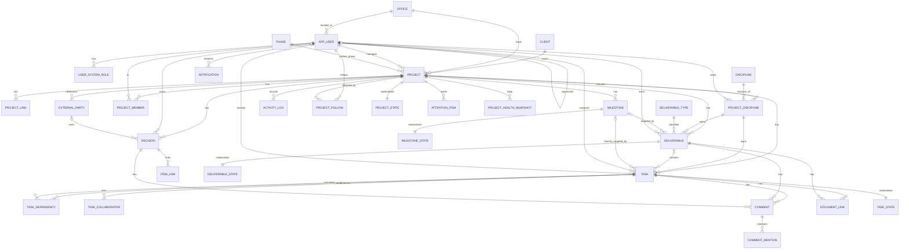

## 21. Security Requirements

The Hub is an internal line-of-business application holding project coordination data (not financial or personal-sensitive data beyond employee names, emails, and job titles). Security is proportionate: standard enterprise controls, no over-engineering.

| Area | Requirement | Class |
|---|---|---|
| Transport | HTTPS only; TLS 1.2+; HSTS; HTTP redirects to HTTPS. | MVP |
| Authentication | Microsoft Entra ID via OpenID Connect / OAuth 2.0 with PKCE for the SPA; API accepts only bearer tokens issued for the Hub API audience; no local accounts, no passwords stored. | MVP |
| Authorisation | Role-based access control per Section 8 enforced in the application service layer for every command and query; deny by default; permission tests derived from the matrix. | MVP |
| Least privilege | App Service uses a system-assigned managed identity to reach Key Vault and (if Graph is used) Graph with the minimum application permissions (`User.Read.All` for sync; `Mail.Send` restricted to one mailbox via an Application Access Policy). Database role for the app has only the needed DML; `activity_log` INSERT/SELECT only (Rec). | MVP |
| Secret management | No secrets in code or config files; connection strings and client secrets in Azure Key Vault referenced by App Service; rotate on schedule (TBD). Prefer Entra-authenticated PostgreSQL (managed identity) to avoid database passwords entirely. | MVP |
| Audit logging | Section 20; plus sign-in and export events. | MVP |
| Backups | Azure Database for PostgreSQL automated backups with point-in-time restore (7–35 days; **TBD**); restore tested before go-live and quarterly (Rec). | MVP |
| Database security | Private networking (VNet integration + private endpoint) or at minimum firewall restricted to App Service outbound IPs; TLS enforced; encryption at rest (platform default); no public admin access; separate credentials per environment. | MVP (private endpoint Rec) |
| Secure coding | Input validation on all API inputs (schema validation); parameterised queries via the ORM; output encoding in the SPA (React default); markdown rendering through a sanitising renderer with an allow-list; CSRF not applicable to bearer-token APIs but SameSite cookies if any are used; Content Security Policy, X-Content-Type-Options, Referrer-Policy, frame-ancestors headers. | MVP |
| Dependency management | Automated dependency vulnerability scanning (Dependabot/Renovate or equivalent) with monthly update cadence and immediate action on critical CVEs; lockfiles committed; container/base image scanning if containers are used. | MVP |
| Logging | Structured application logs with correlation IDs; no secrets, tokens, or comment bodies in logs; user identifiers as IDs not emails where possible; log retention 30–90 days (TBD). | MVP |
| Environment separation | Separate Azure resource groups (and ideally subscriptions) for dev, test/UAT, prod; separate Entra app registrations per environment; no production data in dev; anonymised copy for test if needed (TBD). | MVP |
| Rate limiting | Basic per-user request rate limit on the API (e.g., 600 requests/minute) to protect against runaway clients. | Rec |
| Data classification | All project data treated as internal-confidential; Restricted projects (if enabled) additionally limited to members. | MVP |
| Security review | Threat-model walkthrough before pilot; automated OWASP dependency and static analysis in CI; penetration test before organisation-wide rollout (**TBD**). | Rec |
| Not in scope | Customer-facing security certifications, DLP integration, field-level encryption, bring-your-own-key. | — |

---

## 22. Non-Functional Requirements

Targets are realistic for an internal business application. Items marked TBD need a company decision; none are contractual SLAs.

| Area | Requirement | Target | Notes |
|---|---|---|---|
| Performance — page load | Time to interactive for My Work, Project Dashboard, Task List (≤ 500 tasks) on the corporate network | ≤ 2 s p95 | Measured with App Insights browser SDK |
| Performance — API | List endpoints (page of 100) and item reads | ≤ 500 ms p95 at 100 concurrent users | |
| Performance — evaluation | Re-evaluation of one project's derived states after a write | ≤ 2 s for a project with 2,000 tasks; asynchronous, never blocks the user's save | §23.5 |
| Performance — nightly job | Full re-evaluation + snapshots for all Active projects | ≤ 30 minutes for 500 projects / 100,000 tasks | Assumption on scale |
| Scale (assumption) | 300–500 users; 300–600 Active projects; 100,000 open tasks; 2,000,000 activity rows/year | Single PostgreSQL instance is sufficient | **TBD** actual numbers |
| Availability | Business hours across the organisation's time zones | 99.5% monthly (≈ 3.5 h downtime) | Single-region; no HA database in MVP unless required (**TBD**) |
| Reliability | No data loss on failure; jobs idempotent and resumable; notifications at-least-once with de-dup | RPO ≤ 15 min (PITR); RTO ≤ 8 h (**TBD**) | |
| Maintainability | Modular monolith; ADRs for decisions; automated tests: rules engine ≥ 95% branch coverage, services ≥ 70%, critical UI flows end-to-end; CI on every PR | — | |
| Scalability | Scale App Service plan vertically/horizontally; database tier upgrade; no architectural change needed up to 5× assumed scale | — | |
| Accessibility | WCAG 2.1 AA for all MVP screens | — | Automated checks in CI + manual audit before GA |
| Browser support | Current and previous major versions of Microsoft Edge and Google Chrome; Safari on iPadOS (current); Firefox current (Rec) | — | **TBD** official list |
| Responsiveness | Desktop primary (≥ 1280), tablet usable (768–1279), phone: My Work, task updates, notifications, search | — | §13.0 |
| Backup/recovery | Automated daily backups + PITR; quarterly restore drill; infrastructure re-creatable from IaC in < 1 day | — | |
| Monitoring | App Insights: availability test on `/health`, request/dependency telemetry, exceptions, job durations, queue depths; alerts on error rate, job failure, digest not sent | — | |
| Logging | Structured JSON logs to App Insights/Log Analytics; 30–90 day retention (**TBD**) | — | |
| Localisation | UI strings externalised from day one; English at launch; second language (e.g., French) if required (**TBD — Business Decision Required**) | — | Retrofitting i18n is expensive; externalising strings is cheap |
| Data export | Every list exportable; full project export at archive | — | Avoids lock-in |
| Documentation | Admin guide, user quick guide, API reference (OpenAPI), runbook for jobs and restores | — | |

---

## 23. Technical Architecture

### 23.1 Recommendation in one paragraph

**Recommendation:** Build a **modular monolith**: a React + TypeScript single-page application talking to a single **ASP.NET Core (.NET 8 LTS) Web API** backed by **PostgreSQL**, with background jobs hosted in the same application, authenticated by **Microsoft Entra ID**, deployed to **Azure App Service (Linux)** with **Azure Database for PostgreSQL Flexible Server**, **Key Vault**, and **Application Insights**, provisioned with **Bicep**, delivered via CI/CD. Node.js/TypeScript (NestJS + Prisma or Drizzle) is an acceptable alternative backend if the team's skills favour it; the rest of the architecture is unchanged.

### 23.2 Option evaluation

**Backend**

| Criterion | ASP.NET Core (.NET 8) | Node.js / TypeScript (NestJS or Fastify) |
|---|---|---|
| Entra ID integration | First-class (`Microsoft.Identity.Web`), Graph SDK mature | Good (`@azure/msal-node`, `passport-azure-ad`, Graph SDK) |
| Type safety / domain modelling | Strong; records, enums, pattern matching suit a rules engine | Good with strict TS; runtime validation needed (zod) |
| ORM / migrations | EF Core with Npgsql; mature migrations | Prisma (excellent DX) or Drizzle; mature |
| Background jobs in-process | Hosted services + Quartz.NET or Hangfire | BullMQ needs Redis; node-cron simple but not durable |
| Team skills | **TBD** — likely Microsoft-oriented in an engineering consulting firm | **TBD** — one language across front and back |
| Hosting on App Service | Native | Native |
| Recommendation | **Preferred** for a Microsoft-ecosystem organisation and for durable in-process scheduling without extra infrastructure | Choose if the team is stronger in TypeScript |

**Frontend**

| Criterion | React + Vite SPA (TypeScript) | Next.js |
|---|---|---|
| Fit | Internal app behind SSO; no SEO; heavy tables and panels | SSR/ISR add complexity without benefit here |
| Auth | MSAL.js in browser | MSAL with server components adds complexity |
| Hosting | Static files served by App Service or Azure Static Web Apps | Requires Node runtime |
| Recommendation | **Preferred** | Acceptable if team already standardised on it |

**Hosting**

| Criterion | Azure App Service (Linux) | Azure Container Apps | AKS |
|---|---|---|---|
| Operational simplicity | Highest | Medium | Low |
| Fit for one API + jobs | Excellent (WebJobs or in-process hosted services) | Good (scale-to-zero not needed) | Over-engineered |
| Recommendation | **Preferred** for MVP | Revisit if containerised workloads multiply | Not recommended |

**Supporting libraries (Recommendation, not mandatory)**: UI kit — Fluent UI React v9 (Microsoft look, accessible) or a headless kit with in-house styling; tables — TanStack Table with virtualisation; data fetching — TanStack Query; forms — React Hook Form + Zod; routing — React Router; charts — accessible SVG milestone strip, sparkline, and first-release overview task charts (§36.6); timeline — in-house SVG or a small MIT-licensed Gantt component; backend validation — FluentValidation; OpenAPI — Swashbuckle/NSwag with generated TypeScript client.

### 23.3 Modular monolith structure

One deployable API with clear internal module boundaries (separate projects/assemblies or folders with enforced dependency rules):

| Module | Responsibilities |
|---|---|
| `Identity` | Token validation, user provisioning, system roles, Graph sync |
| `Organisation` | Offices, disciplines, clients, project types, phases, deliverable types, settings |
| `Projects` | Project, links, members, project disciplines, status lifecycle, health override |
| `Work` | Milestones, deliverables, tasks, dependencies, collaborators, task-hour entries, keys/sequences |
| `Workspace` | Named project selections, cross-project board and timeline queries, dashboard layout, calendar events and deadline projections (§36) |
| `Registers` | Decisions, external parties; P2 risks, issues, meetings, actions; item links |
| `Collaboration` | Comments, mentions, watchers, document links |
| `Evaluation` | Pure rules (indicators, milestone status, health, attention) + state materialisation + change detection |
| `Notifications` | Event → notification mapping, preferences, in-app store, email rendering and sending, digest |
| `Templates` (P2) | Template CRUD and instantiation |
| `Reporting` | Report queries, exports, first-release portfolio and workload views |
| `Audit` | Activity logging, history queries |
| `Search` | FTS indexing and query |

Layering inside each module: API endpoints (thin) → application services / command and query handlers (authorisation, transactions, logging) → domain (entities, state machines, pure rule functions) → persistence (EF Core). Modules communicate through in-process domain events (e.g., `TaskStatusChanged`) handled synchronously for logging and asynchronously (outbox) for evaluation and notifications.

### 23.4 Frontend architecture

- SPA with route-based code splitting per area (My Work, Project, Admin).
- Generated typed API client from OpenAPI; server state via TanStack Query with per-project cache keys and invalidation on mutations.
- Shared component library: status pill, indicator chip, people picker, date picker, data table (virtualised, column chooser, group-by), side panel, filter bar, confirmation dialog with consequence text, "Why?" popover.
- Filter/sort/group state encoded in the URL; panels deep-linkable.
- Feature flags (simple config) for MVP-Recommended items and P2 modules so they can ship dark.
- Strings externalised (i18n-ready) from the first component.

### 23.5 Rules evaluation and background processing

**Strategy: compute on change, materialise, and re-run nightly.**

1. All rule logic lives in the `Evaluation` module as pure functions over in-memory snapshots of a project's tasks, dependencies, deliverables, milestones, decisions, and settings. They are exhaustively unit-tested (the worked examples in §15.12 are test cases).
2. After any write in a project that can affect derived state (task/deliverable/milestone/decision/dependency/project status), the transaction commits and publishes a `ProjectChanged(project_id)` event through a transactional **outbox** table. A background worker consumes it (debounced per project for ~2 seconds) and re-evaluates the whole project, writing results to `task_state`, `deliverable_state`, `milestone_state`, and `project_state` tables and upserting `attention_item` rows. Whole-project evaluation is simple and fast at the expected scale (thousands of tasks), and avoids incremental-graph bugs.
3. The worker **diffs** new state against previous state to detect transitions (became Blocked, became unblocked, milestone became At Risk, new Critical attention item) and emits notification events for exactly those transitions — this is how "notify when something *becomes* overdue" works without spamming.
4. A **nightly job** (after midnight in `org_time_zone`) re-evaluates every Active project (date rollovers), writes health snapshots, expires health overrides and snoozes, and queues the daily digest for `digest_send_time_local`.
5. A **15-minute job** re-evaluates projects whose outbox processing failed and retries email sends. A **daily** Graph user sync marks leavers inactive (§23.6).
6. Reads (dashboards, lists, My Work, portfolio) query the materialised state tables with ordinary SQL — fast filtering and sorting by indicator, no rule logic in SQL.

> **Design note.** This hybrid avoids the two classic failure modes. Pure compute-on-read puts rule logic in SQL views and again in application code for notifications, and the two drift. Pure nightly batch leaves a task showing "not blocked" all day after its predecessor slipped. Evaluating the whole project on every change through one pure function, then diffing against the last result, gives a single source of truth, near-real-time indicators, and transition-based notifications from the same code path. Whole-project recomputation sounds wasteful but a project rarely exceeds a few thousand tasks, and simplicity wins.

Scheduling implementation: Quartz.NET (or Hangfire) hosted in the API process with a single-instance lock (database-based) so scaling out App Service instances does not duplicate jobs; job runs recorded in `job_run`. If the team prefers, jobs can run in a separate App Service WebJob using the same codebase — same deployable, different entry point.

### 23.6 Authentication and SSO

- **App registrations**: one for the SPA (public client, redirect URIs per environment), one for the API (exposes scope `access_as_user`, defines **App Roles**: `Hub.Admin`, `Hub.Executive`, `Hub.Supervisor`, `Hub.ProjectManager`, `Hub.ReadOnly`). Recommendation: use App Roles assigned to Entra security groups (via the Enterprise Application) rather than raw group claims, which suffer from group-overage limits and leak group IDs into tokens.
- **Sign-in**: MSAL.js authorization code flow with PKCE; access token for the API scope; silent renewal; token lifetime per tenant policy (~1 h). API validates issuer, audience, signature, and expiry with `Microsoft.Identity.Web`. Conditional Access and MFA are Entra concerns and apply automatically.
- **Provisioning**: on first successful call, the API creates `app_user` from token claims (`oid`, `preferred_username`, `name`) and grants Standard User; app-role claims populate system roles on every sign-in (source = Group); Admin-assigned roles (source = Manual) are additive.
- **Directory sync** (Recommendation): nightly Graph query of users in the organisation (or in the licensed groups) to update `is_active` from `accountEnabled`, `job_title`, `office_location`, and `manager` → `supervisor_id`. Requires `User.Read.All` application permission (**TBD — IT approval**). Fallback without Graph: users who fail sign-in due to a disabled account are marked inactive on the next attempted token use (weak), plus an Admin "deactivate" action.
- **Disabled accounts**: cannot obtain tokens (Entra); marked Inactive by sync; A-18 flags their work; the "Reassign work" tool lists everything they own.
- **Security groups**: five groups mapped to app roles, managed by IT; membership changes take effect at next token issuance.
- **Session management**: API is stateless (no server sessions). SPA sign-out clears MSAL cache and redirects to Entra logout. Idle timeout in the SPA (e.g., 8 h) forces re-authentication (**TBD**). No refresh tokens stored server-side.
- **Service-to-service**: none in MVP other than the API's managed identity to Key Vault/Graph/PostgreSQL.

### 23.7 Environments, CI/CD, IaC

- Environments: `dev` (shared, auto-deployed from main), `test` (UAT, deployed on release candidates), `prod` (approval-gated). Each has its own resource group, database, Key Vault, app registrations, and Entra groups.
- IaC: Bicep modules for App Service plan and app, PostgreSQL Flexible Server (with private endpoint/VNet integration), Key Vault, App Insights/Log Analytics, and (if used) Static Web App. Parameter files per environment.
- CI: build, unit tests, rules-engine tests, lint, dependency scan, OpenAPI generation, SPA build, accessibility checks on key pages; PR required for main.
- CD: GitHub Actions or Azure DevOps Pipelines (**TBD** by existing tooling); database migrations run as a deployment step with backup-before-migrate in prod; blue/green via App Service deployment slots (Rec).
- Configuration: environment variables from App Service settings referencing Key Vault; feature flags as configuration.

### 23.8 Observability

Application Insights (browser + server): requests, dependencies, exceptions, custom events (evaluation duration per project, attention items count, digest sent count, emails failed), availability test on `/health` (checks database and outbox lag). Dashboards and alerts: error rate > 2% for 10 min; outbox lag > 10 min; nightly job failed; digest not sent by 08:00; database CPU > 80% sustained.

### 23.9 Azure services and sizing (assumptions)

| Service | Purpose | Initial size (Assumption) |
|---|---|---|
| App Service (Linux) — P1v3 or P2v3 | API + static SPA + in-process jobs | 1–2 instances |
| Azure Database for PostgreSQL Flexible Server | Primary database | General Purpose 2–4 vCores, 128 GB, PITR 14 days; zone-redundant HA **TBD** |
| Azure Key Vault | Secrets and certificates | Standard |
| Application Insights + Log Analytics | Telemetry and logs | Pay-as-you-go, 30–90 day retention |
| Azure Static Web Apps (optional) | SPA hosting with CDN | Standard; alternatively serve SPA from App Service |
| Microsoft Graph | User sync, mail send | No cost; permissions approval |
| Azure Communication Services Email (alternative) | Outbound email | If Graph mail is not approved |
| Azure Storage | Not required (no files); optional for export staging | — |

### 23.10 Architecture diagram

```mermaid
flowchart LR
  subgraph Browser
    SPA[React + TypeScript SPA<br/>MSAL.js]
  end
  subgraph Entra[Microsoft Entra ID]
    IDP[(OIDC / OAuth2<br/>App Roles from Groups)]
  end
  subgraph Azure[Azure — App Service (Linux)]
    API[ASP.NET Core Web API<br/>Modules: Identity · Organisation · Projects · Work · Registers · Collaboration · Evaluation · Notifications · Reporting · Audit · Search]
    JOBS[In-process jobs<br/>Outbox consumer · Nightly evaluation · Digest · Graph sync]
    API --- JOBS
  end
  PG[(Azure Database for PostgreSQL<br/>core tables · state tables · outbox · activity_log · FTS)]
  KV[(Key Vault)]
  AI[(Application Insights)]
  GRAPH[Microsoft Graph<br/>Users · Mail.Send]
  SPA -- bearer token --> API
  SPA -. sign-in .-> IDP
  API -. validate token .-> IDP
  API --> PG
  JOBS --> PG
  API --> KV
  API --> AI
  SPA --> AI
  JOBS --> GRAPH
```

---

## 24. Database Design

### 24.1 Conventions

- PostgreSQL 15+; schema `hub`; `snake_case` identifiers.
- Primary keys: `uuid` (UUIDv7 generated in the application for index locality). Human keys (`1234-T0042`) stored separately and unique per project.
- Statuses and enums: `text` columns with `CHECK` constraints (easy to evolve); admin-managed lists are tables.
- Audit columns on mutable entities: `created_at timestamptz`, `created_by uuid`, `updated_at`, `updated_by`, `row_version integer` (incremented by the application on every update; used for optimistic concurrency).
- Soft delete on work items: `deleted_at timestamptz`, `deleted_by uuid`; partial indexes `WHERE deleted_at IS NULL`.
- Dates `date`; timestamps `timestamptz`; money never stored.
- Foreign keys always declared; `ON DELETE RESTRICT` by default (soft delete makes cascades unnecessary), `ON DELETE CASCADE` only for pure child rows (links, mentions, state tables).
- `project_id` denormalised onto every project-scoped row (tasks, comments, links, logs, state) for permission filtering and partition-friendly queries.

### 24.2 Entities

Only the important fields are listed; standard audit columns are implied.

#### Organisation

| Entity | Purpose | Key fields | PK | FKs / relationships |
|---|---|---|---|---|
| `app_user` | Employees who can use the Hub | `entra_object_id` (unique), `email` (unique), `display_name`, `job_title`, `office_id`, `supervisor_id`, `is_active`, `weekly_capacity_hours`, `last_sign_in_at` | `id` | `office_id → office`; `supervisor_id → app_user` (self) |
| `user_system_role` | System roles per user | `user_id`, `role` (Admin, Executive, Supervisor, ProjectManager, ReadOnly), `source` (Group, Manual), `granted_by`, `granted_at` | `id`; unique(`user_id`,`role`) | `user_id → app_user` |
| `office` | Offices | `name`, `code`, `time_zone`, `is_active` | `id` | — |
| `discipline` | Organisation discipline list | `name`, `code`, `colour`, `sort_order`, `is_active` | `id` | — |
| `client` | Clients | `name`, `short_name`, `is_active` | `id` | — |
| `project_type` | Project categories | `name`, `is_active` | `id` | — |
| `phase` | Ordered phases | `name`, `sort_order`, `is_active` | `id` | — |
| `deliverable_type` | Deliverable categories | `name`, `sort_order`, `is_active` | `id` | — |
| `org_setting` | Thresholds and settings | `key`, `value` (jsonb), `description`, `updated_by`, `updated_at` | `key` | — |
| `user_setting` | Per-user preferences | `user_id`, `digest_enabled`, `digest_time_local`, `date_format`, `dense_rows` | `user_id` | → `app_user` |

#### Project

| Entity | Purpose | Key fields | PK | FKs / relationships |
|---|---|---|---|---|
| `project` | Project master | `project_number` (unique, citext), `name`, `client_id`, `client_reference`, `project_manager_id`, `office_id`, `project_type_id`, `description`, `location`, `status`, `phase_id`, `start_date`, `target_completion_date`, `visibility`, `internal_notes`, `coordination_day`, `health_override`, `health_override_note`, `health_override_by`, `health_override_at`, `health_override_expires_at`, `created_from_template_id`, `template_version`, `last_coordination_reviewed_at`, `last_coordination_reviewed_by`, `status_changed_at`, `completed_at`, `archived_at`, `next_task_seq`, `next_deliverable_seq`, `next_milestone_seq`, `next_decision_seq`, `next_risk_seq`, `next_issue_seq`, `next_action_seq`, `search_vector` | `id` | `client_id → client`; `project_manager_id → app_user`; `office_id → office`; `project_type_id`; `phase_id`; `created_from_template_id → project_template` |
| `project_link` | Important links | `project_id`, `title`, `url`, `link_type`, `sort_order` | `id` | → `project` (cascade) |
| `project_discipline` | Disciplines active on a project with lead | `project_id`, `discipline_id`, `lead_user_id`, `sort_order`, `is_active` | `id`; unique(`project_id`,`discipline_id`) | → `project`, `discipline`, `app_user` |
| `project_member` | Team membership and project roles | `project_id`, `user_id`, `roles` (text[]: PM, TeamMember, Reviewer, Viewer), `primary_discipline_id`, `added_by`, `added_at`, `removed_at` | `id`; unique(`project_id`,`user_id`) where `removed_at is null` | → `project`, `app_user`, `project_discipline` |
| `external_party` | Client and third-party contacts (no login) | `project_id`, `name`, `organisation`, `email`, `role`, `is_client`, `notes`, `is_active` | `id` | → `project` |
| `project_health_snapshot` | Daily health history | `project_id`, `snapshot_date`, `computed_health`, `reported_health`, `inputs` (jsonb) | `id`; unique(`project_id`,`snapshot_date`) | → `project` |

The first-release Projects board (§36.2) adds `priority` (Low/Medium/High/Critical, default Medium) to `project`. `progress_pct` is derived at read time or materialised by the existing rules engine from Complete / non-Cancelled tasks; it is nullable when the denominator is zero. It is never stored as a PM-entered project status.

#### Work

| Entity | Purpose | Key fields | PK | FKs / relationships |
|---|---|---|---|---|
| `milestone` | Dated checkpoints | `project_id`, `key`, `seq`, `name`, `milestone_type`, `date`, `original_date`, `description`, `project_discipline_id`, `completes_phase_id`, `is_client_facing`, `is_complete`, `completed_date`, `is_cancelled`, `cancelled_reason`, `sort_order`, `search_vector`, soft-delete | `id`; unique(`project_id`,`seq`) | → `project`, `project_discipline`, `phase` |
| `deliverable` | Engineering deliverables | `project_id`, `key`, `seq`, `name`, `project_discipline_id`, `deliverable_type_id`, `description`, `owner_id`, `reviewer_id`, `milestone_id`, `start_date`, `due_date`, `priority`, `status`, `previous_status`, `revision`, `issued_date`, `issued_to`, `accepted_date`, `on_hold_reason`, `cancelled_reason`, `requires_review`, `template_deliverable_id`, `last_activity_at`, `search_vector`, soft-delete, `row_version` | `id`; unique(`project_id`,`seq`) | → `project`, `project_discipline`, `deliverable_type`, `app_user` (owner, reviewer), `milestone` |
| `task` | Units of work | `project_id`, `key`, `seq`, `name`, `description`, `project_discipline_id`, `deliverable_id`, `milestone_id`, `assignee_id`, `reviewer_id`, `requires_review`, `priority`, `start_date`, `due_date`, `status`, `previous_status`, `progress_pct`, `estimated_hours`, `manual_block_type`, `manual_block_reason`, `manual_block_set_at`, `manual_block_set_by`, `on_hold_reason`, `cancelled_reason`, `review_round`, `due_date_change_count`, `last_activity_at`, `completed_at`, `sort_order`, `template_task_id`, `search_vector`, soft-delete, `row_version` | `id`; unique(`project_id`,`seq`) | → `project`, `project_discipline`, `deliverable`, `milestone`, `app_user` (assignee, reviewer). CHECK: `milestone_id IS NULL OR deliverable_id IS NULL`; CHECK `progress_pct IN (0,10,…,100)`; CHECK `start_date <= due_date` |
| `task_time_entry` | Actual hours recorded against one task | `project_id`, `task_id`, `user_id`, `work_date`, `hours` (positive decimal, ≤ 24), `note`, `created_at`, `updated_at`, `deleted_at`, `row_version` | `id` | → `project`, `task`, `app_user`; daily total ≤ 24 enforced transactionally across a user's non-deleted entries |
| `task_dependency` | Finish-to-Start edges | `project_id`, `predecessor_task_id`, `successor_task_id`, `dependency_type` (FinishToStart), `note`, `created_by`, `created_at` | `id`; unique(`predecessor_task_id`,`successor_task_id`) | → `task` ×2 (cascade on task hard-delete only); CHECK `predecessor_task_id <> successor_task_id`. Acyclicity enforced in application (graph check inside the transaction with the project's edges locked). |
| `task_collaborator` | Additional contributors | `task_id`, `user_id`, `added_at` | `id`; unique(`task_id`,`user_id`) | → `task` (cascade), `app_user` |
| `item_watcher` | Users following an item | `project_id`, `item_type`, `item_id`, `user_id`, `source` (Mention, Manual, Assignment) | `id`; unique(`item_type`,`item_id`,`user_id`) | → `app_user`; polymorphic item |

#### Visual workspace and calendar (first release, §36)

| Entity | Purpose | Key fields | PK | FKs / relationships |
|---|---|---|---|---|
| `workspace` | User-owned named project scope | `name`, `owner_id`, `created_at` | `id` | → `app_user`; selections show only currently permitted projects |
| `workspace_project` | Project selection | `workspace_id`, `project_id`, `sort_order` | `id`; unique(`workspace_id`,`project_id`) | → `workspace`, `project` |
| `calendar_event` | Meeting, Site Work, or Internal Task event | `project_id` (nullable for Internal Task), `type`, `title`, `start_at`, `end_at`, `org_time_zone`, `owner_id`, `location`, `description`, `visibility`, `cancelled_at`, `row_version` | `id` | → `project`, `app_user`; CHECK `end_at > start_at` |
| `dashboard_layout` | Personal order and visibility of fixed widgets | `user_id`, `widget_ids_and_order` (jsonb), `updated_at` | `user_id` | → `app_user` |

Deadline calendar entries are projections from tasks, deliverables, and milestones, not copied event rows. The four board lanes are projections of canonical task status, and their counts use the same permission-filtered query as the task lists.
The first-release Created by Me view (§36.7) requires `task.created_by_id`, retained independently of assignment changes and linked to `app_user`.

#### Registers

| Entity | Purpose | Key fields | PK | FKs / relationships |
|---|---|---|---|---|
| `decision` | Decision register | `project_id`, `key`, `seq`, `subject`, `description`, `requested_by_id`, `owner_user_id`, `owner_external_party_id`, `date_requested`, `required_by_date`, `original_required_by_date`, `impact_level`, `impact_description`, `status`, `decision_text`, `decision_date`, `decided_by_id`, `deferral_reason`, `cancelled_reason`, `search_vector`, soft-delete, `row_version` | `id`; unique(`project_id`,`seq`) | → `project`, `app_user`, `external_party`. CHECK exactly one of `owner_user_id`, `owner_external_party_id` not null |
| `item_link` | Generic relation between items | `project_id`, `source_type`, `source_id`, `target_type`, `target_id`, `relation` (blocked_by_decision, related, realised_as, converted_to_task), `created_by`, `created_at` | `id`; unique(all five) | polymorphic; indexes on (`source_type`,`source_id`) and (`target_type`,`target_id`) |
| `risk` [P2] | Risk register | `project_id`, `key`, `seq`, `title`, `description`, `owner_id`, `probability`, `impact`, `severity` (generated), `mitigation`, `trigger_indicator`, `review_date`, `status`, `realised_issue_id` | `id` | → `project`, `app_user`, `issue` |
| `issue` [P2] | Issue register | `project_id`, `key`, `seq`, `title`, `description`, `raised_by_id`, `owner_id`, `severity`, `date_raised`, `target_resolution_date`, `resolution`, `resolved_date`, `status`, `origin_risk_id` | `id` | → `project`, `app_user`, `risk` |
| `meeting` [P2] | Meeting record | `project_id`, `title`, `meeting_date`, `meeting_type`, `notes_link`, `created_by` | `id` | → `project` |
| `meeting_action` [P2] | Actions from meetings | `project_id`, `key`, `seq`, `meeting_id`, `action`, `owner_type`, `owner_user_id`, `owner_discipline_id`, `owner_external_party_id`, `due_date`, `status`, `related_task_id`, `related_decision_id` | `id` | → `meeting`, `app_user`, `project_discipline`, `external_party`, `task`, `decision` |

#### Collaboration

| Entity | Purpose | Key fields | PK | FKs / relationships |
|---|---|---|---|---|
| `comment` | Comments on items | `project_id`, `item_type`, `item_id`, `author_id`, `body`, `comment_kind`, `review_round`, `created_at`, `edited_at`, `deleted_at`, `deleted_by` | `id` | → `project`, `app_user`; polymorphic item; index (`item_type`,`item_id`,`created_at`) |
| `comment_mention` | Users mentioned in a comment | `comment_id`, `user_id` | `id`; unique | → `comment` (cascade), `app_user` |
| `document_link` | Links to documents | `project_id`, `item_type` (Project, Deliverable, Task), `item_id`, `title`, `url`, `link_type`, `added_by`, `added_at`, `deleted_at` | `id` | polymorphic item |

#### System

| Entity | Purpose | Key fields | PK | FKs / relationships |
|---|---|---|---|---|
| `activity_log` | Immutable audit | per §20.2 | `id` (uuid v7, time-ordered) | indexes (`project_id`,`occurred_at desc`), (`item_type`,`item_id`,`occurred_at desc`), (`actor_user_id`,`occurred_at desc`) |
| `notification` | In-app notifications | `user_id`, `event_type`, `project_id`, `item_type`, `item_id`, `item_key`, `title`, `body`, `link_path`, `collapse_key`, `created_at`, `read_at`, `emailed_at`, `digest_included_at` | `id` | → `app_user`; index (`user_id`,`read_at`,`created_at desc`) |
| `notification_preference` | Per-user, per-event channels | `user_id`, `event_type`, `in_app`, `email` | `id`; unique(`user_id`,`event_type`) | → `app_user` |
| `project_follow` | Per-user project following; the Muted level replaces a separate mute table (§12.18) | `user_id`, `project_id`, `level` (AllActivity, MyItemsOnly, Muted), `source` (Assignment, Manual), `last_seen_at` (Following feed read marker), `created_at`, `updated_at` | `id`; unique(`user_id`,`project_id`) | → `app_user`, `project` (cascade) |
| `outbox_event` | Transactional outbox | `id`, `event_type`, `payload` (jsonb), `created_at`, `processed_at`, `attempts`, `last_error` | `id` | index on (`processed_at`) where null |
| `task_state` | Materialised derived state | `task_id`, `project_id`, `is_overdue`, `days_overdue`, `is_due_soon`, `is_waiting`, `is_blocked`, `blocked_since`, `blocked_by` (jsonb: tasks/decisions/manual), `is_blocking`, `blocking_count`, `is_stale`, `is_unassigned`, `is_missing_due_date`, `is_date_inconsistent`, `inconsistency_detail`, `affected_milestone_ids` (uuid[]), `evaluated_at` | `task_id` | → `task` (cascade) |
| `deliverable_state` | Materialised derived state | `deliverable_id`, `project_id`, `progress_pct`, `task_total`, `task_complete`, `task_open`, `task_overdue`, `task_blocked`, `estimated_hours_total`, `remaining_hours`, `is_overdue`, `is_due_soon`, `is_at_risk`, `is_unassigned`, `is_date_inconsistent`, `slip_days`, `derived_predecessor_ids`, `derived_successor_ids`, `evaluated_at` | `deliverable_id` | → `deliverable` (cascade) |
| `milestone_state` | Materialised status | `milestone_id`, `project_id`, `status`, `status_reasons` (jsonb), `days_remaining`, `slip_days`, `deliverable_total`, `deliverable_issued`, `task_open`, `task_overdue`, `task_blocked`, `evaluated_at` | `milestone_id` | → `milestone` (cascade) |
| `project_state` | Materialised health and counts | `project_id`, `computed_health`, `health_reasons` (jsonb), `inputs` (jsonb per §16.3), `counts` (jsonb), `discipline_states` (jsonb), `next_milestone_id`, `next_submission_milestone_id`, `evaluated_at` | `project_id` | → `project` (cascade) |
| `attention_item` | Current attention items | `project_id`, `rule_id`, `item_type`, `item_id`, `item_key`, `severity`, `message`, `route_to_user_ids` (uuid[]), `first_detected_at`, `last_evaluated_at`, `sort_key` | `id`; unique(`rule_id`,`item_type`,`item_id`) | → `project` |
| `attention_snooze` | Snoozes | `project_id`, `rule_id`, `item_type`, `item_id`, `snoozed_by`, `snoozed_until`, `note`, `created_at` | `id` | → `project`, `app_user` |
| `job_run` | Background job history | `job_name`, `started_at`, `finished_at`, `status`, `details` (jsonb) | `id` | — |
| `saved_view` | First-release saved list configurations | `owner_id`, `scope`, `project_id`, `list_type`, `name`, `filters` (jsonb), `sort`, `columns`, `group_by`, `is_default` | `id` | → `app_user`, `project` |

#### Templates [P2]

| Entity | Key fields | PK | FKs |
|---|---|---|---|
| `project_template` | `name`, `description`, `project_type_id`, `version`, `status`, `published_at`, `created_by` | `id` | → `project_type` |
| `template_discipline` | `template_id`, `discipline_id`, `sort_order`, `is_default_included` | `id` | → `project_template`, `discipline` |
| `template_milestone` | `template_id`, `name`, `milestone_type`, `sort_order`, `anchor`, `offset_days_from_anchor`, `completes_phase_id`, `is_client_facing` | `id` | → `project_template`, `phase` |
| `template_deliverable` | `template_id`, `template_discipline_id`, `name`, `deliverable_type_id`, `template_milestone_id`, `due_offset_days`, `requires_review`, `sort_order`, `description` | `id` | → template tables, `deliverable_type` |
| `template_task` | `template_id`, `template_deliverable_id`, `template_discipline_id`, `name`, `description`, `requires_review`, `priority`, `estimated_hours`, `due_offset_days`, `assign_to_role`, `sort_order` | `id` | → template tables |
| `template_dependency` | `predecessor_template_task_id`, `successor_template_task_id` | `id`; unique | → `template_task` ×2 |

### 24.3 ERD (core MVP entities)



### 24.4 Key indexes

- `task (project_id, status) WHERE deleted_at IS NULL`; `task (assignee_id, status) WHERE deleted_at IS NULL`; `task (reviewer_id, status)`; `task (deliverable_id)`; `task (due_date) WHERE deleted_at IS NULL AND status NOT IN ('Complete','Cancelled')`.
- `task_state (project_id, is_blocked)`, `(project_id, is_overdue)`, `(is_blocking)`; My Work queries join `task` with `task_state` by `task_id`.
- `task_dependency (successor_task_id)`, `(predecessor_task_id)`.
- `task_time_entry (user_id, work_date) WHERE deleted_at IS NULL`, `(project_id, work_date) WHERE deleted_at IS NULL`, `(task_id, work_date) WHERE deleted_at IS NULL`.
- `deliverable (project_id, status)`, `(milestone_id)`, `(owner_id, status)`.
- `milestone (project_id, date)`.
- `decision (project_id, status)`, `(required_by_date) WHERE status IN ('Pending','Under Review','Deferred')`.
- `comment (item_type, item_id, created_at)`; `document_link (item_type, item_id)`; `item_link` both directions.
- `activity_log (project_id, occurred_at DESC)`, `(item_type, item_id, occurred_at DESC)`.
- `notification (user_id, read_at, created_at DESC)`.
- `project_follow (user_id)`, `(project_id, level)`; `app_user (supervisor_id)` for My Staff's direct-report lookup.
- `workspace (owner_id, name)` unique per user; `workspace_project (workspace_id, sort_order)`; `calendar_event (project_id, start_at)`, `(owner_id, start_at)` for scoped calendar queries.
- GIN on `search_vector` columns; `pg_trgm` GIN on `project.project_number`, `project.name`, `task.name`, `deliverable.name`.

### 24.5 Constraints worth stating

- Exactly one owner on `decision` (CHECK).
- `task.milestone_id` only when `deliverable_id` is null (CHECK).
- `project_member.roles` non-empty and within allowed values (CHECK).
- `task_dependency` acyclicity: application-enforced with `SELECT … FOR UPDATE` on the project row to serialise edge insertions per project, then a DFS over the project's edges.
- Per-project sequence counters (`next_*_seq`) incremented under the same project row lock, guaranteeing gap-free, unique keys without a global sequence per project.
- A user cannot be their own supervisor: CHECK `supervisor_id <> id`.

### 24.6 Migrations and data volume

- EF Core migrations (or equivalent) versioned in the repository; every migration reversible or accompanied by a documented rollback.
- Estimated volumes (assumption): `task` 200k rows/year; `activity_log` 2–3M rows/year; `notification` 1M rows/year (purge read notifications after 180 days — Rec); state tables one row per work item. All comfortably within a single mid-tier PostgreSQL instance for years.

---

## 25. API Design

### 25.1 Conventions

- REST over HTTPS; JSON (camelCase); base path `/api/v1`. Versioning by path; breaking changes require a new major version.
- Resources are nouns; project-scoped collections are nested one level (`/projects/{projectId}/tasks`); individual items also have canonical top-level routes (`/tasks/{taskId}`) so panels can deep-link by ID.
- Human keys are accepted wherever IDs are (`/tasks/1234-T0042`), resolved server-side.
- `GET` is safe and cacheable per user for short periods; `POST` creates; `PATCH` partially updates (JSON merge semantics on provided fields); `PUT` is not used; `DELETE` soft-deletes; explicit **actions** use `POST /…/{id}:action` (e.g., `:transition`, `:issue`, `:complete`, `:snooze`) so state machines are not smuggled through PATCH.
- All list responses share an envelope; all errors share a problem-details shape.
- OpenAPI 3 document generated from code and published at `/api/v1/openapi.json`; TypeScript client generated from it.

### 25.2 Authentication and authorisation

- `Authorization: Bearer <access token>` issued by Entra ID for the API's audience. Missing/invalid → `401`.
- Every endpoint declares its required permission (e.g., `Task.Update`) and scope resolution (project from route or body). The authorisation service resolves the caller's system roles (from app-role claims + manual grants) and project roles (from `project_member`, `project_discipline`, `project.project_manager_id`) and ownership, and evaluates the matrix (§8.5). Denied → `403` with a problem detail explaining the missing role in plain language (used by the UI for hover text).
- List endpoints apply visibility filtering server-side (Restricted projects).

### 25.3 Pagination

Offset pagination is sufficient for an internal app: `?page=1&pageSize=50` (max 200). Response envelope:

```json
{
  "items": [ /* … */ ],
  "page": 1,
  "pageSize": 50,
  "totalCount": 1234,
  "sort": "dueDate:asc,key:asc",
  "filters": { "status": ["In Progress","Ready for Review"], "blocked": true }
}
```

Exports bypass pagination through dedicated `/export` endpoints that stream CSV/XLSX.

### 25.4 Sorting

`?sort=field:dir[,field:dir]` with an allow-list of sortable fields per resource; unknown field → `400`. Default sorts documented per list (§13). Nulls last for dates.

### 25.5 Filtering

Query parameters named after fields; multiple values comma-separated (OR within field); ranges via `From`/`To` suffixes; boolean indicators as flags; free text `q`.

Examples: `GET /projects/{id}/tasks?status=In Progress,Ready for Review&assigneeId=…&dueTo=2026-09-21&blocked=true&sort=dueDate:asc`; `GET /me/tasks?overdue=true`; `GET /portfolio?health=Red,Yellow&officeId=…&submissionWithinDays=14`.

### 25.6 Error handling

RFC 9457 problem details, `Content-Type: application/problem+json`:

```json
{
  "type": "https://hub.example/errors/validation",
  "title": "Validation failed",
  "status": 400,
  "detail": "One or more fields are invalid.",
  "traceId": "00-4bf9…",
  "errors": {
    "reviewerId": ["Reviewer cannot be the same as the assignee (allow_self_review is off)."],
    "dueDate": ["Due date is later than the deliverable due date 2026-10-02 (warning)."]
  },
  "warnings": ["Task is blocked by 1234-T0031; saved anyway."]
}
```

Status codes: `400` validation; `401`/`403` auth; `404` not found or not visible (indistinguishable by design); `409` conflict (concurrency, cycle, duplicate key, illegal transition — with `code` such as `dependency_cycle` and `cyclePath`); `422` business rule violation that is not a field error (e.g., cannot Complete: review outstanding), with `code`; `429` rate limited; `500` unexpected (no internals leaked; `traceId` for support).

Warnings (non-blocking rule outcomes) are returned alongside successful responses in a `warnings` array so the UI can show them as toasts.

### 25.7 Representative endpoints

| Method & path | Purpose | Permission |
|---|---|---|
| `GET /me` | Current user, system roles, preferences | any |
| `GET /me/work` | My Work aggregate (sections with counts and top rows) | any |
| `GET /me/tasks`, `/me/reviews`, `/me/deliverables`, `/me/decisions`, `/me/attention` | Section lists with filters | any |
| `GET /me/notifications`, `POST /me/notifications:markRead`, `PATCH /me/preferences` | Notification centre and preferences | any |
| `GET /me/following`, `GET /me/feed?projectId=…&since=…`, `POST /me/feed:markRead` | Followed projects, Following feed, feed read markers | any |
| `GET /projects` | Project list with filters/sort | any (visibility-filtered) |
| `POST /projects` | Create project | Project.Create |
| `GET /projects/{id}` | Project header and summary (includes `state`) | Project.View |
| `PATCH /projects/{id}` | Edit project fields | Project.Edit |
| `POST /projects/{id}:transition` | `{ toStatus, reason, closeout: {…} }` | Project.ChangeStatus |
| `POST /projects/{id}:healthOverride`, `DELETE …` | Set/clear override | Project.Edit |
| `POST /projects/{id}:follow` `{ level }`, `POST /projects/{id}:unfollow` | Set own follow level; unfollow | Project.View |
| `GET /projects/{id}/dashboard` | Dashboard payload (state, counts, attention top-10, discipline table, recent activity) | Project.View |
| `GET /projects/{id}/coordination?asOf=…` | Weekly Coordination sections | Project.View |
| `POST /projects/{id}/coordination:markReviewed` | Stamp review | Coordination.Run |
| `GET/POST/PATCH/DELETE /projects/{id}/members[/{memberId}]` | Team | Project.ManageTeam; Staff.Assign for POST/DELETE of a Supervisor's direct report as Team Member |
| `GET/POST/PATCH /projects/{id}/disciplines[/{pdId}]` | Project disciplines and leads | Project.ManageTeam |
| `GET/POST /projects/{id}/milestones`, `GET/PATCH/DELETE /milestones/{id}` | Milestones | Milestone.* |
| `POST /milestones/{id}:changeDate` | `{ newDate, reason, cascadeDeliverables: bool }` returns preview if `dryRun=true` | Milestone.Edit |
| `POST /milestones/{id}:complete`, `:reopen`, `:cancel` | Lifecycle | Milestone.Edit |
| `GET/POST /projects/{id}/deliverables`, `GET/PATCH/DELETE /deliverables/{id}` | Deliverables (list includes `state`) | Deliverable.* |
| `POST /deliverables/{id}:transition` | `{ toStatus, reason }` | Deliverable.ChangeStatus |
| `POST /deliverables/{id}:issue` | `{ issuedDate, revision, issuedTo, note, confirmOpenTasks }` | Deliverable.ChangeStatus |
| `GET/POST /projects/{id}/tasks`, `GET/PATCH/DELETE /tasks/{id}` | Tasks (list includes `state`) | Task.* |
| `POST /tasks/{id}:transition` | `{ toStatus, reason, comment }` | Task.ChangeStatus (role/ownership evaluated per transition) |
| `POST /tasks/{id}:assign` | `{ assigneeId, reviewerId }` | Task.Assign |
| `POST /tasks/{id}:setBlock`, `:clearBlock` | Manual block | Task.Update |
| `GET /tasks/{id}/dependencies`, `POST …`, `DELETE /dependencies/{depId}` | Dependencies | Dependency.Manage |
| `GET /tasks/{id}/chain?depth=10` | Transitive predecessors/successors with states | Task.View |
| `POST /projects/{id}/tasks:bulk` | `{ taskIds[], operation: assign \| shiftDueDates \| setPriority \| setDeliverable \| transition, params, reason }` → per-row results | per row |
| `GET/POST /time/entries`, `GET/PATCH/DELETE /time/entries/{id}` | Own task-hour entries and permitted project/staff review; filtered totals and soft deletion (§36.8) | Time.Own / Project.PM / Discipline.Lead / Staff.View |
| `GET /tasks/{id}/time`, `GET /projects/{id}/time` | Permission-filtered actual-hour totals and entries; export uses the Task Hours report | Task.View / Project.View with time-entry scope |
| `GET/POST /projects/{id}/decisions`, `GET/PATCH /decisions/{id}`, `POST /decisions/{id}:decide`, `:defer`, `:cancel`, `:reopen` | Decisions | Decision.* |
| `GET/POST /projects/{id}/externalParties` | External parties | Project.View / Project.Edit |
| `GET/POST /items/{type}/{id}/comments`, `PATCH/DELETE /comments/{id}` | Comments | Comment.* |
| `GET/POST /items/{type}/{id}/links`, `DELETE /links/{id}` | Document links | Link.* |
| `GET/POST/DELETE /items/{type}/{id}/watchers` | Watchers | any member |
| `GET /projects/{id}/attention`, `POST /attention/{id}:snooze` | Attention items | Project.View / Attention.Snooze |
| `GET /projects/{id}/activity`, `GET /items/{type}/{id}/activity` | Activity history | Project.View |
| `GET /projects/{id}/timeline` | Timeline payload (milestones, deliverables, tasks, and edges) | Project.View |
| `GET /search?q=…&types=…&includeArchived=false` | Global search | any |
| `GET /portfolio`, `GET /resources/workload` | First-release cross-project views | Portfolio.View / Workload.View |
| `GET/POST /workspaces`, `GET/PATCH/DELETE /workspaces/{id}` | User-owned named project selections; read filters inaccessible projects | Workspace.Own |
| `GET /workspaces/{id}/board`, `/timeline`, `/dashboard` | Permission-filtered cross-project views (§36) | Project.View per included project |
| `GET /calendar`, `GET/POST /calendar/events`, `GET/PATCH/DELETE /calendar/events/{id}` | Week/Month/Agenda entries and owned calendar events (§36.5) | Calendar.View / Event.Own / Project.PM |
| `GET /staff?scope=direct\|all` | My Staff rows with assignments and work counts | Staff.View (Supervisor; `all` for Executive/Admin) |
| `GET /users/{id}/assignments`, `GET /users/{id}/work` | A staff member's project assignments and My Work (read-only) | Staff.View (person in scope) |
| `GET /reports`, `GET /reports/{name}?…`, `GET /reports/{name}/export?format=csv\|xlsx` | Reports | scoped |
| `GET/POST/PATCH /admin/users`, `/admin/disciplines`, `/admin/clients`, `/admin/offices`, `/admin/deliverableTypes`, `/admin/phases`, `/admin/projectTypes`, `/admin/settings` | Administration | Admin |
| `GET /admin/users/{id}/openWork`, `POST /admin/users/{id}:reassignAll` | Reassign work tool | Admin / Supervisor (scoped) |
| `GET /health` | Liveness/readiness (DB, outbox lag) | anonymous (network-restricted) |

### 25.8 Optimistic concurrency

Every mutable resource returns `rowVersion`. `PATCH` and action endpoints require `If-Match: "<rowVersion>"` (or `rowVersion` in the body); a mismatch returns `409` with `code: "concurrency_conflict"`, the current representation, and the conflicting fields when determinable, so the UI can show "changed by Marc 2 minutes ago" and offer reload. Comments and links are append-only and exempt. Bulk operations check each row.

### 25.9 Representative payload — task

```json
{
  "id": "0192f1c2-…",
  "key": "1234-T0042",
  "projectId": "0192f0aa-…",
  "name": "Civil detailed grading — 60%",
  "description": "…",
  "discipline": { "id": "…", "code": "CIV", "name": "Civil" },
  "deliverable": { "id": "…", "key": "1234-D012", "name": "60% Civil Drawing Package", "dueDate": "2027-01-26" },
  "milestone": { "id": "…", "key": "1234-M04", "name": "60% Design Submission", "date": "2027-01-29", "derived": true },
  "assignee": { "id": "…", "displayName": "Alex Chen" },
  "reviewer": { "id": "…", "displayName": "Diane Roy" },
  "requiresReview": true,
  "priority": "High",
  "startDate": "2026-09-15",
  "dueDate": "2026-09-30",
  "status": "In Progress",
  "progressPct": 40,
  "estimatedHours": 24,
  "manualBlock": null,
  "reviewRound": 0,
  "dueDateChangeCount": 1,
  "lastActivityAt": "2026-09-14T15:02:11Z",
  "state": {
    "overdue": false, "daysOverdue": 0, "dueSoon": false,
    "waiting": false, "blocked": true, "blockedSince": "2026-09-11",
    "blockedBy": [
      { "type": "task", "id": "…", "key": "1234-T0031", "name": "Geotechnical pavement recommendations",
        "status": "In Progress", "dueDate": "2026-09-10", "overdue": true,
        "assignee": { "id": "…", "displayName": "Sam Patel" } }
    ],
    "blocking": false, "blockingCount": 0,
    "stale": false, "unassigned": false, "missingDueDate": false,
    "dateInconsistent": false,
    "affectedMilestones": [ { "id": "…", "key": "1234-M04", "name": "60% Design Submission", "date": "2027-01-29" } ],
    "evaluatedAt": "2026-09-15T06:05:00Z"
  },
  "permissions": { "canEdit": true, "canAssign": false, "canChangeDueDate": false, "allowedTransitions": ["Ready for Review", "On Hold"] },
  "rowVersion": 7,
  "createdAt": "2026-08-20T13:00:00Z", "createdBy": { "id": "…", "displayName": "Priya Nair" },
  "updatedAt": "2026-09-14T15:02:11Z"
}
```

Including `permissions.allowedTransitions` lets the UI render only valid actions without duplicating the state machine client-side.

### 25.10 Rate limits and idempotency

Per-user rate limit (e.g., 600 requests/minute) returning `429` with `Retry-After`. Create endpoints accept an optional `Idempotency-Key` header (Rec) to make retries safe on flaky connections; not required for MVP.

---

## 26. Integration Architecture

### 26.1 Principles

- MVP integrates with exactly one external system: **Microsoft Entra ID** (plus Microsoft Graph for user sync and, if approved, mail). Everything else is a link or an export.
- Integrations are **adapters** behind interfaces (`IUserDirectory`, `IEmailSender`, `IChatNotifier`, `IProjectMasterSource`) so they can be swapped or stubbed in dev/test.
- The Hub never writes to systems of record it does not own (no writes to ERP, SharePoint, Exchange beyond sending mail).
- No inbound webhooks or public API for third parties in MVP–P2.

### 26.2 Integration inventory

| System | Direction | Purpose | Mechanism | Phase |
|---|---|---|---|---|
| Microsoft Entra ID | Inbound (auth) | SSO, app roles | OIDC/OAuth 2.0 | MVP |
| Microsoft Graph — Users | Inbound (sync) | Active state, title, office, manager | Nightly job; `User.Read.All` application permission (**TBD approval**) | MVP (Rec) |
| Microsoft Graph — Mail / ACS Email | Outbound | Notification emails and digests | `Mail.Send` scoped to one mailbox, or ACS | MVP (**TBD** provider) |
| SharePoint / OneDrive / Teams | Link only | Document links | URLs stored | MVP |
| Microsoft Teams | Outbound | Chat/channel notifications | Graph chat messages or Workflows webhook | P3 |
| SharePoint (Graph) | Read | Browse/pick documents from a project library | Graph Sites/Drives | P3 |
| ERP / Vantagepoint | Inbound (sync) | Project master data (number, name, client, PM, office, status) | Nightly import via vendor API or file drop; Hub fields marked "managed by ERP" become read-only | P3 (**TBD** capabilities and licensing — not assumed) |
| Excel | Outbound | Report and list exports | CSV/XLSX download | MVP |
| Calendar (ICS) | Outbound | Personal feed of due dates and milestones | Signed per-user ICS URL | P3 (optional) |
| HR / leave system | Inbound | Availability for workload | — | Out of scope unless P3 requested |

### 26.3 Design for the Phase 3 ERP integration (so MVP does not preclude it)

- `project.project_number` is the natural join key; keep it unique and stable.
- Add `project.external_source` and `external_id` columns in MVP (nullable) so an import can claim existing projects.
- Field-level "managed by" metadata is a simple JSON column listing which fields the import owns; the UI disables those fields when set.
- Import is idempotent and logged to `activity_log` with actor System and source `Migration/Import`.
