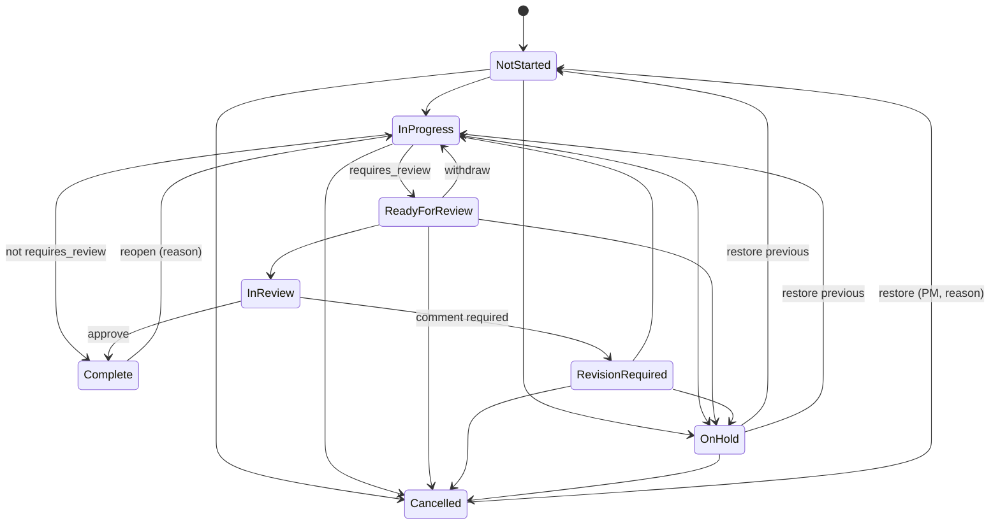
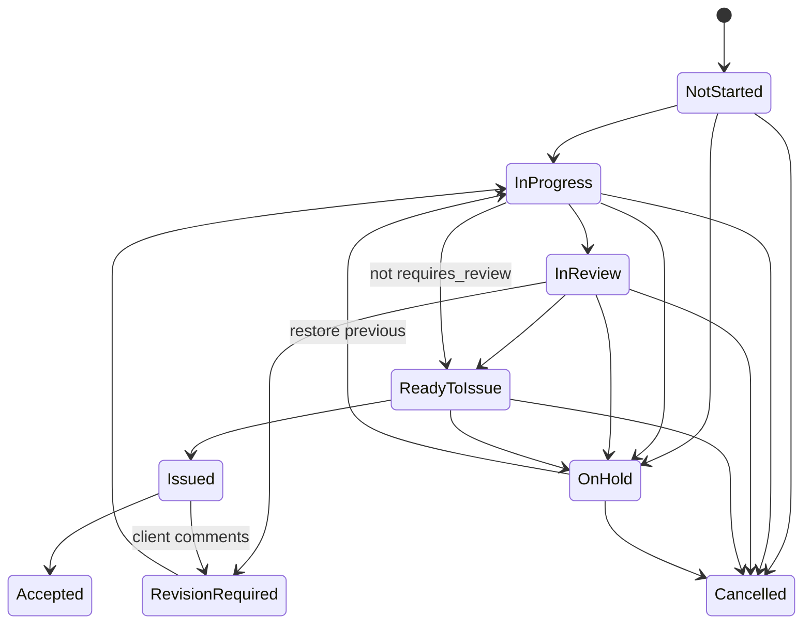

## 27. MVP Scope

**2026-09-26 amendment:** The existing first-release set below is the 24-packet implementation baseline. Jay has also approved all nine coordination additions in §37–§38 (packets 025–033). They are specified, not built. Release in accepted increments within the 50-person pilot; do not claim completion of the expanded scope based on the older packet status. §38.4 defines the dependency order.

**2026-10-03 amendment:** Jay also approved the weekly planning layer (§39, packet 034) as a separate record beside the §37.6 allocations. It is specified, not built, follows the same staged-acceptance rule, and depends on packet 029.

### 27.1 Critical evaluation of the candidate MVP list

| Candidate | Decision | Rationale |
|---|---|---|
| Projects, project teams, disciplines | **MVP-Required** | Container and permission boundary for everything. |
| Tasks, assignments, task status | **MVP-Required** | Core unit of coordination. |
| Task review workflow (Ready for Review → In Review → Complete/Revision Required) | **MVP-Required** | Review is structural in engineering; without it "Complete" is ambiguous. Cheap because it is a few extra states. |
| Dependencies (Finish-to-Start) with Waiting/Blocked/Blocking indicators | **MVP-Required** | The core differentiator; answers "what are we waiting for". |
| Milestones with derived status | **MVP-Required** | Submissions are how engineering projects are judged. |
| Deliverables register with lifecycle and derived progress | **MVP-Required** | Deliverable-driven work; roll-up to milestones depends on it. |
| Comments with @mentions; document links | **MVP-Required** | Minimum collaboration; keeps context with the work. |
| Project Dashboard | **MVP-Required** | PM's daily view. |
| My Work | **MVP-Required** | Individual adoption depends on it. |
| Weekly Coordination | **MVP-Required** | The reason the product exists; drives meeting adoption. |
| PM Attention engine (rules A-01…A-20 excluding P2 registers) | **MVP-Required** | Makes the dashboard actionable; deterministic. |
| Project health with override | **MVP-Required** | Needed for the dashboard and later portfolio; simple rules. |
| Basic notifications (in-app + email + daily digest) | **MVP-Required** | Without notifications nobody returns to the tool. Digest prevents fatigue. |
| Basic roles/permissions (two-layer model) | **MVP-Required** | Security and clarity of ownership. |
| SSO (Entra ID) | **MVP-Required** | No local passwords; frictionless adoption. Feasible with standard libraries. |
| Activity history | **MVP-Required** | Engineering traceability; cheap when built in from the start, painful to retrofit. |
| Global search + list filtering | **MVP-Required** | Basic usability at 100+ projects. |
| Kanban board | **MVP-Required** | Four visible lanes across selected projects with project-labelled cards and guarded transitions (§36.3). |
| Thin Decision Register + External Parties | **MVP-Recommended** | Decisions are the top non-task blocker in design projects and the register is one entity. Fallback documented in §12.9. |
| Timeline (milestones, deliverables, tasks, and dependencies) | **MVP-Required** | The user-confirmed §36 scope includes the cross-project Gantt and guarded date dragging in the first release. |
| Milestone original date / slip; due-date change count | **MVP-Recommended** | Two columns each; strong deterministic signals. |
| Health snapshots and portfolio trend | **MVP-Required** | One row/project/day; the first-release Portfolio view requires the trend. |
| Attention snooze | **MVP-Recommended** | Prevents the attention list from being ignored because it is cluttered by known items. |
| Restricted project visibility (schema + enforcement) | **MVP-Recommended** | Cheap now, expensive later; UI toggle only if the business confirms. |
| Core reports with CSV/XLSX export | **MVP-Required (core set)** | People will ask for Excel on day one. |
| Reassign-work tool for leavers | **MVP-Recommended** | Turnover is certain; the alternative is manual reassignment task by task. |
| Project following on assignment (Following feed, Project updates digest) | **MVP-Required** | Requested by the business: being assigned to a project means receiving all of its updates. Cheap because the feed reads the activity log that is already written. |
| My Staff page (direct reports, with staffing) | **MVP-Required** | Managers see their direct reports' assignments and work and staff them on projects without going through each PM. Hours-based load is in the first-release Resource View. |
| Project templates | **Phase 2** | High value but the template editor is a significant UI; MVP projects can be set up manually or by cloning a project (**Recommendation: include "clone project structure" as a cheap MVP stopgap** — copies disciplines, milestones (undated), deliverables, tasks (unassigned), and dependencies from an existing project). |
| Risk / Issue registers, Meeting Actions | **Phase 2** | Valuable but not needed to answer the core question; can be represented in MVP by tasks and comments. |
| Resource / Workload view | **MVP-Required** | Workload is a visible first-release view (§36.8); missing estimates remain explicit. |
| Portfolio and overview dashboards | **MVP-Required** | The overview with metrics, charts, deadlines, and personal layout editing is in the image (§36.6). |
| Saved views and manual board order | **MVP-Required** | Both are needed for the pictured personal and board workflows (§36.3, §36.7). |
| Team calendar and cross-project views | **MVP-Required** | Week/Month/Agenda, event creation, multi-project board and Gantt are in the image (§36). |
| Task-hour entry under Time | **MVP-Required** | The user confirmed that the image's Time route records actual hours against tasks (§36.8). |

### 27.2 MVP feature list

**Required**
1. Entra ID SSO; user provisioning; system roles; supervisor field; inactive handling.
2. Admin reference data: disciplines, clients, offices, project types, phases, deliverable types, thresholds, notification defaults.
3. Projects: create/edit; statuses (Setup, Active, On Hold, Complete, Archived, Cancelled); links; phase; closeout checklist; archive.
4. Team and disciplines: members with project roles; discipline leads; auto-add on assignment; discipline summaries.
5. Milestones: CRUD; types; derived status; complete/cancel; date change logging and inconsistency flags.
6. Deliverables: CRUD; lifecycle with guards; issue dialog; derived progress; At Risk indicator.
7. Tasks: CRUD; workflow with review; single assignee; collaborators/watchers; progress; manual block; soft delete; reopen; bulk actions.
8. Dependencies: Finish-to-Start; cycle prevention; Waiting/Blocked/Blocking; chain view; affected milestones; auto-unblock notifications.
9. Rules engine and materialised state; attention engine; project and discipline health; overrides.
10. Screens: Project List and grouped Projects Board, Project Dashboard, Overview Dashboard, Task List, cross-project Kanban and Gantt, Team Calendar, Files link library, Task Panel, Deliverables Register, Milestone View, Weekly Coordination (with meeting mode and mark reviewed), My Work, My Staff, Portfolio, Resource/Workload, Activity History, Notification Centre (with Following tab), Admin, Team & Settings, Reports (§36).
11. Comments, mentions, watchers, document links.
12. Notifications: in-app, immediate email, daily digest, preferences.
13. Global search, list filters, sorting, grouping, column chooser, exports.
14. Activity log on all specified changes; item and project history.
15. Core reports (§19 MVP rows).
16. Assignments and following: follow on team assignment, follow levels, Following feed, Project updates digest section, My Staff page for direct reports, with staffing (§12.18).
17. Six-view visual workspace: named project scope, project priority and derived progress, four-lane task board, task-level Gantt, calendar events, overview widgets and charts, saved personal views, functional navigation, and task-hour entry under Time (§36).

**Recommended (ship if schedule allows; each independently cuttable)**
Thin Decision Register + External Parties; slip and due-change tracking; attention snooze; Restricted visibility enforcement; reassign-work tool; clone project structure; "Copy summary" on Weekly Coordination; milestone date cascade to deliverables; staff assignment notices and My staff digest section for supervisors; Staff Assignments report. The six pictured views are required, not cuttable.

### 27.3 Explicitly not in MVP (and the consequence)

| Not in MVP | Consequence during MVP |
|---|---|
| Templates | Projects built manually or cloned from a reference project. |
| Risks, Issues, Meeting Actions | Tracked as tasks/comments or outside the Hub. |
| Teams notifications | Email and in-app only. |

---

## 28. Phase 2 Scope

Original item numbers are retained for historical packet citations. Items marked moved are first-release scope under §27 and §36, not Phase 2 work.

1. **Project Templates** (§12.14) — depends on stable MVP data model; replaces "clone project". Includes "Add from template".
2. **Decision Register enhancements** (if thin register shipped): decision history view, bulk link, client-facing export of open decisions.
3. **Risk Register and Issue Register** (§12.10) — adds attention rule A-07 and Red health input.
4. **Meeting Actions** (§12.11) — integrates with Weekly Coordination meeting mode (create actions inline; "Convert to task").
5. **Moved to first release:** Portfolio Dashboard (§13.12, §36.6).
6. **Moved to first release:** Resource / Workload View (§12.15, §13.11, §36.8).
7. **Moved to first release:** Improved Timeline with tasks, arrows, guarded dragging, and baseline ghosts (§36.4).
8. **Moved to first release:** Saved views (§18.4, §36.7).
9. **Advanced notifications** — weekly PM summary email; digest content preferences; server-sent events for live unread counts. (Per-project mute ships in MVP as the Muted follow level, §12.18.)
10. **Explicit deliverable-to-deliverable dependencies**; dependency lag days.
11. **Working-day calendars** for thresholds (statutory holidays by office).
12. **Search over descriptions and comments**.
13. **Moved to first release:** Kanban manual ordering (§36.3).

---

## 29. Phase 3 Scope

1. **Microsoft Teams integration** — per-user chat notifications and per-project channel digests; deep links back into the Hub.
2. **SharePoint integration** — browse and pick documents from the project library (Graph); still no storage in the Hub.
3. **ERP / Vantagepoint integration** — inbound project master data sync (**TBD**: capabilities, licensing, ownership of fields). Nothing is assumed about ERP capabilities in this specification.
4. **Project financial information (read-only display)** — only if sourced from ERP; the Hub never becomes a financial system.
5. **Utilisation / resource planning** — availability from HR/leave systems, capacity by role, longer horizons; still no levelling or payroll timesheets. Manual dated capacity overrides and confirmed production/review allocations are now approved in §37.6, and manual weekly planning entries in §39; HR integration remains Phase 3.
6. **Client / external actions** — optional read-only external access or emailed action lists to external parties (security review required).
7. **Advanced portfolio reporting** — cross-office comparisons, discipline throughput, submission on-time rates from snapshots.
8. **Advanced administration** — per-project threshold overrides; template analytics; bulk data tools.
9. **Calendar feed (ICS)** for personal due dates and milestones.
10. **Localisation** into a second language if not done in MVP (**TBD**).

No AI features are planned in any phase of this specification.

---

## 30. Explicitly Out-of-Scope Items

| Exclusion | Reason |
|---|---|
| AI assistants, LLM features, automated summaries, AI task extraction, recommendations, predictions, "smart" scheduling | Product constraint; the product must be fully deterministic and explainable. |
| Accounting, invoicing, budgets, cost tracking, earned value | Financial systems of record exist; the Hub coordinates work, not money. |
| Payroll, HR records, leave management | Not a coordination concern. Planned time away is recorded only as a non-sensitive availability override for capacity (§37.6, §39.3), with no leave type, reason or balance. |
| Payroll or billable timesheet approval, billing rates, invoicing, and payroll submission | Actual hours are recorded against tasks in the first-release Time view (§36.8), but the Hub does not replace financial or payroll systems. |
| Full ERP or CRM functionality | — |
| CPM scheduling, critical path, float, resource levelling, baselining beyond original dates, MS Project/P6 import-export | Primavera/Project replacement is a non-goal. |
| CAD/BIM authoring, model viewing, drawing mark-up | Engineering tools do this. Location metadata and links to external markups/viewpoints are approved in §38.3; no embedded authoring/viewer is added. |
| Document management: file storage, file versioning, check-in/out, sending transmittals | SharePoint/DMS remains the file system of record. Registered revision metadata, revision-use tracking and immutable submission manifests are approved in §37.4–§37.5; Tuesday stores references and coordination evidence only. |
| Email client features, reply-by-email, Teams/chat replacement | Use Teams and Outlook; the Hub links by item key. |
| Engineering calculations or automated engineering decisions | Professional responsibility remains with engineers. |
| Custom fields builder, custom statuses/workflows per project, automation rule builder | Complexity that undermines consistency of the coordination rules. |
| Client login / external user accounts (before P3 review) | Security and licensing implications; externals are referenced, not users. |
| Native mobile apps | Responsive web covers reading and quick updates. |
| Multi-tenant SaaS packaging | Single organisation. |
| Gamification, badges, streaks, leaderboards | Professional tool; would distort behaviour. |
| Public API for third parties, outbound webhooks | No demonstrated need; revisit with integration requests. |
| Recurring tasks, subtasks/nested task trees, generic checklists inside tasks | Deliverable → Task remains the hierarchy. The approved submission checks (§37.5) and ready-to-start constraints (§38.2) are specific coordination records linked to work, not a generic checklist builder. |
| Multiple assignees per task | Violates single-accountability principle; collaborators cover the real need. |

---

## 31. Acceptance Criteria

Format: Given / When / Then. Criteria are testable against the rules and thresholds in Sections 10, 15, and 16. Default thresholds are assumed unless stated.

### 31.1 Authentication and access (AC-AUTH)

- **AC-AUTH-01** Given a user with a valid corporate Entra ID account who has never used the Hub, When they sign in, Then a user record is created with their display name and email, they receive the Standard User role, and they land on My Work.
- **AC-AUTH-02** Given a user whose Entra account is disabled, When they attempt to sign in, Then sign-in fails at Entra and, after the next directory sync, the user is marked Inactive and appears with an "(Inactive)" suffix wherever referenced.
- **AC-AUTH-03** Given a user in the `Hub.ProjectManager` app role, When they open Projects, Then the Create project action is visible; Given a user without it, Then it is not visible and a direct `POST /projects` returns 403.
- **AC-AUTH-04** Given an API request without a valid bearer token, When any endpoint except `/health` is called, Then the response is 401.

### 31.2 Permissions (AC-PERM)

- **AC-PERM-01** Given a Discipline Lead for Civil, When they attempt to change a milestone date, Then the action is not offered and the API returns 403 with a message naming the Project Manager role.
- **AC-PERM-02** Given a Discipline Lead for Civil, When they create a deliverable in Civil, Then it succeeds; When they attempt to create one in Electrical, Then it fails with 403.
- **AC-PERM-03** Given a Team Member assigned to a task, When they set it to In Progress, Then it succeeds; When they attempt to reassign it to someone else, Then it fails with 403.
- **AC-PERM-04** Given a Read Only user, When they open any project they can view, Then all edit actions are hidden and comment posting is disabled.
- **AC-PERM-05** Given Restricted visibility is enabled and a project is Restricted, When a non-member Standard User searches for its number, Then no result is returned and a direct URL returns 404.

### 31.3 Projects (AC-PRJ)

- **AC-PRJ-01** Given a project number already exists, When a PM creates a project with the same number (any case), Then creation fails with a validation error linking to the existing project.
- **AC-PRJ-02** Given a PM creates a project, When creation succeeds, Then the PM is the primary Project Manager, a member with the PM role, and the creation is logged.
- **AC-PRJ-03** Given an Active project with 42 open tasks, When the PM sets it On Hold with a reason, Then no task in it is counted as Overdue or Blocked on any screen or digest, health shows Grey with the reason "Project on hold", and the change is logged with the reason.
- **AC-PRJ-04** Given an Active project with 3 open tasks and 1 un-issued deliverable, When the PM marks it Complete, Then the closeout dialog lists these items with counts, requires a reason, and after confirmation the project status is Complete with `completed_at` set.
- **AC-PRJ-05** Given a Complete project, When the PM archives it, Then it is read-only for all users, absent from the default Project List, present when "include archived" is on, and its items remain openable.
- **AC-PRJ-06** Given an Archived project, When an Admin unarchives it, Then its status is Complete, the PM can edit with reasons, and both actions are logged.

### 31.4 Team (AC-TEAM)

- **AC-TEAM-01** Given a PM assigns a task to a user who is not on the team, When the assignment saves, Then the user is added as a Team Member and the PM receives an in-app notification.
- **AC-TEAM-02** Given a PM sets a Discipline Lead who is not a member, When saved, Then the user is added to the team and receives a "You are Discipline Lead" notification.
- **AC-TEAM-03** Given a member owns 5 open tasks, When the PM removes them from the team, Then the PM is prompted to reassign or leave; if left, the tasks show an "assignee not on project" indicator.
- **AC-TEAM-04** Given the primary PM, When anyone attempts to remove them from the team, Then the action is refused with guidance to change the PM first.

### 31.5 Milestones (AC-MS)

- **AC-MS-01** Given a milestone dated 2027-01-29 with 5 targeted deliverables, 3 Issued and 2 In Progress, When today is 2027-01-16 (13 days out, threshold 14), Then the milestone status is At Risk and the "why" lists "2 of 5 deliverables not issued".
- **AC-MS-02** Given the same milestone with all 5 deliverables Issued, When today is 2027-01-16, Then the status is On Track.
- **AC-MS-03** Given a milestone dated yesterday and not complete, Then its status is Overdue, attention rule A-14 fires as Critical, and project health is Red.
- **AC-MS-04** Given a milestone created with date 2027-01-29, When the PM changes the date to 2027-02-12 with a reason, Then `original_date` remains 2027-01-29, slip shows 14 days, the change is logged with old and new, all DLs receive an in-app notification, and any deliverable due after 2027-02-12 is flagged Date Inconsistent.
- **AC-MS-05** Given the cascade option is chosen in AC-MS-04, When confirmed after the preview, Then every deliverable targeting the milestone has its due date shifted by +14 days and each shift is logged individually.
- **AC-MS-06** Given a milestone with an un-issued deliverable, When the PM marks it Complete, Then a confirmation lists the deliverable, and on confirmation the milestone is Complete with today's date and the deliverable remains in its status.

### 31.6 Deliverables (AC-DEL)

- **AC-DEL-01** Given a DL creates a deliverable with a target milestone and no due date, Then the due date defaults to the milestone date.
- **AC-DEL-02** Given a deliverable with 8 tasks of which 6 are Complete and 1 Cancelled, Then progress shows 85% (6/7 rounded down to nearest 5) and "6/7 tasks".
- **AC-DEL-03** Given a deliverable with `requires_review` true in status In Progress, When the owner attempts Ready to Issue, Then the transition is refused with the message that it must pass In Review first.
- **AC-DEL-04** Given a deliverable In Review, When the reviewer sets Revision Required with a comment, Then status is Revision Required, the comment is stored as a Review comment, and the owner is notified.
- **AC-DEL-05** Given a deliverable Ready to Issue with 1 open task, When the owner clicks Issue, Then a confirmation lists the open task; on confirmation the deliverable is Issued with date, revision, and issued-to recorded, and the task shows "Deliverable issued with task open".
- **AC-DEL-06** Given a deliverable due in 7 days (threshold 10) with progress 30%, Then it is At Risk and attention rule A-06 fires as Warning to owner, DL, and PM.
- **AC-DEL-07** Given a deliverable due after its milestone date, Then it shows Date Inconsistent and A-17 fires.

### 31.7 Tasks (AC-TSK)

- **AC-TSK-01** Given a task is created without an assignee and its start date is today, Then it shows Unassigned and A-08 fires to DL and PM.
- **AC-TSK-02** Given a task with `requires_review` true, When the assignee attempts to move it from In Progress to Complete, Then Complete is not an allowed transition and Ready for Review is.
- **AC-TSK-03** Given a task with `requires_review` true and no reviewer, When the assignee sets Ready for Review, Then the system requires a reviewer to be chosen before saving.
- **AC-TSK-04** Given a task due yesterday in status In Progress, Then it is Overdue with "Overdue 1d", appears in the project's Overdue count, in the assignee's My Work Overdue bucket, and in the next digest.
- **AC-TSK-05** Given the same task is set On Hold with a reason, Then it is excluded from the Overdue count and appears in the "Held past due date" section of Weekly Coordination.
- **AC-TSK-06** Given a task In Progress with no changes or comments for 11 days (threshold 10), Then it shows Stale and A-10 fires as Info to the assignee and DL.
- **AC-TSK-07** Given an assignee sets progress to 100 on a task not requiring review, Then the system prompts to mark it Complete; on acceptance status is Complete, `completed_at` is set, and the deliverable's progress is recalculated.
- **AC-TSK-08** Given a Complete task, When a DL reopens it with a reason, Then status is In Progress, progress is 90, `completed_at` is cleared, successors are re-evaluated, and the reopen is logged with the reason.
- **AC-TSK-09** Given a task with two successors, When the PM deletes it, Then a confirmation lists the two dependencies to be removed; on confirmation the task is soft-deleted with a snapshot in the log, the dependencies are removed, and the two successor assignees and the PM are notified.
- **AC-TSK-10** Given a task's due date has been changed three times, Then the task shows a "Due moved ×3" indicator and A-20 fires as Info.
- **AC-TSK-11** Given a collaborator on a task, When they update progress and post a comment, Then both succeed; When they attempt to change the due date, Then it fails with 403.
- **AC-TSK-12** Given two users edit the same task, When the second saves with a stale `rowVersion`, Then the API returns 409 and the UI shows who changed it and when, with a reload option.

### 31.8 Review (AC-REV)

- **AC-REV-01** Given a task is set Ready for Review, Then the reviewer receives an immediate in-app and email notification and the task appears in their My Reviews.
- **AC-REV-02** Given a task In Review, When the reviewer clicks Request revision without a comment, Then the action is refused; with a comment, Then status is Revision Required, review round increments to 1, and the assignee is notified.
- **AC-REV-03** Given a task Ready for Review for 6 days (threshold 5), Then A-11 fires as Warning to reviewer, DL, and PM.
- **AC-REV-04** Given `allow_self_review` is false, When a user sets themselves as both assignee and reviewer, Then validation fails with the stated reason.
- **AC-REV-05** Given the reviewer is changed while a task is In Review, Then both old and new reviewers are notified and the change is logged.

### 31.9 Dependencies (AC-DEP)

- **AC-DEP-01** Given tasks A and B in the same project, When a user adds "B depends on A", Then A shows "Blocks B" and B shows "Depends on A".
- **AC-DEP-02** Given A → B → C exists, When a user attempts to add "A depends on C", Then the save is rejected with a 409 `dependency_cycle` and the path A → B → C → A is displayed.
- **AC-DEP-03** Given B depends on A, A is In Progress and due in 10 days, B's start date is in 12 days, Then B shows Waiting, not Blocked, and no attention item fires for B.
- **AC-DEP-04** Given B depends on A and A becomes Overdue, Then within one evaluation cycle B shows Blocked with A listed as blocker, A shows Blocking 1 task, A-03 fires as Critical for A, A-02 fires for B, and both list the affected milestone.
- **AC-DEP-05** Given B is Blocked by A, When A is marked Complete, Then B's Blocked indicator clears immediately after evaluation and B's assignee receives an "unblocked" notification.
- **AC-DEP-06** Given B is Blocked by A and A is Cancelled, Then B is no longer Waiting or Blocked and shows an info note "Predecessor cancelled".
- **AC-DEP-07** Given A → B → C → D, When the user opens the chain view on B, Then predecessors (A) and successors (C, D) are shown with their states up to the depth limit.
- **AC-DEP-08** Given B depends on A and B's start date is earlier than A's due date, Then B shows Date Inconsistent naming the pair.
- **AC-DEP-09** Given a manual block is set on a task with type Client and a reason, Then the task is Blocked with the reason and "blocked for n days" shown, and clearing the block removes the indicator.

### 31.10 Decisions (AC-DEC) — if the thin register ships

- **AC-DEC-01** Given a decision is raised with an external party as owner, Then it saves with the external owner shown with organisation, and no external email is sent.
- **AC-DEC-02** Given a decision required by yesterday in status Pending, Then it is Overdue, A-04 fires as Critical to requester and PM, and the dashboard Decisions: Overdue count is 1.
- **AC-DEC-03** Given the overdue decision is linked to two tasks with relation blocked_by_decision, Then both tasks show Blocked with the decision as blocker and the project Blocked count includes them.
- **AC-DEC-04** Given the PM defers the decision to a date next week with a reason, Then status is Deferred, the previous required-by date is visible in history, the tasks return to Waiting, and A-04 clears.
- **AC-DEC-05** Given the owner records the decision with text and date, Then status is Decided, linked task assignees are notified, and the decision link on the tasks is satisfied.
- **AC-DEC-06** Given a decision Under Review, When a user attempts to set Decided without decision text, Then validation fails.

### 31.11 Comments and links (AC-COM, AC-DOC)

- **AC-COM-01** Given a user posts a comment mentioning @Diane, Then Diane receives an immediate notification linking to the item and becomes a watcher.
- **AC-COM-02** Given a comment posted 10 minutes ago by the current user, Then it can be edited and shows "edited"; at 16 minutes, Then editing is no longer available.
- **AC-COM-03** Given a comment by another user, When the PM deletes it, Then a "removed by PM" placeholder remains and the deletion is logged.
- **AC-COM-04** Given a task's status is changed with a status note, Then the note appears as a Status Note comment and the status change appears in History.
- **AC-COM-05** Given a Viewer on a project where viewer comments are disabled, Then the comment box is not shown.
- **AC-DOC-01** Given a user adds a link with a SharePoint URL, Then the link type is detected as SharePoint and shown with its icon.
- **AC-DOC-02** Given a UNC path is added, Then it is shown with a Copy path button and is not rendered as a clickable hyperlink.
- **AC-DOC-03** Given a deliverable has a document link, Then its tasks show the link as inherited.

### 31.12 Attention engine and health (AC-ATT, AC-HLT)

- **AC-ATT-01** Given a project with one task Overdue 6 days and blocking another, Then the top attention item is A-03 Critical for that task with a message naming the successor and days overdue.
- **AC-ATT-02** Given a PM snoozes an attention item for 7 days with a note, Then it disappears from the default list, appears under Snoozed, is logged, and reappears after 7 days if the condition persists.
- **AC-ATT-03** Given a snoozed Warning item whose condition becomes Critical, Then it reappears immediately.
- **AC-ATT-04** Given a project in Setup status, Then no attention items are produced.
- **AC-ATT-05** Given a task assigned to an Inactive user, Then A-18 fires as Critical to DL, PM, and the user's supervisor.
- **AC-ATT-06** Given an attention item, When the user opens "why", Then the exact rule, threshold value, and the item values that satisfied it are shown.
- **AC-ATT-07** Given rule A-10 is disabled in settings, Then no Stale attention items are produced, while the Stale indicator on tasks still shows.
- **AC-ATT-08** Given the PM of a project changes, Then attention items routed to "PM" route to the new PM within one evaluation cycle.
- **AC-HLT-01** Given an Active project with 41 open tasks of which 7 are Overdue (17%) and no other conditions, Then computed health is Yellow and "why" shows "Overdue tasks 7 of 41 (17%) ≥ 10%".
- **AC-HLT-02** Given the same project with 11 Overdue (27%), Then computed health is Red.
- **AC-HLT-03** Given a Red computed health, When the PM sets an override to Green with a note, Then the Project Dashboard shows Reported Green with Computed Red beside it; the Project List shows both; after 14 days the override is removed by the system, logged, and A-15 informs the PM.
- **AC-HLT-04** Given a project with no milestones and no open tasks, Then health is Grey with reason "Nothing to evaluate".
- **AC-HLT-05** Given a nightly run, Then each Active project has exactly one health snapshot row for that date.

### 31.13 Dashboard, Weekly Coordination, My Work (AC-DASH, AC-WC, AC-MYW)

- **AC-DASH-01** Given the dashboard shows Blocked = 4, When the user clicks it, Then the Task List opens filtered to Blocked with exactly 4 rows.
- **AC-DASH-02** Given a project with 6 disciplines, Then the discipline table shows one row per active discipline with lead, status colour, open, overdue, blocked, and deliverables due within 14 days, and each count reconciles with the filtered list.
- **AC-DASH-03** Given the milestone strip, Then it shows the next 5 non-complete milestones ordered by date with Overdue first, each with status colour and countdown.
- **AC-WC-01** Given a project whose `last_coordination_reviewed_at` is 7 days ago, Then "Recently completed" lists exactly the tasks completed, deliverables issued, and decisions decided since that timestamp.
- **AC-WC-02** Given three tasks are Blocked by the same predecessor, Then the Blocked work section shows one group headed by the predecessor with three rows beneath.
- **AC-WC-03** Given meeting mode is on, When the user presses the right arrow, Then focus moves to the next section header and it scrolls into view.
- **AC-WC-04** Given meeting mode, When the PM changes a task due date inline with a reason, Then the change is saved, logged, notifications sent per defaults, and the item appears in the "Changes made in this meeting" tray.
- **AC-WC-05** Given the PM clicks Mark as reviewed, Then `last_coordination_reviewed_at` is set to now and logged, and the "since last review" marker updates.
- **AC-WC-06** Given Copy summary is clicked, Then the clipboard contains plain text with headline, approaching milestones, decisions required, blocked work, and overdue work, each row including the item key.
- **AC-WC-07** Given a DL opens Weekly Coordination scoped to their discipline, Then every section contains only items owned by that discipline, and the discipline round shows only their card.
- **AC-MYW-01** Given a user is assignee on 3 tasks, collaborator on 1, reviewer on 2 (Ready for Review), and owner of 1 deliverable, Then My Tasks shows 4, My Reviews shows 2, My Deliverables shows 1.
- **AC-MYW-02** Given one of the user's tasks is Blocked by another person's task, Then it appears under Waiting on Others with the blocker and its owner.
- **AC-MYW-03** Given one of the user's tasks blocks two others, Then it appears under Blocking Others with the two successors and their owners.
- **AC-MYW-04** Given a Supervisor opens a supervised employee's My Work, Then it is read-only and shows the same sections; Given a non-supervisor attempts the same URL, Then 403.

### 31.14 Notifications (AC-NOT)

- **AC-NOT-01** Given a user is assigned a task by someone else, Then they receive one in-app notification and one email within 2 minutes.
- **AC-NOT-02** Given a user changes their own task's status, Then they receive no notification.
- **AC-NOT-03** Given a user with no new project updates has 2 overdue tasks, 1 review waiting, and 1 blocked task at 07:00 in the organisation time zone, Then they receive one digest email with those sections and the subject "Hub digest — 2 overdue, 1 review, 1 blocked".
- **AC-NOT-04** Given a user has nothing due, overdue, blocked, or awaiting review, and no project updates or staff changes to report, Then no digest is sent.
- **AC-NOT-05** Given a user turns off email for "Comment on an item you own/watch", Then comments still create in-app notifications and no emails.
- **AC-NOT-06** Given a PM bulk-reassigns 12 tasks to one user, Then that user receives a single notification summarising 12 tasks.
- **AC-NOT-07** Given a project in Setup with 40 tasks assigned during setup, When the project is activated, Then each assignee receives one batched assignment notification.

### 31.15 Search and audit (AC-SRCH, AC-AUD)

- **AC-SRCH-01** Given the user types `1234-T0042` and presses Enter, Then the task panel opens directly.
- **AC-SRCH-02** Given the user types "Dundurn", Then results show the project first, then tasks/deliverables/milestones/decisions whose names contain it, grouped by type, excluding archived projects unless toggled.
- **AC-SRCH-03** Given a Task List filtered by status and assignee, When the URL is shared, Then the recipient sees the same filters applied.
- **AC-AUD-01** Given a task's due date is changed from 2026-09-10 to 2026-09-17 with reason "Client extension", Then the item History shows actor, timestamp, "Due date: 2026-09-10 → 2026-09-17", and the reason.
- **AC-AUD-02** Given a task is deleted, Then the project Activity History shows the deletion with a snapshot summary (key, name, assignee, status, due) and the removed dependencies.
- **AC-AUD-03** Given the system expires a health override, Then the log entry shows actor System.
- **AC-AUD-04** Given any user, Then no UI or API path exists to edit or delete an activity log row (verified by API surface review and database role permissions).

### 31.16 Assignments, following, and My Staff (AC-ASG)

- **AC-ASG-01** Given a PM adds Alex to project 1234 as a Team Member, Then Alex follows 1234 at All activity with source Assignment, and Alex's "Added to a project" notification states that they now follow it; Given Diane is auto-added only as Reviewer, Then she follows at My items only.
- **AC-ASG-02** Given Alex follows 1234 at All activity, When Marc changes a task due date on 1234, Then the change appears in Alex's Following tab within 60 seconds and counts as unread for 1234; When Alex changes a task themselves, Then it is not counted as unread.
- **AC-ASG-03** Given Alex set 1234 to My items only, When the PM later changes Alex's project role, Then Alex's level is still My items only.
- **AC-ASG-04** Given Alex's follow on 1234 has source Assignment, When Alex is removed from the team, Then the follow is deleted; Given Alex had set the level themselves (source Manual) and 1234 is Open, Then it is kept.
- **AC-ASG-05** Given Alex follows 1234 at All activity and others made 9 changes on it yesterday, one of which assigned Alex a task, Then the 07:00 digest's Project updates section counts 8 changes for 1234, and the assignment appears only in its personal notification.
- **AC-ASG-06** Given a PM bulk-shifts 40 due dates on 1234, Then Alex's Following tab shows one collapsed entry for the 40 changes, not 40 entries.
- **AC-ASG-07** Given Sam supervises Alex and Lena supervises Sam, When Sam opens My Staff, Then Alex appears with project count, roles, open, overdue, blocked, blocking others, and reviews waiting; When Lena opens My Staff, Then Sam appears and Alex does not; Given a Standard User without the Supervisor role calls `GET /staff`, Then 403.
- **AC-ASG-08** Given Alex has 2 tasks on a Restricted project that Sam cannot view, When Sam opens My Staff, Then those tasks are absent from Alex's counts and expanded assignments, so Sam cannot infer restricted work from this screen (§36.1).
- **AC-ASG-09** Given Sam supervises Alex, When Sam assigns Alex to project 1301 from My Staff with primary discipline Civil, Then Alex is a Team Member of 1301 following it at All activity, the PM of 1301 receives an in-app notification naming Sam, and the change is logged with Sam as actor; When Sam tries to add Jill, who does not report to him, or to make Alex a Discipline Lead, Then the action is not offered and the API returns 403.

---

## 32. Edge Cases and Recommended Handling

| ID | Edge case | Handling |
|---|---|---|
| E-01 | **Employee leaves the company** | Entra disable → sync marks Inactive within 24 h → cannot sign in → A-18 fires for every open task, deliverable, decision, review, and discipline lead role they hold → Supervisor and PMs use the Reassign-work tool (bulk, per project, logged) → historical references retained with "(Inactive)" suffix. Notifications to the inactive user stop. |
| E-02 | **Project manager changes** | PM (or Admin) sets a new `project_manager_id`; the new PM gets the PM role and notification; the old PM keeps membership as Team Member unless removed; attention items and digests re-route within one cycle; the change is logged. The Reassign-work dialog is offered for tasks assigned to the old PM (optional). |
| E-03 | **Due date is changed** | Log old → new with reason (required for non-PM/DL by Recommendation); notify assignee and reviewer if changed by someone else; increment `due_date_change_count`; re-evaluate Overdue/Due Soon/Blocked/Date Inconsistent for the task and its successors; if the task is a predecessor, successors with start dates before the new due date are flagged D-12. |
| E-04 | **Predecessor is deleted** | Soft-delete; all edges removed and listed in the log snapshot; successors re-evaluated (usually unblocked); successor assignees and PM notified with "dependency removed because 1234-T0031 was deleted"; PM may restore the task (Admin/PM restore action, Rec) which re-creates edges from the snapshot. |
| E-05 | **Project is placed On Hold** | Evaluation suspended (G-05); items keep their dates; portfolio shows On Hold; digests exclude the project; on resume, a "Date review" banner lists items whose dates passed while on hold with a bulk shift-by-N-days action (Rec). |
| E-06 | **Task belongs to multiple disciplines** | Not supported by design: one owning discipline for accountability. Handling: create the task under the leading discipline and add collaborators from the other; or create two linked tasks with a dependency; a "Coordination" task typically belongs to Project Management or the discipline that owns the deliverable. Documented in user guidance. |
| E-07 | **Multiple people collaborate on a task** | Single assignee plus collaborators (T-15); collaborators can update progress/status and comment; notifications go to assignee and collaborators; if the work is genuinely separable, split into tasks under the deliverable. |
| E-08 | **Reviewer is also the assignee** | Refused unless `allow_self_review` is on (R-02). If a DL must review their own work on a small project, the PM may change the reviewer to themselves or the org may enable self-review (logged setting change). |
| E-09 | **Milestone moves** | M-02 to M-04: log, notify DLs, flag inconsistent deliverables, optional cascade preview; slip visible on milestone; portfolio "next submission" updates; if moved earlier, deliverables now due after the milestone are flagged. |
| E-10 | **Task is reopened** | T-14: reason required; progress 90; successors re-evaluated (may re-block; notified); deliverable progress recalculated; if the deliverable is Issued, "Issued with open work" indicator (DL-12) — the deliverable status is never auto-reverted. |
| E-11 | **Completed project needs correction** | Complete status stays editable for the PM (P-05); Archived requires Admin unarchive → PM edits with reasons → re-archive; all logged; corrected items remain in original snapshot history. |
| E-12 | **Template changes after projects were created** | Snapshot semantics: no propagation. Projects record template id and version. "Add from template" allows pulling specific new items. A "Compare with template" view is deliberately not built. |
| E-13 | **Duplicate project numbers** | Unique constraint with case-insensitive collation; clear error linking to the existing project; Admin can renumber with logging; if the business uses sub-project suffixes (e.g., `1234-02`), the format regex allows them and each is a distinct project. |
| E-14 | **External parties own actions/decisions but have no accounts** | `ExternalParty` records; owner shown with organisation; no outbound notifications; requester/PM receive attention and digests; Weekly Coordination lists "Waiting on client/external" items; P3 may add emailed action lists. |
| E-15 | **Task with no deliverable and no milestone** | Allowed (e.g., "Book kickoff room"); shows under "Other tasks" in grouped views; excluded from milestone readiness; A-09 applies if In Progress with no due date. |
| E-16 | **Deliverable retargeted to another milestone** | Logged; both milestones re-evaluated; if the new milestone date is earlier than the deliverable due date, flag A-17. |
| E-17 | **Cancelled milestone with linked deliverables** | Deliverables flagged "Milestone cancelled — retarget"; excluded from readiness; PM prompted with a bulk retarget dialog. |
| E-18 | **Discipline deactivated organisation-wide while in use** | Deactivation hides it from pickers only; existing project disciplines and items remain valid; Admin sees the count of affected projects before deactivating. |
| E-19 | **Same person is PM, DL, and assignee on one project** | Permissions are the union; UI never asks to switch roles; self-review still governed by R-02; attention items routed once per user (de-duplicated). |
| E-20 | **Bulk action partially fails** | Row-by-row with a results summary (updated / skipped with reason); no rollback of successful rows; single summary notification per recipient. |
| E-21 | **Clock/time-zone differences** | Dates are calendar dates; "today" is the organisation time zone; a user in another time zone may see an item become Overdue an hour "early" or "late" — accepted and documented; per-project time zone is a future capability. |
| E-22 | **Very large project (5,000+ tasks)** | Whole-project evaluation still completes within seconds; lists are virtualised and paginated; Kanban warns above 500 cards and suggests filtering. |
| E-23 | **Two PMs edit Weekly Coordination items simultaneously** | Optimistic concurrency per item; conflicts surfaced inline; no locking. |
| E-24 | **Deliverable issued, then client returns comments** | Set status Revision Required (from Issued, PM/DL) with a comment; `issued_date`/`revision` retained; the next issue records the new revision; P2 issue history lists both. |
| E-25 | **Employee moves to another manager** | The `supervisor_id` change (Admin or directory sync) takes effect immediately for My Staff and reassignment scope; the previous supervisor loses read access to that person's My Work; logged as an Admin change. |
| E-26 | **Supervisor data missing** | Users with no supervisor appear only in the All staff scope and in an Admin "No supervisor" filter so the gap gets fixed; nobody can staff them from My Staff until a supervisor is set. |
| E-27 | **Person on many projects gets too many updates** | Per-project follow levels (ASG-02); the digest groups updates by project and caps each at five rows; the Following tab has an "important only" filter; the system never overrides a level the user has set. |
| E-28 | **Follower loses access to a Restricted project** | The follow is deleted (ASG-04), and because the feed is permission-filtered at read time, that project's entries disappear from the Following tab immediately. |
| E-29 | **Supervisor removes a direct report who owns open work on a project** | The TM-04 prompt runs for the supervisor as it would for the PM: reassign the person's open items within the project or leave them assigned with an "Inactive on project" indicator; the PM is notified with the list of affected items; all logged. |

---

## 33. Risks and Technical Considerations

| Risk | Impact | Mitigation |
|---|---|---|
| **Adoption**: team members do not update tasks, so indicators are wrong and PMs stop trusting the tool. | High | My Work as the single list; minimal required fields; weekly coordination run from the tool creates the habit; digest reminders; pilot with 2–3 motivated PMs; measure update frequency. |
| **Data quality**: missing due dates, unassigned tasks, no estimates. | Medium | Attention rules A-08/A-09/A-13 make gaps visible; the first-release Resource View shows unestimated counts rather than hiding them; templates (P2) seed structure. |
| **Notification fatigue** leads to filters that hide everything. | Medium | Digest-first defaults; transition-based immediate notifications only; per-user preferences; monitor unsubscribe rates in pilot and adjust defaults. |
| **Rule tuning**: thresholds produce too many or too few attention items. | Medium | All thresholds configurable; start with defaults; review attention volume per project weekly during pilot; keep the rule set small. |
| **Over-reliance on health colours** by management. | Medium | Computed and reported shown together; "why" always available; override expiry; training message: health summarises indicators, it does not predict. |
| **Permission model perceived as restrictive** (e.g., DL cannot move a milestone). | Low | Clear hover explanations; PMs can grant roles quickly; revisit after pilot rather than pre-emptively loosening. |
| **Entra/Graph permission approvals** delay SSO or sync. | Medium | Start the IT approval process in the discovery sprint; SSO works without Graph; sync has a documented fallback. |
| **Supervisor data is incomplete** (Entra `manager` not populated), so My Staff shows the wrong people and the wrong managers can staff them. | Medium | Sync `manager` from Entra where populated (Q3); Admin maintenance otherwise; "No supervisor" filter for Admins. |
| **Staffing conflicts**: a supervisor adds or removes people on a project without the PM's agreement. | Low | The PM is notified of every change (ASG-10); supervisors can only add their own direct reports as Team Members; the PM controls all other roles and can remove anyone. |
| **Email deliverability** (spam filtering of digests). | Low | Send from a corporate mailbox via Graph; SPF/DKIM already handled by Exchange Online; plain formatting. |
| **Evaluation performance** at higher-than-assumed scale. | Low | Whole-project evaluation is O(items) per project; per-project debounce; profile in test with synthetic 5,000-task projects; state tables keep reads cheap. |
| **Time-zone and working-day expectations** differ by office. | Low | Calendar days and one organisation time zone in MVP, stated plainly; working-day calendars in P2. |
| **Bilingual requirement discovered late.** | High if late | Externalise all strings from the first commit; decide the language requirement before development (§34). |
| **Small team bus factor.** | Medium | Mainstream stack; modular monolith; ADRs; runbooks; tests on rules; avoid exotic libraries. |
| **Template maintenance** becomes a bottleneck (P2). | Low | Template Editor flag; versioning; snapshot semantics avoid propagation complexity. |
| **Scope creep** toward scheduling, documents, or chat. | High | Section 30 and the "do not build yet" list; product principle 1 applied at every ticket. |
| **Optimistic concurrency confusion** during meetings. | Low | Clear conflict messages; per-field autosave reduces collision windows. |

---

## 34. Open Decisions / Questions

| # | Decision | Why it matters | Default assumption if undecided |
|---|---|---|---|
| Q1 | Backend stack: ASP.NET Core vs Node/TypeScript | Team skills and hiring; scheduling library choice | ASP.NET Core (.NET 8) |
| Q2 | System roles via Entra app roles/groups vs in-app assignment (or both) | IT ownership of access; audit expectations | App roles on groups + in-app manual additions |
| Q3 | Approval for Graph `User.Read.All` (directory sync) and `Mail.Send` (service mailbox) | Leaver detection and email delivery path | Request both; fall back to manual deactivation and ACS Email |
| Q4 | Open-by-default visibility vs Restricted projects | Permission enforcement, search, portfolio | Open by default; Restricted column enforced, toggle hidden |
| Q5 | Project number format and source (manual now; ERP later?) | Validation regex, uniqueness, future sync | Manual entry, free format with uniqueness |
| Q6 | Organisation time zone; date format | All date rules and display | Single org time zone; ISO dates |
| Q7 | Bilingual UI requirement (e.g., English/French) | i18n architecture from day one | Externalised strings; English only at launch |
| Q8 | Thin Decision Register in MVP: yes/no | Blocked-by-decision rule; workflow 11 | Yes |
| Q9 | Availability/HA and backup retention targets | Database tier and cost | 99.5% business hours; 14-day PITR; no zone-redundant HA |
| Q10 | Official browser list; iPad support | Testing matrix | Edge, Chrome current; Safari iPadOS |
| Q11 | Reason required for due-date changes by non-PM/DL? | Friction vs traceability | Required |
| Q12 | `allow_self_review` default | QA policy | False |
| Q13 | Who can create projects (PM role holders only vs all staff) | Governance vs friction | PM system role holders and Admins |
| Q14 | Retention policy for archived projects and logs | Storage, compliance | Indefinite |
| Q15 | CI/CD platform (GitHub Actions vs Azure DevOps) | Tooling alignment | Whichever the organisation already uses |
| Q16 | Pilot group and success metrics | Rollout plan | **Decided:** 50 people. Proposed operational default remains 3 PMs, 6 projects, 8 weeks, subject to project selection; the 50-person count is not a concurrency or server-capacity claim. |
| Q17 | Idle session timeout | Security vs convenience | 8 hours |
| Q18 | Weekly capacity default and whether under-assignment should be shown (P2) | Workload view sensitivity | 40 h; show with caveats |
| Q19 | Manager staff scope | Who sees and staffs whose work; only as good as the supervisor data (Q3) | **Decided:** direct reports only; Executives and Admins can view all staff |
| Q20 | Default follow level when a user is assigned to a project | Update volume vs. visibility | **Decided:** All activity (My items only for reviewer-only members), delivered in-app and in the daily digest, never one email per change |
| Q21 | Meaning of the Time navigation entry in the six-view image: task-hour entry or reserved route | Determines whether §3.2, §6, §12.15, and §30's time-tracking exclusion changes, and whether a new first-release workflow and packet are needed | **Decided by user:** enter actual hours against tasks in the first release; no billing or payroll workflow is implied. |

---

## 35. Recommended Development Sequence

### 35.1 Overall sequence

| Stage | Purpose | Exit criteria |
|---|---|---|
| **0. Discovery & design sprint** | Confirm decisions Q1–Q13 and Q21; validate the §36 functional flows with 3 PMs using representative project data; use the V2 prototype only as a visual clue while designing and testing the actual screens; finalise discipline and deliverable type lists | Decisions recorded as ADRs; functional flows and proposed screen designs reviewed; test data set prepared (DCC Dundurn Roads-style project) |
| **1. Foundations** | Repo, CI/CD, IaC, environments, SSO end-to-end, user provisioning, admin reference data, activity log framework, design system skeleton | A user can sign in, see their name, and an Admin can maintain disciplines |
| **2. Core structure** | Projects, team, disciplines, milestones, deliverables, tasks (CRUD, workflow, review), comments, links | A project can be fully built by hand and worked through review |
| **3. Dependencies and rules** | Dependencies, evaluation module, state tables, outbox worker, indicators, milestone status, health, attention engine, nightly jobs | Worked examples in §15.12 pass as automated tests and show correctly in the UI |
| **4. Coordination surfaces** | Project Dashboard, My Work, Weekly Coordination (with meeting mode), Kanban, Milestone view, Deliverables Register polish, search, filters, exports | A PM can run a coordination meeting on the test project without leaving the app |
| **5. Visual workspace and notifications** | Six pictured views (§36), task-hour entry, portfolio, resource grid, saved views, task-level Gantt, team calendar, in-app centre, email, digest, preferences; recommended Decision Register and extras | Every first-release visual acceptance scenario AC-VIS-01 through AC-VIS-08 passes before pilot |
| **6. Hardening and pilot** | Accessibility audit, performance test with synthetic scale, security review, runbooks, training material; 50-person pilot (proposed 3 PMs, 6 projects, 8 weeks); accepted coordination increments (§38.4); threshold tuning | Pilot success metrics met; go/no-go for organisation rollout |
| **7. General availability** | Rollout by office/group; support process; backlog triage for Phase 2 | — |

### 35.2 Recommended MVP Build Order (epics and dependencies)

| Epic | Contents | Depends on | Relative size |
|---|---|---|---|
| **E0 Platform & Foundations** | Repos, CI/CD, Bicep, environments, App Insights, database, migrations framework, design system skeleton, OpenAPI + client generation, feature flags | — | M |
| **E1 Identity & Organisation** | Entra SSO (SPA + API), JIT provisioning, app roles → system roles, user admin, supervisor, Graph sync (flag), reference data admin (disciplines, clients, offices, types, phases), settings | E0 | M |
| **E2 Audit Framework** | `ActivityLogger`, diff engine with allow-lists, history endpoints, item History tab component | E0 | S |
| **E3 Projects & Teams** | Project CRUD, status lifecycle, links, members/roles, project disciplines/leads, Project List, project header, Team & Settings screens, authorisation service and matrix tests | E1, E2 | L |
| **E4 Milestones & Deliverables** | Milestone CRUD/lifecycle/date change; deliverable CRUD/lifecycle/issue; Deliverables Register; Milestone view (without derived status) | E3 | L |
| **E5 Tasks & Review** | Task CRUD, workflow, review, collaborators/watchers, manual block, bulk actions, Task List, Task Panel, Kanban | E4 | XL |
| **E6 Dependencies** | Edge CRUD, cycle detection, chain endpoint, UI sections | E5 | M |
| **E7 Evaluation Engine** | Pure rules (indicators, milestone status, deliverable progress/at-risk, health, attention), state tables, outbox worker, nightly/15-min jobs, snapshots, snooze; "why" popovers; indicator chips wired to state | E6 | XL |
| **E8 Collaboration** | Comments, mentions, watchers, document links, status notes | E5 | M |
| **E9 Notifications** | Event mapping, in-app centre, preferences, email adapter (Graph/ACS), digest, suppression/collapse; project following (follow on assignment, levels), Following feed, Project updates and My staff digest sections | E7, E8 | L |
| **E10 Coordination Surfaces** | Project Dashboard, My Work, Weekly Coordination (+ meeting mode, mark reviewed, copy summary), discipline summaries, My Staff (including staffing) | E7, E8 | XL |
| **E11 Decisions & External Parties** (Rec) | Decision CRUD/lifecycle, external parties, item links, decision-block rule, register screen, dashboard/coordination integration | E7 | M |
| **E12 Search, Filters, Reports** | FTS indexing, global search, key lookup, filter bar/URL state, group-by, column chooser, core reports, CSV/XLSX export | E5 (usable earlier for projects) | M |
| **E13 Timeline & Extras** | Baseline Timeline, clone project structure, reassign-work tool, milestone cascade | E7 | M |
| **E15 Six-View Workspace** | Projects board, cross-project board/Gantt, calendar, overview, My Work views, portfolio, workload, saved views, task-hour entry, §36 functional acceptance | E5, E7, E9, E10, E12, E13 | Re-estimate |
| **E14 Hardening & Pilot** | Accessibility, performance, security review, runbooks, training, pilot support, threshold tuning | E0–E13, E15 | Re-estimate |

```mermaid
flowchart TD
  E0[E0 Platform] --> E1[E1 Identity & Org]
  E0 --> E2[E2 Audit Framework]
  E1 --> E3[E3 Projects & Teams]
  E2 --> E3
  E3 --> E4[E4 Milestones & Deliverables]
  E4 --> E5[E5 Tasks & Review]
  E5 --> E6[E6 Dependencies]
  E6 --> E7[E7 Evaluation Engine]
  E5 --> E8[E8 Collaboration]
  E7 --> E9[E9 Notifications]
  E8 --> E9
  E7 --> E10[E10 Coordination Surfaces]
  E8 --> E10
  E7 --> E11[E11 Decisions (Rec)]
  E5 --> E12[E12 Search, Filters, Reports]
  E7 --> E13[E13 Timeline & Extras]
  E5 --> E15[E15 Six-View Workspace]
  E7 --> E15
  E9 --> E15
  E10 --> E15
  E12 --> E15
  E13 --> E15
  E9 --> E14[E14 Hardening & Pilot]
  E10 --> E14
  E11 --> E14
  E12 --> E14
  E13 --> E14
  E15 --> E14
```

**Parallelisation.** With two developers, E2 runs alongside E1; E8 and E12 can proceed while E7 is built; front-end work on E10 can start against mocked state payloads once E7's contracts are fixed. The previous 5–7 month estimate no longer applies after the first-release scope expansion in §36. Re-estimate Stages 1–5 and pilot readiness in packet plans.

### 35.3 Phase 2 sequence

Templates → Risks/Issues → Meeting Actions → Advanced notifications → Deliverable dependencies/lag → Working-day calendars → additional portfolio and workload analysis.

---

## Decisions We Need to Make Before Development

Only decisions that materially affect architecture, functionality, security, or UX:

1. **Backend technology** (ASP.NET Core vs Node/TypeScript) — determines hiring, libraries, and scheduling approach. (Q1)
2. **Role assignment mechanism** — Entra app roles on security groups, in-app assignment, or both; and who owns group membership. (Q2)
3. **Graph permissions** — approval (or not) for directory sync and service-mailbox mail sending; determines leaver detection quality and the email path. (Q3)
4. **Project visibility model** — open-by-default, or Restricted projects required from day one. (Q4)
5. **Project number format and source** — manual entry rules now; whether ERP will become the source later (affects field ownership). (Q5)
6. **Organisation time zone and date format** — affects every date rule. (Q6)
7. **Language requirement** — English only, or bilingual UI; decides i18n investment at the start. (Q7)
8. **Thin Decision Register in MVP** — yes or no; changes Workflow 11 and the blocked-by-decision rule. (Q8)
9. **Availability, HA, and backup retention targets** — database tier and cost. (Q9)
10. **Pilot group and success metrics** — defines what "done" means for MVP. (Q16)
11. **Supervisor data source** — whether supervisor links come from Entra `manager` or are maintained in the Hub. My Staff and manager staffing are only as good as this data. (Q3; scope decided as direct reports, Q19)

Everything else in Section 34 has a workable default and can be decided during development.

---

## Features That Sound Useful But Should NOT Be Built Yet

| Feature | Why it sounds useful | Why not yet | Revisit when |
|---|---|---|---|
| **Payroll or billable timesheet approval** | Logged task hours could be reused. | Approval, billing rates, invoicing, and payroll need separate source and control decisions. | Outside the first-release task-hour entry (§36.8). |
| **Gantt auto-shifting successors** | Feels like "real" scheduling. | Auto-shifting is CPM scheduling by another name; hides decisions behind drag gestures; huge testing surface. | Manual date drag with confirmation is first release (§36.4); auto-shift is not planned. |
| **Custom fields and custom statuses per project** | Every PM has a special case. | Breaks deterministic rules and cross-project reporting; permanent complexity. | Only if a concrete, organisation-wide need survives two release cycles. |
| **Automation rule builder ("when X then Y")** | "Let PMs automate their own workflows." | The built-in rules are the product; a builder makes behaviour unpredictable and unsupportable. | Not planned. |
| **Subtasks / nested task trees / checklists** | "Some tasks have steps." | Deliverable → Task already provides one level; nesting invites 10-item to-do lists that nobody coordinates. | Simple checklists in P2 only if pilot shows real demand. |
| **Multiple assignees** | "Two people work on it." | Destroys accountability; collaborators cover the need. | Not planned. |
| **File uploads / attachments** | "Just attach the PDF." | Becomes a shadow DMS with retention and permission problems. | Never; SharePoint picker in P3. |
| **Client portal / external logins** | "Clients could answer decisions directly." | Security, licensing, and support burden; externals as referenced parties cover MVP. | P3 after security review and demonstrated demand. |
| **Teams bot / chat commands** | "Update a task from Teams." | Integration surface before the core is stable. | P3, after Teams notifications prove valuable. |
| **Recurring tasks** | "Weekly site visit." | Adds scheduling semantics; engineering coordination work is rarely truly recurring. | Reconsider only with evidence. |
| **Per-project threshold overrides** | "Our project is different." | Makes portfolio comparisons meaningless; tune org defaults instead. | P3 at most. |
| **Dark mode, themes, custom dashboard widget builder** | Polish and unlimited customisation. | The first release already lets users reorder or hide fixed overview widgets (§36.6); new widget definitions require separate metrics and permission rules. | After GA if requested. |
| **Cross-project dependencies** | "Project B waits on Project A's survey." | Rare; complicates permissions and evaluation; can be represented by a decision or manual block with a link. | P3 if a pattern emerges. |
| **Email-to-task, calendar sync** | Convenience. | Integration before adoption. | P3 (ICS feed is the cheap version). |
| **Report builder / pivot tables** | "Let managers build their own." | Excel export already provides this; a builder is a product in itself. | Not planned. |
| **Any AI feature** | Summaries, extraction, prediction. | Explicit product constraint; deterministic rules must be trusted first. | Outside this specification. |

---

## Appendix A — Reference Example: Municipal Infrastructure Design template and "DCC Dundurn Roads"

### A.1 Template: Municipal Infrastructure Design (v1)

**Disciplines (default included):** Project Management, Survey, Civil, Geotechnical, Electrical, Environmental. (Structural, Transportation, Architecture available but not included by default.)

**Milestones (anchor = ProjectStart unless noted; offsets are illustrative defaults that PMs overtype with contractual dates)**

| # | Milestone | Type | Offset (days) | Completes phase | Client-facing |
|---|---|---|---|---|---|
| M01 | Project Kickoff | Kickoff | +7 | Kickoff | Yes |
| M02 | Field Investigation Complete | Field Work | +45 | Field Investigation | No |
| M03 | 30% Design Submission | Design Submission | +90 | Preliminary Design | Yes |
| M04 | 60% Design Submission | Design Submission | +150 | — | Yes |
| M05 | 85% Design Submission | Design Submission | +210 | — | Yes |
| M06 | 100% Design Submission | Design Submission | +250 | Detailed Design | Yes |
| M07 | Issued for Construction (IFC) | IFC | +270 | IFC | Yes |
| M08 | Tender Close | Tender | +310 | Tender | Yes |
| M09 | Construction Start | Construction | +340 | Construction | Yes |
| M10 | Record Drawings Issued | Record Drawings | +600 | — | Yes |
| M11 | Project Closeout | Closeout | +630 | Closeout | No |

**Deliverables by discipline (target milestone; due offset relative to milestone)**

| Discipline | Deliverable | Type | Target | Offset |
|---|---|---|---|---|
| Project Management | Project Management Plan | Report | M01 | 0 |
| Project Management | Kickoff Meeting Minutes | Memo | M01 | +3 |
| Project Management | Preliminary Cost Estimate | Cost Estimate | M03 | −2 |
| Project Management | Class B Cost Estimate | Cost Estimate | M05 | −2 |
| Project Management | Tender Package | Tender Package | M08 | −21 |
| Survey | Topographic Survey Base Plan | Model/Base Plan | M02 | 0 |
| Survey | Legal/Property Fabric Plan | Drawing Package | M02 | +7 |
| Civil | Existing Conditions Plan | Drawing Package | M03 | −14 |
| Civil | Preliminary Servicing Plan | Drawing Package | M03 | −3 |
| Civil | Grading Design | Drawing Package | M04 | −3 |
| Civil | Stormwater Management Report | Report | M04 | −3 |
| Civil | Road Design (Plan & Profile) | Drawing Package | M04 | −3 |
| Civil | Utility Coordination Plan | Drawing Package | M05 | −5 |
| Civil | Quantity Estimate | Quantity Estimate | M05 | −3 |
| Civil | 30% Civil Drawing Package | Drawing Package | M03 | −3 |
| Civil | 60% Civil Drawing Package | Drawing Package | M04 | −3 |
| Civil | 85% Civil Drawing Package | Drawing Package | M05 | −3 |
| Civil | 100% Civil Drawing Package | Drawing Package | M06 | −3 |
| Civil | Civil IFC Package | IFC Package | M07 | −2 |
| Civil | Specifications | Specification | M06 | −3 |
| Civil | Civil Record Drawings | Record Drawings | M10 | −5 |
| Geotechnical | Geotechnical Investigation Report | Report | M03 | −10 |
| Geotechnical | Pavement Design Recommendations | Report | M04 | −30 |
| Electrical | Street Lighting Design | Drawing Package | M05 | −5 |
| Electrical | Electrical Utility Coordination | Memo | M05 | −10 |
| Electrical | Electrical IFC Package | IFC Package | M07 | −2 |
| Environmental | Environmental Screening Report | Report | M02 | +14 |
| Environmental | Permit Submission (regulatory) | Permit Submission | M06 | −20 |

**Sample tasks — 85% Civil Drawing Package (all `requires_review` where noted; dependencies shown)**

| Task | Assign to role | Est. hrs | Due offset (from deliverable due) | Review | Depends on |
|---|---|---|---|---|---|
| Update grading | Unassigned | 24 | −12 | No | Pavement Design Recommendations (Geotech task: "Issue pavement recommendations") |
| Update pipe network | Unassigned | 24 | −12 | No | Update grading |
| Update profiles | Unassigned | 16 | −10 | No | Update grading |
| Update quantities | Unassigned | 8 | −6 | No | Update pipe network; Update profiles |
| CAD QA | Unassigned | 8 | −5 | Yes | Update quantities |
| Technical review | Discipline Lead | 8 | −3 | Yes | CAD QA |
| PM review | PM | 4 | −1 | Yes | Technical review |
| Issue package | Discipline Lead | 2 | 0 | No | PM review |

**Cross-discipline dependency chain seeded by the template**

```
Survey: Issue topographic base plan
  → Civil: Prepare existing conditions plan
    → Civil: Preliminary servicing plan
      → Electrical: Confirm utility conflicts (Electrical Utility Coordination)
      → Geotechnical: Issue pavement recommendations
        → Civil: Update grading (85%)
          → Electrical: Street lighting pole locations
            → Civil: CAD QA → Technical review → PM review
              → Decision (client): Approve 85% package  [Decision Register]
                → Civil: 100% Civil Drawing Package tasks
```

### A.2 Instantiation: project "DCC Dundurn Roads"

- Project number `2026-0417` (illustrative), client "Dundurn County Corporation" (illustrative), PM Priya, office Hamilton (illustrative), type Municipal Infrastructure, start 2026-10-05.
- Wizard: all six default disciplines ticked; leads chosen; contractual dates typed for M03 (2027-01-15), M04 (2027-03-12), M05 (2027-05-14), M06 (2027-06-25), M07 (2027-07-16); others computed from offsets; M08–M11 left for later confirmation (undated, flagged).
- Result: 11 milestones (5 dated by contract, 2 by offset, 4 undated), 28 deliverables, ~120 tasks, ~95 dependencies; project in Setup. PM removes "Legal/Property Fabric Plan" (not in scope), adds "Traffic Management Plan" under a newly added Transportation discipline, assigns tasks, and activates.
- Week 1 dashboard: health Green; next milestone Project Kickoff in 7 days; attention items: A-12 "Tender Close has no deliverables" (Info), A-08 for 40 unassigned tasks (Warning) until assignment; discipline table shows six leads.

---

## Appendix B — Glossary

| Term | Definition |
|---|---|
| Attention item | A rule firing (A-01…A-20) that indicates a human should intervene; carries severity, item, routing, and reason. |
| Blocked | Derived indicator: a task cannot reasonably proceed because a predecessor is incomplete when it should have started or is overdue, a linked decision is overdue, or a manual block is set. |
| Blocking Others | Derived indicator: a task or decision has at least one open dependent that is Waiting or Blocked because of it. |
| Deliverable | An engineering product (drawing package, report, estimate, etc.) with a lifecycle; contains tasks. |
| Discipline | An engineering practice area (Civil, Electrical…); an ownership dimension for deliverables and tasks. |
| Discipline Lead (DL) | The person accountable for a discipline's work on a project. |
| External Party | A client or third-party contact referenced as an owner of decisions/actions without a system login. |
| Following | A per-user subscription to a project's updates at one of three levels (All activity, My items only, Muted); turned on automatically when the user is assigned to the project team. |
| Health | Green/Yellow/Red/Grey summary of deterministic indicators for a project or discipline; may be overridden by the PM with a note for a limited time. |
| Item key | Human-readable identifier such as `1234-T0042`. |
| Milestone | A dated project checkpoint, especially a design submission; status derived from targeted deliverables. |
| My Staff | The page where a manager sees their direct reports' project assignments and work signals and staffs them on projects. |
| Predecessor / Successor | In a dependency, the task that must finish first / the task that waits. |
| Slip | Days between a milestone's (or deliverable's) original date and current date. |
| Stale | Derived indicator: active work with no update for longer than the stale threshold. |
| Supervised staff | A supervisor's direct reports: users whose supervisor is them. |
| Waiting | Derived indicator: a task has an incomplete predecessor but is not yet a problem. |
| Weekly Coordination | The screen and agenda used to run a project's multidisciplinary coordination meeting. |

## Appendix C — Status Transition Diagrams

**Task**



**Deliverable**



---

*End of specification.*
